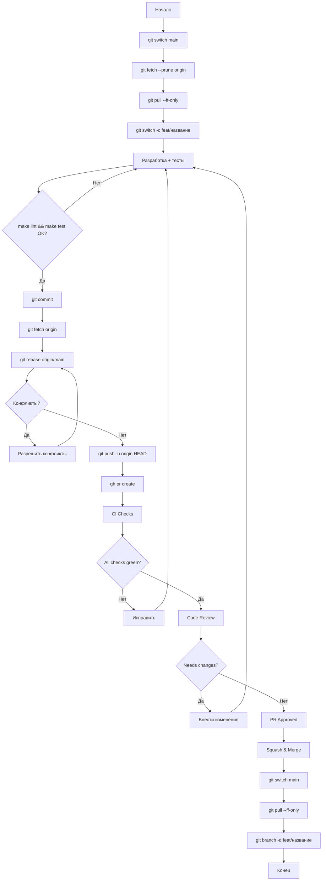
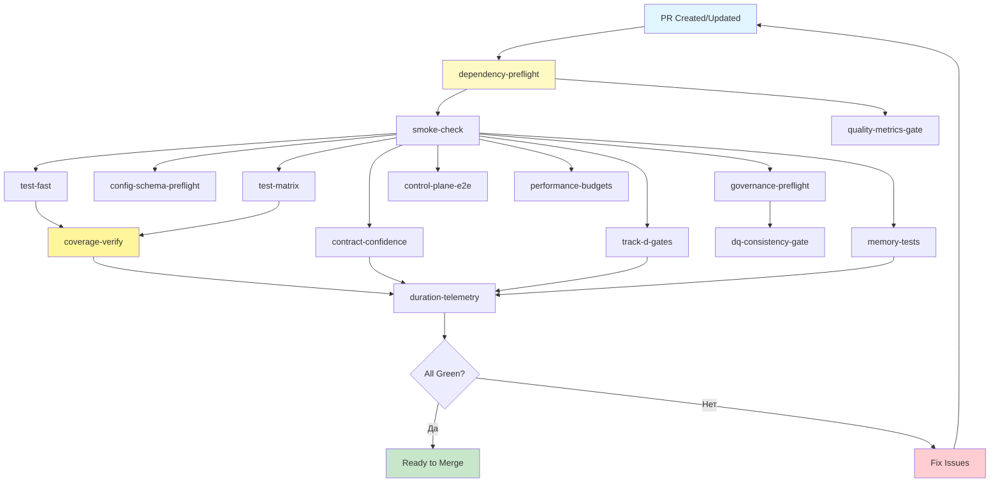
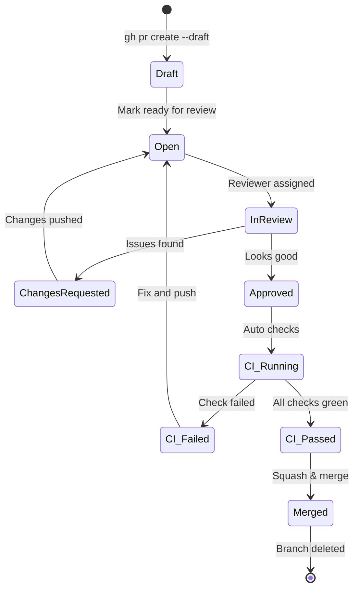
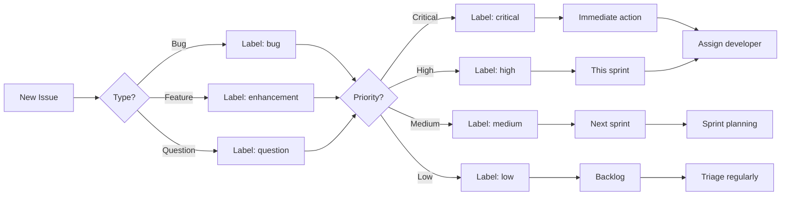
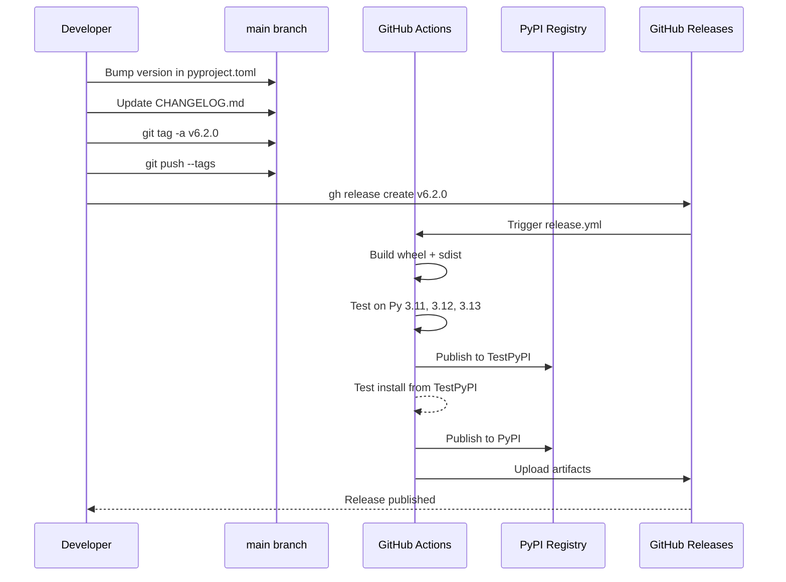
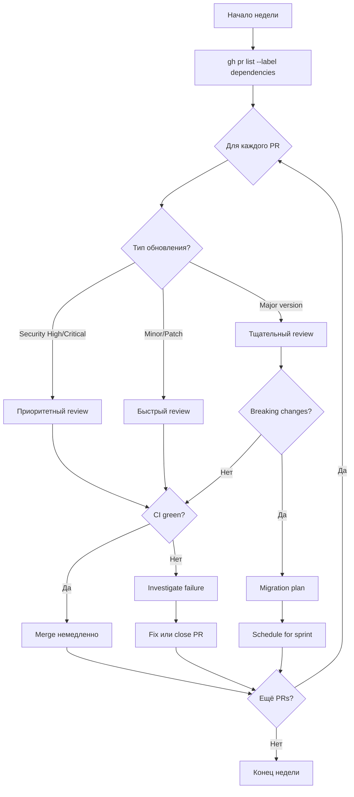
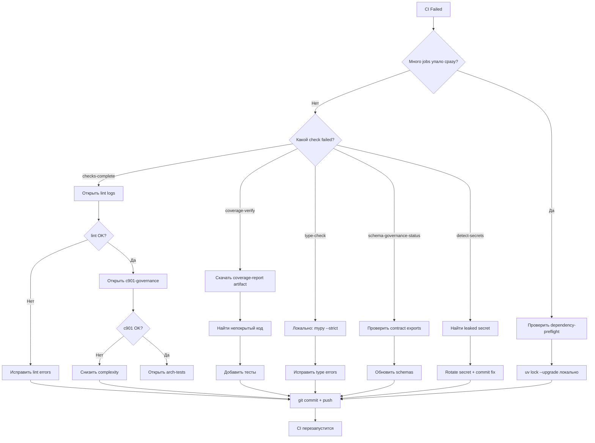
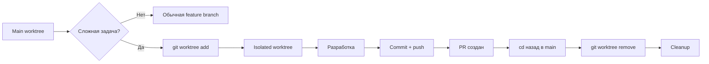

# GitHub Workflow Визуализация для BioETL

## Feature Development Flow

## CI Pipeline Structure

## PR Lifecycle

## Issue Triage Flow

## Release Workflow

## Dependabot Weekly Triage

## CI Troubleshooting Decision Tree

## Git Worktree Usage Pattern

---

**Примечание:** Все диаграммы используют Mermaid синтаксис и совместимы с GitHub, MkDocs, и другими markdown рендерерами с поддержкой Mermaid.

