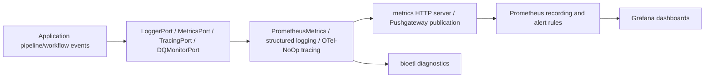

______________________________________________________________________

Version: 1.0.0
Status: active
Class: published
Owner: BioETL Team
Reviewers:

- BioETL Team
  Last verified: '2026-06-03'

______________________________________________________________________

# Observability Guide

BioETL observability is local-first and port-driven. Runtime code emits through
domain observability ports, concrete metrics/logging/tracing adapters live in
infrastructure, and operator dashboards are shipped as repository JSON.

## Source Of Truth

| Surface | File(s) |
| --- | --- |
| Observability ports | `src/bioetl/domain/ports/observability/*.py`, `src/bioetl/domain/ports/logger_port.py` |
| Application observer | `src/bioetl/application/observability/observer.py` |
| Metrics service | `src/bioetl/application/services/metrics_service.py` |
| Infrastructure metrics/tracing/logging | `src/bioetl/infrastructure/observability/**` |
| Composition bootstrap | `src/bioetl/composition/bootstrap/runtime/observability*.py`, `src/bioetl/composition/observability_api.py` |
| Dashboards/rules | `grafana/dashboards/*.json`, `grafana/prometheus-rules/*.yml` |
| Operator diagnostics | `src/bioetl/interfaces/cli/commands/diagnostics.py` |

## Runtime Flow



## Label Safety

Prometheus labels must stay bounded. Do not emit `run_id`, `manifest_id`,
`record_id`, `lineage_fragment_id`, payload hashes, raw filesystem paths, raw
URLs, or raw error messages as labels. Forensic correlation belongs to
RunManifest, RunLedger, logs, lineage, and inspection CLI surfaces.

## Operator Entry Points

```bash
bioetl diagnostics guide
bioetl diagnostics metrics --json
bioetl diagnostics health --json
bioetl diagnostics run --run-id <run-id>
python -m scripts.engineering.qa report-observability-metric-inventory --json
```

See also:

- [Metrics & Monitoring Guide](metrics-monitoring.md)
- [Dashboard Guide](dashboard-guide.md)
- [Observability Layers](../02-architecture/observability-layers.md)
- [ADR-017 Observability Architecture](../02-architecture/decisions/ADR-017-observability-architecture.md)
