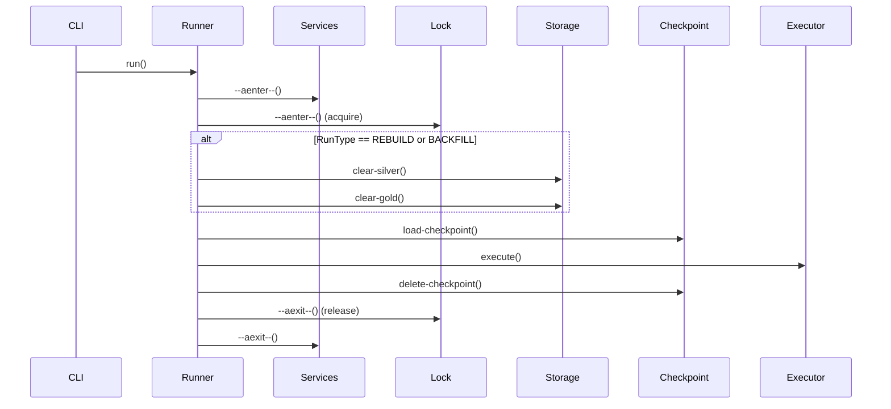
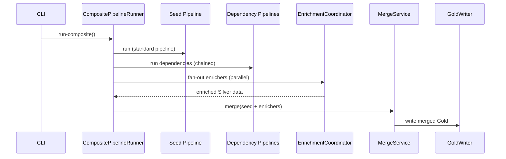

# Жизненный цикл пайплайна

Этот документ описывает последовательность операций при выполнении пайплайна BioETL.

## Порядок выполнения PipelineRunner.run()



## Очистка слоёв по типу запуска

| RunType | clear-silver | clear-gold | Обоснование |
|---------|--------------|------------|-------------|
| `INCREMENTAL` | ❌ | ❌ | Merge/upsert сохраняет существующие данные |
| `BACKFILL` | ✅ | ✅ | Заполнение исторических данных |
| `REBUILD` | ✅ | ✅ | Полная перестройка таблицы |

### Почему incremental не очищает данные?

Medallion архитектура требует идемпотентности для инкрементальных обновлений:

1. **Silver слой**: Использует merge/upsert по `content-hash`
2. **Gold слой**: Применяет SCD Type 2 или партиционирование

Удаление данных при incremental run привело бы к потере исторических записей.

## Инварианты блокировки

Блокировка (`LockManager`) гарантирует:

1. **Эксклюзивный доступ**: Только один процесс выполняет пайплайн
2. **Heartbeat**: Периодическое продление TTL блокировки
3. **Graceful release**: Освобождение в `finally` даже при ошибках

```python
async with self.-lock-manager:
    # Блокировка захвачена
    await self.-clear-exports()
    await self.-checkpoint-manager.load-checkpoint()
    await self.-executor.execute()
    # Блокировка освобождается автоматически
```

## Политика метрик (fail-fast)

Параметр `BIOETL-FAIL-FAST-METRICS` управляет поведением при ошибках запуска Prometheus сервера:

| Значение | Поведение |
|----------|-----------|
| `false` (default) | Warning в лог, метрики отключаются, пайплайн продолжает работу |
| `true` | Исключение `MetricsServerError`, пайплайн не запускается |

### Рекомендации

- **Development/CI**: `false` — не блокировать из-за занятых портов
- **Production с мониторингом**: `true` — гарантировать наличие метрик

### Пример настройки

```bash
# Строгий режим для production
export BIOETL-FAIL-FAST-METRICS=true

# Или в конфиге
metrics:
  port: 8000
  fail-fast: true
```

## Graceful Shutdown

При получении `SIGTERM`/`SIGINT`:

1. `ShutdownSignal.set()` активируется
2. Текущий батч завершается
3. Checkpoint сохраняется
4. Lock освобождается
5. Exit code 0

См. [ADR-008: Graceful Shutdown Strategy](../02-architecture/decisions/ADR-008-graceful-shutdown-strategy.md)

## Жизненный цикл Composite Pipeline

Composite pipelines используют отдельный оркестратор (`CompositePipelineRunner`)
вместо стандартного `PipelineRunner` + `Transformer`.



### Ключевые отличия

1. **Без трансформеров**: Composite не использует `*Transformer` классы
2. **Оркестрация**: `application/composite/` содержит 15 модулей сервисов
3. **Merge**: `MergeService` выполняет JOIN по `join-key` из конфига
4. **Fan-out**: Enrichers могут выполняться параллельно (если `optional: true`)

См. [ADR-026: Composite Pipeline Pattern](../02-architecture/decisions/ADR-026-composite-pipeline-pattern.md)

## Связанные документы

- [ADR-012: Storage Clear Contract](../02-architecture/decisions/ADR-012-storage-clear-contract-and-run-id.md)
- [ADR-013: Async Storage Cleanup](../02-architecture/decisions/ADR-013-async-storage-cleanup.md)
- [Running Pipelines](./running-pipelines.md)
