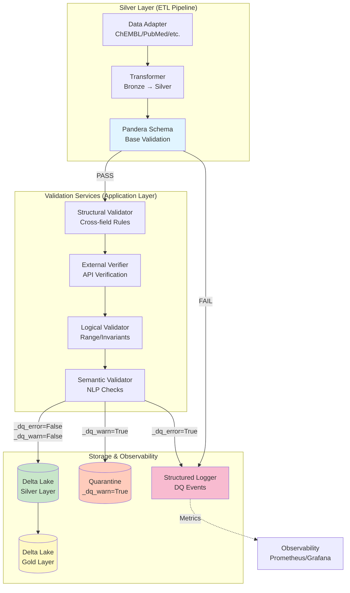
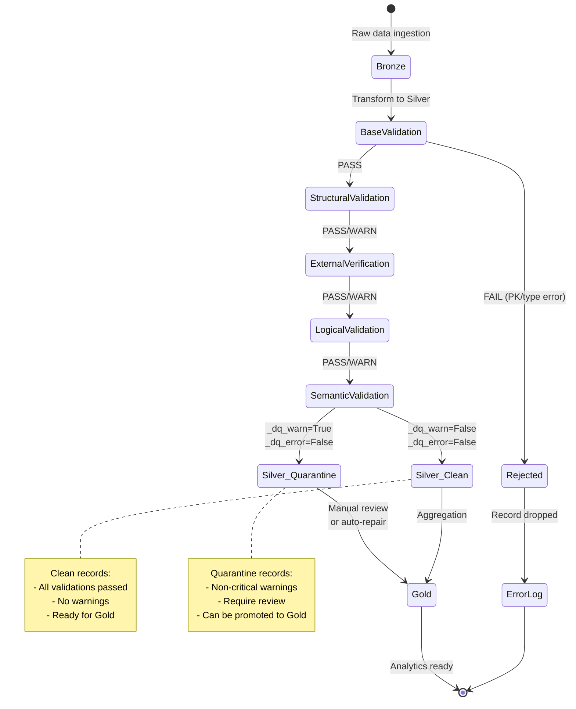
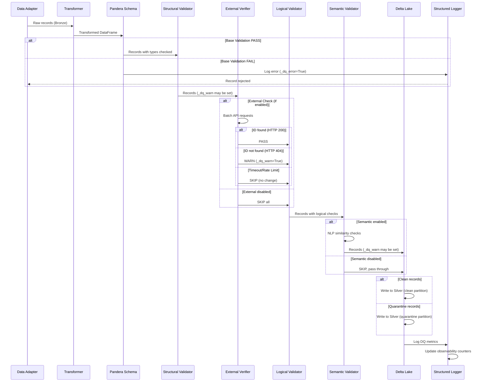

# Руководство по валидации публикаций (Publication Validation Guide)

**Версия:** 1.0.0
**Дата:** 2026-02-06
**Статус:** Утверждено ✅
**Связанный ADR:** ADR-032

---

## Содержание

1. [Введение](#введение)
2. [Архитектура валидации](#архитектура-валидации)
3. [Пятиуровневая стратегия](#пятиуровневая-стратегия)
4. [Жизненный цикл DQ-флагов](#жизненный-цикл-dq-флагов)
5. [Иерархия конфигурации](#иерархия-конфигурации)
6. [Workflow валидации](#workflow-валидации)
7. [Примеры использования](#примеры-использования)
8. [Troubleshooting](#troubleshooting)
9. [Best Practices](#best-practices)

---

## Введение

Данное руководство описывает **комплексную стратегию валидации публикационных данных** в проекте BioETL, охватывающую:

- **191 поле** из 5 провайдеров (ChEMBL, PubMed, CrossRef, OpenAlex, Semantic Scholar)
- **5 уровней валидации** (base → structural → external → logical → semantic)
- **3 режима обработки** (PASS, FAIL, WARN)
- **2 DQ-флага** (`_dq_error`, `_dq_warn`)

**Ключевые принципы:**

1. **Fail-Fast для критичных ошибок** — блокировка записей с некорректными PK или типами данных
2. **Graceful Degradation для предупреждений** — пропуск записей с WARN через карантин
3. **Layered Validation** — последовательная проверка от простых правил к сложным
4. **Observability** — полное логирование всех DQ событий с контекстом

---

## Архитектура валидации

### Компонентная диаграмма



**Легенда:**
- **Синий** — Base Validation (Pandera)
- **Зелёный** — Silver Layer (валидные записи)
- **Жёлтый** — Gold Layer (финальный слой)
- **Оранжевый** — Quarantine (WARN записи)
- **Розовый** — Логирование и мониторинг

---

## Пятиуровневая стратегия

### 1. Base Validation (Pandera)

**Цель:** Проверка базовых ограничений схемы
**Инструмент:** Pandera `DataFrameModel`
**Когда:** Сразу после трансформации Bronze → Silver

**Проверки:**
- ✅ Тип данных (string, integer, boolean, date)
- ✅ Nullable constraints (non-nullable fields)
- ✅ Regex patterns (DOI: `^10\.\d{4,9}/.+$`, PMID: `^[1-9]\d*$`)
- ✅ String trimming и normalization

**Результат:**
- `PASS` → следующий уровень
- `FAIL` → запись отклонена (`_dq_error=True`), логируется

**Пример:**
```python
from pandera import DataFrameModel, Field
import pandera as pa

class PublicationSilverSchema(DataFrameModel):
    pmid: Series[str] = Field(
        nullable=True,
        regex=r"^[1-9]\d*$",
        description="PubMed ID (positive integer)"
    )
    doi: Series[str] = Field(
        nullable=True,
        regex=r"^10\.\d{4,9}/.+$",
        description="Digital Object Identifier"
    )
    title: Series[str] = Field(nullable=True)

    class Config:
        coerce = True
        strict = False  # Silver allows extra columns
```

---

### 2. Structural Validation

**Цель:** Проверка межполевых зависимостей
**Инструмент:** `StructuralValidator` (application service)
**Когда:** После успешной Base Validation

**Проверки:**
- ✅ Page ordering: `page_first <= page_last`
- ✅ Year consistency: `YEAR(publication_date) == publication_year`
- ✅ Field dependencies: `IF doi THEN title IS NOT NULL`
- ✅ Content hash integrity: `SHA256(title + abstract + ...) == content_hash`

**Результат:**
- `PASS` → следующий уровень
- `WARN` → `_dq_warn=True`, продолжить валидацию

**Пример:**
```python
class StructuralValidator:
    def validate_page_ordering(self, df: pd.DataFrame) -> pd.DataFrame:
        """Check page_first <= page_last when both numeric."""
        mask = (
            df["page_first"].notna() &
            df["page_last"].notna() &
            df["page_first"].str.isnumeric() &
            df["page_last"].str.isnumeric()
        )

        invalid = df[mask & (df["page_first"].astype(int) > df["page_last"].astype(int))]

        if not invalid.empty:
            df.loc[invalid.index, "_dq_warn"] = True
            self._logger.warning(
                "page_ordering_violation",
                count=len(invalid),
                record_ids=invalid.index.tolist()
            )

        return df
```

---

### 3. External Verification

**Цель:** Проверка существования записей у upstream-провайдеров
**Инструмент:** HTTP clients с retry-логикой
**Когда:** После Structural Validation (асинхронно, батчами)

**API Endpoints:**

| Идентификатор | Провайдер | Endpoint | HTTP Method |
|---------------|-----------|----------|-------------|
| `doi` | CrossRef | `https://api.crossref.org/works/{doi}` | GET |
| `pmid` | PubMed | `https://eutils.ncbi.nlm.nih.gov/entrez/eutils/efetch.fcgi?db=pubmed&id={pmid}` | GET |
| `pmc_id` | PMC | `https://www.ncbi.nlm.nih.gov/pmc/articles/{pmc_id}` | GET |
| `openalex_id` | OpenAlex | `https://api.openalex.org/works/{id}` | GET |
| `paper_id` | Semantic Scholar | `https://api.semanticscholar.org/graph/v1/paper/{id}` | GET |
| `document_chembl_id` | ChEMBL | `https://www.ebi.ac.uk/chembl/api/data/document/{id}` | GET |

**Результат:**
- `HTTP 200` → PASS
- `HTTP 404` → WARN (`_dq_warn=True`)
- `HTTP 429/500/timeout` → SKIP (не блокировать)

**Конфигурация:**
```yaml
external_verification:
  enabled: true
  batch_size: 100
  timeout: 10.0
  max_retries: 3
  retry_delay: 1.0
  providers:
    crossref:
      enabled: true
      rate_limit: 50  # requests per second
    pubmed:
      enabled: true
      rate_limit: 3
```

---

### 4. Logical Validation

**Цель:** Проверка бизнес-правил и инвариантов
**Инструмент:** `LogicalValidator` (application service)
**Когда:** После External Verification

**Проверки:**
- ✅ Range constraints: `publication_year ∈ [1800, CURRENT_YEAR + 1]`
- ✅ Non-negative rules: `citations_received >= 0`, `citations_made >= 0`
- ✅ Date ordering: `date_completed <= date_revised`
- ✅ Citation logic: `citations_received >= influential_citation_count`

**Результат:**
- `PASS` → следующий уровень
- `WARN` → `_dq_warn=True`

**Пример:**
```python
class LogicalValidator:
    def validate_publication_year_range(self, df: pd.DataFrame) -> pd.DataFrame:
        """Year must be in [1800, CURRENT_YEAR + 1]."""
        current_year = date.today().year

        invalid = df[
            df["publication_year"].notna() &
            ((df["publication_year"] < 1800) | (df["publication_year"] > current_year + 1))
        ]

        if not invalid.empty:
            df.loc[invalid.index, "_dq_warn"] = True
            self._logger.warning(
                "publication_year_out_of_range",
                count=len(invalid),
                min_year=invalid["publication_year"].min(),
                max_year=invalid["publication_year"].max()
            )

        return df
```

---

### 5. Semantic Validation

**Цель:** NLP-проверки семантической согласованности
**Инструмент:** `SemanticValidator` (uses NLP models)
**Когда:** Последний уровень (опционально)

**Проверки:**
- ✅ Text similarity: `SemanticSimilarity(title, abstract) > 0.3`
- ✅ Language detection: `Language(abstract) == language`
- ✅ Keyword relevance: `Keywords(abstract) ∩ subject_keywords ≠ ∅`
- ✅ TLDR consistency: `SemanticSimilarity(abstract, tldr) > 0.5`

**Результат:**
- **ВСЕГДА WARN** (никогда не FAIL)
- `_dq_warn=True` при низкой согласованности

**Важно:** Semantic validation **НЕ блокирует** записи, только помечает флагом.

**Конфигурация:**
```yaml
semantic_validation:
  enabled: false  # Expensive, disabled by default
  similarity_threshold: 0.3
  language_detection:
    enabled: true
    model: "fasttext"
  keyword_extraction:
    enabled: true
    min_overlap: 1
```

---

## Жизненный цикл DQ-флагов

### Диаграмма состояний записи



**Флаги:**

| Флаг | Значение | Действие |
|------|----------|----------|
| `_dq_error=True` | Критическая ошибка (PK violation, type error) | Запись **отклонена**, не попадает в Silver |
| `_dq_warn=True` | Некритичное предупреждение (external 404, low similarity) | Запись **помещается в карантин**, доступна для Gold с фильтрацией |
| `_dq_warn=False`<br/>`_dq_error=False` | Все проверки пройдены | Запись **чистая**, автоматически идёт в Gold |

---

## Иерархия конфигурации

### Диаграмма перезаписи конфигов

```mermaid
graph TB
    subgraph "Configuration Hierarchy"
        Default[Default Config<br/>application/config/validation.yaml<br/>Priority: 1]
        Provider[Provider Config<br/>config/{provider}_validation.yaml<br/>Priority: 2]
        Pipeline[Pipeline Config<br/>pipelines/{provider}_{entity}.yaml<br/>Priority: 3]
        CLI[CLI Arguments<br/>--validation-mode strict<br/>Priority: 4]
    end

    Default -->|Override| Provider
    Provider -->|Override| Pipeline
    Pipeline -->|Override| CLI

    CLI --> FinalConfig[Final Config<br/>Runtime]

    style Default fill:#e3f2fd
    style Provider fill:#fff3e0
    style Pipeline fill:#f3e5f5
    style CLI fill:#c8e6c9
    style FinalConfig fill:#ffeb3b
```

**Приоритет (от низкого к высокому):**

1. **Default Config** (`application/config/validation.yaml`)
   - Базовые правила для всех провайдеров
   - Дефолтные пороги и таймауты

2. **Provider Config** (`config/chembl_validation.yaml`)
   - Специфичные для провайдера настройки
   - Переопределяет Default

3. **Pipeline Config** (`pipelines/chembl_compound.yaml`)
   - Настройки для конкретного pipeline (provider + entity)
   - Переопределяет Provider

4. **CLI Arguments** (`--validation-mode strict`)
   - Runtime-параметры
   - Наивысший приоритет

**Пример Default Config:**
```yaml
# application/config/validation.yaml
validation:
  base:
    enabled: true
    fail_on_error: true

  structural:
    enabled: true
    rules:
      - page_ordering
      - year_consistency
      - field_dependencies

  external:
    enabled: false  # Expensive, opt-in
    timeout: 10.0
    max_retries: 3

  logical:
    enabled: true
    rules:
      - year_range
      - non_negative
      - date_ordering

  semantic:
    enabled: false  # Very expensive
```

**Пример Pipeline Override:**
```yaml
# pipelines/pubmed_publication.yaml
validation:
  external:
    enabled: true  # Override: enable for PubMed
    providers:
      pubmed:
        enabled: true
        rate_limit: 3

  semantic:
    enabled: true  # Override: enable semantic for PubMed
    similarity_threshold: 0.4  # Higher threshold
```

---

## Workflow валидации

### End-to-End процесс



**Этапы:**

1. **Ingestion** — адаптер извлекает raw data из источника
2. **Transformation** — трансформер преобразует Bronze → Silver format
3. **Base Validation** — Pandera проверяет схему (типы, regex, nullable)
4. **Structural Validation** — проверка межполевых правил
5. **External Verification** — HTTP-запросы к upstream API (опционально)
6. **Logical Validation** — проверка бизнес-инвариантов
7. **Semantic Validation** — NLP-проверки (опционально)
8. **Storage** — запись в Delta Lake (clean или quarantine)
9. **Observability** — логирование метрик DQ

---

## Примеры использования

### 1. Strict Mode (все проверки)

```bash
python -m bioetl.interfaces.cli.main run-pipeline \
    --provider pubmed \
    --entity publication \
    --validation-mode strict \
    --enable-external-verification \
    --enable-semantic-validation \
    --fail-on-warn
```

**Результат:**
- Все 5 уровней активны
- `_dq_warn=True` → запись **отклонена** (из-за `--fail-on-warn`)
- Максимальное качество, минимальная пропускная способность

---

### 2. Balanced Mode (по умолчанию)

```bash
python -m bioetl.interfaces.cli.main run-pipeline \
    --provider chembl \
    --entity publication \
    --validation-mode balanced
```

**Результат:**
- Base + Structural + Logical (без External и Semantic)
- `_dq_warn=True` → запись **в карантине**
- Хороший баланс качества и производительности

---

### 3. Fast Mode (только Base)

```bash
python -m bioetl.interfaces.cli.main run-pipeline \
    --provider crossref \
    --entity publication \
    --validation-mode fast \
    --skip-external \
    --skip-semantic
```

**Результат:**
- Только Base Validation (Pandera)
- Максимальная производительность
- Подходит для REBUILD с известными чистыми данными

---

### 4. Programmatic API

```python
from bioetl.application.services.dq import (
    BaseValidator,
    StructuralValidator,
    ExternalVerifier,
    LogicalValidator,
    SemanticValidator,
)

# Configure validators
config = ValidationConfig.load("config/pubmed_validation.yaml")

validators = [
    BaseValidator(schema=PubMedPublicationSchema),
    StructuralValidator(config=config.structural),
    ExternalVerifier(config=config.external, http_client=client),
    LogicalValidator(config=config.logical),
    SemanticValidator(config=config.semantic, nlp_models=models),
]

# Run validation pipeline
df = pd.read_parquet("silver/pubmed/publication.parquet")

for validator in validators:
    df = validator.validate(df)

    # Log metrics
    logger.info(
        "validation_step_complete",
        validator=validator.__class__.__name__,
        records_passed=len(df[df["_dq_warn"] == False]),
        records_warned=len(df[df["_dq_warn"] == True]),
        records_failed=len(df[df["_dq_error"] == True]),
    )

# Write to Delta Lake
df.to_parquet("silver/pubmed/publication_validated.parquet")
```

---

## Troubleshooting

### Проблема: Высокий процент WARN записей

**Симптомы:**
- > 20% записей имеют `_dq_warn=True`
- Карантин переполнен

**Причины:**
1. External verification включена, но API провайдера недоступен
2. Слишком строгие пороги в Semantic Validation
3. Некорректные данные у источника

**Решение:**
```bash
# 1. Проверить доступность API
curl -I https://api.crossref.org/works/10.1038/nature12373

# 2. Отключить проблемный уровень
python -m bioetl.interfaces.cli.main run-pipeline \
    --provider crossref \
    --entity publication \
    --skip-external

# 3. Увеличить порог similarity
# В config/crossref_validation.yaml:
semantic:
  similarity_threshold: 0.2  # Было 0.3
```

---

### Проблема: Base Validation постоянно FAIL

**Симптомы:**
- Все записи отклонены на Pandera
- `pandera.errors.SchemaError: Column 'doi' failed validation`

**Причины:**
1. Regex паттерн не соответствует реальным данным
2. Некорректная трансформация Bronze → Silver
3. NULL в non-nullable полях

**Решение:**
```python
# 1. Проверить реальные значения
df = pd.read_parquet("bronze/crossref/publication.parquet")
print(df["doi"].value_counts())

# 2. Ослабить regex (temporary)
class PublicationSilverSchema(DataFrameModel):
    doi: Series[str] = Field(
        nullable=True,
        regex=None,  # Отключить regex временно
    )

# 3. Проверить трансформер
# src/bioetl/application/transformers/crossref_transformer.py
def transform_doi(raw_doi: str) -> str:
    return raw_doi.strip().lower()  # Ensure normalization
```

---

### Проблема: External Verification timeout

**Симптомы:**
- Валидация зависает на External уровне
- Логи: `external_verification_timeout`

**Причины:**
1. Слишком низкий timeout
2. Rate limit превышен
3. API провайдера медленный

**Решение:**
```yaml
# config/pubmed_validation.yaml
external_verification:
  timeout: 30.0  # Увеличить с 10 до 30
  batch_size: 50  # Уменьшить batch
  max_retries: 5
  retry_delay: 2.0
  providers:
    pubmed:
      rate_limit: 2  # Снизить с 3 до 2 RPS
```

---

## Best Practices

### 1. Используйте режимы валидации по контексту

| Сценарий | Режим | Уровни | Rationale |
|----------|-------|--------|-----------|
| **REBUILD** | Fast | Base only | Известные чистые данные, не нужны дорогие проверки |
| **BACKFILL** | Balanced | Base + Structural + Logical | Новые данные, но без External (дорого) |
| **INCREMENTAL** | Strict | Все 5 уровней | Малые объёмы, критически важное качество |
| **Development** | Strict | Все 5 уровней | Поиск проблем в схеме |
| **Production CI** | Balanced | Base + Structural + Logical | Компромисс качество/скорость |

---

### 2. Мониторинг DQ-метрик

```python
# Экспортировать метрики в Prometheus
from prometheus_client import Counter, Histogram

validation_passed = Counter(
    "bioetl_validation_passed_total",
    "Records passed validation",
    ["provider", "level"]
)

validation_warned = Counter(
    "bioetl_validation_warned_total",
    "Records with warnings",
    ["provider", "level", "rule"]
)

validation_failed = Counter(
    "bioetl_validation_failed_total",
    "Records failed validation",
    ["provider", "level", "rule"]
)

validation_duration = Histogram(
    "bioetl_validation_duration_seconds",
    "Validation duration",
    ["provider", "level"]
)
```

**Dashboard (Grafana):**
- DQ Pass Rate: `validation_passed / (validation_passed + validation_warned + validation_failed)`
- Top Failing Rules: `topk(10, validation_failed)`
- Validation Latency: `validation_duration{quantile="0.95"}`

---

### 3. Batch External Verification

```python
async def verify_dois_batch(dois: list[str]) -> dict[str, bool]:
    """Batch verify DOIs to reduce latency."""
    async with httpx.AsyncClient() as client:
        tasks = [
            client.get(f"https://api.crossref.org/works/{doi}", timeout=10.0)
            for doi in dois
        ]

        responses = await asyncio.gather(*tasks, return_exceptions=True)

        results = {}
        for doi, response in zip(dois, responses):
            if isinstance(response, Exception):
                results[doi] = None  # SKIP on error
            else:
                results[doi] = response.status_code == 200

        return results
```

---

### 4. Карантинные записи требуют review

```sql
-- Запрос записей в карантине
SELECT *
FROM silver.pubmed_publication
WHERE _dq_warn = TRUE
ORDER BY _dq_warn_count DESC
LIMIT 100;

-- Промоция в Gold после ручного review
UPDATE silver.pubmed_publication
SET _dq_warn = FALSE
WHERE pmid IN ('12345678', '87654321')
  AND manual_review_status = 'approved';
```

---

### 5. Используйте VCR.py для тестов External

```python
import pytest
import vcr

@pytest.mark.integration
@vcr.use_cassette("tests/fixtures/vcr/crossref_doi_valid.yaml")
async def test_external_verification_doi():
    """Test DOI verification with recorded HTTP response."""
    verifier = ExternalVerifier(config=config)
    result = await verifier.verify_doi("10.1038/nature12373")

    assert result.status == "PASS"
    assert result.found is True
```

**Cassette recording:**
```bash
pytest tests/integration/validation/ --record-mode=once
```

---

## Связанная документация

- **ADR-032:** Стратегия валидации публикаций
- **Field Reference:** `docs/04-reference/publication-fields-reference.md`
- **Validation Schema:** `docs/04-reference/schemas/publication_validation_schema_v3.xlsx`
- **Operational Runbook:** `docs/05-operations/runbooks/publication-validation-runbook.md`
- **Tests:** `tests_generated/` (471 тест)

---

**Версия документа:** 1.0.0
**Последнее обновление:** 2026-02-06
**Статус:** Готов к использованию ✅
