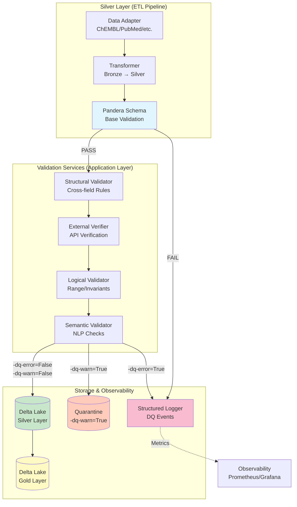
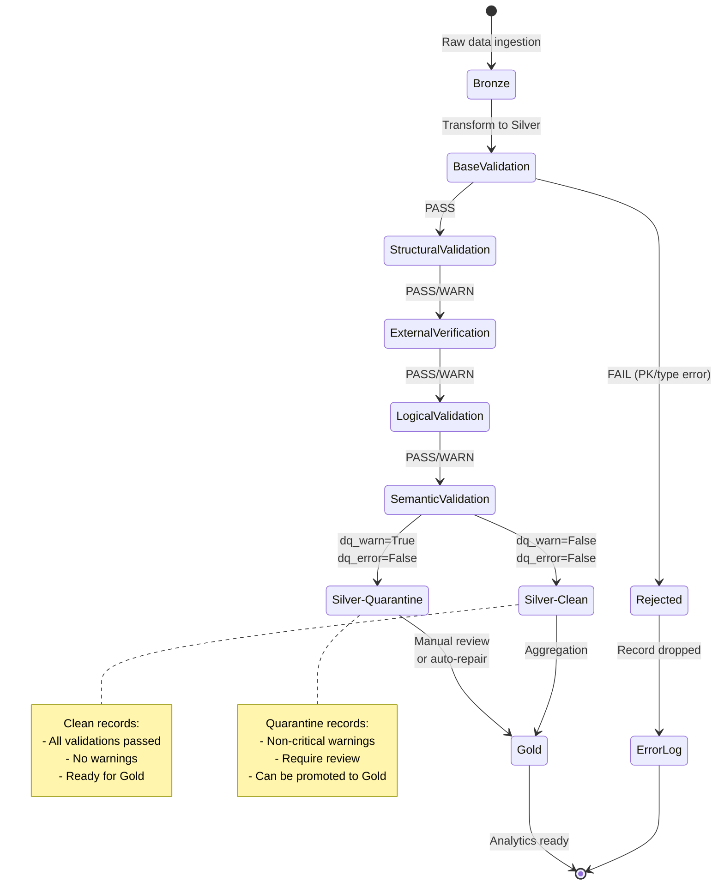
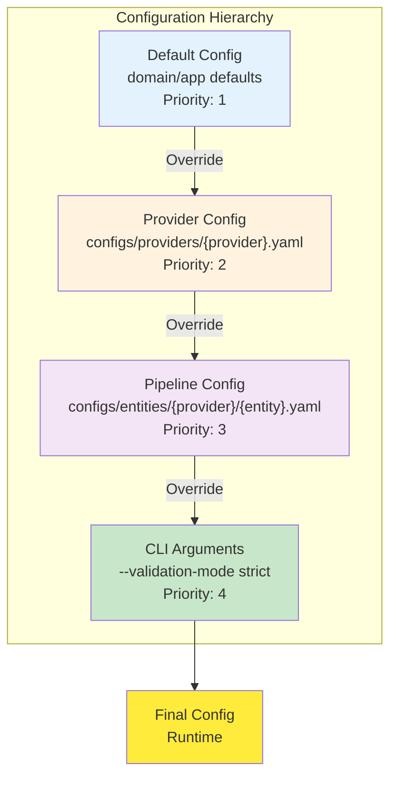
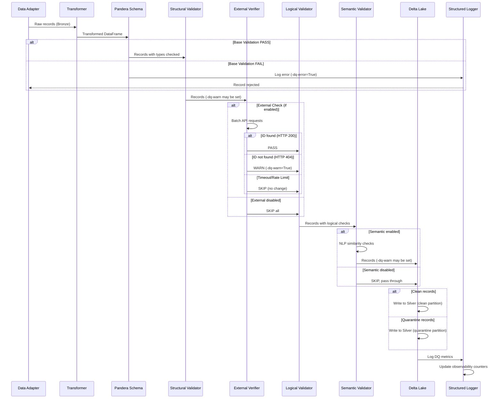

______________________________________________________________________

Version: 1.0.0
Status: Утверждено ✅
Class: published
Owner: BioETL Team
Reviewers:

- BioETL Team
  Last verified: '2026-03-29'

______________________________________________________________________

# Руководство по валидации публикаций (Publication Validation Guide)

**Дата:** 2026-02-06
**Статус:** Утверждено ✅
**Связанный ADR:** ADR-033

______________________________________________________________________

## Содержание

1. [Введение](#introduction)
1. [Архитектура валидации](#validation-architecture)
1. [Пятиуровневая стратегия](#five-level-strategy)
1. [Жизненный цикл DQ-флагов](#dq-flag-lifecycle)
1. [Иерархия конфигурации](#configuration-hierarchy)
1. [Workflow валидации](#validation-workflow)
1. [Примеры использования](#usage-examples)
1. [Troubleshooting](#troubleshooting)
1. [Best Practices](#best-practices)

______________________________________________________________________

## Введение { #introduction }

Данное руководство описывает **комплексную стратегию валидации публикационных данных** в проекте BioETL, охватывающую:

- **191 поле** из 5 провайдеров (ChEMBL, PubMed, CrossRef, OpenAlex, Semantic Scholar)
- **5 уровней валидации** (base → structural → external → logical → semantic)
- **3 режима обработки** (PASS, FAIL, WARN)
- **2 DQ-флага** (`-dq-error`, `-dq-warn`)

**Ключевые принципы:**

1. **Fail-Fast для критичных ошибок** — блокировка записей с некорректными PK или типами данных
1. **Graceful Degradation для предупреждений** — пропуск записей с WARN через карантин
1. **Layered Validation** — последовательная проверка от простых правил к сложным
1. **Observability** — полное логирование всех DQ событий с контекстом

______________________________________________________________________

## Архитектура валидации { #validation-architecture }

### Компонентная диаграмма



**Легенда:**

- **Синий** — Base Validation (Pandera)
- **Зелёный** — Silver Layer (валидные записи)
- **Жёлтый** — Gold Layer (финальный слой)
- **Оранжевый** — Quarantine (WARN записи)
- **Розовый** — Логирование и мониторинг

______________________________________________________________________

## Пятиуровневая стратегия { #five-level-strategy }

### 1. Base Validation (Pandera)

**Цель:** Проверка базовых ограничений схемы
**Инструмент:** Pandera `DataFrameModel`
**Когда:** Сразу после трансформации Bronze → Silver

**Проверки:**

- ✅ Тип данных (string, integer, boolean, date)
- ✅ Nullable constraints (non-nullable fields)
- ✅ Regex patterns (DOI: `^10\.\d{4,9}/.+$`, PMID: `^[1-9]\d*$`)
- ✅ String trimming и normalization

**Результат:**

- `PASS` → следующий уровень
- `FAIL` → запись отклонена (`-dq-error=True`), логируется

**Пример:**

```python
from pandera import DataFrameModel, Field
import pandera as pa


class PublicationSilverSchema(DataFrameModel):
    pmid: Series[str] = Field(
        nullable=True, regex=r"^[1-9]\d*$", description="PubMed ID (positive integer)"
    )
    doi: Series[str] = Field(
        nullable=True,
        regex=r"^10\.\d{4,9}/.+$",
        description="Digital Object Identifier",
    )
    title: Series[str] = Field(nullable=True)

    class Config:
        coerce = True
        strict = False  # Silver allows extra columns
```

______________________________________________________________________

### 2. Structural Validation

**Цель:** Проверка межполевых зависимостей
**Инструмент:** `StructuralValidator` (application service)
**Когда:** После успешной Base Validation

**Проверки:**

- ✅ Page ordering: `page_first <= page_last`
- ✅ Year consistency: `YEAR(publication_date) == publication_year`
- ✅ Field dependencies: `IF doi THEN title IS NOT NULL`
- ✅ Content hash integrity: `SHA256(title + abstract + ...) == content_hash`

**Результат:**

- `PASS` → следующий уровень
- `WARN` → `_dq_warn=True`, продолжить валидацию

**Пример:**

```python
class StructuralValidator:
    def validate_page_ordering(self, df: pd.DataFrame) -> pd.DataFrame:
        """Check page_first <= page_last when both numeric."""
        mask = (
            df["page_first"].notna()
            & df["page_last"].notna()
            & df["page_first"].str.isnumeric()
            & df["page_last"].str.isnumeric()
        )

        invalid = df[
            mask & (df["page_first"].astype(int) > df["page_last"].astype(int))
        ]

        if not invalid.empty:
            df.loc[invalid.index, "_dq_warn"] = True
            self._logger.warning(
                "page_ordering_violation",
                count=len(invalid),
                record_ids=invalid.index.tolist(),
            )

        return df
```

______________________________________________________________________

### 3. External Verification

**Цель:** Проверка существования записей у upstream-провайдеров
**Инструмент:** HTTP clients с retry-логикой
**Когда:** После Structural Validation (асинхронно, батчами)

**API Endpoints:**

| Идентификатор    | Провайдер        | Endpoint                                                                        | HTTP Method |
| ---------------- | ---------------- | ------------------------------------------------------------------------------- | ----------- |
| `doi`            | CrossRef         | `https://api.crossref.org/works/{doi}`                                          | GET         |
| `pmid`           | PubMed           | `https://eutils.ncbi.nlm.nih.gov/entrez/eutils/efetch.fcgi?db=pubmed&id={pmid}` | GET         |
| `pmc_id`         | PMC              | `https://www.ncbi.nlm.nih.gov/pmc/articles/{pmc_id}`                            | GET         |
| `openalex_id`    | OpenAlex         | `https://api.openalex.org/works/{id}`                                           | GET         |
| `paper_id`       | Semantic Scholar | `https://api.semanticscholar.org/graph/v1/paper/{id}`                           | GET         |
| `publication_id` | ChEMBL           | `https://www.ebi.ac.uk/chembl/api/data/document/{id}`                           | GET         |

**Результат:**

- `HTTP 200` → PASS
- `HTTP 404` → WARN (`-dq-warn=True`)
- `HTTP 429/500/timeout` → SKIP (не блокировать)

**Конфигурация:**

```yaml
external-verification:
  enabled: true
  batch_size: 100
  timeout: 10.0
  max_retries: 3
  retry-delay: 1.0
  providers:
    crossref:
      enabled: true
      rate_limit: 50  # requests per second
    pubmed:
      enabled: true
      rate_limit: 3
```

______________________________________________________________________

### 4. Logical Validation

**Цель:** Проверка бизнес-правил и инвариантов
**Инструмент:** `LogicalValidator` (application service)
**Когда:** После External Verification

**Проверки:**

- ✅ Range constraints: `publication_year ∈ [1800, CURRENT_YEAR + 1]`
- ✅ Non-negative rules: `citations-received >= 0`, `citations-made >= 0`
- ✅ Date ordering: `date-completed <= date-revised`
- ✅ Citation logic: `citations-received >= influential-citation_count`

**Результат:**

- `PASS` → следующий уровень
- `WARN` → `-dq-warn=True`

**Пример:**

```python
class LogicalValidator:
    def validate-publication_year-range(self, df: pd.DataFrame) -> pd.DataFrame:
        """Year must be in [1800, CURRENT_YEAR + 1]."""
        current-year = date.today().year

        invalid = df[
            df["publication_year"].notna() &
            ((df["publication_year"] < 1800) | (df["publication_year"] > current-year + 1))
        ]

        if not invalid.empty:
            df.loc[invalid.index, "-dq-warn"] = True
            self._logger.warning(
                "publication_year-out-of-range",
                count=len(invalid),
                min-year=invalid["publication_year"].min(),
                max-year=invalid["publication_year"].max()
            )

        return df
```

______________________________________________________________________

### 5. Semantic Validation

**Цель:** NLP-проверки семантической согласованности
**Инструмент:** `SemanticValidator` (uses NLP models)
**Когда:** Последний уровень (опционально)

**Проверки:**

- ✅ Text similarity: `SemanticSimilarity(title, abstract) > 0.3`
- ✅ Language detection: `Language(abstract) == language`
- ✅ Keyword relevance: `Keywords(abstract) ∩ subject-keywords ≠ ∅`
- ✅ TLDR consistency: `SemanticSimilarity(abstract, tldr) > 0.5`

**Результат:**

- **ВСЕГДА WARN** (никогда не FAIL)
- `-dq-warn=True` при низкой согласованности

**Важно:** Semantic validation **НЕ блокирует** записи, только помечает флагом.

**Конфигурация:**

```yaml
semantic-validation:
  enabled: false  # Expensive, disabled by default
  similarity-threshold: 0.3
  language-detection:
    enabled: true
    model: "fasttext"
  keyword-extraction:
    enabled: true
    min-overlap: 1
```

______________________________________________________________________

## Жизненный цикл DQ-флагов { #dq-flag-lifecycle }

### Диаграмма состояний записи



**Флаги:**

| Флаг                                   | Значение                                                  | Действие                                                          |
| -------------------------------------- | --------------------------------------------------------- | ----------------------------------------------------------------- |
| `-dq-error=True`                       | Критическая ошибка (PK violation, type error)             | Запись **отклонена**, не попадает в Silver                        |
| `-dq-warn=True`                        | Некритичное предупреждение (external 404, low similarity) | Запись **помещается в карантин**, доступна для Gold с фильтрацией |
| `-dq-warn=False`<br/>`-dq-error=False` | Все проверки пройдены                                     | Запись **чистая**, автоматически идёт в Gold                      |

______________________________________________________________________

## Иерархия конфигурации { #configuration-hierarchy }

### Диаграмма перезаписи конфигов



**Приоритет (от низкого к высокому):**

1. **Default Config** (значения по умолчанию в коде и dataclass/Settings)

   - Базовые правила для всех провайдеров
   - Дефолтные пороги и таймауты

1. **Provider Config** (`configs/providers/{provider}.yaml`)

   - Специфичные для провайдера настройки
   - Переопределяет Default

1. **Pipeline Config** (`configs/entities/{provider}/{entity}.yaml`)

   - Настройки для конкретного pipeline (provider + entity)
   - Переопределяет Provider

1. **CLI Arguments** (`--validation-mode strict`)

   - Runtime-параметры
   - Наивысший приоритет

**Пример Default Config:**

```yaml
# Example validation defaults (conceptual)
validation:
  base:
    enabled: true
    fail-on-error: true

  structural:
    enabled: true
    rules:
      - page-ordering
      - year-consistency
      - field-dependencies

  external:
    enabled: false  # Expensive, opt-in
    timeout: 10.0
    max_retries: 3

  logical:
    enabled: true
    rules:
      - year-range
      - non-negative
      - date-ordering

  semantic:
    enabled: false  # Very expensive
```

**Пример Pipeline Override:**

```yaml
# pipelines/pubmed_publication.yaml
validation:
  external:
    enabled: true  # Override: enable for PubMed
    providers:
      pubmed:
        enabled: true
        rate_limit: 3

  semantic:
    enabled: true  # Override: enable semantic for PubMed
    similarity-threshold: 0.4  # Higher threshold
```

______________________________________________________________________

## Workflow валидации { #validation-workflow }

### End-to-End процесс



**Этапы:**

1. **Ingestion** — адаптер извлекает raw data из источника
1. **Transformation** — трансформер преобразует Bronze → Silver format
1. **Base Validation** — Pandera проверяет схему (типы, regex, nullable)
1. **Structural Validation** — проверка межполевых правил
1. **External Verification** — HTTP-запросы к upstream API (опционально)
1. **Logical Validation** — проверка бизнес-инвариантов
1. **Semantic Validation** — NLP-проверки (опционально)
1. **Storage** — запись в Delta Lake (clean или quarantine)
1. **Observability** — логирование метрик DQ

______________________________________________________________________

## Примеры использования { #usage-examples }

### 1. Полный validation sweep через стандартный `run`

```bash
bioetl run --pipeline pubmed_publication \
  --limit 500
```

**Результат:**

- Активны все уровни, соответствующие конфигу pipeline
- `-dq-warn=True` → запись попадает в карантин (поведение задаётся конфигом)
- Используется стандартный логгер CLI (`reports/logs/bioetl.log`)
- В CLI нет отдельного `--run-type validation`; validation depth задаётся schema/pipeline config

______________________________________________________________________

### 2. Balanced (по умолчанию)

```bash
bioetl run --pipeline chembl_publication \
  --limit 1000
```

**Результат:**

- Уровни валидации берутся из pipeline config (external/semantic опциональны)
- `-dq-warn=True` → запись в карантине
- Баланс производительности и покрытия

______________________________________________________________________

### 3. Fast Check (dry-run без записи)

```bash
bioetl run --pipeline crossref_publication \
  --limit 200 \
  --dry-run
```

**Результат:**

- Проверяет схему и валидаторы без записи в Delta
- Максимальная производительность
- Удобно для быстрых проверок после изменений схемы

______________________________________________________________________

### 4. Programmatic API

```python
from bioetl.application.services.dq import (
    BaseValidator,
    StructuralValidator,
    ExternalVerifier,
    LogicalValidator,
    SemanticValidator,
)

# Configure validators
config = ValidationConfig.load("configs/entities/pubmed/publication.yaml")

validators = [
    BaseValidator(schema=PubMedPublicationSchema),
    StructuralValidator(config=config.structural),
    ExternalVerifier(config=config.external, http_client=client),
    LogicalValidator(config=config.logical),
    SemanticValidator(config=config.semantic, nlp-models=models),
]

# Run validation pipeline
df = pd.read-parquet("silver/pubmed/publication.parquet")

for validator in validators:
    df = validator.validate(df)

    # Log metrics
    logger.info(
        "validation-step-complete",
        validator=validator.--class--.__name__,
        records_passed=len(df[df["-dq-warn"] == False]),
        records_warned=len(df[df["-dq-warn"] == True]),
        records_failed=len(df[df["-dq-error"] == True]),
    )

# Write to Delta Lake
df.to-parquet("silver/pubmed/publication-validated.parquet")
```

______________________________________________________________________

## Troubleshooting

### Проблема: Высокий процент WARN записей

**Симптомы:**

- > 20% записей имеют `-dq-warn=True`
- Карантин переполнен

**Причины:**

1. External verification включена, но API провайдера недоступен
1. Слишком строгие пороги в Semantic Validation
1. Некорректные данные у источника

**Решение:**

```bash
# 1. Проверить доступность API
curl -I https://api.crossref.org/works/10.1038/nature12373

# 2. Запустить ограниченный прогон для диагностики
uv run python -m bioetl run --pipeline crossref_publication --limit 100

# 3. Увеличить порог similarity
# В configs/providers/crossref.yaml:
semantic:
  similarity-threshold: 0.2  # Было 0.3
```

______________________________________________________________________

### Проблема: Base Validation постоянно FAIL

**Симптомы:**

- Все записи отклонены на Pandera
- `pandera.errors.SchemaError: Column 'doi' failed validation`

**Причины:**

1. Regex паттерн не соответствует реальным данным
1. Некорректная трансформация Bronze → Silver
1. NULL в non-nullable полях

**Решение:**

```python
# 1. Проверить реальные значения
df = pd.read_parquet("data/output/bronze/crossref/publication.parquet")
print(df["doi"].value_counts())


# 2. Ослабить regex (temporary)
class PublicationSilverSchema(DataFrameModel):
    doi: Series[str] = Field(
        nullable=True,
        regex=None,  # Отключить regex временно
    )


# 3. Проверить трансформер
# src/bioetl/application/pipelines/crossref/transformer.py
def transform_doi(raw_doi: str) -> str:
    return raw_doi.strip().lower()  # Ensure normalization
```

______________________________________________________________________

### Проблема: External Verification timeout

**Симптомы:**

- Валидация зависает на External уровне
- Логи: `external-verification-timeout`

**Причины:**

1. Слишком низкий timeout
1. Rate limit превышен
1. API провайдера медленный

**Решение:**

```yaml
# configs/providers/pubmed.yaml
external-verification:
  timeout: 30.0  # Увеличить с 10 до 30
  batch_size: 50  # Уменьшить batch
  max_retries: 5
  retry-delay: 2.0
  providers:
    pubmed:
      rate_limit: 2  # Снизить с 3 до 2 RPS
```

______________________________________________________________________

## Best Practices

### 1. Используйте режимы валидации по контексту

| Сценарий          | Режим    | Уровни                      | Rationale                                          |
| ----------------- | -------- | --------------------------- | -------------------------------------------------- |
| **REBUILD**       | Fast     | Base only                   | Известные чистые данные, не нужны дорогие проверки |
| **BACKFILL**      | Balanced | Base + Structural + Logical | Новые данные, но без External (дорого)             |
| **INCREMENTAL**   | Strict   | Все 5 уровней               | Малые объёмы, критически важное качество           |
| **Development**   | Strict   | Все 5 уровней               | Поиск проблем в схеме                              |
| **Production CI** | Balanced | Base + Structural + Logical | Компромисс качество/скорость                       |

______________________________________________________________________

### 2. Мониторинг DQ-метрик

```python
# Экспортировать метрики в Prometheus
from prometheus-client import Counter, Gauge, Histogram

dq_validation_failures = Counter(
    "bioetl_dq_validation_failures_total",
    "DQ validation failures by stage and severity",
    ["pipeline", "stage", "severity"]
)

dq_records_quarantined = Counter(
    "bioetl_dq_records_quarantined_total",
    "Records quarantined by DQ checks",
    ["pipeline", "error_type", "run_type"]
)

dq_validation_score = Gauge(
    "bioetl_dq_validation_score",
    "Entity-level DQ score between 0.0 and 1.0",
    ["pipeline", "entity"]
)

dq_check_duration = Histogram(
    "bioetl_dq_check_duration_ms",
    "DQ check duration in milliseconds",
    ["pipeline"]
)
```

**Dashboard (Grafana):**

- DQ Score: `bioetl_dq_validation_score`
- Top Hard-Fail Events: `topk(10, increase(bioetl_dq_validation_failures_total{severity="hard_fail"}[15m]))`
- Quarantine Rate: `sum(rate(bioetl_dq_records_quarantined_total[5m])) / clamp_min(sum(rate(bioetl_records_processed_total{stage="bronze"}[5m])), 1)`
- Validation Latency: `histogram_quantile(0.95, sum by (le, pipeline) (increase(bioetl_dq_check_duration_ms_bucket[5m])))`

______________________________________________________________________

### 3. Batch External Verification

```python
async def verify_dois_batch(dois: list[str]) -> dict[str, bool]:
    """Batch verify DOIs to reduce latency."""
    async with httpx.AsyncClient() as client:
        tasks = [
            client.get(f"https://api.crossref.org/works/{doi}", timeout=10.0)
            for doi in dois
        ]

        responses = await asyncio.gather(*tasks, return-exceptions=True)

        results = {}
        for doi, response in zip(dois, responses):
            if isinstance(response, Exception):
                results[doi] = None  # SKIP on error
            else:
                results[doi] = response.status_code == 200

        return results
```

______________________________________________________________________

### 4. Карантинные записи требуют review

```sql
-- Запрос записей в карантине
SELECT *
FROM silver.pubmed_publication
WHERE -dq-warn = TRUE
ORDER BY -dq-warn-count DESC
LIMIT 100;

-- Промоция в Gold после ручного review
UPDATE silver.pubmed_publication
SET -dq-warn = FALSE
WHERE pmid IN ('12345678', '87654321')
  AND manual-review-status = 'approved';
```

______________________________________________________________________

### 5. Используйте VCR.py для тестов External

```python
import pytest
import vcr


@pytest.mark.integration
@ vcr.use - cassette("tests/fixtures/vcr/crossref-doi-valid.yaml")
async def test_external_verification_doi():
    """Test DOI verification with recorded HTTP response."""
    verifier = ExternalVerifier(config=config)
    result = await verifier.verify_doi("10.1038/nature12373")

    assert result.status == "PASS"
    assert result.found is True
```

**Cassette recording:**

```bash
pytest tests/integration/validation/ --record-mode=once
```

______________________________________________________________________

## Связанная документация

- **ADR-033:** Стратегия валидации публикаций
- **Canonical provider refs:** `docs/04-reference/providers/{provider}/publication.md`
- **Validation Rules Matrix:** `docs/04-reference/schemas/publication_validation_schema_v3.xlsx` (supporting artifact; canonical field names/aliases live in provider refs and `configs/entities/{provider}/publication.yaml`)
- **Operational Runbook:** `docs/05-operations/runbooks/publication-validation-runbook.md`
- **Tests:** `tests/contract/` + `tests/unit/` (471 тест)

______________________________________________________________________

**Версия документа:** 1.0.0
**Последнее обновление:** 2026-02-06
**Статус:** Готов к использованию ✅
