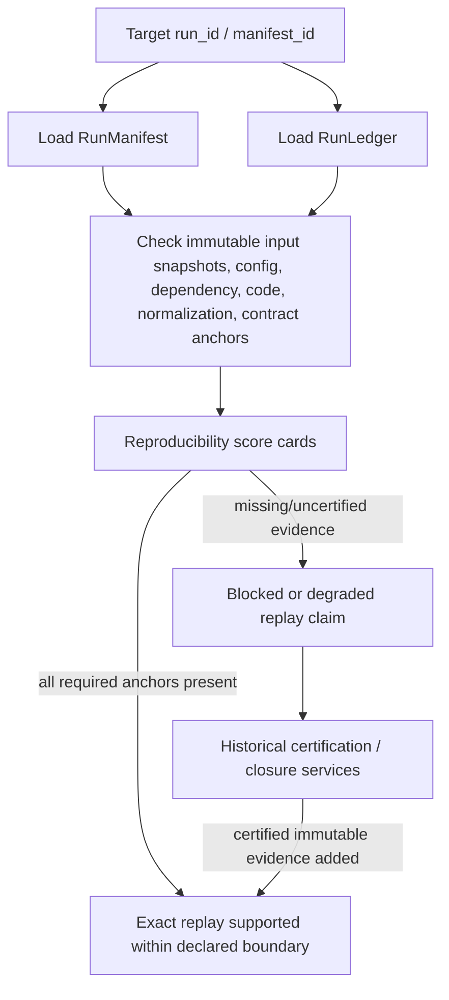

______________________________________________________________________

Version: 1.0.0
Status: active
Class: published
Owner: BioETL Team
Reviewers:

- BioETL Team
  Last verified: '2026-06-03'

______________________________________________________________________

# Replay Guide

Replay support is evidence-based and fail-closed. A retained Bronze file,
checkpoint, or local path is not enough to claim exact replay unless the run has
the required immutable evidence and control-plane anchors.

## Source Of Truth

| Surface | File(s) |
| --- | --- |
| Replay services | `src/bioetl/application/services/control_plane/replay/**` |
| Replay taxonomy | `src/bioetl/application/services/control_plane/manifest/replay_taxonomy.py`, `replay_taxonomy_fields.py` |
| Reproducibility scoring | `src/bioetl/application/services/control_plane/run_manifest_reproducibility_*.py` |
| Historical closure | `src/bioetl/application/services/control_plane/replay/historical_closure_service.py` |
| Historical universe | `src/bioetl/application/services/control_plane/replay/historical_universe_service.py` |
| Manifest/ledger contract | `docs/04-reference/contracts/run-manifest-ledger.md` |

## Replay Decision Flow



## Rules

- Exact replay claims must cite manifest, ledger, effective config, dependency
  lock, source fingerprint, contract identity, normalization profile, and input
  snapshot evidence where required.
- Historical live runs without immutable snapshot evidence remain outside strict
  replay until explicit certification evidence is appended to the ledger.
- Workflow resume is governed by ADR-047 workflow manifest/ledger/execution
  state, not by workflow name alone.
- `required_persistence_profile` values such as `replay_ready` and
  `forensic_grade` require explicit data-root and evidence retention behavior.

## Checks

```bash
python -m pytest tests/unit/application/services/control_plane -q
python -m pytest tests/architecture -q
python -m scripts.engineering.qa run-historical-replay-closure-campaign
```

Use the last command only when the local environment has the required historical
replay fixtures and runtime artifacts.
