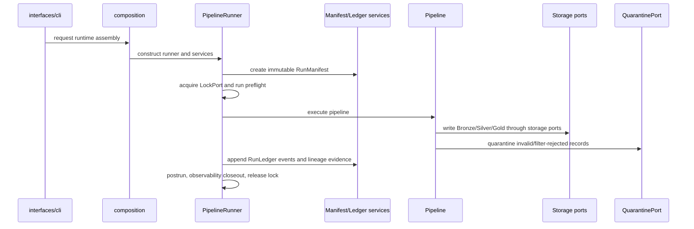

______________________________________________________________________

Version: 1.0.0
Status: active
Class: published
Owner: BioETL Team
Reviewers:

- BioETL Team
  Last verified: '2026-06-03'

______________________________________________________________________

# Run Lifecycle

The BioETL run lifecycle is split between runtime execution, control-plane
provenance, and postrun evidence. The split is intentional: runtime contexts are
not reused as provenance artifacts.

## Source Of Truth

| Surface | File(s) |
| --- | --- |
| Launch/runtime context | `src/bioetl/domain/context.py`, `src/bioetl/domain/value_objects/run_context.py` |
| Pipeline runner | `src/bioetl/application/core/runner.py` |
| Batch execution | `src/bioetl/application/core/batch_executor.py`, `batch_writer.py`, `record_processor.py` |
| Runtime services | `src/bioetl/application/core/lifecycle/**`, `src/bioetl/application/services/execution/**` |
| Manifest/ledger | `src/bioetl/domain/control_plane/run_manifest.py`, `run_ledger.py` |
| Control-plane services | `src/bioetl/application/services/control_plane/**` |
| File stores | `src/bioetl/infrastructure/control_plane/**` |

## Lifecycle

## Invariants

- `RunManifest` is immutable provenance and does not replace
  `PipelineRunContext` or `PipelineContext`.
- `RunLedger` is append-only history and does not serve as a mutable status
  owner.
- Checkpoint resume and ledger-based replay are distinct seams; see ADR-046.
- `PipelineStorageProtocol` is application-owned and aggregates narrow domain
  storage ports for a pipeline service bundle.
- Strict replay-grade runs require explicit reproducibility anchors and must not
  rely on implicit local path reconstruction.

## Related Documents

- [Run Manifest and Run Ledger Contract](../04-reference/contracts/run-manifest-ledger.md)
- [Replay Guide](replay-guide.md)
- [ADR-044 Run Manifest and Run Ledger Control Plane](../02-architecture/decisions/ADR-044-run-manifest-ledger-control-plane.md)
- [ADR-046 Checkpoint Versus Ledger-Based Resume](../02-architecture/decisions/ADR-046-checkpoint-vs-ledger-resume.md)
