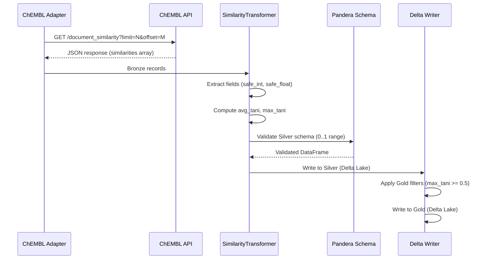
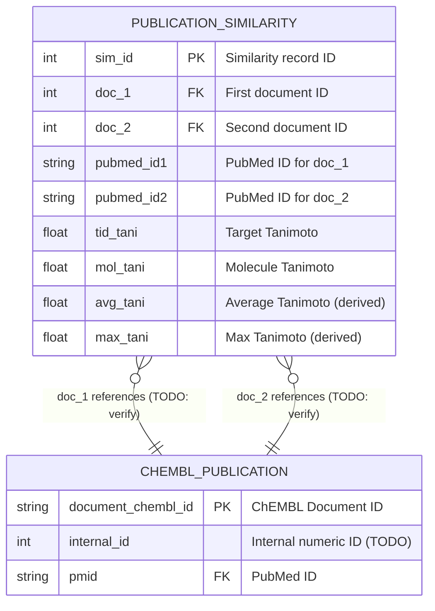

# chembl-publication-similarity

## Overview

The `chembl_publication_similarity` pipeline extracts document similarity data from the ChEMBL database. This entity represents pairwise similarity scores between ChEMBL publications based on Tanimoto coefficients calculated from:

- **Molecules** described in the documents (`mol_tani`)
- **Targets** described in the documents (`tid_tani`)

These similarity metrics enable identification of related publications for literature clustering, redundancy detection, and research trend analysis.

- **Provider**: ChEMBL (European Bioinformatics Institute)
- **Entity**: Publication Similarity (maps to ChEMBL API `/document_similarity` endpoint)
- **Layers**: Silver + Gold
- **Version**: 2.1.0

## Pipeline Identity

| Property | Value |
|----------|-------|
| `pipeline_name` | `chembl_publication_similarity` |
| `provider` | `chembl` |
| `entity_type` | `publication_similarity` |
| `primary_keys` | `["sim_id"]` |
| `silver_table` | `chembl_publication_similarity` |
| `gold_table` | `chembl_publication_similarity` |
| `loading_strategy` | `full_scan_only` |

### Primary Key

- **Primary Key**: `sim_id` (integer, unique similarity record identifier)

### Foreign Keys

| Field | Type | Description | Target |
|-------|------|-------------|--------|
| `doc_1` | `int` | FK to first document | TODO: Verify exact mapping to `chembl_publication` internal ID vs `document_chembl_id` |
| `doc_2` | `int` | FK to second document | TODO: Verify exact mapping to `chembl_publication` internal ID vs `document_chembl_id` |

> **Note**: The `doc_1` and `doc_2` fields appear to be internal ChEMBL document IDs (integers), not the `document_chembl_id` strings used in the publication pipeline. Cross-referencing requires mapping via the ChEMBL database schema.

## Source API

| Property | Value |
|----------|-------|
| **Endpoint** | `https://www.ebi.ac.uk/chembl/api/data/document_similarity` |
| **Format** | JSON |
| **Authentication** | None (public API) |
| **Rate Limit** | TODO: Verify current rate limits |

### API Response Structure

```json
{
  "document_similarities": [
    {
      "sim_id": 12345,
      "doc_1": 1001,
      "doc_2": 1002,
      "pubmed_id1": "12345678",
      "pubmed_id2": "87654321",
      "tid_tani": 0.75,
      "mol_tani": 0.82
    }
  ]
}
```

### Data Flow



## Silver Output Contract

### Field Reference

| Field | Type | Nullable | JSONPath / Source | Transformation |
|-------|------|----------|-------------------|----------------|
| `entity_id` | `str` | No | Computed | SHA256 hash of PK fields |
| `content_hash` | `str` | No | Computed | SHA256 of business fields |
| `sim_id` | `int` | No | `$.sim_id` | `int(primary_id)` |
| `doc_1` | `int` | No | `$.doc_1` | `safe_int()` |
| `doc_2` | `int` | No | `$.doc_2` | `safe_int()` |
| `pubmed_id1` | `str` | Yes | `$.pubmed_id1` | `normalize_pmid()` (numeric string) |
| `pubmed_id2` | `str` | Yes | `$.pubmed_id2` | `normalize_pmid()` (numeric string) |
| `tid_tani` | `float` | Yes | `$.tid_tani` | `safe_float()`, validated 0..1 |
| `mol_tani` | `float` | Yes | `$.mol_tani` | `safe_float()`, validated 0..1 |
| `avg_tani` | `float` | Yes | Derived | `round((tid_tani + mol_tani) / 2, 6)` |
| `max_tani` | `float` | Yes | Derived | `round(max(tid_tani, mol_tani), 6)` |
| `_run_id` | `str` | No | Lineage | Pipeline run UUID |
| `_run_type` | `str` | No | Lineage | `incremental` or `full` |
| `_source_batch_id` | `str` | Yes | Lineage | Batch identifier |
| `_ingestion_ts` | `str` | No | Lineage | ISO timestamp |
| `_index` | `int` | No | Lineage | Record ordinal |

### Tanimoto Coefficient Fields

| Field | Description | Range |
|-------|-------------|-------|
| `tid_tani` | Target-based Tanimoto coefficient (similarity based on shared targets) | [0, 1] |
| `mol_tani` | Molecule-based Tanimoto coefficient (similarity based on shared molecules) | [0, 1] |
| `avg_tani` | **Derived**: Average of `tid_tani` and `mol_tani` | [0, 1] |
| `max_tani` | **Derived**: Maximum of `tid_tani` and `mol_tani` | [0, 1] |

### PubMed Identifier Fields

| Field | Description |
|-------|-------------|
| `pubmed_id1` | PubMed ID for document 1 (numeric string, e.g., `"12345678"`) |
| `pubmed_id2` | PubMed ID for document 2 (numeric string, e.g., `"87654321"`) |

## Transformations (Silver)

### Derived Metrics Computation

The transformer computes `avg_tani` and `max_tani` from the source Tanimoto coefficients:

```python
# Both coefficients present
if tid_tani is not None and mol_tani is not None:
    avg_tani = round((tid_tani + mol_tani) / 2, 6)
    max_tani = round(max(tid_tani, mol_tani), 6)

# Only tid_tani present
elif tid_tani is not None:
    avg_tani = round(tid_tani, 6)
    max_tani = round(tid_tani, 6)

# Only mol_tani present
elif mol_tani is not None:
    avg_tani = round(mol_tani, 6)
    max_tani = round(mol_tani, 6)

# Neither present
else:
    avg_tani = None
    max_tani = None
```

### Computation Details

| Metric | Formula | Precision | Edge Cases |
|--------|---------|-----------|------------|
| `avg_tani` | `(tid_tani + mol_tani) / 2` | 6 decimal places | Single value used if only one present |
| `max_tani` | `max(tid_tani, mol_tani)` | 6 decimal places | Single value used if only one present |

### Type Conversions

| Source Field | Conversion | Function |
|--------------|------------|----------|
| `sim_id` | int | `int(primary_id)` |
| `doc_1`, `doc_2` | int | `safe_int()` |
| `tid_tani`, `mol_tani` | float | `safe_float()` |
| `pubmed_id1`, `pubmed_id2` | str | `normalize_pmid()` |

## Gold Output Contract

### Field Reference

| Field | Type | Coerce | Nullable | Validation Rules |
|-------|------|--------|----------|------------------|
| `entity_id` | `str` | No | No | Non-empty |
| `content_hash` | `str` | No | No | Non-empty |
| `sim_id` | `float` | Yes | No | Coerced from int |
| `doc_1` | `float` | Yes | No | Coerced from int |
| `doc_2` | `float` | Yes | No | Coerced from int |
| `pubmed_id1` | `str` | No | Yes | Numeric string pattern |
| `pubmed_id2` | `str` | No | Yes | Numeric string pattern |
| `tid_tani` | `float` | Yes | Yes | `>= 0` AND `<= 1` |
| `mol_tani` | `float` | Yes | Yes | `>= 0` AND `<= 1` |
| `avg_tani` | `float` | Yes | Yes | `>= 0` AND `<= 1` |
| `max_tani` | `float` | Yes | Yes | `>= 0` AND `<= 1` |
| `_run_id` | `str` | No | No | - |
| `_run_type` | `str` | No | No | - |
| `_source_batch_id` | `str` | No | Yes | - |
| `_ingestion_ts` | `str` | No | No | ISO timestamp |
| `_index` | `int` | No | No | - |

### Tanimoto Coefficient Constraints

All Tanimoto fields have the following validation:

```
0 ≤ tid_tani ≤ 1
0 ≤ mol_tani ≤ 1
0 ≤ avg_tani ≤ 1
0 ≤ max_tani ≤ 1
```

**Note**: `float` coercion for integer fields (`sim_id`, `doc_1`, `doc_2`) handles nullable integers per RULES.md §2.6.

## Gold Filters and Exclusions

### Filter Configuration

Gold layer applies the following filters defined in `configs/filter/entities/chembl/publication_similarity.yaml`:

| Filter Type | Field | Condition | Description |
|-------------|-------|-----------|-------------|
| **Required Fields** | `sim_id` | NOT NULL | Primary key must exist |
| **Required Fields** | `doc_1` | NOT NULL | First document reference required |
| **Required Fields** | `doc_2` | NOT NULL | Second document reference required |
| **Range Filter** | `max_tani` | `>= 0.5` | Only significant similarities (include_min: true) |

### Filter Rationale

The `max_tani >= 0.5` filter retains only **significant similarities**:
- Tanimoto coefficient of 0.5+ indicates meaningful overlap
- Low similarity pairs (< 0.5) add noise without analytical value
- Reduces data volume while preserving actionable relationships

### Exclusion Handling

Records failing Gold filters are:

1. **Logged**: Exclusion reason recorded in DQ report
2. **Counted**: Metrics track excluded record counts by reason
3. **Not Written**: Excluded from Gold output

| Exclusion Reason | Description |
|------------------|-------------|
| `missing_required_field:sim_id` | No similarity ID |
| `missing_required_field:doc_1` | No first document reference |
| `missing_required_field:doc_2` | No second document reference |
| `range_filter:max_tani` | max_tani < 0.5 (low similarity) |

## Data Quality & Monitoring Checklist

### Range Validation

- [ ] **Tanimoto Bounds**: Verify all `tid_tani`, `mol_tani`, `avg_tani`, `max_tani` values in [0, 1]
- [ ] **Outlier Detection**: Flag any values exactly 0 or 1 for review (edge cases)

### Missingness Checks

- [ ] **Primary Key**: `sim_id` should have 0% nulls
- [ ] **Foreign Keys**: `doc_1`, `doc_2` should have 0% nulls
- [ ] **Tanimoto Coefficients**: Track null rates for `tid_tani` and `mol_tani`
- [ ] **PubMed IDs**: Track coverage of `pubmed_id1` and `pubmed_id2`

### Integrity Checks

- [ ] **Duplicate Detection**: Check for duplicate `sim_id` values
- [ ] **Symmetric Duplicates**: Detect pairs where (doc_1, doc_2) and (doc_2, doc_1) both exist
- [ ] **Self-Similarity**: Verify no records where `doc_1 == doc_2`
- [ ] **Derived Metric Consistency**: Verify `avg_tani` and `max_tani` computed correctly

### Distribution Analysis

- [ ] **Tanimoto Distribution**: Histogram of `tid_tani`, `mol_tani`, `max_tani`
- [ ] **Similarity Threshold**: Percentage of records with `max_tani >= 0.5` vs < 0.5
- [ ] **Document Coverage**: Count unique documents appearing in similarity pairs

### DQ Thresholds

| Metric | Soft Threshold | Hard Threshold |
|--------|----------------|----------------|
| Error Rate | 5% | 20% |
| Tanimoto Out-of-Range | 0% | 1% |

## Lineage

### Upstream

```
ChEMBL API (/document_similarity)
    │
    ▼
Bronze Layer (JSONL + zstd)
    │
    ▼
Silver Layer (Delta Lake)
    │
    ▼
Gold Layer (Delta Lake)
```

### Relationship to Publications

```
chembl_publication_similarity.doc_1  ──?──►  chembl_publication (internal ID)
chembl_publication_similarity.doc_2  ──?──►  chembl_publication (internal ID)
```

> **TODO**: Verify the exact relationship between `doc_1`/`doc_2` (integer IDs) and the `document_chembl_id` field in `chembl_publication`. The ChEMBL database may have an internal numeric ID distinct from the public `CHEMBL*` identifiers.

### Downstream

This entity is primarily used for:
- Publication clustering analysis
- Related paper recommendations
- Literature redundancy detection

## Entity Relationship



## Examples

### Silver Record Example (Synthetic)

```json
{
  "entity_id": "f7a8b9c0d1e2...",
  "content_hash": "3f4g5h6i7j8k...",
  "sim_id": 98765,
  "doc_1": 1234,
  "doc_2": 5678,
  "pubmed_id1": "28574821",
  "pubmed_id2": "31245890",
  "tid_tani": 0.723456,
  "mol_tani": 0.856789,
  "avg_tani": 0.790123,
  "max_tani": 0.856789,
  "_run_id": "run-2024-01-15-001",
  "_run_type": "full",
  "_source_batch_id": "batch-042",
  "_ingestion_ts": "2024-01-15T14:30:00Z",
  "_index": 1523
}
```

### Gold Record Example (Synthetic)

```json
{
  "entity_id": "f7a8b9c0d1e2...",
  "content_hash": "3f4g5h6i7j8k...",
  "sim_id": 98765.0,
  "doc_1": 1234.0,
  "doc_2": 5678.0,
  "pubmed_id1": "28574821",
  "pubmed_id2": "31245890",
  "tid_tani": 0.723456,
  "mol_tani": 0.856789,
  "avg_tani": 0.790123,
  "max_tani": 0.856789,
  "_run_id": "run-2024-01-15-001",
  "_run_type": "full",
  "_source_batch_id": "batch-042",
  "_ingestion_ts": "2024-01-15T14:30:00Z",
  "_index": 1523
}
```

**Note**: Gold `sim_id`, `doc_1`, `doc_2` are `float` due to nullable integer coercion. This record passes Gold filter because `max_tani` (0.856789) >= 0.5.

### Excluded Record Example

```json
{
  "sim_id": 11111,
  "doc_1": 2222,
  "doc_2": 3333,
  "tid_tani": 0.15,
  "mol_tani": 0.22,
  "avg_tani": 0.185,
  "max_tani": 0.22
}
```

**Exclusion Reason**: `range_filter:max_tani` (0.22 < 0.5)

## Known Limitations / TODO

### Foreign Key Mapping

| Issue | Status | Notes |
|-------|--------|-------|
| `doc_1`/`doc_2` mapping | TODO | Verify relationship to `document_chembl_id` in publication pipeline |
| Join key availability | TODO | Document how to join similarity records with publication metadata |

### Data Considerations

- **Symmetric Pairs**: ChEMBL may store only (A, B) or both (A, B) and (B, A); verify behavior
- **Self-Similarity**: Confirm API never returns records where doc_1 == doc_2
- **Coverage**: Not all publications have similarity records (only those with shared molecules/targets)

### Performance Notes

- Large dataset: Full scan required on each run (`force_full_scan: true`)
- No natural partition key; sorted by `sim_id`

## Changelog

| Version | Date | Changes |
|---------|------|---------|
| 2.1.0 | 2024-XX-XX | Current version with derived metrics |
| 2.0.0 | 2024-XX-XX | Renamed from `chembl_document_similarity` per ADR-024 |
| 1.0.0 | 2023-XX-XX | Initial implementation |
