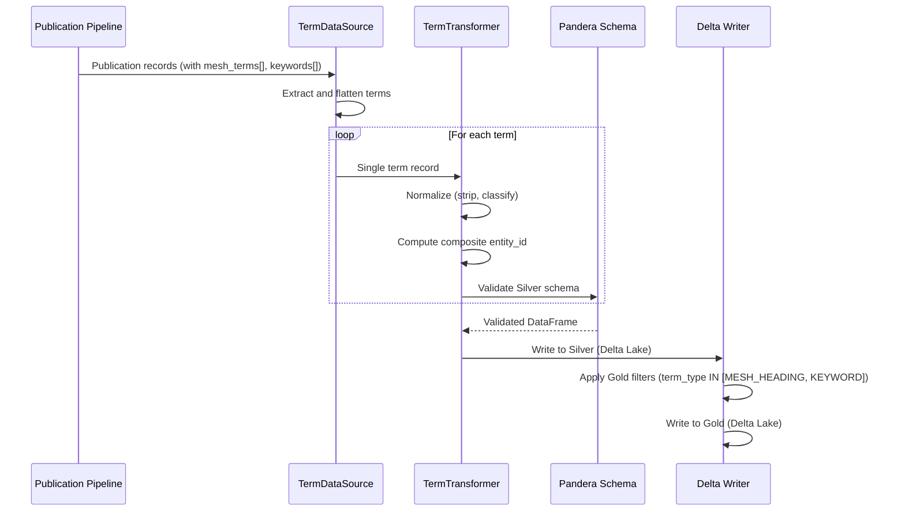
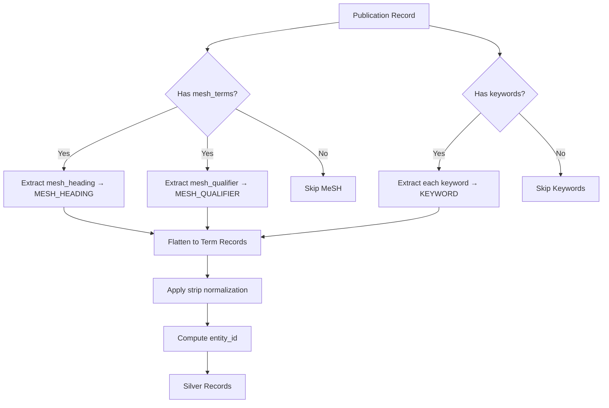
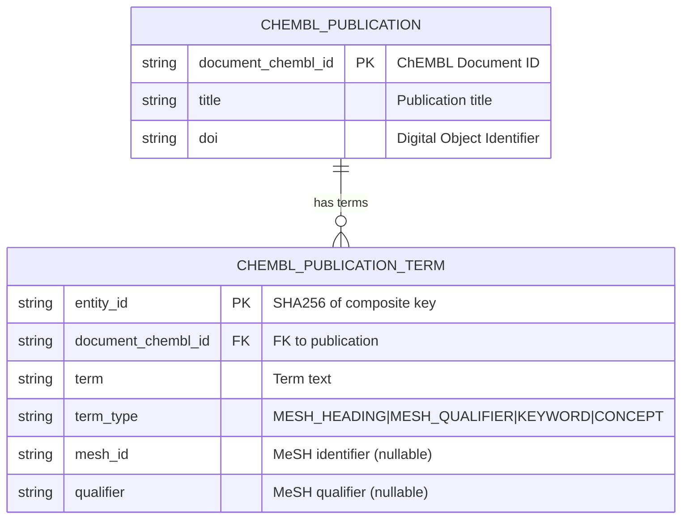

# chembl-publication-term

## Overview

The `chembl_publication_term` pipeline extracts and flattens **terms** (MeSH headings, MeSH qualifiers, keywords, concepts) from ChEMBL publication records. This is a **derived entity** that normalizes the 1:M relationship between publications and their associated classification terms.

### Why a Separate Table?

The source ChEMBL `/document` API returns terms as nested arrays within each publication record:

```json
{
  "document_chembl_id": "CHEMBL1121734",
  "mesh_terms": [
    {"mesh_heading": "Kinases", "mesh_id": "D010770", "mesh_qualifier": "antagonists"},
    {"mesh_heading": "Drug Discovery", "mesh_id": "D055808"}
  ],
  "keywords": ["kinase inhibitor", "drug development"]
}
```

Flattening this 1:M relationship into a separate table enables:

- **Efficient querying**: Find all publications for a given MeSH term
- **Term frequency analysis**: Count publications per term
- **Cross-publication linking**: Identify related publications via shared terms
- **Normalized schema**: Standard relational structure for analytics

- **Provider**: ChEMBL (European Bioinformatics Institute)
- **Entity**: Publication Term (derived from ChEMBL API `/document` endpoint)
- **Layers**: Silver + Gold
- **Version**: 2.1.0

## Pipeline Identity

| Property | Value |
|----------|-------|
| `pipeline_name` | `chembl_publication_term` |
| `provider` | `chembl` |
| `entity_type` | `publication_term` |
| `primary_keys` | `["entity_id"]` (SHA256 of composite key) |
| `silver_table` | `chembl_publication_term` |
| `gold_table` | `chembl_publication_term` |
| `loading_strategy` | `full_scan_only` |
| `partition_by` | `["term_type"]` |

### Natural Key (Composite)

The logical primary key is a composite of three fields:

| Field | Description |
|-------|-------------|
| `document_chembl_id` | Parent publication identifier |
| `term_type` | Term classification (MESH_HEADING, MESH_QUALIFIER, KEYWORD, CONCEPT) |
| `term` | Normalized term text (lowercase, stripped) |

The `entity_id` is computed as:
```python
entity_id = SHA256(f"{document_chembl_id}:{term_type}:{term.lower().strip()}")[:16]
```

> **Note**: The composite key uniquely identifies a term within a document. The same term text may appear multiple times across different documents or with different term types.

### Foreign Key

| Field | Type | References | Description |
|-------|------|------------|-------------|
| `document_chembl_id` | `str` | `chembl_publication.document_chembl_id` | FK to parent publication |

## Source Data (Derived)

This entity is **derived** from the ChEMBL `/document` endpoint, not fetched from a dedicated API.

| Property | Value |
|----------|-------|
| **Source Endpoint** | `https://www.ebi.ac.uk/chembl/api/data/document` |
| **Extraction Type** | Nested field extraction + flattening |
| **Source Fields** | `mesh_terms[]`, `keywords[]` |

### Source Array Structures

**MeSH Terms** (`mesh_terms[]`):
```json
{
  "mesh_heading": "Protein Kinases",
  "mesh_id": "D011494",
  "mesh_qualifier": "antagonists & inhibitors"
}
```

**Keywords** (`keywords[]`):
```json
["kinase inhibitor", "drug discovery", "cancer therapy"]
```

### Data Flow



## Silver Output Contract

### Field Reference

| Field | Type | Nullable | Source | Transformation |
|-------|------|----------|--------|----------------|
| `entity_id` | `str` | No | Computed | SHA256(composite_key)[:16] |
| `content_hash` | `str` | No | Computed | SHA256 of business fields |
| `document_chembl_id` | `str` | No | `$.document_chembl_id` | Validated: `^CHEMBL\d+$` |
| `term` | `str` | No | `$.mesh_terms[].mesh_heading` OR `$.mesh_terms[].mesh_qualifier` OR `$.keywords[]` | `strip()`, min length 1 |
| `term_type` | `str` | No | Derived | Classification enum |
| `mesh_id` | `str` | Yes | `$.mesh_terms[].mesh_id` | Direct (only for MeSH terms) |
| `qualifier` | `str` | Yes | `$.mesh_terms[].mesh_qualifier` | Direct (only for MESH_HEADING) |
| `_run_id` | `str` | No | Lineage | Pipeline run UUID |
| `_run_type` | `str` | No | Lineage | `incremental` or `full` |
| `_source_batch_id` | `str` | Yes | Lineage | Batch identifier |
| `_ingestion_ts` | `str` | No | Lineage | ISO timestamp |
| `_index` | `int` | No | Lineage | Record ordinal |

### Term Types

| `term_type` | Source Array | Source Field | Description |
|-------------|--------------|--------------|-------------|
| `MESH_HEADING` | `mesh_terms[]` | `mesh_heading` | MeSH descriptor (main subject heading) |
| `MESH_QUALIFIER` | `mesh_terms[]` | `mesh_qualifier` | MeSH subheading (aspect qualifier) |
| `KEYWORD` | `keywords[]` | (string value) | Author-provided keyword |
| `CONCEPT` | N/A | N/A | ChEMBL-derived concept (reserved, currently unused) |

### Field Nullability by Term Type

| Field | MESH_HEADING | MESH_QUALIFIER | KEYWORD | CONCEPT |
|-------|--------------|----------------|---------|---------|
| `mesh_id` | Usually present | May be present | Always NULL | NULL |
| `qualifier` | May be present | Always NULL | Always NULL | NULL |

## Transformations (Silver)

### Flattening Logic

The transformer extracts multiple term records from a single publication:



### Term Type Classification

```python
# MeSH Heading extraction
for mesh in record.get("mesh_terms", []):
    if mesh.get("mesh_heading"):
        yield {
            "term": mesh["mesh_heading"],
            "term_type": "MESH_HEADING",
            "mesh_id": mesh.get("mesh_id"),
            "qualifier": mesh.get("mesh_qualifier"),
        }

    # MeSH Qualifier as separate term
    if mesh.get("mesh_qualifier"):
        yield {
            "term": mesh["mesh_qualifier"],
            "term_type": "MESH_QUALIFIER",
            "mesh_id": mesh.get("mesh_id"),
            "qualifier": None,
        }

# Keyword extraction
for keyword in record.get("keywords", []):
    if keyword.strip():  # Skip empty strings
        yield {
            "term": keyword.strip(),
            "term_type": "KEYWORD",
            "mesh_id": None,
            "qualifier": None,
        }
```

### Normalization Rules

| Transformation | Applied To | Description |
|----------------|------------|-------------|
| `strip()` | `term`, `term_type` | Remove leading/trailing whitespace |
| `str()` | All fields | Ensure string type |
| `lower().strip()` | `term` (for entity_id) | Normalize for deduplication |
| Skip empty | `term` | Reject terms with empty text after strip |

### Entity ID Computation

```python
def compute_term_entity_id(document_chembl_id, term_type, term):
    normalized_term = term.lower().strip()
    composite = f"{document_chembl_id}:{term_type}:{normalized_term}"
    return hashlib.sha256(composite.encode()).hexdigest()[:16]
```

Example:
- Input: `("CHEMBL1121734", "MESH_HEADING", "Protein Kinases")`
- Composite: `"CHEMBL1121734:MESH_HEADING:protein kinases"`
- entity_id: `"8f3a9b2c1d4e5f67"` (first 16 chars of SHA256)

## Gold Output Contract

### Field Reference

| Field | Type | Nullable | Validation Rules |
|-------|------|----------|------------------|
| `entity_id` | `str` | No | Non-empty |
| `content_hash` | `str` | No | Non-empty |
| `document_chembl_id` | `str` | No | Pattern: `^CHEMBL\d+$` |
| `term` | `str` | No | Min length: 1 |
| `term_type` | `str` | No | Enum: MESH_HEADING, MESH_QUALIFIER, KEYWORD, CONCEPT |
| `mesh_id` | `str` | Yes | - |
| `qualifier` | `str` | Yes | - |
| `_run_id` | `str` | No | - |
| `_run_type` | `str` | No | - |
| `_source_batch_id` | `str` | Yes | - |
| `_ingestion_ts` | `str` | No | ISO timestamp |
| `_index` | `int` | No | - |

## Gold Filters and Exclusions

### Filter Configuration

Gold layer applies the following filters defined in `configs/filter/entities/chembl/publication_term.yaml`:

| Filter Type | Field | Condition | Description |
|-------------|-------|-----------|-------------|
| **Required Fields** | `document_chembl_id` | NOT NULL | FK to publication required |
| **Required Fields** | `term` | NOT NULL | Term text required |
| **Required Fields** | `term_type` | NOT NULL | Classification required |
| **Column Filter** | `term_type` | `IN ["MESH_HEADING", "KEYWORD"]` | Primary term types only |

### Filter Rationale

The `term_type IN [MESH_HEADING, KEYWORD]` filter:

- **Includes**: `MESH_HEADING` (primary subject descriptors) and `KEYWORD` (author keywords)
- **Excludes**: `MESH_QUALIFIER` (subheadings like "pharmacology", "antagonists") and `CONCEPT`

This focuses on **primary classification terms** while excluding modifiers that are less useful for standalone analysis.

### Exclusion Handling

| Exclusion Reason | Description |
|------------------|-------------|
| `missing_required_field:document_chembl_id` | No parent publication |
| `missing_required_field:term` | Empty term text |
| `missing_required_field:term_type` | Missing classification |
| `column_filter:term_type` | term_type is MESH_QUALIFIER or CONCEPT |

## Data Quality & Monitoring Checklist

### Duplicate Detection

- [ ] **Exact Duplicates**: Check for duplicate `entity_id` values
- [ ] **Logical Duplicates**: Same (document_chembl_id, term, term_type) with different case/whitespace
- [ ] **Cross-Type Duplicates**: Same term appearing as both MESH_HEADING and KEYWORD

### Whitespace Normalization

- [ ] **Leading/Trailing Spaces**: Verify all `term` values are stripped
- [ ] **Internal Normalization**: Check for multiple consecutive spaces
- [ ] **Empty Strings**: Verify no empty `term` values after strip()

### Term Type Distribution

- [ ] **Type Counts**: Distribution of MESH_HEADING vs MESH_QUALIFIER vs KEYWORD
- [ ] **Gold Retention**: Percentage retained after Gold filter (MESH_HEADING + KEYWORD)
- [ ] **CONCEPT Usage**: Monitor if CONCEPT type appears (currently reserved)

### MeSH Field Consistency

- [ ] **mesh_id Coverage**: Percentage of MESH_HEADING/MESH_QUALIFIER with mesh_id
- [ ] **mesh_id NULL Rationale**: Verify NULL mesh_id only for KEYWORD type
- [ ] **qualifier Presence**: Check qualifier only present for MESH_HEADING

### Integrity Checks

- [ ] **FK Validity**: Verify all document_chembl_id exist in chembl_publication
- [ ] **Term Length**: Monitor term length distribution (flag very short/long terms)
- [ ] **Character Encoding**: Check for encoding issues in term text

### DQ Thresholds

| Metric | Soft Threshold | Hard Threshold |
|--------|----------------|----------------|
| Error Rate | 5% | 20% |
| Empty Term Rate | 0% | 1% |
| FK Orphan Rate | 0% | 5% |

## Lineage

### Upstream

```
ChEMBL API (/document)
    │
    ├── mesh_terms[] array
    │   ├── mesh_heading → MESH_HEADING
    │   └── mesh_qualifier → MESH_QUALIFIER
    │
    └── keywords[] array
        └── keyword string → KEYWORD
    │
    ▼
chembl_publication (parent entity)
    │
    ▼
chembl_publication_term (derived, flattened)
```

### Dependency Graph

```
chembl_publication
    │
    └──< chembl_publication_term (1:N, FK: document_chembl_id)
```

### Downstream

This entity supports:

- **Composite Publication Pipeline**: Aggregates MeSH terms and keywords for enriched publication records
- **Topic Analysis**: Term frequency and co-occurrence analysis
- **Search/Discovery**: Term-based publication lookup

## Entity Relationship



## Examples

### Example 1: MeSH Heading with Qualifier

**Source (nested in publication)**:
```json
{
  "document_chembl_id": "CHEMBL1121734",
  "mesh_terms": [{
    "mesh_heading": "Protein Kinases",
    "mesh_id": "D011494",
    "mesh_qualifier": "antagonists & inhibitors"
  }]
}
```

**Silver Record (MESH_HEADING)**:
```json
{
  "entity_id": "8f3a9b2c1d4e5f67",
  "content_hash": "a1b2c3d4e5f6...",
  "document_chembl_id": "CHEMBL1121734",
  "term": "Protein Kinases",
  "term_type": "MESH_HEADING",
  "mesh_id": "D011494",
  "qualifier": "antagonists & inhibitors",
  "_run_id": "run-2024-01-15-001",
  "_run_type": "full",
  "_source_batch_id": "batch-001",
  "_ingestion_ts": "2024-01-15T10:30:00Z",
  "_index": 142
}
```

### Example 2: MeSH Qualifier as Separate Term

**Silver Record (MESH_QUALIFIER)** (extracted from same source):
```json
{
  "entity_id": "2c4e6f8a0b1d3e5f",
  "content_hash": "b2c3d4e5f6g7...",
  "document_chembl_id": "CHEMBL1121734",
  "term": "antagonists & inhibitors",
  "term_type": "MESH_QUALIFIER",
  "mesh_id": "D011494",
  "qualifier": null,
  "_run_id": "run-2024-01-15-001",
  "_run_type": "full",
  "_source_batch_id": "batch-001",
  "_ingestion_ts": "2024-01-15T10:30:00Z",
  "_index": 143
}
```

**Note**: This record is **excluded from Gold** due to `term_type = MESH_QUALIFIER`.

### Example 3: Author Keyword

**Source (nested in publication)**:
```json
{
  "document_chembl_id": "CHEMBL1121734",
  "keywords": ["kinase inhibitor", "drug discovery"]
}
```

**Silver Record (KEYWORD)**:
```json
{
  "entity_id": "5a7c9e1b3d5f7a9c",
  "content_hash": "c3d4e5f6g7h8...",
  "document_chembl_id": "CHEMBL1121734",
  "term": "kinase inhibitor",
  "term_type": "KEYWORD",
  "mesh_id": null,
  "qualifier": null,
  "_run_id": "run-2024-01-15-001",
  "_run_type": "full",
  "_source_batch_id": "batch-001",
  "_ingestion_ts": "2024-01-15T10:30:00Z",
  "_index": 144
}
```

### Gold Output Summary

From the examples above, **Gold layer includes**:
- Example 1 (MESH_HEADING): Included
- Example 2 (MESH_QUALIFIER): **Excluded** (filter: term_type not in [MESH_HEADING, KEYWORD])
- Example 3 (KEYWORD): Included

## Known Limitations / TODO

### Data Source Limitations

| Issue | Status | Notes |
|-------|--------|-------|
| ChEMBL API deprecation | Note | The `/document_term` endpoint was deprecated; terms are extracted from `/document` |
| CONCEPT type | Reserved | `term_type = CONCEPT` is defined but not currently populated from source |
| MeSH hierarchy | Not captured | Only captures term text, not MeSH tree structure |

### Normalization Considerations

- **Case Sensitivity**: Entity ID uses lowercase normalization, but stored `term` preserves original case
- **Punctuation**: No punctuation normalization applied (e.g., "kinase inhibitor" vs "kinase-inhibitor" are different)
- **Stemming/Lemmatization**: Not applied; exact term matching only

### Future Enhancements

- [ ] Add MeSH tree code extraction for hierarchical analysis
- [ ] Consider term normalization/stemming for improved matching
- [ ] Add term frequency statistics at document level

## Changelog

| Version | Date | Changes |
|---------|------|---------|
| 2.1.0 | 2024-XX-XX | Current version with derived entity extraction |
| 2.0.0 | 2024-XX-XX | Renamed from `chembl_document_term` per ADR-024 |
| 1.0.0 | 2023-XX-XX | Initial implementation |
