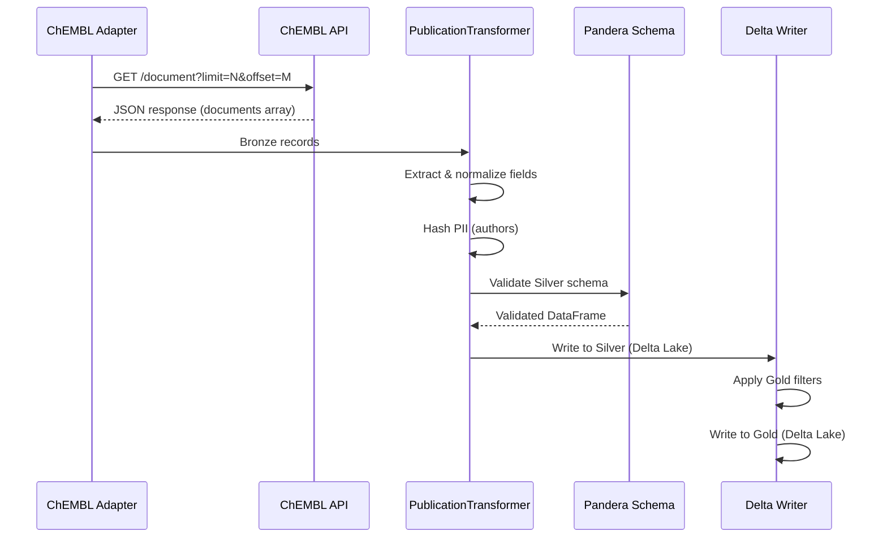
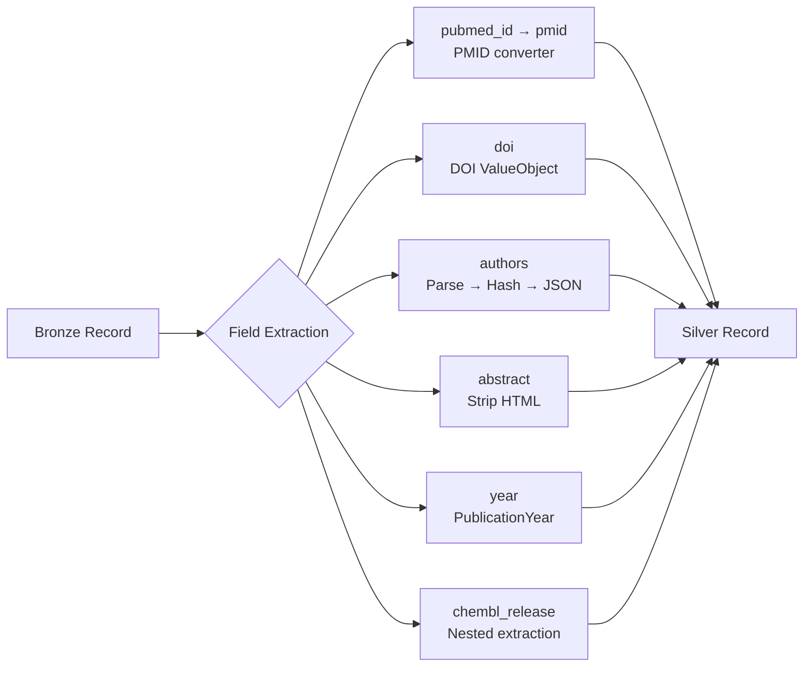
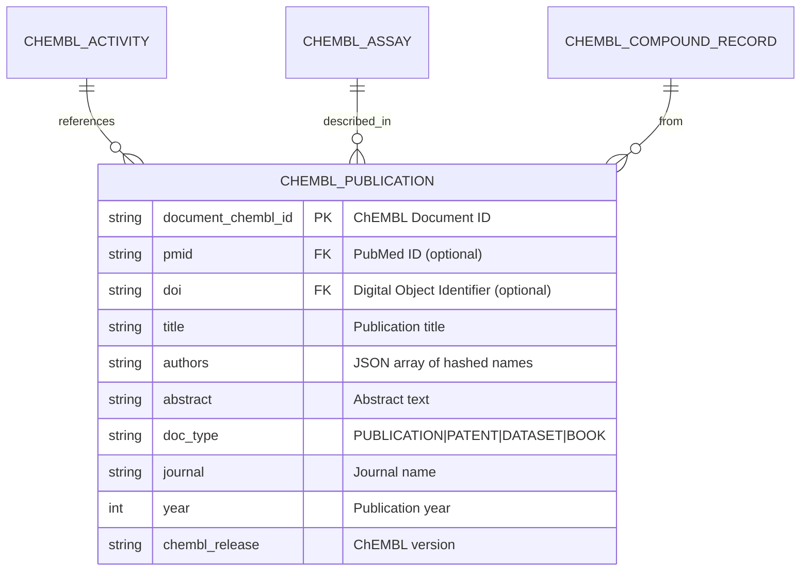

# chembl-publication

## Overview

The `chembl_publication` pipeline extracts scientific publication metadata from the ChEMBL database. Publications in ChEMBL represent scientific literature (journal articles, patents, books, datasets) that serve as sources for bioactivity data.

- **Provider**: ChEMBL (European Bioinformatics Institute)
- **Entity**: Publication (maps to ChEMBL API `/document` endpoint)
- **Layers**: Silver + Gold
- **Version**: 2.1.0

## Pipeline Identity

| Property | Value |
|----------|-------|
| `pipeline_name` | `chembl_publication` |
| `provider` | `chembl` |
| `entity_type` | `publication` |
| `primary_keys` | `["document_chembl_id"]` |
| `silver_table` | `chembl_publication` |
| `gold_table` | `chembl_publication` |
| `loading_strategy` | `full_scan_only` |

### Primary Key and Uniqueness

- **Primary Key**: `document_chembl_id` (format: `CHEMBL\d+`, e.g., `CHEMBL1121734`)
- **Uniqueness**: Each document has a unique ChEMBL ID; deduplication handled via `content_hash` in Silver layer
- **Cross-Provider Linking**: `pmid` and `doi` fields enable joining with PubMed, CrossRef, OpenAlex, and Semantic Scholar data

## Source API

| Property | Value |
|----------|-------|
| **Endpoint** | `https://www.ebi.ac.uk/chembl/api/data/document` |
| **Format** | JSON |
| **Authentication** | None (public API) |
| **Rate Limit** | TODO: Verify current rate limits |

### Data Fetching

The pipeline uses `force_full_scan: true` because ChEMBL API offset pagination can be unstable for incremental loads. Records are fetched in batches, with deduplication handled on Silver layer via `content_hash`.



## Silver Output Contract

### Field Reference

| Field | Type | Nullable | JSONPath / Source | Transformation |
|-------|------|----------|-------------------|----------------|
| `entity_id` | `str` | No | Computed | SHA256 hash of PK fields |
| `content_hash` | `str` | No | Computed | SHA256 of business fields |
| `document_chembl_id` | `str` | No | `$.document_chembl_id` | Validated: `^CHEMBL\d+$` |
| `pmid` | `str` | Yes | `$.pubmed_id` | Renamed; PMID converter (str) |
| `doi` | `str` | Yes | `$.doi` | DOI ValueObject validation |
| `title` | `str` | Yes | `$.title` | Direct |
| `authors` | `str` | Yes | `$.authors` | Parse → Hash PII → JSON serialize |
| `abstract` | `str` | Yes | `$.abstract` | Strip HTML tags |
| `doc_type` | `str` | Yes | `$.doc_type` | Enum: PUBLICATION, PATENT, DATASET, BOOK |
| `journal` | `str` | Yes | `$.journal` | Direct |
| `journal_full_title` | `str` | Yes | `$.journal_full_title` | Direct |
| `year` | `int` | Yes | `$.year` | PublicationYear validation (1800-2100) |
| `volume` | `str` | Yes | `$.volume` | Direct |
| `issue` | `str` | Yes | `$.issue` | Direct |
| `first_page` | `str` | Yes | `$.first_page` | Direct |
| `last_page` | `str` | Yes | `$.last_page` | Direct |
| `src_id` | `int` | Yes | `$.src_id` | Direct (int) |
| `chembl_release` | `str` | Yes | `$.chembl_release.chembl_release` | Nested extraction |
| `creation_date` | `str` | Yes | `$.chembl_release.creation_date` | Nested extraction (YYYY-MM-DD) |
| `citation_count` | `int` | Yes | N/A | Always `None` (not in API) |
| `is_oa` | `bool` | Yes | N/A | Always `None` (not in API) |
| `language` | `str` | Yes | N/A | Always `None` (not in API) |
| `_lookup_method` | `str` | No | Computed | Always `"direct"` |
| `_original_id` | `str` | Yes | Computed | Same as `document_chembl_id` |
| `_source` | `str` | No | Computed | Always `"chembl"` |
| `_dq_warn` | `bool` | Yes | Computed | Default `False` |
| `_dq_error` | `bool` | Yes | Computed | Default `False` |
| `_run_id` | `str` | No | Lineage | Pipeline run UUID |
| `_run_type` | `str` | No | Lineage | `incremental` or `full` |
| `_source_batch_id` | `str` | Yes | Lineage | Batch identifier |
| `_ingestion_ts` | `str` | No | Lineage | ISO timestamp |
| `_index` | `int` | No | Lineage | Record ordinal |

### Derived / Not in API

The following fields are included for cross-provider schema consistency but are **always NULL** for ChEMBL publications:

| Field | Reason |
|-------|--------|
| `citation_count` | ChEMBL `/document` API does not provide citation metrics |
| `is_oa` | Open Access status not available from ChEMBL |
| `language` | Language metadata not provided by ChEMBL |

### Excluded Fields (Not in Silver Output)

| Field | Reason |
|-------|--------|
| `affiliations` | Not collected for ChEMBL publications |
| `pmc_id` | Not provided by ChEMBL API |
| `publication_date` | Not available (only year is provided) |
| `patent_id` | Excluded per unified publication schema |

### PII Handling

**Authors field**: The `authors` field undergoes PII protection per RULES.md §5.4:

1. Raw authors string from API is parsed into a list
2. Each author name is hashed using `PiiHasherPort`
3. Hashed names are serialized to JSON array
4. Example output: `["a1b2c3...", "d4e5f6..."]`

## Transformations (Silver)

### Field-Level Transformations



### 1. PMID Normalization

```python
# Field renamed: pubmed_id → pmid
# Converter ensures string type for cross-provider consistency
FieldSpec("pubmed_id", target="pmid", converter=PMID)
```

### 2. DOI Validation

```python
# DOI ValueObject validates format, normalizes to lowercase
doi = DOI.from_raw(data.get("doi"))
data["doi"] = str(doi) if doi else None
```

Valid DOI pattern: `^10\.\d{4,}/[^\s]+$`

### 3. Authors Processing

```python
# 1. Parse concatenated string to list
author_list = normalizer.parse_authors_to_list(raw_authors)
# 2. Hash each author name (PII protection)
hashed_authors = self.hash_pii_list(author_list)
# 3. Serialize to JSON array
data["authors"] = self.serialize_json_list(hashed_authors)
```

### 4. Abstract HTML Stripping

```python
# Remove HTML tags using DataNormalizationService
data["abstract"] = normalizer.strip_html_tags(data.get("abstract"))
```

### 5. Year Validation

```python
# PublicationYear ValueObject validates range [1800, 2100]
year_vo = PublicationYear.from_raw(data.get("year"))
data["year"] = year_vo.value if year_vo else None
```

### 6. Nested Extraction (ChEMBL Release)

```python
# Extract from nested chembl_release object
release_info = record.get("chembl_release")
if release_info and isinstance(release_info, dict):
    data["chembl_release"] = release_info.get("chembl_release")
    data["creation_date"] = release_info.get("creation_date")
```

## Gold Output Contract

### Field Reference

| Field | Type | Coerce | Nullable | Validation Rules |
|-------|------|--------|----------|------------------|
| `entity_id` | `str` | No | No | Non-empty |
| `content_hash` | `str` | No | No | Non-empty |
| `document_chembl_id` | `str` | No | No | Pattern: `^CHEMBL\d+$` |
| `pmid` | `str` | No | Yes | Pattern: `^\d+$` |
| `doi` | `str` | No | Yes | Valid DOI format |
| `title` | `str` | No | Yes | - |
| `authors` | `str` | No | Yes | Valid JSON array |
| `abstract` | `str` | No | Yes | - |
| `doc_type` | `str` | No | Yes | Enum validation |
| `journal` | `str` | No | Yes | - |
| `journal_full_title` | `str` | No | Yes | - |
| `year` | `float` | Yes | Yes | Coerced from int; nullable |
| `volume` | `str` | No | Yes | - |
| `issue` | `str` | No | Yes | - |
| `first_page` | `str` | No | Yes | - |
| `last_page` | `str` | No | Yes | - |
| `src_id` | `float` | Yes | Yes | Coerced from int |
| `chembl_release` | `str` | No | Yes | - |
| `creation_date` | `str` | No | Yes | Pattern: `YYYY-MM-DD` |
| `citation_count` | `float` | Yes | Yes | Always NULL |
| `is_oa` | `bool` | Yes | Yes | Always NULL |
| `language` | `str` | No | Yes | Always NULL |
| `_source` | `str` | No | Yes | Value: `"chembl"` |
| `_lookup_method` | `str` | No | Yes | Value: `"direct"` |
| `_original_id` | `str` | No | Yes | - |
| `_dq_warn` | `bool` | No | No | Default: `False` |
| `_dq_error` | `bool` | No | No | Default: `False` |
| `_run_id` | `str` | No | No | - |
| `_run_type` | `str` | No | No | - |
| `_source_batch_id` | `str` | No | Yes | - |
| `_ingestion_ts` | `str` | No | No | ISO timestamp |
| `_index` | `int` | No | No | - |

**Note**: `float` coercion for integer fields (`year`, `src_id`, `citation_count`) handles nullable integers per RULES.md §2.6.

## Gold Filters and Exclusions

### Filter Configuration

Gold layer applies the following filters defined in `configs/filter/entities/chembl/publication.yaml`:

| Filter Type | Field | Condition | Description |
|-------------|-------|-----------|-------------|
| **Required Fields** | `document_chembl_id` | NOT NULL | Primary key must exist |
| **Required Fields** | `doc_type` | NOT NULL | Document type must be specified |
| **Required Fields** | `title` | NOT NULL | Title required for valid publication |
| **Column Filter** | `doc_type` | `= "PUBLICATION"` | Only journal articles (excludes patents, books, datasets) |
| **Range Filter** | `year` | `> 1950` | Modern publications only (`include_min: false`) |

### Exclusion Handling

Records failing Gold filters are:

1. **Logged**: Exclusion reason recorded in DQ report
2. **Counted**: Metrics track excluded record counts by reason
3. **Not Written**: Excluded from Gold output

| Exclusion Reason | Description |
|------------------|-------------|
| `missing_required_field:document_chembl_id` | No ChEMBL ID |
| `missing_required_field:title` | No title |
| `missing_required_field:doc_type` | No document type |
| `column_filter:doc_type` | Not PUBLICATION (e.g., PATENT, BOOK) |
| `range_filter:year` | Year ≤ 1950 or NULL |

## Data Quality & Monitoring Checklist

### Required Checks

- [ ] **Null Rate - Primary Key**: `document_chembl_id` should have 0% nulls
- [ ] **Null Rate - Title**: Monitor title null rate (should be low for valid publications)
- [ ] **Null Rate - DOI**: Track DOI coverage (expected ~70-90% for modern publications)
- [ ] **Null Rate - PMID**: Track PMID coverage (varies by publication type)

### Distribution Checks

- [ ] **Year Distribution**: Histogram of publication years (expect recent years to dominate)
- [ ] **doc_type Distribution**: Count by type (PUBLICATION should be majority)
- [ ] **Journal Distribution**: Top journals by publication count

### Integrity Checks

- [ ] **Duplicate Detection**: Check for duplicate `document_chembl_id` values
- [ ] **DOI Format**: Validate DOI pattern compliance
- [ ] **Year Range**: Verify all years within [1800, 2100]

### DQ Thresholds

| Metric | Soft Threshold | Hard Threshold |
|--------|----------------|----------------|
| Error Rate | 5% | 20% |
| Title Null Rate | 1% | 5% |

## Lineage

### Upstream

```
ChEMBL API (/document)
    │
    ▼
Bronze Layer (JSONL + zstd)
    │
    ▼
Silver Layer (Delta Lake)
    │
    ▼
Gold Layer (Delta Lake)
```

### Downstream

The `chembl_publication` Silver table serves as the **seed** for the composite publication pipeline:

```yaml
# configs/pipelines/composite/publication.yaml
composite:
  seed:
    pipeline: chembl_publication
    silver_table: silver/chembl/publication
    output_keys:
      - document_chembl_id
      - doi
      - pmid
      - title
```

The composite pipeline enriches ChEMBL publications with data from:
- CrossRef (citations)
- OpenAlex (concepts)
- PubMed (MeSH terms)
- Semantic Scholar (embeddings)

## Entity Relationship



## Examples

### Silver Record Example (Synthetic)

```json
{
  "entity_id": "abc123def456...",
  "content_hash": "789xyz012...",
  "document_chembl_id": "CHEMBL1121734",
  "pmid": "12345678",
  "doi": "10.1021/jm000000a",
  "title": "Discovery of Novel Kinase Inhibitors",
  "authors": "[\"a1b2c3d4e5f6...\", \"b2c3d4e5f6g7...\"]",
  "abstract": "We report the discovery of a series of potent kinase inhibitors...",
  "doc_type": "PUBLICATION",
  "journal": "J Med Chem",
  "journal_full_title": "Journal of Medicinal Chemistry",
  "year": 2020,
  "volume": "63",
  "issue": "12",
  "first_page": "6500",
  "last_page": "6520",
  "src_id": 1,
  "chembl_release": "CHEMBL_30",
  "creation_date": "2020-06-15",
  "citation_count": null,
  "is_oa": null,
  "language": null,
  "_lookup_method": "direct",
  "_original_id": "CHEMBL1121734",
  "_source": "chembl",
  "_dq_warn": false,
  "_dq_error": false,
  "_run_id": "run-2024-01-15-001",
  "_run_type": "full",
  "_source_batch_id": "batch-001",
  "_ingestion_ts": "2024-01-15T10:30:00Z",
  "_index": 42
}
```

### Gold Record Example (Synthetic)

```json
{
  "entity_id": "abc123def456...",
  "content_hash": "789xyz012...",
  "document_chembl_id": "CHEMBL1121734",
  "pmid": "12345678",
  "doi": "10.1021/jm000000a",
  "title": "Discovery of Novel Kinase Inhibitors",
  "authors": "[\"a1b2c3d4e5f6...\", \"b2c3d4e5f6g7...\"]",
  "abstract": "We report the discovery of a series of potent kinase inhibitors...",
  "doc_type": "PUBLICATION",
  "journal": "J Med Chem",
  "journal_full_title": "Journal of Medicinal Chemistry",
  "year": 2020.0,
  "volume": "63",
  "issue": "12",
  "first_page": "6500",
  "last_page": "6520",
  "src_id": 1.0,
  "chembl_release": "CHEMBL_30",
  "creation_date": "2020-06-15",
  "citation_count": null,
  "is_oa": null,
  "language": null,
  "_source": "chembl",
  "_lookup_method": "direct",
  "_original_id": "CHEMBL1121734",
  "_dq_warn": false,
  "_dq_error": false,
  "_run_id": "run-2024-01-15-001",
  "_run_type": "full",
  "_source_batch_id": "batch-001",
  "_ingestion_ts": "2024-01-15T10:30:00Z",
  "_index": 42
}
```

**Note**: Gold `year` and `src_id` are `float` due to nullable integer coercion.

## Known Limitations / TODO

### Provider-Dependent Fields (Always NULL)

| Field | Status | Workaround |
|-------|--------|------------|
| `citation_count` | Not provided by ChEMBL API | Use composite pipeline with CrossRef/OpenAlex enrichment |
| `is_oa` | Not provided by ChEMBL API | Use composite pipeline with OpenAlex enrichment |
| `language` | Not provided by ChEMBL API | Use composite pipeline with CrossRef enrichment |
| `pmc_id` | Not provided by ChEMBL API | Use composite pipeline with PubMed enrichment |
| `publication_date` | Only year available | Use `year` field; exact date available via CrossRef |

### Known Issues

- **API Offset Instability**: ChEMBL API pagination can return inconsistent results; mitigated by `force_full_scan: true`
- **Patent Data**: Patents have different metadata structure; filtered out in Gold layer

### TODO

- [ ] Document exact rate limit behavior from ChEMBL API
- [ ] Add batch size optimization recommendations
- [ ] Document retry/backoff strategy for API errors

## Changelog

| Version | Date | Changes |
|---------|------|---------|
| 2.1.0 | 2024-01-XX | Added DataNormalizationService for text normalization (DI pattern) |
| 2.0.0 | 2024-XX-XX | Renamed from `chembl_document` per ADR-024 Entity Naming Unification |
| 1.0.0 | 2023-XX-XX | Initial implementation |
