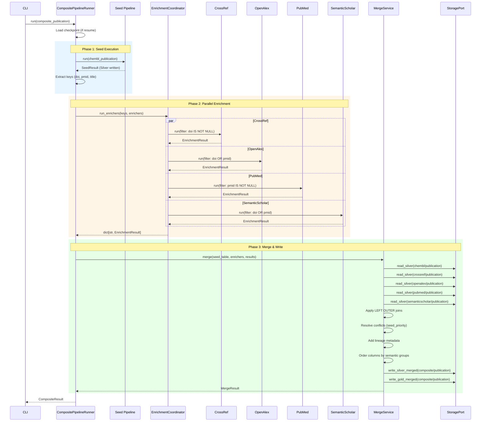
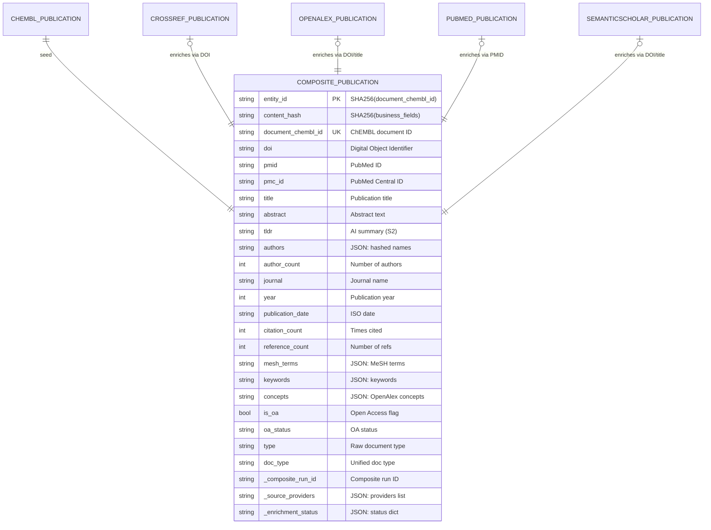

# Composite Publication Pipeline

> **Pipeline**: `composite_publication`
> **Version**: 1.0.0
> **Last Updated**: 2026-01-27
> **Reference**: ADR-026 Composite Pipeline Pattern

---

## Overview

The `composite_publication` pipeline is a **multi-source enrichment pipeline** that combines publication data from multiple providers into a unified, enriched view. It follows the Composite Pipeline Pattern (ADR-026) to orchestrate data enrichment from external sources.

### Why Composite Pipelines?

Traditional single-source pipelines operate independently, requiring manual orchestration to combine data from multiple APIs. The composite pipeline provides:

1. **Automated Multi-Source Enrichment** - Single command runs seed + all enrichers + merge
2. **Unified Entity View** - Merged publication with best-available data from each source
3. **Lineage Tracking** - Field-level provenance showing which source contributed each value
4. **Graceful Degradation** - Optional enricher failures don't block the composite
5. **Resume Capability** - Checkpoint-based recovery from failures

### Architecture

```
┌─────────────────┐
│   Seed Pipeline │
│ (chembl_pub)    │
└────────┬────────┘
         │
┌────────▼────────┐
│  Extract Keys   │
│  (doi, pmid)    │
└────────┬────────┘
         │
   ┌─────┴─────┬─────────────┬─────────────┐
   │           │             │             │
┌──▼───┐   ┌───▼───┐   ┌─────▼───┐   ┌─────▼─────┐
│Cross │   │OpenAl │   │ PubMed  │   │ Semantic  │
│ Ref  │   │  ex   │   │         │   │ Scholar   │
└──┬───┘   └───┬───┘   └────┬────┘   └─────┬─────┘
   │           │            │              │
   └─────┬─────┴────────────┴──────────────┘
         │
┌────────▼────────┐
│   Merge Step    │
│ (Left Outer +   │
│ conflict res)   │
└────────┬────────┘
         │
┌────────▼────────┐
│  Gold Output    │
│(unified entity) │
└─────────────────┘
```

---

## Pipeline Identity

| Attribute | Value |
|-----------|-------|
| **Pipeline Name** | `composite_publication` |
| **Seed Pipeline** | `chembl_publication` |
| **Seed Key** | `document_chembl_id` |
| **Join Keys** | `doi`, `pmid`, `title` (fallback) |
| **Output Silver Path** | `data/output/silver/composite/publication` |
| **Output Gold Path** | `data/output/gold/composite/publication` |
| **Max Concurrency** | 4 enrichers |

### Identifier Fields

| Identifier | Source | Description |
|------------|--------|-------------|
| `document_chembl_id` | chembl (seed) | ChEMBL document ID - primary key |
| `doi` | multiple | Digital Object Identifier - primary join key |
| `pmid` | multiple | PubMed ID - secondary join key |
| `pmc_id` | pubmed only | PubMed Central ID |
| `openalex_id` | openalex | OpenAlex work identifier |
| `paper_id` | semanticscholar | Semantic Scholar paper ID |
| `corpus_id` | semanticscholar | Semantic Scholar corpus ID |

---

## Inputs (Upstream Silver Tables)

The composite pipeline reads from the following Silver tables:

| Pipeline | Silver Table | Join Keys | Required | Filter Condition |
|----------|--------------|-----------|----------|------------------|
| `chembl_publication` | `silver/chembl/publication` | seed | Yes | (seed) |
| `crossref_publication` | `silver/crossref/publication` | doi, title | No | `doi IS NOT NULL` |
| `openalex_publication` | `silver/openalex/publication` | doi, title | No | `doi IS NOT NULL OR pmid IS NOT NULL` |
| `pubmed_publication` | `silver/pubmed/publication` | pmid, doi | No | `pmid IS NOT NULL` |
| `semanticscholar_publication` | `silver/semanticscholar/publication` | doi, title | No | `doi IS NOT NULL OR pmid IS NOT NULL` |

### Notes on Dependencies

- **chembl_publication_term**: Removed as dependency because ChEMBL API no longer provides `mesh_terms`/`keywords` fields in `/document` endpoint and `/document_term` endpoint is deprecated (returns 404).

- **Field exclusions (2026-01-27)**:
  - CrossRef: `pmid`, `pmc_id`, `doc_type` (uses raw `type` instead)
  - OpenAlex: `pmc_id`, `doc_type` (uses raw `type` instead)
  - PubMed: `vernacular_title`, `epub_date`, `received_date`, `revised_date`, `accepted_date`
  - SemanticScholar: `pmc_id`, `arxiv_id`

---

## Merge Strategy

### Overview

The merge process combines data from seed and enrichers using configurable strategies:

```yaml
merge:
  strategy: left_outer          # Preserves all seed records
  conflict_resolution: seed_priority  # Seed values take priority
```

### Merge Strategies

| Strategy | Behavior |
|----------|----------|
| `left_outer` | All seed records preserved; enricher fields nullable |
| `inner` | Only records found in ALL required enrichers |
| `union` | All records from any source (with dedup) |

**Current Configuration**: `left_outer` (all seed records preserved)

### Conflict Resolution Strategies

| Strategy | Behavior |
|----------|----------|
| `seed_priority` | Seed value wins on conflict |
| `enricher_priority` | Enricher value wins on conflict |
| `coalesce` | First non-null value wins |
| `explicit_rules` | Use `field_priorities` mapping |
| `latest_timestamp` | Most recent value wins |

**Current Configuration**: `seed_priority` with `field_priorities` overrides

### Field Priorities

When `explicit_rules` is used with `field_priorities`, specific fields use custom source ordering:

```yaml
field_priorities:
  title:
    - chembl       # ChEMBL title is authoritative
    - crossref
    - openalex
  abstract:
    - pubmed       # PubMed has best abstracts
    - openalex
    - chembl
  citations_count:
    - crossref     # CrossRef is citation authority
    - openalex
  mesh_terms:
    - pubmed       # PubMed MeSH is authoritative
  concepts:
    - openalex     # OpenAlex concepts are unique
  tldr:
    - semanticscholar  # S2-only field
```

---

## Priority Matrix by Field Groups

### Column Groups and Provider Order

| Group | Fields | Provider Order | Notes |
|-------|--------|----------------|-------|
| **System** | `entity_id`, `content_hash`, `_run_id`, `_run_type`, `_source_batch_id`, `_source`, `_ingestion_ts`, `_index`, `_lookup_method`, `_original_id` | (from seed) | Always first |
| **Lineage** | `_composite_*`, `_source_providers`, `_enrichment_*`, `_lineage_*` | (added by MergeService) | Pattern-based |
| **Identifiers** | `document_chembl_id`, `doi`, `pmid` | chembl → openalex → pubmed → semanticscholar | Seed key first |
| **PMC Identifiers** | `pmc_id` | pubmed | Only PubMed provides |
| **Title** | `title` | chembl → crossref → openalex → pubmed → semanticscholar | |
| **Abstract** | `abstract`, `abstract_structured`, `tldr` | chembl → pubmed → crossref → openalex → semanticscholar | PubMed for abstract, S2 for tldr |
| **Authors** | `authors`, `author_count` | chembl → crossref → openalex → pubmed → semanticscholar | |
| **Journal** | `journal`, `journal_full_title`, `journal_title`, `journal_abbrev`, `journal_iso_abbrev`, `short_container_title`, `venue` | chembl → crossref → openalex → pubmed → semanticscholar | |
| **Year** | `year`, `publication_year` | chembl → crossref → openalex → pubmed → semanticscholar | |
| **Dates** | `publication_date`, `published`, `published_print`, `published_online`, `pub_date`, `pub_month`, `pub_day`, `date_completed`, `date_revised` | crossref → openalex → pubmed → semanticscholar | |
| **Pagination** | `volume`, `issue`, `first_page`, `last_page`, `pages`, `medline_pgn` | chembl → crossref → pubmed → semanticscholar | |
| **Citations** | `citation_count`, `reference_count` | crossref → openalex → semanticscholar → pubmed | CrossRef authoritative |
| **ISSN** | `issn`, `issn_print`, `issn_electronic`, `journal_issn_type` | crossref → openalex → pubmed | |
| **Open Access** | `is_oa`, `oa_status`, `open_access_url` | openalex → semanticscholar | |
| **Document Type** | `doc_type`, `type` | chembl → crossref → openalex → pubmed | `type` is raw CrossRef/OpenAlex |
| **Language** | `language` | crossref → openalex → pubmed | |
| **Publisher** | `publisher` | crossref → openalex | |
| **Subjects** | `subjects`, `concepts`, `fields_of_study`, `mesh_terms`, `mesh_heading_count`, `keywords`, `keyword_count`, `publication_types`, `publication_type_list` | crossref → openalex → pubmed → semanticscholar | PubMed for MeSH |
| **Provider IDs** | `openalex_id`, `paper_id`, `corpus_id`, `src_id`, `chembl_release`, `creation_date`, `nlm_unique_id` | chembl → openalex → semanticscholar → pubmed | |
| **Misc** | `license_url`, `alternative_id`, `content_domain_domains`, `content_domain_crossmark_restriction`, `country`, `citation_subset`, `publication_status`, `grant_count`, `chemical_count` | crossref → pubmed | |
| **DQ** | `_dq_*` | (from seed) | Always last |

---

## Composite Silver Output Contract

### Merged Fields Table

| Field | Description | Sources | Merge Rule | Nullable |
|-------|-------------|---------|------------|----------|
| `entity_id` | SHA256 hash of primary key | seed | N/A | No |
| `content_hash` | SHA256 of business fields | seed | N/A | No |
| `document_chembl_id` | ChEMBL document ID | chembl.publication | seed only | No |
| `doi` | Digital Object Identifier | chembl, crossref, openalex, pubmed, semanticscholar | seed_priority | Yes |
| `pmid` | PubMed ID | chembl, openalex, pubmed, semanticscholar | seed_priority | Yes |
| `pmc_id` | PubMed Central ID | pubmed | pubmed only | Yes |
| `title` | Publication title | all providers | field_priority: chembl first | No |
| `abstract` | Abstract text | pubmed, openalex, chembl | field_priority: pubmed first | Yes |
| `abstract_structured` | Has NLM sections | pubmed | pubmed only | Yes |
| `tldr` | AI-generated summary | semanticscholar | S2 only | Yes |
| `authors` | JSON array of hashed names | all providers | seed_priority | Yes |
| `author_count` | Number of authors | all providers | seed_priority | Yes |
| `journal` | Journal name | all providers | seed_priority | Yes |
| `year` | Publication year | all providers | seed_priority | Yes |
| `publication_date` | ISO date (YYYY-MM-DD) | crossref, openalex, pubmed, semanticscholar | crossref first | Yes |
| `citation_count` | Times cited | crossref, openalex, semanticscholar | field_priority: crossref first | Yes |
| `reference_count` | Number of references | crossref, openalex, semanticscholar | crossref first | Yes |
| `mesh_terms` | JSON array of MeSH terms | pubmed | field_priority: pubmed only | Yes |
| `keywords` | JSON array of keywords | pubmed, openalex | pubmed first | Yes |
| `concepts` | JSON array of OpenAlex concepts | openalex | field_priority: openalex only | Yes |
| `fields_of_study` | S2 fields of study | semanticscholar | S2 only | Yes |
| `is_oa` | Open Access flag | openalex, semanticscholar | openalex first | Yes |
| `oa_status` | OA status (green/gold/etc.) | openalex | openalex only | Yes |
| `type` | Raw document type | crossref, openalex | provider-specific | Yes |
| `doc_type` | Unified document type | chembl, pubmed | mapped type | Yes |
| `language` | Language code | crossref, openalex, pubmed | crossref first | Yes |
| `publisher` | Publisher name | crossref, openalex | crossref first | Yes |

### Lineage Metadata Fields

Added by MergeService:

| Field | Type | Description |
|-------|------|-------------|
| `_composite_run_id` | string | UUID of composite pipeline run |
| `_source_providers` | string | JSON list of providers used: `["seed", "crossref", ...]` |
| `_enrichment_status` | string | JSON dict: `{"crossref": "success", "pubmed": "not_found"}` |
| `_lineage_created_at` | string | ISO timestamp of merge |

---

## Aggregations from chembl_publication_term

> **Note**: This section is retained for historical reference. The `chembl_publication_term` dependency was **removed** because the ChEMBL API no longer provides the `/document_term` endpoint.

### Original Design (Deprecated)

When `chembl_publication_term` was a dependency, it used 1:M aggregation:

```yaml
enrichers:
  - pipeline: chembl_publication_term
    is_many_to_one: true
    aggregation:
      group_by: [document_chembl_id]
      fields:
        - source_field: term
          agg_function: collect_list
          output_field: mesh_headings
          filter_condition: "term_type == 'MESH_HEADING'"
        - source_field: term
          agg_function: collect_list
          output_field: keywords
          filter_condition: "term_type == 'KEYWORD'"
        - source_field: term
          agg_function: count
          output_field: term_count
```

### Aggregation Functions

| Function | Description | Output Type |
|----------|-------------|-------------|
| `collect_list` | Collect all values into list | `list[T]` |
| `collect_set` | Collect unique values into list | `list[T]` (unique) |
| `count` | Count non-null values | `int` |
| `first` | Take first value | `T` |
| `concat_str` | Concatenate strings with separator | `str` |

### Current Alternative

MeSH terms and keywords are now sourced from **PubMed** via the `pubmed_publication` enricher:
- `mesh_terms`: From `MeshHeadingList/MeshHeading/DescriptorName`
- `keywords`: From `KeywordList/Keyword`
- `mesh_heading_count`: Computed count
- `keyword_count`: Computed count

---

## Data Quality & Consistency Rules

### DQ Thresholds

```yaml
dq_rules:
  soft_fail_threshold: 0.10  # 10% errors = warning
  hard_fail_threshold: 0.30  # 30% errors = failure

  enricher_overrides:
    semanticscholar_publication:
      soft_fail_threshold: 0.20  # Higher tolerance
      hard_fail_threshold: 0.50
    pubmed_publication:
      soft_fail_threshold: 0.15
      hard_fail_threshold: 0.40

  required_fields:
    - document_chembl_id
    - title
```

### Conflict Resolution Rules

1. **Seed Priority**: Seed (ChEMBL) values always take precedence unless null
2. **Coalesce on Null**: If seed value is null, first non-null enricher value used
3. **Type Compatibility**: Only columns with compatible types can be coalesced
4. **List vs Scalar**: List types cannot be coalesced with scalar types

### Duplicate Identifier Handling

- **Join Key Normalization**: DOI and PMID are normalized to lowercase for case-insensitive matching
- **Enricher Deduplication**: Before join, enrichers are deduplicated by join key (first row wins)
- **Fan-out Prevention**: Deduplication prevents 1:M join from creating duplicate seed records

### Null Filling Strategy

| Scenario | Behavior |
|----------|----------|
| Seed field null, enricher has value | Enricher value used |
| Seed field has value, enricher null | Seed value preserved |
| All sources null | Field remains null |
| Type mismatch | Skip coalesce, keep original columns |

---

## Sequence Diagram



---

## Entity Relationship Diagram



---

## Gold Layer Contract

### Contract Definition

**The Gold contract for `composite_publication` is now defined.**

| Artifact | Location |
|----------|----------|
| **Pandera Schema** | `src/bioetl/domain/contracts/gold/composite.py` |
| **JSON Schema** | `docs/contracts/gold/composite_publication_v1.0.json` |
| **Filter Config** | `configs/filter/entities/composite/publication.yaml` |

### Schema: CompositePublicationGoldSchema

```python
class CompositePublicationGoldSchema(pa.DataFrameModel):
    # System fields (from seed)
    entity_id: Series[str] = pa.Field(nullable=False)
    content_hash: Series[str] = pa.Field(nullable=False)
    dq_warn: Series[bool] = pa.Field(nullable=False, alias="_dq_warn")
    dq_error: Series[bool] = pa.Field(nullable=False, alias="_dq_error")
    run_id: Series[str] = pa.Field(nullable=False, alias="_run_id")
    run_type: Series[str] = pa.Field(nullable=False, alias="_run_type")
    ingestion_ts: Series[str] = pa.Field(nullable=False, alias="_ingestion_ts")
    index: Series[int] = pa.Field(nullable=False, alias="_index")

    # Composite lineage metadata (added by MergeService)
    composite_run_id: Series[str] = pa.Field(nullable=False, alias="_composite_run_id")
    source_providers: Series[str] = pa.Field(nullable=False, alias="_source_providers")
    enrichment_status: Series[str] = pa.Field(nullable=False, alias="_enrichment_status")
    lineage_created_at: Series[str] = pa.Field(nullable=False, alias="_lineage_created_at")

    class Config:
        strict = False  # Allow additional qualified columns from enrichers
        coerce = True
```

### Required Fields

| Field | Type | Description |
|-------|------|-------------|
| `entity_id` | string | SHA256 hash of primary key |
| `content_hash` | string | SHA256 hash of business fields |
| `_dq_warn` | boolean | Data quality warning flag |
| `_dq_error` | boolean | Data quality error flag |
| `_run_id` | string | Pipeline run identifier |
| `_run_type` | string | Run type (incremental/full) |
| `_ingestion_ts` | string | Ingestion timestamp |
| `_index` | integer | Record index |
| `_composite_run_id` | string | Composite pipeline run UUID |
| `_source_providers` | string | JSON list of providers |
| `_enrichment_status` | string | JSON dict of enricher statuses |
| `_lineage_created_at` | string | ISO timestamp of merge |

### Design Notes

1. **`strict = False`**: Composite schemas allow additional columns because:
   - Business columns use qualified names: `{provider}.{entity}.{field}`
   - Actual columns depend on which enrichers succeeded
   - Coalesced columns may have unqualified names

2. **Variable Columns**: The schema validates core required fields while allowing:
   - `chembl.publication.document_chembl_id` (seed primary key)
   - `chembl.publication.title`, `crossref.publication.citation_count`, etc.
   - Any additional enricher columns

3. **Filter Config**: Gold filters require `title` field (qualified or coalesced)

---

## Lineage

### Upstream Dependencies

```
┌─────────────────────────────────────────────────────────────┐
│                    UPSTREAM SILVERS                         │
├─────────────────────────────────────────────────────────────┤
│ silver/chembl/publication        → Seed (primary entity)    │
│ silver/crossref/publication      → Enricher (citations)     │
│ silver/openalex/publication      → Enricher (concepts, OA)  │
│ silver/pubmed/publication        → Enricher (MeSH, abstract)│
│ silver/semanticscholar/publication → Enricher (tldr, S2 IDs)│
└─────────────────────────────────────────────────────────────┘
                             │
                             ▼
┌─────────────────────────────────────────────────────────────┐
│                 COMPOSITE OUTPUTS                           │
├─────────────────────────────────────────────────────────────┤
│ silver/composite/publication     → Merged Silver            │
│ gold/composite/publication       → Merged Gold              │
└─────────────────────────────────────────────────────────────┘
                             │
                             ▼
┌─────────────────────────────────────────────────────────────┐
│                    DOWNSTREAM (TODO)                        │
├─────────────────────────────────────────────────────────────┤
│ Not yet defined - potential consumers:                      │
│ - Analytics dashboards                                      │
│ - ML feature engineering pipelines                          │
│ - Export to external systems                                │
└─────────────────────────────────────────────────────────────┘
```

### Lineage Tracking

The composite pipeline tracks lineage at multiple levels:

| Level | Tracking | Storage |
|-------|----------|---------|
| **Run** | `_composite_run_id` | Every record |
| **Sources** | `_source_providers` | Every record |
| **Status** | `_enrichment_status` | Every record |
| **Timestamp** | `_lineage_created_at` | Every record |
| **Field** | `_field_sources` (optional) | Per-field (if enabled) |

---

## Examples

### Synthetic Merged Record

```json
{
    "entity_id": "sha256:abc123...",
    "content_hash": "sha256:def456...",

    "document_chembl_id": "CHEMBL3307465",
    "doi": "10.1038/nature12373",
    "pmid": "23873052",
    "pmc_id": "PMC3755391",

    "title": "CRISPR-Cas systems for editing",
    "abstract": "BACKGROUND: Gene editing has revolutionized... METHODS: We conducted systematic review... CONCLUSIONS: CRISPR technology shows promise...",
    "abstract_structured": true,
    "tldr": "This paper reviews CRISPR-Cas systems and their applications in drug discovery.",

    "authors": "[\"sha256:author1...\", \"sha256:author2...\"]",
    "author_count": 2,

    "journal": "Nature",
    "journal_full_title": "Nature",
    "volume": "500",
    "issue": "7463",
    "first_page": "472",
    "last_page": "476",

    "year": 2013,
    "publication_year": 2013,
    "publication_date": "2013-08-29",
    "published_print": "2013-08-29",
    "published_online": "2013-06-21",

    "citation_count": 12500,
    "reference_count": 45,

    "mesh_terms": "[\"CRISPR-Cas Systems\", \"Drug Discovery\", \"Gene Editing\"]",
    "mesh_heading_count": 3,
    "keywords": "[\"CRISPR\", \"genome editing\"]",
    "keyword_count": 2,
    "concepts": "[{\"id\": \"C12345\", \"display_name\": \"Genetics\", \"score\": 0.95}]",
    "fields_of_study": "[\"Biology\", \"Genetics\"]",

    "is_oa": true,
    "oa_status": "gold",
    "open_access_url": "https://www.nature.com/articles/nature12373",

    "doc_type": "PUBLICATION",
    "type": "journal-article",
    "language": "en",
    "publisher": "Springer Nature",

    "issn": "0028-0836",
    "issn_print": "0028-0836",
    "issn_electronic": "1476-4687",

    "_source": "chembl",
    "_composite_run_id": "abc123-def456-...",
    "_source_providers": "['seed', 'crossref_publication', 'openalex_publication', 'pubmed_publication', 'semanticscholar_publication']",
    "_enrichment_status": "{'crossref_publication': 'success', 'openalex_publication': 'success', 'pubmed_publication': 'success', 'semanticscholar_publication': 'success'}",
    "_lineage_created_at": "2026-01-27T12:00:00Z",
    "_dq_warn": false,
    "_dq_error": false
}
```

### Merge Precedence Demonstration

| Field | Seed (ChEMBL) | CrossRef | OpenAlex | PubMed | Final Value | Why |
|-------|---------------|----------|----------|--------|-------------|-----|
| `title` | "CRISPR systems" | "CRISPR-Cas systems for editing" | "CRISPR-Cas systems" | "CRISPR-Cas systems for editing" | "CRISPR systems" | seed_priority |
| `abstract` | null | null | "Gene editing..." | "BACKGROUND: Gene editing..." | "BACKGROUND: Gene editing..." | field_priority: pubmed |
| `citation_count` | null | 12500 | 12400 | null | 12500 | field_priority: crossref |
| `mesh_terms` | null | null | null | "[\"CRISPR...\"]" | "[\"CRISPR...\"]" | field_priority: pubmed |
| `concepts` | null | null | "[{\"id\":...}]" | null | "[{\"id\":...}]" | field_priority: openalex |
| `tldr` | null | null | null | null, S2: "This paper..." | "This paper..." | S2 only field |

---

## Known Limitations / TODO

### Current Limitations

1. **No Field-Level Lineage**: `_field_sources` tracking is not implemented; cannot trace which source contributed each individual field value

2. **No Incremental Mode**: Composite pipeline only supports full runs, not delta/incremental enrichment

3. **chembl_publication_term Removed**: MeSH terms from ChEMBL are no longer available; relies on PubMed for classification

4. **Sequential Seed Requirement**: Seed must complete before enrichers start (no streaming)

5. **Memory Pressure**: Large seed datasets may cause memory issues during parallel enrichment

### Completed

- [x] Define `CompositePublicationGoldSchema` in Pandera (2026-01-27)
- [x] Generate JSON Schema contract (2026-01-27)
- [x] Update filter config with Gold contract reference (2026-01-27)

### TODO List

- [ ] Implement field-level lineage tracking (`_field_sources`)
- [ ] Add incremental/delta composite runs
- [ ] Implement caching of enrichment results
- [ ] Add `--enrich-only` and `--required-only` CLI options
- [ ] Define downstream consumers

---

## Configuration Files

| File | Purpose |
|------|---------|
| `configs/pipelines/composite/publication.yaml` | Main composite configuration |
| `configs/filter/entities/composite/publication.yaml` | Gold filter rules |
| `docs/02-architecture/decisions/ADR-026-composite-pipeline-pattern.md` | Architecture decision |

---

## Changelog

| Version | Date | Changes |
|---------|------|---------|
| 1.1.0 | 2026-01-27 | Added Gold contract: CompositePublicationGoldSchema (Pandera), JSON Schema, updated filter config |
| 1.0.0 | 2026-01-27 | Initial documentation; removed chembl_publication_term dependency; documented field exclusions |
