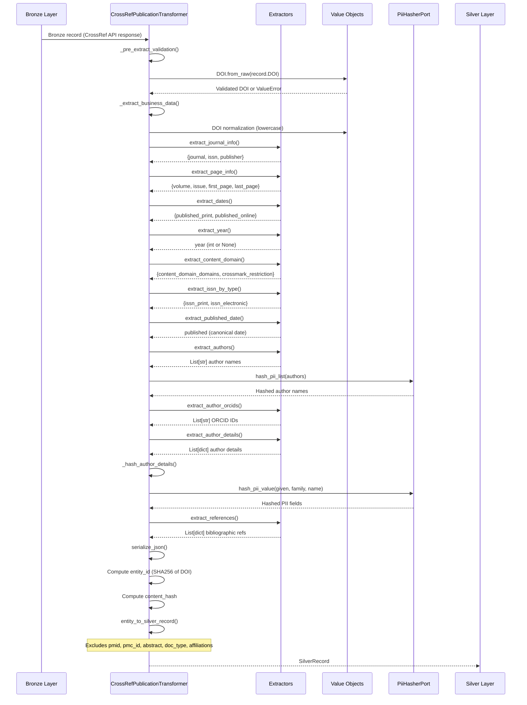
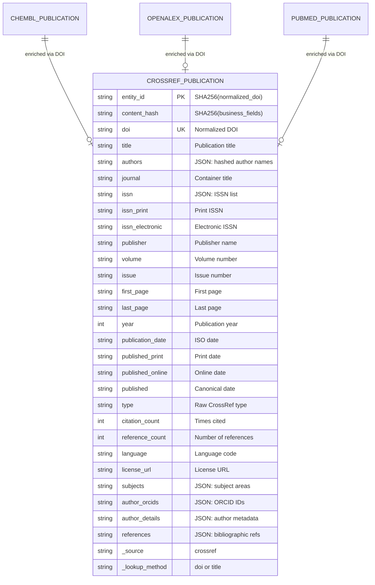

# CrossRef Publication Pipeline

> **Pipeline**: `crossref_publication`
> **Version**: 1.2.0
> **Last Updated**: 2026-01-27

---

## Overview

The `crossref_publication` pipeline enriches publication records with metadata from the CrossRef Works API via DOI resolution. It extracts citation metrics, bibliographic references, author information with ORCID identifiers, and publication dates.

**Key Features:**
- DOI-based lookup with title fallback for unresolved DOIs
- Citation count and reference count extraction
- Author ORCID preservation (non-PII public identifiers)
- Full bibliographic reference extraction for citation network analysis
- Print/electronic ISSN separation
- Content domain (Crossmark) metadata extraction

---

## Pipeline Identity

| Attribute | Value |
|-----------|-------|
| **Pipeline Name** | `crossref_publication` |
| **Provider** | `crossref` |
| **Entity Type** | `work` |
| **Primary Key** | `doi` (normalized: lowercase, stripped) |
| **Loading Strategy** | `full_scan_only` (`force_full_scan: true`) |
| **Silver Table** | `crossref_publication` |
| **Gold Table** | `crossref_publication` |

### Terminology

The pipeline uses "Publication" instead of CrossRef API term "Work" for Ubiquitous Language alignment. All layers reference "publication" to refer to scholarly works (articles, preprints, etc.).

---

## Source API

| Attribute | Value |
|-----------|-------|
| **API** | CrossRef Works API |
| **Endpoint** | `/works/{doi}` (single) or `/works` (batch) |
| **Documentation** | https://api.crossref.org/swagger-ui/index.html |
| **Rate Limits** | Polite pool (50 requests/batch) |
| **Authentication** | None required (polite pool recommended) |

### Input Filter

The pipeline supports DOI-based input filtering with title fallback:

```yaml
input_filter:
  enabled: true
  source_path: "data/input/dois.csv"
  column_name: "doi"
  filter_field: "doi"
  batch_size: 50
  fallback_column: "title"  # Search by title if DOI not found (404)
```

### Lookup Strategy

Three-phase lookup via `TitleFallbackHandler`:
1. **DOI batch fetch** — primary lookup
2. **Title fallback** — for DOIs returning 404
3. **Title-only lookup** — for entries without DOIs

---

## Silver Output Contract

**Schema**: `PublicationEnrichedSchema` (Pandera)
**Location**: `src/bioetl/domain/schemas/crossref/publication.py`

### Core Fields

| Field | Type | Nullable | Description |
|-------|------|----------|-------------|
| `entity_id` | `str` | No | SHA256 hash of normalized DOI |
| `content_hash` | `str` | No | SHA256 of business fields |
| `doi` | `str` | No | Digital Object Identifier (normalized: lowercase, stripped) |
| `title` | `str` | Yes | Publication title (first element of title array) |
| `authors` | `str` | Yes | JSON array of hashed author names (PII compliance) |
| `journal` | `str` | Yes | Container title (journal name) |
| `year` | `int64` | Yes | Publication year (extracted from date-parts) |
| `publication_date` | `str` | Yes | ISO date (YYYY-MM-DD), prefers print over online |

### CrossRef-Specific Fields

| Field | Type | Nullable | Description |
|-------|------|----------|-------------|
| `issn` | `str` | Yes | JSON array of ISSNs |
| `issn_print` | `str` | Yes | Print ISSN (format: XXXX-XXXX) |
| `issn_electronic` | `str` | Yes | Electronic ISSN (format: XXXX-XXXX) |
| `publisher` | `str` | Yes | Publisher name |
| `volume` | `str` | Yes | Volume number |
| `issue` | `str` | Yes | Issue number |
| `first_page` | `str` | Yes | First page (parsed from page range) |
| `last_page` | `str` | Yes | Last page (parsed from page range) |
| `published_print` | `str` | Yes | Print publication date (ISO format) |
| `published_online` | `str` | Yes | Online publication date (ISO format) |
| `published` | `str` | Yes | Canonical publication date (YYYY-MM-DD) |
| `type` | `str` | Yes | Raw CrossRef document type (e.g., "journal-article") |
| `citation_count` | `int64` | Yes | Times cited (is-referenced-by-count) |
| `reference_count` | `int64` | Yes | Number of references |
| `language` | `str` | Yes | Primary language code |
| `license_url` | `str` | Yes | First license URL |
| `subjects` | `str` | Yes | JSON array of subject areas |

### Author & Reference Fields

| Field | Type | Nullable | Description |
|-------|------|----------|-------------|
| `author_orcids` | `str` | Yes | JSON array of ORCID IDs (format: 0000-0000-0000-000X) |
| `author_details` | `str` | Yes | JSON array with hashed names, ORCID, sequence, affiliations |
| `references` | `str` | Yes | JSON array of bibliographic citations |

### Content Domain Fields

| Field | Type | Nullable | Description |
|-------|------|----------|-------------|
| `content_domain_domains` | `object` | Yes | List of content domain domains |
| `content_domain_crossmark_restriction` | `bool` | Yes | Crossmark restriction flag |
| `alternative_id` | `object` | Yes | Alternative IDs (publisher-specific, e.g., PII) |
| `short_container_title` | `object` | Yes | Short journal/container title list |

### System Fields

| Field | Type | Nullable | Description |
|-------|------|----------|-------------|
| `_source` | `str` | No | Fixed: `"crossref"` |
| `_lookup_method` | `str` | Yes | Lookup method: `"doi"` or `"title"` |
| `_original_id` | `str` | Yes | Original identifier used for lookup |
| `_dq_warn` | `bool` | No | Data quality warning flag |
| `_dq_error` | `bool` | No | Data quality error flag |

### Fields Always NULL

The following fields are **excluded** from Silver output via `entity_to_silver_record()`:

| Field | Reason |
|-------|--------|
| `pmid` | CrossRef doesn't provide PubMed IDs |
| `pmc_id` | CrossRef doesn't provide PMC IDs |
| `abstract` | CrossRef doesn't provide abstracts in standard API |
| `doc_type` | Uses raw `type` field instead of mapped unified type |
| `affiliations` | Affiliations are embedded in `author_details` JSON |
| `is_oa` | CrossRef doesn't provide Open Access info |

---

## Transformations

### Sequence Diagram



### Transformation Rules

#### DOI Normalization

```python
# DOI is normalized via Value Object
doi = DOI.from_raw(record.get("DOI"))
# Result: lowercase, stripped, validated format
# e.g., "10.1038/NATURE12373 " → "10.1038/nature12373"
```

#### Title Extraction

```python
# Title is first element of title array
title = extract_first_string(record.get("title", []))
# ["Main Title", "Subtitle"] → "Main Title"
```

#### Year Extraction Priority

```python
# Priority: published-print → published-online → issued
for date_field in ["published-print", "published-online", "issued"]:
    date_parts = record.get(date_field, {}).get("date-parts", [[]])
    if date_parts and date_parts[0]:
        year = PublicationYear.from_raw(date_parts[0][0])
        if year:
            return year.value  # Validated range: 1800-2100
return None
```

#### Date-Parts Formatting

Partial dates are normalized to end-of-period:

| Input | Output |
|-------|--------|
| `[[2023, 6, 15]]` | `"2023-06-15"` |
| `[[2023, 6]]` | `"2023-06-30"` (last day of month) |
| `[[2023]]` | `"2023-12-31"` (last day of year) |

#### Page Range Parsing

```python
# "123-145" → first_page="123", last_page="145"
# "42" → first_page="42", last_page=None
# "e12345" → first_page="e12345", last_page=None
first_page, last_page = parse_page_range(record.get("page"))
```

#### ISSN by Type Extraction

```python
# Input: issn-type array
[
    {"value": "0006-291X", "type": "print"},
    {"value": "1090-2104", "type": "electronic"}
]
# Output:
{
    "issn_print": "0006-291X",
    "issn_electronic": "1090-2104"
}
```

#### Author Name Hashing (PII Compliance)

```python
# Author names are PII and hashed per RULES.md §5.4
raw_authors = extract_authors(record)  # ["John Doe", "Jane Smith"]
hashed_authors = hash_pii_list(raw_authors)  # ["sha256:abc...", "sha256:def..."]
authors_json = serialize_json_list(hashed_authors)
```

#### Author Details Hashing

```python
# PII fields (given, family, name) are hashed
# Non-PII fields (orcid, sequence, affiliations) are preserved
{
    "given": "sha256:abc...",  # Hashed
    "family": "sha256:def...",  # Hashed
    "name": None,  # Org name (hashed if present)
    "orcid": "0000-0002-1825-0097",  # Preserved (public identifier)
    "authenticated_orcid": true,  # Preserved
    "sequence": "first",  # Preserved
    "affiliations": ["University of Oxford"]  # Preserved
}
```

#### ORCID Normalization

```python
# URL prefix is stripped
"https://orcid.org/0000-0002-1825-0097" → "0000-0002-1825-0097"
"http://orcid.org/0000-0002-1825-0097" → "0000-0002-1825-0097"
# Format validated: 0000-0000-0000-000X
```

#### Reference Extraction

```python
# Bibliographic references are extracted for citation network analysis
{
    "key": "ref-1",
    "doi": "10.1016/j.cell.2020.01.001",  # Lowercase
    "doi_asserted_by": "publisher",
    "article_title": "Example Article",
    "journal_title": "Cell",
    "author": "Smith",
    "year": 2020,
    "volume": "180",
    "first_page": "123",
    "unstructured": "Smith J. Example Article. Cell. 2020;180:123-145."
}
```

---

## Gold Output Contract

**Schema**: `CrossRefPublicationGoldSchema` (JSON Schema)
**Location**: `docs/contracts/gold/crossref_publication_v1.0.json`

### Required Fields

| Field | Type | Constraint |
|-------|------|------------|
| `entity_id` | `string` | Not null |
| `content_hash` | `string` | Not null |
| `doi` | `string` | Not null |
| `_dq_warn` | `boolean` | Not null |
| `_dq_error` | `boolean` | Not null |
| `_run_id` | `string` | Not null |
| `_run_type` | `string` | Not null |
| `_ingestion_ts` | `string` | Not null |
| `_index` | `integer` | Not null |

### Validated Fields

| Field | Type | Constraint |
|-------|------|------------|
| `year` | `number` | `minimum: 1900, maximum: 2100` |
| `publication_date` | `string` | Pattern: `^\d{4}-\d{2}-\d{2}$` |
| `published_print` | `string` | Pattern: `^\d{4}-\d{2}-\d{2}$` |
| `published_online` | `string` | Pattern: `^\d{4}-\d{2}-\d{2}$` |
| `citation_count` | `number` | `minimum: 0` |
| `reference_count` | `number` | `minimum: 0` |

---

## Gold Filters

**Configuration**: `configs/filter/entities/crossref/publication.yaml`

### Filter Rules

```yaml
gold_filters:
  ranges:
    year:
      min: 1900
      max: 2100
  required_fields:
    - doi
    - title
```

### Filter Logic

1. **Required Fields**: Records without `doi` or `title` are excluded
2. **Year Range**: Records with `year < 1900` or `year > 2100` are excluded

---

## Data Quality Checklist

### DQ Rules

| Rule | Type | Threshold | Action |
|------|------|-----------|--------|
| DOI format validation | Hard | 100% | Reject record |
| Title presence | Soft | 95% | Warning if missing |
| Year range (1900-2100) | Soft | 99% | Warning if out of range |
| Citation count >= 0 | Hard | 100% | Reject if negative |

### DQ Flags

| Flag | Meaning |
|------|---------|
| `_dq_warn=True` | Non-critical quality issue (missing optional field) |
| `_dq_error=True` | Critical quality issue (invalid format) |

---

## Entity Relationship Diagram



---

## Lineage

### Data Flow

```
Bronze (CrossRef API) → Silver (Delta Lake) → Gold (Delta Lake/Parquet)
```

### Lineage Fields

| Field | Description |
|-------|-------------|
| `_source` | Fixed: `"crossref"` |
| `_lookup_method` | `"doi"` (primary) or `"title"` (fallback) |
| `_original_id` | Original identifier used for lookup |
| `_run_id` | Pipeline run identifier |
| `_run_type` | Run type (incremental/full) |
| `_source_batch_id` | Source batch identifier |
| `_ingestion_ts` | Ingestion timestamp |
| `_index` | Record index within batch |

### Source Traceability

```
CrossRef API Response
    ↓ (DOI resolution)
Bronze Record (JSONL + zstd)
    ↓ (CrossRefPublicationTransformer)
Silver Record (Delta Lake)
    ↓ (Gold filters + DQ validation)
Gold Record (Delta Lake/Parquet)
```

---

## Examples

### Bronze Input (CrossRef API Response)

```json
{
    "DOI": "10.1038/nature12373",
    "title": ["CRISPR-Cas systems for editing"],
    "author": [
        {
            "given": "John",
            "family": "Doe",
            "ORCID": "https://orcid.org/0000-0002-1825-0097",
            "authenticated-orcid": true,
            "sequence": "first",
            "affiliation": [{"name": "MIT"}]
        }
    ],
    "container-title": ["Nature"],
    "ISSN": ["0028-0836", "1476-4687"],
    "issn-type": [
        {"value": "0028-0836", "type": "print"},
        {"value": "1476-4687", "type": "electronic"}
    ],
    "publisher": "Springer Nature",
    "volume": "500",
    "issue": "7463",
    "page": "472-476",
    "published-print": {"date-parts": [[2013, 8, 29]]},
    "published-online": {"date-parts": [[2013, 6, 21]]},
    "type": "journal-article",
    "is-referenced-by-count": 12500,
    "references-count": 45,
    "language": "en",
    "license": [{"URL": "https://creativecommons.org/licenses/by/4.0/"}],
    "subject": ["Genetics", "Molecular Biology"],
    "content-domain": {
        "domain": ["nature.com"],
        "crossmark-restriction": false
    },
    "reference": [
        {
            "key": "ref-1",
            "DOI": "10.1126/science.1225829",
            "article-title": "A programmable dual-RNA-guided",
            "author": "Jinek",
            "year": "2012"
        }
    ]
}
```

### Silver Output

```json
{
    "entity_id": "sha256:a1b2c3...",
    "content_hash": "sha256:d4e5f6...",
    "doi": "10.1038/nature12373",
    "title": "CRISPR-Cas systems for editing",
    "authors": "[\"sha256:abc123...\"]",
    "journal": "Nature",
    "issn": "[\"0028-0836\", \"1476-4687\"]",
    "issn_print": "0028-0836",
    "issn_electronic": "1476-4687",
    "publisher": "Springer Nature",
    "volume": "500",
    "issue": "7463",
    "first_page": "472",
    "last_page": "476",
    "year": 2013,
    "publication_date": "2013-08-29",
    "published_print": "2013-08-29",
    "published_online": "2013-06-21",
    "published": "2013-08-29",
    "type": "journal-article",
    "citation_count": 12500,
    "reference_count": 45,
    "language": "en",
    "license_url": "https://creativecommons.org/licenses/by/4.0/",
    "subjects": "[\"Genetics\", \"Molecular Biology\"]",
    "author_orcids": "[\"0000-0002-1825-0097\"]",
    "author_details": "[{\"given\":\"sha256:...\",\"family\":\"sha256:...\",\"orcid\":\"0000-0002-1825-0097\",\"sequence\":\"first\",\"affiliations\":[\"MIT\"]}]",
    "references": "[{\"key\":\"ref-1\",\"doi\":\"10.1126/science.1225829\",\"article_title\":\"A programmable dual-RNA-guided\",\"author\":\"Jinek\",\"year\":2012}]",
    "content_domain_domains": ["nature.com"],
    "content_domain_crossmark_restriction": false,
    "_source": "crossref",
    "_lookup_method": "doi",
    "_original_id": "10.1038/nature12373",
    "_dq_warn": false,
    "_dq_error": false
}
```

---

## Known Limitations

1. **No Abstract**: CrossRef standard API doesn't provide abstracts. Use `abstract=true` query parameter for limited abstract availability.

2. **No Open Access Info**: CrossRef doesn't provide `is_oa` status. Use OpenAlex enrichment for OA metadata.

3. **No PubMed IDs**: CrossRef doesn't provide `pmid` or `pmc_id`. Use PubMed enrichment for these identifiers.

4. **Rate Limits**: Polite pool requires conservative batch sizes (50/batch). Use `mailto` parameter for higher limits.

5. **Partial Date Normalization**: Dates with only year or year-month are normalized to end-of-period (e.g., 2023 → 2023-12-31).

6. **Reference Completeness**: Not all references have DOIs; `unstructured` field may contain free-text citations.

7. **ORCID Coverage**: Not all authors have ORCID identifiers; `author_orcids` may be shorter than author list.

---

## Configuration Files

| File | Purpose |
|------|---------|
| `configs/pipelines/crossref/publication.yaml` | Pipeline configuration |
| `configs/filter/entities/crossref/publication.yaml` | Gold filter rules |
| `configs/dq/entities/crossref/publication.yaml` | DQ validation rules |
| `configs/sources/crossref.yaml` | API source configuration |

---

## Changelog

| Version | Date | Changes |
|---------|------|---------|
| 1.2.0 | 2026-01-27 | Removed `doc_type` (uses raw `type`), excluded `pmid`, `pmc_id`, `abstract` |
| 1.1.0 | 2026-01-15 | Added `author_details`, `author_orcids`, `references` fields |
| 1.0.0 | 2025-12-01 | Initial release |
