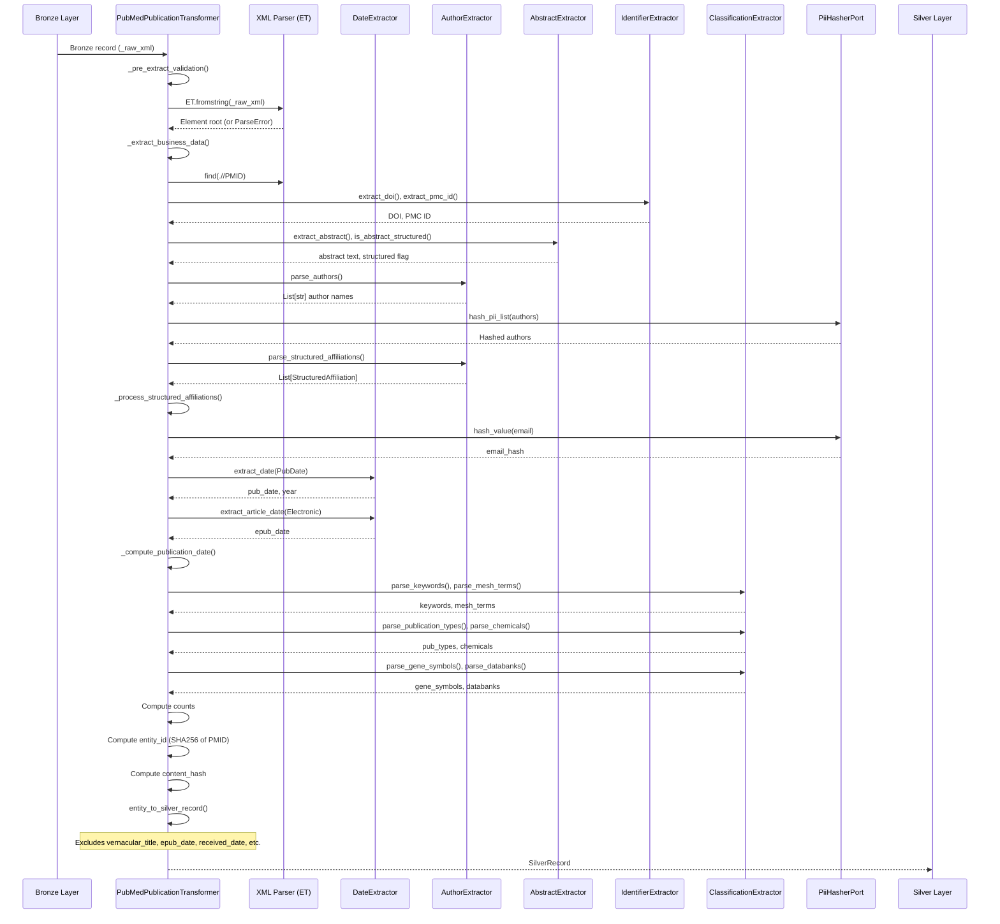
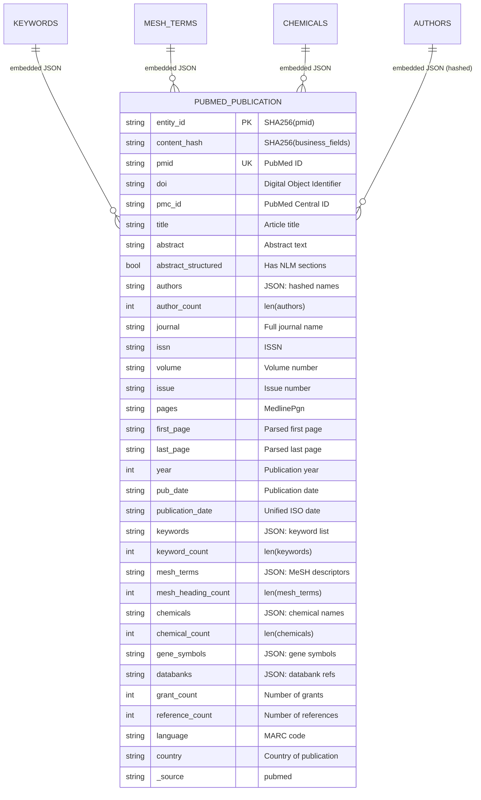

# PubMed Publication Pipeline

> **Pipeline**: `pubmed_publication`
> **Version**: 1.2.0
> **Last Updated**: 2026-01-27

---

## Overview

The `pubmed_publication` pipeline extracts publication metadata from PubMed via the NCBI Entrez E-utilities API. It processes XML responses to extract bibliographic data, MeSH terms, keywords, chemicals, gene symbols, and structured affiliations with institutional identifiers.

**Key Features:**
- XML parsing with specialized extractors for dates, authors, abstracts, identifiers, and classifications
- Structured abstract detection (NLM labeled sections: BACKGROUND, METHODS, RESULTS, CONCLUSIONS)
- MedlineDate free-text parsing with season/quarter support
- PII hashing for author names and affiliation emails (RULES.md §5.4)
- Denormalized counts for query efficiency
- Structured affiliations with ROR/GRID institutional identifiers

---

## Pipeline Identity

| Attribute | Value |
|-----------|-------|
| **Pipeline Name** | `pubmed_publication` |
| **Provider** | `pubmed` |
| **Entity Type** | `publication` |
| **Primary Key** | `pmid` (PubMedId ValueObject normalized) |
| **Loading Strategy** | `full_scan_only` (`force_full_scan: true`) |
| **Silver Table** | `pubmed_publication` |
| **Gold Table** | `pubmed_publication` |
| **Partition By** | `pub_year` (Silver layer) |

---

## Source API

| Attribute | Value |
|-----------|-------|
| **API** | NCBI Entrez E-utilities |
| **Endpoint** | `/eutils/efetch.fcgi` |
| **Response Format** | XML (MEDLINE DTD) |
| **Documentation** | https://www.nlm.nih.gov/bsd/licensee/elements_descriptions.html |
| **Rate Limits** | 3 req/sec (without API key), 10 req/sec (with API key) |
| **Authentication** | API key (recommended), email (required) |

### Request Parameters

```
db=pubmed
rettype=xml
retmode=xml
id={pmid_list}  # Comma-separated PMIDs
```

### Input Filter

```yaml
input_filter:
  enabled: true
  source_path: "data/input/pubmed.csv"
  column_name: "pubmed_id"
  filter_field: "pmid"
  batch_size: 100
  fallback_column: "title"  # Search by title if PMID not found
```

### Extraction Shape

1. **Search Phase**: `esearch.fcgi` returns PMID list matching query
2. **Fetch Phase**: `efetch.fcgi` retrieves full XML for each PMID batch
3. **Parse Phase**: XML parsed with specialized extractors
4. **Transform Phase**: Business data extracted and normalized

---

## Silver Output Contract

**Schema**: `PubMedPublicationSchema` (Pandera)
**Location**: `src/bioetl/domain/schemas/pubmed/publication.py`

### Field Mapping Table

| Field | XPath | Transformation | Nullable |
|-------|-------|----------------|----------|
| `pmid` | `.//PMID` | `PubMedId.from_raw()` → str | No |
| `doi` | `.//ELocationID[@EIdType='doi']` or `.//ArticleId[@IdType='doi']` | `DOI.from_raw()` → lowercase | Yes |
| `pmc_id` | `.//ArticleId[@IdType='pmc']` | `normalize_pmc_id()` → PMC prefix | Yes |
| `pii` | `.//ELocationID[@EIdType='pii']` or `.//ArticleId[@IdType='pii']` | strip | Yes |
| `mid` | `.//ArticleId[@IdType='mid']` | strip | Yes |
| `publisher_id` | `.//ArticleId[@IdType='publisher-id']` | strip | Yes |
| `title` | `.//ArticleTitle` | `get_text()` | No |
| `abstract` | `.//Abstract/AbstractText` | `AbstractExtractor` → join sections | Yes |
| `abstract_structured` | `.//Abstract/AbstractText[@Label]` | `is_abstract_structured()` → bool | Yes |
| `authors` | `.//AuthorList/Author` | `AuthorExtractor` → JSON (hashed PII) | Yes |
| `author_count` | computed | `len(authors)` | Yes |
| `structured_affiliations` | `.//AffiliationInfo` | JSON with identifier, email_hash | Yes |
| `journal` | `.//Journal/Title` | `get_text()` | Yes |
| `journal_title` | `.//Journal/Title` | alias for `journal` | Yes |
| `journal_abbrev` | `.//Journal/ISOAbbreviation` | `get_text()` | Yes |
| `journal_iso_abbrev` | `.//Journal/ISOAbbreviation` | alias for `journal_abbrev` | Yes |
| `issn` | `.//Journal/ISSN` | `get_text()`, format validated | Yes |
| `journal_issn_type` | `.//Journal/ISSN/@IssnType` | Print/Electronic/Linking | Yes |
| `nlm_unique_id` | `.//MedlineJournalInfo/NlmUniqueID` | `get_text()` | Yes |
| `volume` | `.//JournalIssue/Volume` | `get_text()` | Yes |
| `issue` | `.//JournalIssue/Issue` | `get_text()` | Yes |
| `pages` | `.//Pagination/MedlinePgn` | `get_text()` | Yes |
| `medline_pgn` | `.//Pagination/MedlinePgn` | alias for `pages` | Yes |
| `first_page` | `.//Pagination/MedlinePgn` | `parse_page_range()[0]` | Yes |
| `last_page` | `.//Pagination/MedlinePgn` | `parse_page_range()[1]` | Yes |
| `year` | `.//JournalIssue/PubDate/Year` | `PublicationYear.from_raw()` | Yes |
| `publication_year` | computed | alias for `year` | Yes |
| `pub_date` | `.//JournalIssue/PubDate` | `DateExtractor` → ISO | Yes |
| `pub_month` | `.//JournalIssue/PubDate/Month` | month name → int (1-12) | Yes |
| `pub_day` | `.//JournalIssue/PubDate/Day` | int (1-31) | Yes |
| `publication_date` | computed | `_compute_publication_date()` | Yes |
| `date_completed` | `.//MedlineCitation/DateCompleted` | `DateExtractor` → ISO | Yes |
| `date_revised` | `.//MedlineCitation/DateRevised` | `DateExtractor` → ISO | Yes |
| `publication_status` | `.//PubmedData/PublicationStatus` | ppublish/epublish/aheadofprint | Yes |
| `publication_types` | `.//PublicationTypeList/PublicationType` | `ClassificationExtractor` → JSON | Yes |
| `publication_type_list` | computed | JSON serialization of `publication_types` | Yes |
| `keywords` | `.//KeywordList/Keyword` | `ClassificationExtractor` → JSON | Yes |
| `keyword_count` | computed | `len(keywords)` | Yes |
| `mesh_terms` | `.//MeshHeadingList/MeshHeading/DescriptorName` | `ClassificationExtractor` → JSON | Yes |
| `mesh_heading_count` | computed | `len(mesh_terms)` | Yes |
| `chemicals` | `.//ChemicalList/Chemical/NameOfSubstance` | `ClassificationExtractor` → JSON | Yes |
| `chemical_count` | computed | `len(chemicals)` | Yes |
| `gene_symbols` | `.//GeneSymbolList/GeneSymbol` | `ClassificationExtractor` → JSON | Yes |
| `databanks` | `.//DataBankList/DataBank` | `ClassificationExtractor` → JSON | Yes |
| `grant_count` | `.//GrantList/Grant` | `len(grants)` | Yes |
| `reference_count` | `.//ReferenceList/Reference` | `len(references)` | Yes |
| `language` | `.//Article/Language` | MARC code (2-3 chars) | Yes |
| `country` | `.//MedlineJournalInfo/Country` | `get_text()` | Yes |
| `citation_subset` | `.//MedlineCitation/CitationSubset` | comma-joined | Yes |
| `doc_type` | fixed | `"PUBLICATION"` | Yes |
| `_source` | fixed | `"pubmed"` | No |

### Computed Fields

| Field | Formula | Description |
|-------|---------|-------------|
| `author_count` | `len(hashed_authors)` | Number of authors |
| `keyword_count` | `len(keywords)` | Number of keywords |
| `mesh_heading_count` | `len(mesh_terms)` | Number of MeSH headings |
| `chemical_count` | `len(chemicals)` | Number of chemicals |
| `grant_count` | `len(grant_list)` | Number of grants |
| `reference_count` | `len(reference_list)` | Number of references |
| `publication_date` | `epub_date or pub_date or f"{year}-12-31"` | Unified ISO date |
| `publication_year` | `year` (alias) | Legacy compatibility |

### Fields Excluded from Output

The following fields are excluded via `entity_to_silver_record()`:

| Field | Reason |
|-------|--------|
| `vernacular_title` | PubMed no longer provides consistently |
| `epub_date` | Excluded per design (2026-01-27) |
| `received_date` | Excluded per design (2026-01-27) |
| `revised_date` | Excluded per design (2026-01-27) |
| `accepted_date` | Excluded per design (2026-01-27) |

### Fields Always NULL

| Field | Reason |
|-------|--------|
| `citation_count` | PubMed doesn't provide citation counts |
| `is_oa` | PubMed doesn't provide OA status directly |

### PII Handling

Author names and affiliation emails are PII and hashed before storage:

```python
# Author names hashed
raw_authors = AuthorExtractor.parse_authors(article)  # ["Doe, J", "Smith, A"]
hashed_authors = hash_pii_list(raw_authors)  # ["sha256:abc...", "sha256:def..."]
authors_json = serialize_json_list(hashed_authors)

# Affiliation emails hashed in structured_affiliations
{
    "text": "University of Oxford, UK. Electronic address: john.doe@ox.ac.uk",
    "identifier": "https://ror.org/052gg0110",
    "identifier_source": "ROR",
    "email_hash": "sha256:ghi..."  # Original email hashed
}
```

---

## Transformations (Silver)

### Sequence Diagram



### DateExtractor Usage

The `DateExtractor` class handles multiple date formats:

#### Structured Dates (Year/Month/Day elements)

```xml
<PubDate>
    <Year>2023</Year>
    <Month>Jun</Month>
    <Day>15</Day>
</PubDate>
```

Result: `"2023-06-15"`

#### Partial Dates (End-of-Period Strategy)

| Input | Output | Strategy |
|-------|--------|----------|
| Year + Month + Day | `YYYY-MM-DD` | Exact date |
| Year + Month | `YYYY-MM-{last_day}` | Last day of month |
| Year only | `YYYY-12-31` | Last day of year |

#### MedlineDate Free-Text Parsing

```xml
<PubDate>
    <MedlineDate>2023 Jan-Feb</MedlineDate>
</PubDate>
```

| MedlineDate Format | Parsed Result | Strategy |
|--------------------|---------------|----------|
| `"2023 Jan-Feb"` | year=2023, month=Feb | End of range |
| `"2023 Spring"` | year=2023, month=May | End of season |
| `"2023 1st Quart"` | year=2023, month=Mar | End of Q1 |
| `"2022 Dec-2023 Jan"` | year=2023, month=Jan | Cross-year: take second year |

#### Date Fields

| Field | Source XPath | Extractor Method |
|-------|--------------|------------------|
| `pub_date` | `.//JournalIssue/PubDate` | `DateExtractor.extract_date()` |
| `epub_date` | `.//ArticleDate[@DateType='Electronic']` | `DateExtractor.extract_article_date()` |
| `date_completed` | `.//MedlineCitation/DateCompleted` | `DateExtractor.extract_date()` |
| `date_revised` | `.//MedlineCitation/DateRevised` | `DateExtractor.extract_date()` |

### parse_page_range

```python
# MedlinePgn formats:
"123-456" → first_page="123", last_page="456"
"123"     → first_page="123", last_page=None
"e12345"  → first_page="e12345", last_page=None
"A1-A15"  → first_page="A1", last_page="A15"
```

### Structured Abstract Detection

```python
# Structured abstract has labeled sections
<Abstract>
    <AbstractText Label="BACKGROUND">...</AbstractText>
    <AbstractText Label="METHODS">...</AbstractText>
    <AbstractText Label="RESULTS">...</AbstractText>
    <AbstractText Label="CONCLUSIONS">...</AbstractText>
</Abstract>

abstract_structured = True  # Has Label attributes
abstract = "BACKGROUND: ... METHODS: ... RESULTS: ... CONCLUSIONS: ..."
```

---

## Gold Output Contract

**Schema**: `PubMedPublicationGoldSchema` (JSON Schema)
**Location**: `docs/contracts/gold/pubmed_publication_v1.0.json`

### Required Fields

| Field | Type | Constraint |
|-------|------|------------|
| `entity_id` | `string` | Not null |
| `content_hash` | `string` | Not null |
| `pmid` | `string` | Not null, matches `^\d+$` |
| `_dq_warn` | `boolean` | Not null |
| `_dq_error` | `boolean` | Not null |
| `_run_id` | `string` | Not null |
| `_run_type` | `string` | Not null |
| `_ingestion_ts` | `string` | Not null |
| `_index` | `integer` | Not null |

### Validated Fields

| Field | Type | Constraint |
|-------|------|------------|
| `publication_date` | `string` | Pattern: `^\d{4}-\d{2}-\d{2}$` |
| `date_completed` | `string` | Pattern: `^\d{4}-\d{2}-\d{2}$` |
| `date_revised` | `string` | Pattern: `^\d{4}-\d{2}-\d{2}$` |
| `pub_month` | `number` | 1-12 (via Silver schema check) |
| `pub_day` | `number` | 1-31 (via Silver schema check) |
| `author_count` | `number` | >= 0 |
| `keyword_count` | `number` | >= 0 |
| `mesh_heading_count` | `number` | >= 0 |
| `grant_count` | `number` | >= 0 |
| `reference_count` | `number` | >= 0 |
| `chemical_count` | `number` | >= 0 |

### Type Coercions (Float for Nullable Integers)

The Gold schema uses `float` coercion for nullable integer fields due to Pandas/Polars historical limitations with nullable integers:

| Field | Silver Type | Gold Type | Reason |
|-------|-------------|-----------|--------|
| `year` | `int64` | `number` | Nullable integer handling |
| `publication_year` | `int64` | `number` | Nullable integer handling |
| `pub_month` | `int` | `number` | Nullable integer handling |
| `pub_day` | `int` | `number` | Nullable integer handling |
| `author_count` | `int` | `number` | Nullable integer handling |
| `*_count` fields | `int` | `number` | Nullable integer handling |

---

## Gold Filters and Exclusions

**Configuration**: `configs/filter/entities/pubmed/publication.yaml`

### Filter Rules

```yaml
gold_filters:
  required_fields:
    - pmid
    - title
  columns: {}  # No column-specific filters beyond required fields
```

### Applied Filters

1. **Required Fields**: Records without `pmid` or `title` are excluded
2. **No Additional Range Filters**: Unlike other providers, PubMed pipeline does not define year range filters (relies on Silver schema validation)

Note: The Silver schema enforces `pmid` as non-nullable with positive integer validation and `title` as non-nullable with length >= 1.

---

## Data Quality Checklist

### XML Parsing Robustness

| Scenario | Handling |
|----------|----------|
| Missing `_raw_xml` field | `ValueError` → record rejected |
| Malformed XML | `ET.ParseError` → logged warning, record rejected |
| Missing `<Article>` element | Returns `{pmid: pmid}` only |
| Missing child elements | `get_text()` returns `None` gracefully |

### Date Normalization

| Scenario | Handling |
|----------|----------|
| Invalid date format (e.g., "2024-13-99") | `_is_valid_date_format()` → `None` |
| Non-ISO text (e.g., "n/a") | Validation fails → `None` |
| Partial dates | End-of-period normalization |
| MedlineDate with season/quarter | Mapped to end-of-period month |

### Duplicate PMID

- **Detection**: Silver layer deduplication via `content_hash`
- **Resolution**: Latest record wins (UPSERT on content_hash)

### Null Title

- **Silver Schema**: `title` is non-nullable with length >= 1 check
- **Transformer**: If `<ArticleTitle>` missing, record still passes but title will be None
- **Gold Filter**: `required_fields: [pmid, title]` excludes null titles

### DQ Flags

| Flag | Meaning |
|------|---------|
| `_dq_warn=True` | Non-critical quality issue |
| `_dq_error=True` | Critical quality issue |

---

## Entity Relationship Diagram



---

## Lineage

### Data Flow

```
NCBI Entrez API (XML) → Bronze (JSONL + zstd) → Silver (Delta Lake) → Gold (Delta Lake/Parquet)
```

### Downstream Usage

The `composite_publication` pipeline uses PubMed Silver data as an enricher:

```yaml
# configs/pipelines/composite/publication.yaml
enrichers:
  - pipeline: pubmed_publication
    join_keys:
      - pmid
      - doi
    required: false
    filter_condition: "pmid IS NOT NULL"
    timeout_seconds: 600
    silver_table: silver/pubmed/publication
```

### Lineage Fields

| Field | Description |
|-------|-------------|
| `_source` | Fixed: `"pubmed"` |
| `_lookup_method` | `"pmid"` or `"title"` (fallback) |
| `_original_id` | Original identifier used for lookup |
| `_run_id` | Pipeline run identifier |
| `_run_type` | Run type (incremental/full) |
| `_source_batch_id` | Source batch identifier |
| `_ingestion_ts` | Ingestion timestamp |
| `_index` | Record index within batch |

---

## Examples

### Synthetic XML Fragment

```xml
<PubmedArticle>
  <MedlineCitation Status="MEDLINE" Owner="NLM">
    <PMID Version="1">12345678</PMID>
    <DateCompleted>
      <Year>2023</Year>
      <Month>07</Month>
      <Day>15</Day>
    </DateCompleted>
    <Article PubModel="Print-Electronic">
      <Journal>
        <ISSN IssnType="Electronic">1476-4687</ISSN>
        <JournalIssue CitedMedium="Internet">
          <Volume>600</Volume>
          <Issue>7890</Issue>
          <PubDate>
            <Year>2023</Year>
            <Month>Jun</Month>
            <Day>15</Day>
          </PubDate>
        </JournalIssue>
        <Title>Nature</Title>
        <ISOAbbreviation>Nature</ISOAbbreviation>
      </Journal>
      <ArticleTitle>CRISPR advances in drug discovery</ArticleTitle>
      <Pagination>
        <MedlinePgn>123-145</MedlinePgn>
      </Pagination>
      <ELocationID EIdType="doi" ValidYN="Y">10.1038/s41586-023-06123-4</ELocationID>
      <Abstract>
        <AbstractText Label="BACKGROUND">Gene editing has revolutionized...</AbstractText>
        <AbstractText Label="METHODS">We conducted systematic review...</AbstractText>
        <AbstractText Label="CONCLUSIONS">CRISPR technology shows promise...</AbstractText>
      </Abstract>
      <AuthorList CompleteYN="Y">
        <Author ValidYN="Y">
          <LastName>Smith</LastName>
          <ForeName>John</ForeName>
          <Initials>J</Initials>
          <AffiliationInfo>
            <Affiliation>MIT, Cambridge, MA. Electronic address: jsmith@mit.edu</Affiliation>
            <Identifier Source="ROR">https://ror.org/042nb2s44</Identifier>
          </AffiliationInfo>
        </Author>
      </AuthorList>
      <Language>eng</Language>
      <PublicationTypeList>
        <PublicationType UI="D016428">Journal Article</PublicationType>
        <PublicationType UI="D016454">Review</PublicationType>
      </PublicationTypeList>
    </Article>
    <MedlineJournalInfo>
      <Country>England</Country>
      <NlmUniqueID>0410462</NlmUniqueID>
    </MedlineJournalInfo>
    <KeywordList Owner="NOTNLM">
      <Keyword MajorTopicYN="N">CRISPR</Keyword>
      <Keyword MajorTopicYN="N">drug discovery</Keyword>
    </KeywordList>
    <MeshHeadingList>
      <MeshHeading>
        <DescriptorName UI="D000071137" MajorTopicYN="Y">CRISPR-Cas Systems</DescriptorName>
      </MeshHeading>
    </MeshHeadingList>
  </MedlineCitation>
  <PubmedData>
    <PublicationStatus>ppublish</PublicationStatus>
    <ArticleIdList>
      <ArticleId IdType="pubmed">12345678</ArticleId>
      <ArticleId IdType="doi">10.1038/s41586-023-06123-4</ArticleId>
      <ArticleId IdType="pmc">PMC10234567</ArticleId>
    </ArticleIdList>
  </PubmedData>
</PubmedArticle>
```

### Corresponding Silver Row

```json
{
    "entity_id": "sha256:abc123...",
    "content_hash": "sha256:def456...",
    "pmid": "12345678",
    "doi": "10.1038/s41586-023-06123-4",
    "pmc_id": "PMC10234567",
    "title": "CRISPR advances in drug discovery",
    "abstract": "BACKGROUND: Gene editing has revolutionized... METHODS: We conducted systematic review... CONCLUSIONS: CRISPR technology shows promise...",
    "abstract_structured": true,
    "authors": "[\"sha256:jsmith...\"]",
    "author_count": 1,
    "structured_affiliations": "[{\"text\":\"MIT, Cambridge, MA. Electronic address: jsmith@mit.edu\",\"identifier\":\"https://ror.org/042nb2s44\",\"identifier_source\":\"ROR\",\"email_hash\":\"sha256:email...\"}]",
    "journal": "Nature",
    "journal_title": "Nature",
    "journal_abbrev": "Nature",
    "journal_iso_abbrev": "Nature",
    "issn": "1476-4687",
    "journal_issn_type": "Electronic",
    "nlm_unique_id": "0410462",
    "volume": "600",
    "issue": "7890",
    "pages": "123-145",
    "medline_pgn": "123-145",
    "first_page": "123",
    "last_page": "145",
    "year": 2023,
    "publication_year": 2023,
    "pub_date": "2023-06-15",
    "pub_month": 6,
    "pub_day": 15,
    "publication_date": "2023-06-15",
    "date_completed": "2023-07-15",
    "publication_status": "ppublish",
    "publication_types": "[\"Journal Article\", \"Review\"]",
    "publication_type_list": "[\"Journal Article\", \"Review\"]",
    "keywords": "[\"CRISPR\", \"drug discovery\"]",
    "keyword_count": 2,
    "mesh_terms": "[\"CRISPR-Cas Systems\"]",
    "mesh_heading_count": 1,
    "chemicals": "[]",
    "chemical_count": 0,
    "gene_symbols": "[]",
    "databanks": "[]",
    "grant_count": 0,
    "reference_count": 0,
    "language": "eng",
    "country": "England",
    "doc_type": "PUBLICATION",
    "_source": "pubmed",
    "_lookup_method": "pmid",
    "_original_id": "12345678",
    "_dq_warn": false,
    "_dq_error": false
}
```

---

## Known Limitations / TODO

### Current Limitations

1. **No Citation Counts**: PubMed doesn't provide citation metrics. Use CrossRef or Semantic Scholar enrichment.

2. **No OA Status**: PubMed doesn't directly indicate Open Access. Use OpenAlex for OA metadata.

3. **Excluded Date Fields**: `epub_date`, `received_date`, `revised_date`, `accepted_date` are excluded per design decision (2026-01-27). These manuscript history dates were previously available but removed for consistency.

4. **Rate Limits**: NCBI enforces strict rate limits (3 req/sec without key). API key recommended for production.

5. **MedlineDate Parsing**: Some edge cases in free-text MedlineDate format may not parse correctly (e.g., "circa 2020").

6. **Affiliation Normalization**: Institution names are not normalized; relies on ROR/GRID identifiers when available.

### TODO

- [ ] Add support for `CommentsCorrectionsList` extraction for errata/retractions
- [ ] Consider adding `DataBankList` accession numbers as separate entity
- [ ] Evaluate adding GrantList detailed extraction (agency, country, grant ID)

---

## Configuration Files

| File | Purpose |
|------|---------|
| `configs/pipelines/pubmed/publication.yaml` | Pipeline configuration |
| `configs/filter/entities/pubmed/publication.yaml` | Gold filter rules |
| `configs/sources/pubmed.yaml` | API source configuration |

---

## Changelog

| Version | Date | Changes |
|---------|------|---------|
| 1.2.0 | 2026-01-27 | Excluded `vernacular_title`, `epub_date`, `received_date`, `revised_date`, `accepted_date` |
| 1.1.0 | 2026-01-25 | Added MedlineDate free-text parsing with season/quarter support |
| 1.0.0 | 2025-12-01 | Initial release |
