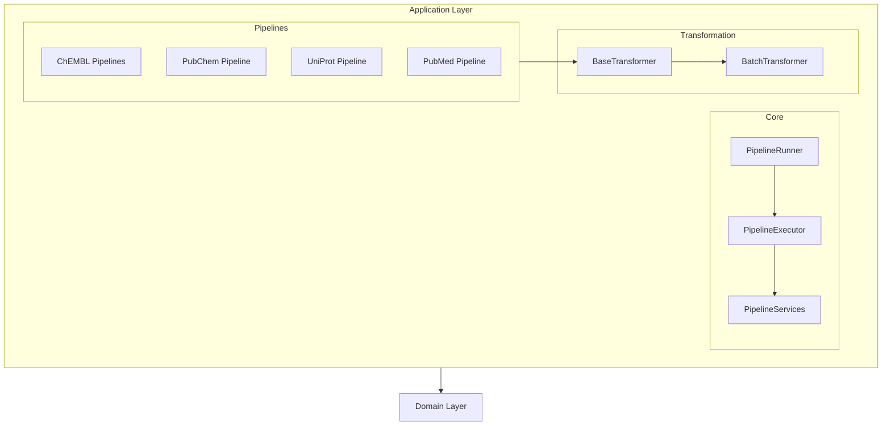
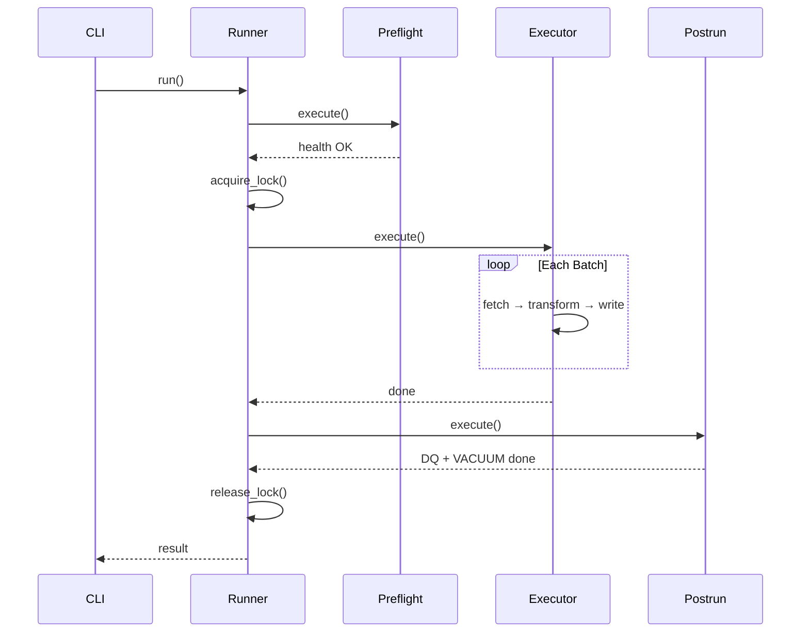

# Application Layer

The Application layer contains pipeline orchestration, use cases, and data transformation logic. It depends only on the Domain layer.

## Overview



## Modules

### [Core](application/core.md)

Pipeline execution infrastructure:

- `PipelineRunner` - Lifecycle orchestrator for pipeline execution
- `PipelineExecutor` - Data flow orchestrator (fetch → transform → write)
- `PipelineServices` - Service bundle for dependency injection
- `CheckpointManager` - Checkpoint persistence for resume capability
- `LockManager` - Distributed locking coordination
- `PreflightService` - Pre-flight infrastructure validation
- `PostrunService` - Post-run DQ checks, VACUUM, cleanup
- `LifecycleOrchestrator` - Medallion layer clearing policies

### [Transformers](application/transformers.md)

Data transformation framework:

- `BaseTransformer` - Template Method pattern for Bronze → Silver → Gold
- `BatchTransformer` - Batch-oriented transformation
- Transform utilities - Common transformation helpers

### [Pipelines](application/pipelines.md)

Provider-specific pipeline implementations:

- **ChEMBL**: Activity, Assay, Molecule, Target, Document
- **PubChem**: Compound
- **UniProt**: Protein
- **PubMed**: Publications

## Key Concepts

### Pipeline Lifecycle



### Service Delegation Pattern

PipelineRunner delegates to specialized services:

| Service | Responsibility |
|---------|---------------|
| `PreflightService` | Health checks, lock acquisition |
| `PipelineExecutor` | Data flow orchestration |
| `PostrunService` | DQ validation, VACUUM |
| `LifecycleOrchestrator` | Layer clearing policies |

### Template Method Pattern

`BaseTransformer` implements Template Method for consistent transformation:

```python
# Fixed algorithm, customizable steps
async def transform_batch(self, records: list[dict]) -> TransformResult:
    # 1. Pre-transform hook (overridable)
    records = await self._pre_transform_hook(records)

    # 2. Transform each record (abstract method)
    transformed = []
    for record in records:
        result = await self._transform_record(record)
        transformed.append(result)

    # 3. Post-transform hook (overridable)
    return await self._post_transform_hook(transformed)
```

## Import Structure

```python
# Preferred: Import from core package
from bioetl.application.core import (
    PipelineRunner,
    PipelineExecutor,
    BaseTransformer,
    PipelineServices,
)

# Alternative: Import from specific modules
from bioetl.application.core.runner import PipelineRunner
from bioetl.application.core.executor import PipelineExecutor
from bioetl.application.core.base_transformer import BaseTransformer
```

## See Also

- [Core Components](application/core.md) - Detailed core component documentation
- [Transformers](application/transformers.md) - Transformer framework
- [Pipelines](application/pipelines.md) - Provider-specific pipelines
- [Domain Layer](domain.md) - Port interfaces used by application
