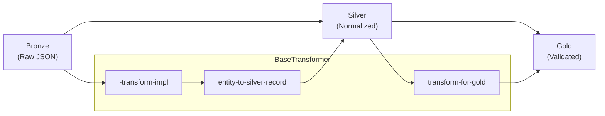

# Transformers

Data transformation framework using Template Method pattern.

## Overview

Transformers handle the Bronze → Silver → Gold data transformation:



## Base Transformer

### BaseTransformer

Abstract base class implementing Template Method pattern for transformations.

::: bioetl.application.core.base-transformer.BaseTransformer
    options:
        show-root-heading: true
        show-source: false
        members:
            - --init--
            - transform
            - compute-content-hash
            - serialize-json
            - entity-to-silver-record
            - transform-for-gold
            - should-write-gold
            - GOLD-EXCLUDE-FIELDS

### TransformationError

Raised when transformation fails due to invalid data.

::: bioetl.application.core.base-transformer.TransformationError
    options:
        show-root-heading: true
        show-source: false

## Batch Processing

### BatchTransformer

Batch-oriented transformation with parallel processing.

::: bioetl.application.core.batch-transformer.BatchTransformer
    options:
        show-root-heading: true
        show-source: false

### StreamingBatchProcessor

Streaming batch processor for memory-efficient processing.

::: bioetl.application.core.batch-transformer.StreamingBatchProcessor
    options:
        show-root-heading: true
        show-source: false

### TransformResult

Result container for batch transformation.

::: bioetl.application.core.batch-transformer.TransformResult
    options:
        show-root-heading: true
        show-source: false

### TransformedRecord

Individual transformed record with metadata.

::: bioetl.application.core.batch-transformer.TransformedRecord
    options:
        show-root-heading: true
        show-source: false

## Batch Writing

### BatchWriter

Writes transformed batches to storage layers.

::: bioetl.application.core.batch-writer.BatchWriter
    options:
        show-root-heading: true
        show-source: false

## Transform Utilities

Common transformation helper functions.

### safe-extract

Safely extract value from nested dictionary.

::: bioetl.application.core.dict-transformers.safe-extract
    options:
        show-root-heading: true
        show-source: false

### normalize-string

Normalize string values (strip, lowercase, etc.).

::: bioetl.application.core.dict-transformers.normalize-string
    options:
        show-root-heading: true
        show-source: false

### parse-date-field

Parse date fields to ISO format.

::: bioetl.application.core.dict-transformers.parse-date-field
    options:
        show-root-heading: true
        show-source: false

### validate-smiles

Validate SMILES chemical notation.

::: bioetl.application.core.dict-transformers.validate-smiles
    options:
        show-root-heading: true
        show-source: false

### flatten-nested-dict

Flatten nested dictionary to dot notation.

::: bioetl.application.core.dict-transformers.flatten-nested-dict
    options:
        show-root-heading: true
        show-source: false

### extract-list-field

Extract and process list fields.

::: bioetl.application.core.dict-transformers.extract-list-field
    options:
        show-root-heading: true
        show-source: false

### aggregate-nested-lists

Aggregate values from nested lists.

::: bioetl.application.core.dict-transformers.aggregate-nested-lists
    options:
        show-root-heading: true
        show-source: false

## Template Method Pattern

The `BaseTransformer` implements Template Method for consistent transformation:

```python
class BaseTransformer(ABC):
    """Template Method pattern for transformations."""

    async def transform(self, context: PipelineContext, record: BronzeRecord) -> SilverRecord | None:
        """Template method - fixed algorithm structure."""
        try:
            # 1. Abstract hook - implemented by subclasses
            silver-record = await self.-transform-impl(context, record)
            return silver-record

        except TransformationError as e:
            # 2. Handle errors uniformly (fixed step)
            self.-log-transformation-error(e)
            return None

    @abstractmethod
    async def -transform-impl(self, context: PipelineContext, record: BronzeRecord) -> SilverRecord | None:
        """Abstract hook - subclasses implement entity-specific logic."""
        ...
```

## Creating a Custom Transformer

```python
from bioetl.application.core import BaseTransformer
from bioetl.domain.entities import Activity

class ActivityTransformer(BaseTransformer):
    """Transform ChEMBL activity records."""

    async def -transform-impl(self, context: PipelineContext, record: dict) -> SilverRecord | None:
        # Extract required fields
        activity-id = self.-get-required-field(record, "activity-id")
        molecule-id = self.-get-required-field(record, "molecule-chembl-id")

        # Create entity with lineage
        entity = self.-create-entity(
            Activity,
            context,
            entity-id=str(activity-id),
            content-hash=self.compute-content-hash(record),
            activity-id=activity-id,
            molecule-chembl-id=molecule-id,
            standard-type=record.get("standard-type"),
            standard-value=record.get("standard-value"),
            standard-units=record.get("standard-units"),
        )
        
        return self.entity-to-silver-record(entity)
```

## Content Hash Generation

Content hash ensures record deduplication:

```python
# Hash computed from canonical JSON representation
hash = compute-content-hash(business-data, exclude-none=True)

# Normalization rules:
# - NaN/Inf → null
# - Floats → round(val, 10)
# - Dates → ISO "YYYY-MM-DD"
# - Excludes: -ingestion-ts, -run-id, -run-type, -dq-*
```

## See Also

- [Core Components](core.md) - Pipeline execution infrastructure
- [Pipelines](pipelines.md) - Provider-specific transformers
- [Domain Entities](../domain/entities.md) - Entity dataclasses
