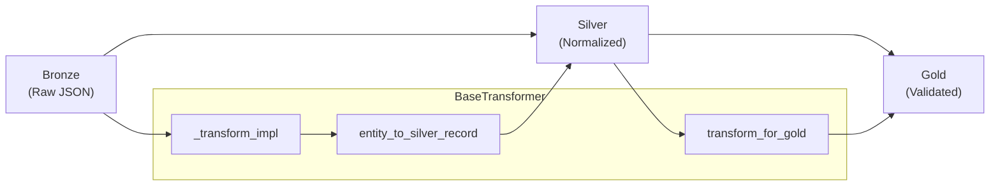

# Transformers

Data transformation framework using Template Method pattern.

## Overview

Transformers handle the Bronze → Silver → Gold data transformation:



## Base Transformer

### BaseTransformer

Abstract base class implementing Template Method pattern for transformations.

::: bioetl.application.core.base_transformer.BaseTransformer
    options:
        show_root_heading: true
        show_source: false
        members:
            - __init__
            - transform
            - compute_content_hash
            - serialize_json
            - entity_to_silver_record
            - transform_for_gold
            - should_write_gold
            - GOLD_EXCLUDE_FIELDS

### TransformationError

Raised when transformation fails due to invalid data.

::: bioetl.application.core.base_transformer.TransformationError
    options:
        show_root_heading: true
        show_source: false

## Batch Processing

### BatchTransformer

Batch-oriented transformation with parallel processing.

::: bioetl.application.core.batch_transformer.BatchTransformer
    options:
        show_root_heading: true
        show_source: false

### StreamingBatchProcessor

Streaming batch processor for memory-efficient processing.

::: bioetl.application.core.batch_transformer.StreamingBatchProcessor
    options:
        show_root_heading: true
        show_source: false

### TransformResult

Result container for batch transformation.

::: bioetl.application.core.batch_transformer.TransformResult
    options:
        show_root_heading: true
        show_source: false

### TransformedRecord

Individual transformed record with metadata.

::: bioetl.application.core.batch_transformer.TransformedRecord
    options:
        show_root_heading: true
        show_source: false

## Batch Writing

### BatchWriter

Writes transformed batches to storage layers.

::: bioetl.application.core.batch_writer.BatchWriter
    options:
        show_root_heading: true
        show_source: false

## Transform Utilities

Common transformation helper functions.

### safe_extract

Safely extract value from nested dictionary.

::: bioetl.application.core.transform_utils.safe_extract
    options:
        show_root_heading: true
        show_source: false

### normalize_string

Normalize string values (strip, lowercase, etc.).

::: bioetl.application.core.transform_utils.normalize_string
    options:
        show_root_heading: true
        show_source: false

### parse_date_field

Parse date fields to ISO format.

::: bioetl.application.core.transform_utils.parse_date_field
    options:
        show_root_heading: true
        show_source: false

### validate_smiles

Validate SMILES chemical notation.

::: bioetl.application.core.transform_utils.validate_smiles
    options:
        show_root_heading: true
        show_source: false

### flatten_nested_dict

Flatten nested dictionary to dot notation.

::: bioetl.application.core.transform_utils.flatten_nested_dict
    options:
        show_root_heading: true
        show_source: false

### extract_list_field

Extract and process list fields.

::: bioetl.application.core.transform_utils.extract_list_field
    options:
        show_root_heading: true
        show_source: false

### aggregate_nested_lists

Aggregate values from nested lists.

::: bioetl.application.core.transform_utils.aggregate_nested_lists
    options:
        show_root_heading: true
        show_source: false

## Template Method Pattern

The `BaseTransformer` implements Template Method for consistent transformation:

```python
class BaseTransformer(ABC):
    """Template Method pattern for transformations."""

    async def transform(self, context: PipelineContext, record: BronzeRecord) -> SilverRecord | None:
        """Template method - fixed algorithm structure."""
        try:
            # 1. Abstract hook - implemented by subclasses
            silver_record = await self._transform_impl(context, record)
            return silver_record

        except TransformationError as e:
            # 2. Handle errors uniformly (fixed step)
            self._log_transformation_error(e)
            return None

    @abstractmethod
    async def _transform_impl(self, context: PipelineContext, record: BronzeRecord) -> SilverRecord | None:
        """Abstract hook - subclasses implement entity-specific logic."""
        ...
```

## Creating a Custom Transformer

```python
from bioetl.application.core import BaseTransformer
from bioetl.domain.entities import Activity

class ActivityTransformer(BaseTransformer):
    """Transform ChEMBL activity records."""

    async def _transform_impl(self, context: PipelineContext, record: dict) -> SilverRecord | None:
        # Extract required fields
        activity_id = self._get_required_field(record, "activity_id")
        molecule_id = self._get_required_field(record, "molecule_chembl_id")

        # Create entity with lineage
        entity = self._create_entity(
            Activity,
            context,
            entity_id=str(activity_id),
            content_hash=self.compute_content_hash(record),
            activity_id=activity_id,
            molecule_chembl_id=molecule_id,
            standard_type=record.get("standard_type"),
            standard_value=record.get("standard_value"),
            standard_units=record.get("standard_units"),
        )
        
        return self.entity_to_silver_record(entity)
```

## Content Hash Generation

Content hash ensures record deduplication:

```python
# Hash computed from canonical JSON representation
hash = compute_content_hash(business_data, exclude_none=True)

# Normalization rules:
# - NaN/Inf → null
# - Floats → round(val, 10)
# - Dates → ISO "YYYY-MM-DD"
# - Excludes: _ingestion_ts, _run_id, _run_type, _dq_*
```

## See Also

- [Core Components](core.md) - Pipeline execution infrastructure
- [Pipelines](pipelines.md) - Provider-specific transformers
- [Domain Entities](../domain/entities.md) - Entity dataclasses
