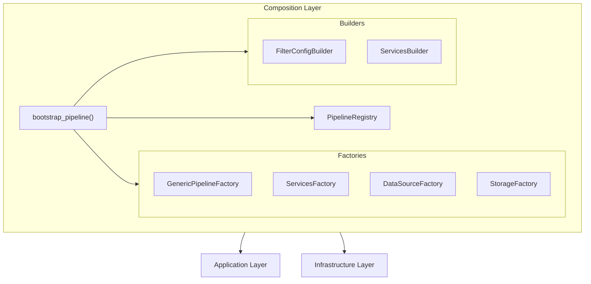

# Composition Layer

The Composition layer is the Dependency Injection (DI) container that wires together domain, application, and infrastructure components.

## Overview



## Modules

### [Bootstrap](composition/bootstrap.md)

Entry point for pipeline creation:

- `bootstrap_pipeline()` - Main composition root
- `bootstrap_observability()` - Logging, tracing, metrics setup
- `bootstrap_storage()` - Storage adapter creation

### [Factories](composition/factories.md)

Component factories for DI:

- `GenericPipelineFactory` - Pipeline instance creation
- `ServicesFactory` - Service bundle creation
- `DataSourceFactory` - Data source adapter creation
- `StorageFactory` - Storage writer creation

## Key Concepts

### Composition Root Pattern

All dependencies are wired in the composition layer:

```python
def bootstrap_pipeline(ctx: PipelineRunContext) -> PipelineRunner:
    """Composition Root: assembles all components."""

    # 1. Bootstrap observability
    logger, tracer, metrics = bootstrap_observability(ctx)

    # 2. Bootstrap storage
    storage = bootstrap_storage(ctx, logger, metrics)

    # 3. Get factory from registry
    factory = registry.get(ctx.pipeline_name)

    # 4. Create runner via factory
    return factory.create_runner(ctx, ...)
```

### Factory Pattern

Factories encapsulate component creation logic:

```python
class GenericPipelineFactory:
    """Creates pipeline runners with proper DI."""

    def create_runner(
        self,
        ctx: PipelineRunContext,
        services: PipelineServices,
        ...
    ) -> PipelineRunner:
        # Create executor, transformer, etc.
        return PipelineRunner(...)
```

### Pipeline Registry

Pipelines are registered via decorator:

```python
from bioetl.composition.registry import register

@register("chembl_activity")
def chembl_activity_factory(ctx: PipelineRunContext) -> PipelineRunner:
    """Factory function for ChEMBL activity pipeline."""
    ...

# Later: retrieve and create
factory = registry.get("chembl_activity")
runner = factory(ctx)
```

## Import Structure

```python
# Main entry point
from bioetl.composition.bootstrap import bootstrap_pipeline

# Factories
from bioetl.composition.factories import (
    GenericPipelineFactory,
    ServicesFactory,
    DataSourceFactory,
    StorageFactory,
)

# Registry
from bioetl.composition.registry import (
    PipelineRegistry,
    get_default_registry,
)

# Builders
from bioetl.composition.builders import FilterConfigBuilder
```

## Usage Example

```python
from bioetl.composition.bootstrap import bootstrap_pipeline
from bioetl.domain.context import PipelineRunContext
from bioetl.domain.types import RunType
from uuid import uuid4

# Create context with pipeline parameters
ctx = PipelineRunContext(
    pipeline_name="chembl_activity",
    run_id=uuid4(),
    run_type=RunType.INCREMENTAL,
    limit=1000,
    resume=False,
)

# Bootstrap creates fully configured runner
runner = bootstrap_pipeline(ctx)

# Run the pipeline
await runner.run()
```

## See Also

- [Bootstrap](composition/bootstrap.md) - Detailed bootstrap documentation
- [Factories](composition/factories.md) - Factory classes
- [Application Layer](application.md) - Components being assembled
- [Infrastructure Layer](infrastructure.md) - Adapters being wired
