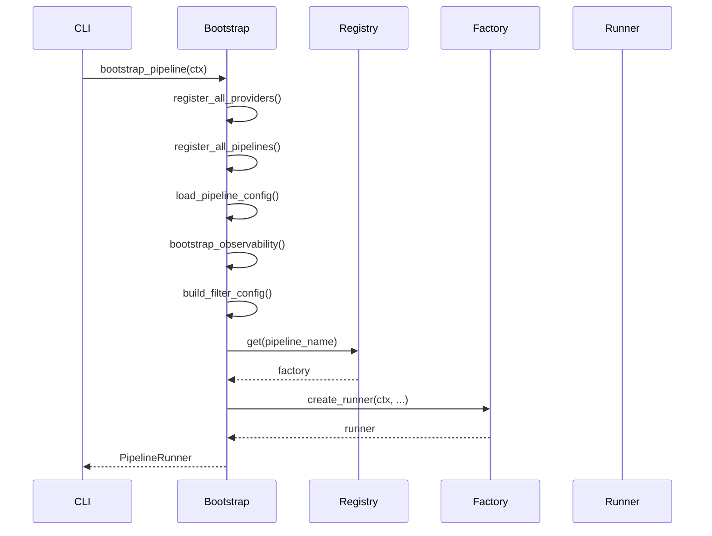

# Bootstrap

Composition Root and bootstrap functions for pipeline initialization.

## Main Entry Point

### bootstrap_pipeline

The main entry point for creating a fully configured PipelineRunner.

::: bioetl.composition.bootstrap.bootstrap_pipeline
    options:
        show_root_heading: true
        show_source: false

## Observability Bootstrap

### bootstrap_observability

Initialize all observability components (logging, tracing, metrics).

::: bioetl.composition._bootstrap.observability.bootstrap_observability
    options:
        show_root_heading: true
        show_source: false

### bootstrap_logger

Create structured logger instance.

::: bioetl.composition._bootstrap.observability.bootstrap_logger
    options:
        show_root_heading: true
        show_source: false

### bootstrap_tracer

Create tracing exporter instance.

::: bioetl.composition._bootstrap.observability.bootstrap_tracer
    options:
        show_root_heading: true
        show_source: false

### bootstrap_metrics

Create metrics exporter instance.

::: bioetl.composition._bootstrap.observability.bootstrap_metrics
    options:
        show_root_heading: true
        show_source: false

### bootstrap_dq_monitor

Create data quality anomaly monitor.

::: bioetl.composition._bootstrap.observability.bootstrap_dq_monitor
    options:
        show_root_heading: true
        show_source: false

## Storage Bootstrap

### bootstrap_storage

Create storage adapters for all Medallion layers.

::: bioetl.composition._bootstrap.storage.bootstrap_storage
    options:
        show_root_heading: true
        show_source: false

### bootstrap_cleanup

Create cleanup service for storage management.

::: bioetl.composition._bootstrap.storage.bootstrap_cleanup
    options:
        show_root_heading: true
        show_source: false

### bootstrap_lifecycle_service

Create Medallion lifecycle service.

::: bioetl.composition._bootstrap.storage.bootstrap_lifecycle_service
    options:
        show_root_heading: true
        show_source: false

## Checkpoint Bootstrap

### bootstrap_checkpoint

Create checkpoint port implementation.

::: bioetl.composition._bootstrap.checkpoint.bootstrap_checkpoint
    options:
        show_root_heading: true
        show_source: false

### bootstrap_checkpoint_manager

Create checkpoint manager instance.

::: bioetl.composition._bootstrap.checkpoint.bootstrap_checkpoint_manager
    options:
        show_root_heading: true
        show_source: false

### bootstrap_quarantine

Create quarantine port implementation.

::: bioetl.composition._bootstrap.checkpoint.bootstrap_quarantine
    options:
        show_root_heading: true
        show_source: false

### bootstrap_quarantine_manager

Create quarantine manager instance.

::: bioetl.composition._bootstrap.checkpoint.bootstrap_quarantine_manager
    options:
        show_root_heading: true
        show_source: false

## Pipeline Registry

### PipelineRegistry

Registry for pipeline factory functions.

::: bioetl.composition.registry.PipelineRegistry
    options:
        show_root_heading: true
        show_source: false
        members:
            - register
            - get
            - list_pipelines

### get_default_registry

Get the global default registry instance.

::: bioetl.composition.registry.get_default_registry
    options:
        show_root_heading: true
        show_source: false

## Builders

### FilterConfigBuilder

Builder for filter configuration from CLI/YAML.

::: bioetl.composition.builders.FilterConfigBuilder
    options:
        show_root_heading: true
        show_source: false

## Bootstrap Sequence



## Configuration Loading

### load_pipeline_config

Load pipeline configuration from YAML file.

::: bioetl.infrastructure.config.load_pipeline_config
    options:
        show_root_heading: true
        show_source: false

### get_settings

Get application settings from environment.

::: bioetl.infrastructure.config.get_settings
    options:
        show_root_heading: true
        show_source: false

## Usage Example

```python
from bioetl.composition.bootstrap import (
    bootstrap_pipeline,
)
from bioetl.composition._bootstrap.observability import bootstrap_observability
from bioetl.composition._bootstrap.storage import bootstrap_storage
from bioetl.domain.context import PipelineContext
from bioetl.domain.types import RunType

# Full bootstrap (recommended)
ctx = PipelineContext(
    pipeline_name="chembl_activity",
    run_type=RunType.INCREMENTAL,
)
runner = bootstrap_pipeline(ctx)
await runner.run()

# Partial bootstrap (for testing)
logger, tracer, metrics = bootstrap_observability(ctx)
storage = bootstrap_storage(ctx, logger, metrics)
```

## See Also

- [Factories](factories.md) - Component factories
- [Application Core](../application/core.md) - PipelineRunner
- [CLI Reference](../../cli.md) - Command-line interface
