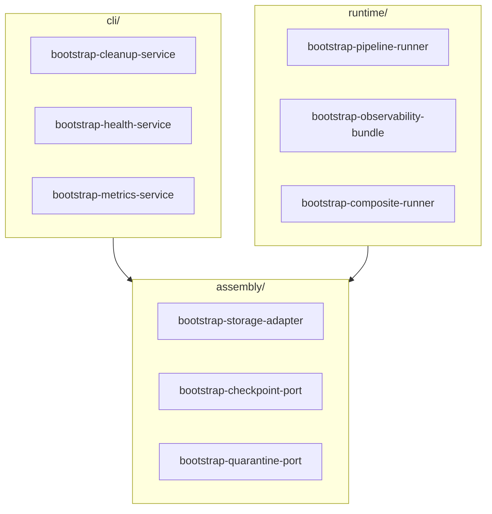
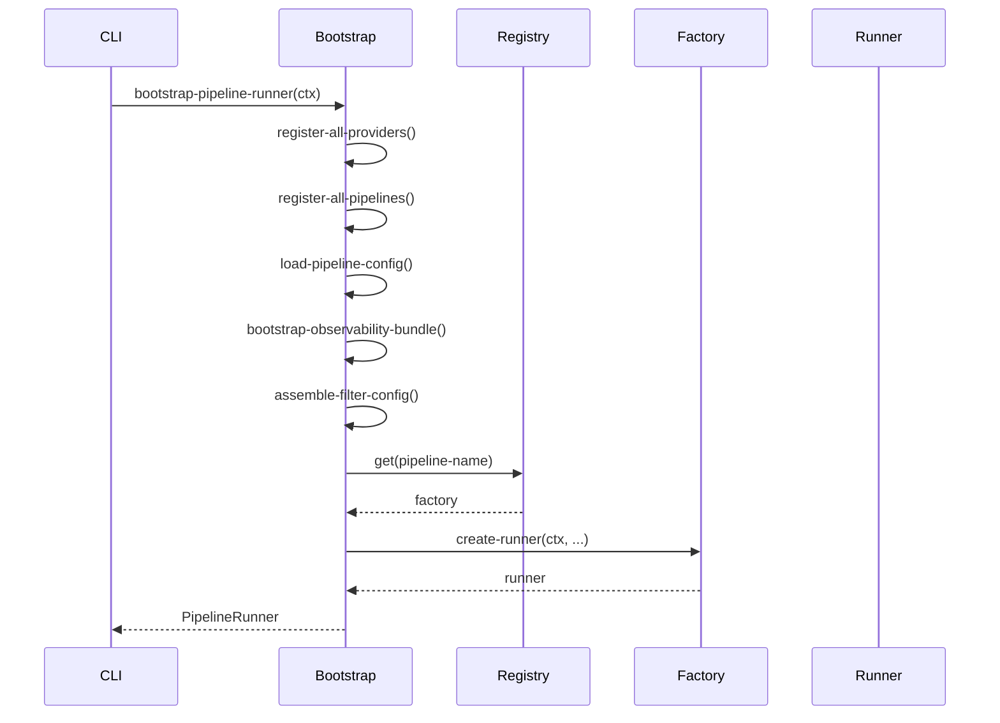

# Bootstrap

Composition Root and bootstrap functions for pipeline initialization.

## Overview

The bootstrap package is organized into three modules:

- **assembly**: Shared infrastructure components (ports, storage adapters) without side-effects. Used by both CLI and runtime.
- **cli**: Bootstrap functions for CLI-only commands (inspect, list, maintenance). Uses NoOp observability implementations.
- **runtime**: Bootstrap functions for actual pipeline execution. Uses full observability stack.



## Main Entry Points

### bootstrap-pipeline

The main entry point for creating a fully configured PipelineRunner (deprecated alias for `bootstrap-pipeline-runner`).

::: bioetl.composition.bootstrap.runtime.pipeline.bootstrap_pipeline
    options:
        show_root_heading: true
        show_source: false

### bootstrap-pipeline-runner

Canonical function for creating a PipelineRunner with full observability.

::: bioetl.composition.bootstrap.bootstrap_pipeline_runner
    options:
        show_root_heading: true
        show_source: false

### bootstrap-composite-runner

Bootstrap function for composite pipelines (multiple data sources).

::: bioetl.composition.bootstrap.runtime.composite.bootstrap_composite_runner
    options:
        show_root_heading: true
        show_source: false

## Runtime Observability

Functions for initializing the full observability stack during pipeline execution.

### bootstrap-observability-bundle

Initialize all observability components (logging, tracing, metrics) as a bundle.

::: bioetl.composition.bootstrap.runtime.observability.bootstrap_observability_bundle
    options:
        show_root_heading: true
        show_source: false

### bootstrap-logger-port

Create structured logger instance.

::: bioetl.composition.bootstrap.bootstrap_logger_port
    options:
        show_root_heading: true
        show_source: false

### bootstrap-tracer-port

Create tracing exporter instance.

::: bioetl.composition.bootstrap.runtime.observability.bootstrap_tracer_port
    options:
        show_root_heading: true
        show_source: false

### bootstrap-metrics-port

Create metrics exporter instance.

::: bioetl.composition.bootstrap.bootstrap_metrics_port
    options:
        show_root_heading: true
        show_source: false

### bootstrap-dq-monitor-port

Create data quality anomaly monitor.

::: bioetl.composition.bootstrap.runtime.observability.bootstrap_dq_monitor_port
    options:
        show_root_heading: true
        show_source: false

## Assembly (Shared Infrastructure)

Functions for creating infrastructure components used by both CLI and runtime.

### bootstrap-storage-adapter

Create storage adapter for all Medallion layers.

::: bioetl.composition.bootstrap.assembly.storage.bootstrap_storage_adapter
    options:
        show_root_heading: true
        show_source: false

### bootstrap-checkpoint-port

Create checkpoint port implementation.

::: bioetl.composition.bootstrap.assembly.checkpoint.bootstrap_checkpoint_port
    options:
        show_root_heading: true
        show_source: false

### bootstrap-quarantine-port

Create quarantine port implementation.

::: bioetl.composition.bootstrap.bootstrap_quarantine_port
    options:
        show_root_heading: true
        show_source: false

## CLI Services

Bootstrap functions for CLI-only commands. These use NoOp observability implementations for admin/maintenance operations.

### bootstrap-cleanup-service

Create cleanup service for storage management.

::: bioetl.composition.bootstrap.bootstrap_cleanup_service
    options:
        show_root_heading: true
        show_source: false

### bootstrap-lifecycle-service

Create Medallion lifecycle service.

::: bioetl.composition.bootstrap.bootstrap_lifecycle_service
    options:
        show_root_heading: true
        show_source: false

### bootstrap-checkpoint-manager

Create checkpoint manager instance.

::: bioetl.composition.bootstrap.bootstrap_checkpoint_manager
    options:
        show_root_heading: true
        show_source: false

### bootstrap-quarantine-manager

Create quarantine manager instance.

::: bioetl.composition.bootstrap.bootstrap_quarantine_manager
    options:
        show_root_heading: true
        show_source: false

### bootstrap-health-service

Create health check service for CLI.

::: bioetl.composition.bootstrap.bootstrap_health_service
    options:
        show_root_heading: true
        show_source: false

### bootstrap-lock-service

Create lock service for CLI.

::: bioetl.composition.bootstrap.bootstrap_lock_service
    options:
        show_root_heading: true
        show_source: false

### bootstrap-vacuum-service

Create vacuum service for Delta table maintenance.

::: bioetl.composition.bootstrap.bootstrap_vacuum_service
    options:
        show_root_heading: true
        show_source: false

### bootstrap-metrics-service

Create metrics service for CLI.

::: bioetl.composition.bootstrap.bootstrap_metrics_service
    options:
        show_root_heading: true
        show_source: false

### bootstrap-export-service

Create export service for CLI.

::: bioetl.composition.bootstrap.bootstrap_export_service
    options:
        show_root_heading: true
        show_source: false

## Runtime Assembly Functions

Pure functions for assembling configuration without side effects.

### assemble-runtime-config

Assemble runtime configuration from CLI arguments and environment.

::: bioetl.composition.bootstrap.runtime.assembly.assemble_runtime_config
    options:
        show_root_heading: true
        show_source: false

### assemble-filter-config

Assemble filter configuration from YAML and CLI overrides.

::: bioetl.composition.bootstrap.runtime.assembly.assemble_filter_config
    options:
        show_root_heading: true
        show_source: false

### assemble-vacuum-settings

Assemble VACUUM settings for Delta table maintenance.

::: bioetl.composition.bootstrap.runtime.assembly.assemble_vacuum_settings
    options:
        show_root_heading: true
        show_source: false

### VacuumSettings

Configuration for VACUUM operations.

::: bioetl.composition.bootstrap.runtime.assembly.VacuumSettings
    options:
        show_root_heading: true
        show_source: false

## Pipeline Registry

### PipelineRegistry

Registry for pipeline factory functions.

::: bioetl.composition.registry.PipelineRegistry
    options:
        show_root_heading: true
        show_source: false
        members:
            - register
            - get
            - list-pipelines

### get-default-registry

Get the global default registry instance.

::: bioetl.composition.registry.get_default_registry
    options:
        show_root_heading: true
        show_source: false

## Metrics Server

### maybe-start-metrics-server

Conditionally start metrics server if enabled.

::: bioetl.composition.bootstrap.maybe_start_metrics_server
    options:
        show_root_heading: true
        show_source: false

### MetricsServerError

Error raised when metrics server fails to start.

::: bioetl.domain.exceptions.internal.MetricsServerError
    options:
        show_root_heading: true
        show_source: false

## Bootstrap Sequence



## Configuration Loading

### load-pipeline-config

Load pipeline configuration from YAML file.

::: bioetl.infrastructure.config.load_pipeline_config
    options:
        show_root_heading: true
        show_source: false

### load-composite-config

Load composite pipeline configuration.

::: bioetl.composition.bootstrap.load_composite_config
    options:
        show_root_heading: true
        show_source: false

## Usage Example

```python
from bioetl.composition.bootstrap import (
    bootstrap-pipeline-runner,
    bootstrap-observability-bundle,
    bootstrap-storage-adapter,
    assemble-runtime-config,
)
from bioetl.domain.context import PipelineContext
from bioetl.domain.types import RunType

# Full bootstrap (recommended)
ctx = PipelineContext(
    pipeline-name="chembl_activity",
    run-type=RunType.INCREMENTAL,
)
runner = bootstrap-pipeline-runner(ctx)
await runner.run()
```

```python
# Partial bootstrap (for testing or custom assembly)
from bioetl.composition.bootstrap import (
    bootstrap-observability-bundle,
    bootstrap-storage-adapter,
    bootstrap-checkpoint-port,
)

# Create observability components
obs = bootstrap-observability-bundle(ctx)

# Create storage adapter
storage = bootstrap-storage-adapter(
    ctx,
    logger=obs.logger,
    metrics=obs.metrics,
)

# Create checkpoint port
checkpoint = bootstrap-checkpoint-port(ctx)
```

## Deprecated Aliases

The following functions are deprecated aliases maintained for backward compatibility:

| Deprecated | Canonical |
|------------|-----------|
| `bootstrap-pipeline` | `bootstrap-pipeline-runner` |
| `bootstrap-composite-pipeline` | `bootstrap-composite-runner` |
| `bootstrap-storage` | `bootstrap-storage-adapter` |
| `bootstrap-checkpoint` | `bootstrap-checkpoint-port` |
| `bootstrap-quarantine` | `bootstrap-quarantine-port` |
| `bootstrap-cleanup` | `bootstrap-cleanup-service` |
| `bootstrap-observability` | `bootstrap-observability-bundle` |
| `bootstrap-logger` | `bootstrap-logger-port` |
| `bootstrap-tracer` | `bootstrap-tracer-port` |
| `bootstrap-metrics` | `bootstrap-metrics-port` |
| `bootstrap-dq-monitor` | `bootstrap-dq-monitor-port` |

## See Also

- [Factories](factories.md) - Component factories
- [Application Core](../application/core.md) - PipelineRunner
- [CLI Reference](../../cli.md) - Command-line interface
