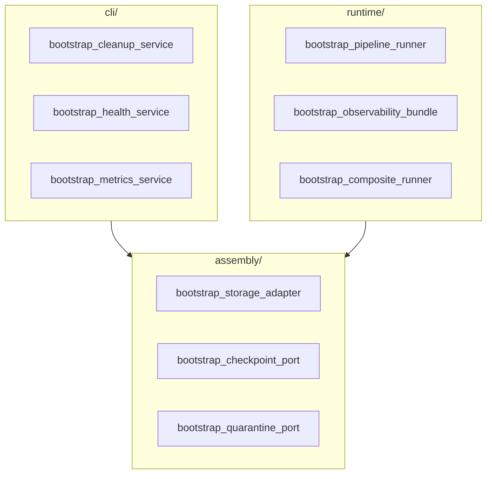
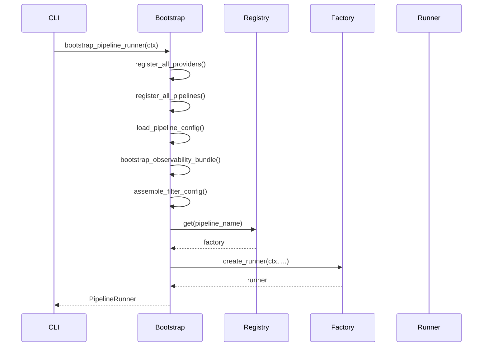

# Bootstrap

Composition Root and bootstrap functions for pipeline initialization.

## Overview

The bootstrap package is organized into three modules:

- **assembly**: Shared infrastructure components (ports, storage adapters) without side-effects. Used by both CLI and runtime.
- **cli**: Bootstrap functions for CLI-only commands (inspect, list, maintenance). Uses NoOp observability implementations.
- **runtime**: Bootstrap functions for actual pipeline execution. Uses full observability stack.



## Main Entry Points

### bootstrap_pipeline

The main entry point for creating a fully configured PipelineRunner (deprecated alias for `bootstrap-pipeline-runner`).

<!-- ::: bioetl.composition.bootstrap.bootstrap_pipeline -->
<!--     options: -->
<!--         show-root-heading: true -->
<!--         show-source: false -->

### bootstrap_pipeline_runner

Canonical function for creating a PipelineRunner with full observability.

::: bioetl.composition.bootstrap.bootstrap_pipeline_runner
    options:
        show-root-heading: true
        show-source: false

### bootstrap_composite_runner

Bootstrap function for composite pipelines (multiple data sources).

<!-- ::: bioetl.composition.bootstrap.bootstrap_composite_runner -->
<!--     options: -->
<!--         show-root-heading: true -->
<!--         show-source: false -->

## Runtime Observability

Functions for initializing the full observability stack during pipeline execution.

### bootstrap_observability_bundle

Initialize all observability components (logging, tracing, metrics) as a bundle.

<!-- ::: bioetl.composition.bootstrap.bootstrap_observability_bundle -->
<!--     options: -->
<!--         show-root-heading: true -->
<!--         show-source: false -->

### bootstrap_logger_port

Create structured logger instance.

::: bioetl.composition.bootstrap.bootstrap_logger_port
    options:
        show-root-heading: true
        show-source: false

### bootstrap_tracer_port

Create tracing exporter instance.

<!-- ::: bioetl.composition.bootstrap.bootstrap_tracer_port -->
<!--     options: -->
<!--         show-root-heading: true -->
<!--         show-source: false -->

### bootstrap_metrics_port

Create metrics exporter instance.

::: bioetl.composition.bootstrap.bootstrap_metrics_port
    options:
        show-root-heading: true
        show-source: false

### bootstrap_dq_monitor_port

Create data quality anomaly monitor.

<!-- ::: bioetl.composition.bootstrap.bootstrap_dq_monitor_port -->
<!--     options: -->
<!--         show-root-heading: true -->
<!--         show-source: false -->

## Assembly (Shared Infrastructure)

Functions for creating infrastructure components used by both CLI and runtime.

### bootstrap_storage_adapter

Create storage adapter for all Medallion layers.

<!-- ::: bioetl.composition.bootstrap.bootstrap_storage_adapter -->
<!--     options: -->
<!--         show-root-heading: true -->
<!--         show-source: false -->

### bootstrap_checkpoint_port

Create checkpoint port implementation.

<!-- ::: bioetl.composition.bootstrap.bootstrap_checkpoint_port -->
<!--     options: -->
<!--         show-root-heading: true -->
<!--         show-source: false -->

### bootstrap_quarantine_port

Create quarantine port implementation.

::: bioetl.composition.bootstrap.bootstrap_quarantine_port
    options:
        show-root-heading: true
        show-source: false

## CLI Services

Bootstrap functions for CLI-only commands. These use NoOp observability implementations for admin/maintenance operations.

### bootstrap_cleanup_service

Create cleanup service for storage management.

::: bioetl.composition.bootstrap.bootstrap_cleanup_service
    options:
        show-root-heading: true
        show-source: false

### bootstrap_lifecycle_service

Create Medallion lifecycle service.

::: bioetl.composition.bootstrap.bootstrap_lifecycle_service
    options:
        show-root-heading: true
        show-source: false

### bootstrap_checkpoint_manager

Create checkpoint manager instance.

::: bioetl.composition.bootstrap.bootstrap_checkpoint_manager
    options:
        show-root-heading: true
        show-source: false

### bootstrap_quarantine_manager

Create quarantine manager instance.

::: bioetl.composition.bootstrap.bootstrap_quarantine_manager
    options:
        show-root-heading: true
        show-source: false

### bootstrap_health_service

Create health check service for CLI.

::: bioetl.composition.bootstrap.bootstrap_health_service
    options:
        show-root-heading: true
        show-source: false

### bootstrap_lock_service

Create lock service for CLI.

::: bioetl.composition.bootstrap.bootstrap_lock_service
    options:
        show-root-heading: true
        show-source: false

### bootstrap_vacuum_service

Create vacuum service for Delta table maintenance.

::: bioetl.composition.bootstrap.bootstrap_vacuum_service
    options:
        show-root-heading: true
        show-source: false

### bootstrap_metrics_service

Create metrics service for CLI.

::: bioetl.composition.bootstrap.bootstrap_metrics_service
    options:
        show-root-heading: true
        show-source: false

### bootstrap_export_service

Create export service for CLI.

::: bioetl.composition.bootstrap.bootstrap_export_service
    options:
        show-root-heading: true
        show-source: false

## Runtime Assembly Functions

Pure functions for assembling configuration without side effects.

### assemble_runtime_config

Assemble runtime configuration from CLI arguments and environment.

<!-- ::: bioetl.composition.bootstrap.assemble_runtime_config -->
<!--     options: -->
<!--         show-root-heading: true -->
<!--         show-source: false -->

### assemble_filter_config

Assemble filter configuration from YAML and CLI overrides.

<!-- ::: bioetl.composition.bootstrap.assemble_filter_config -->
<!--     options: -->
<!--         show-root-heading: true -->
<!--         show-source: false -->

### assemble_vacuum_settings

Assemble VACUUM settings for Delta table maintenance.

<!-- ::: bioetl.composition.bootstrap.assemble_vacuum_settings -->
<!--     options: -->
<!--         show-root-heading: true -->
<!--         show-source: false -->

### VacuumSettings

Configuration for VACUUM operations.

<!-- ::: bioetl.composition.bootstrap.VacuumSettings -->
<!--     options: -->
<!--         show-root-heading: true -->
<!--         show-source: false -->

## Pipeline Registry

### PipelineRegistry

Registry for pipeline factory functions.

::: bioetl.composition.registry.PipelineRegistry
    options:
        show-root-heading: true
        show-source: false
        members:
            - register
            - get
            - list_pipelines

### get_default_registry

Get the global default registry instance.

::: bioetl.composition.registry.get_default_registry
    options:
        show-root-heading: true
        show-source: false

## Metrics Server

### start_metrics_server

Start Prometheus metrics HTTP server.

<!-- ::: bioetl.composition.bootstrap.start_metrics_server -->
<!--     options: -->
<!--         show-root-heading: true -->
<!--         show-source: false -->

### maybe_start_metrics_server

Conditionally start metrics server if enabled.

::: bioetl.composition.bootstrap.maybe_start_metrics_server
    options:
        show-root-heading: true
        show-source: false

### MetricsServerError

Error raised when metrics server fails to start.

<!-- ::: bioetl.composition.bootstrap.MetricsServerError -->
<!--     options: -->
<!--         show-root-heading: true -->
<!--         show-source: false -->

## Bootstrap Sequence



## Configuration Loading

### load_pipeline_config

Load pipeline configuration from YAML file.

::: bioetl.infrastructure.config.load_pipeline_config
    options:
        show-root-heading: true
        show-source: false

### load_composite_config

Load composite pipeline configuration.

::: bioetl.composition.bootstrap.load_composite_config
    options:
        show-root-heading: true
        show-source: false

## Usage Example

```python
from bioetl.composition.bootstrap import (
    bootstrap_pipeline_runner,
    bootstrap_observability_bundle,
    bootstrap_storage_adapter,
    assemble_runtime_config,
)
from bioetl.domain.context import PipelineContext
from bioetl.domain.types import RunType

# Full bootstrap (recommended)
ctx = PipelineContext(
    pipeline_name="chembl_activity",
    run_type=RunType.INCREMENTAL,
)
runner = bootstrap_pipeline_runner(ctx)
await runner.run()
```

```python
# Partial bootstrap (for testing or custom assembly)
from bioetl.composition.bootstrap import (
    bootstrap_observability_bundle,
    bootstrap_storage_adapter,
    bootstrap_checkpoint_port,
)

# Create observability components
obs = bootstrap_observability_bundle(ctx)

# Create storage adapter
storage = bootstrap_storage_adapter(
    ctx,
    logger=obs.logger,
    metrics=obs.metrics,
)

# Create checkpoint port
checkpoint = bootstrap_checkpoint_port(ctx)
```

## Deprecated Aliases

The following functions are deprecated aliases maintained for backward compatibility:

| Deprecated | Canonical |
|------------|-----------|
| `bootstrap-pipeline` | `bootstrap-pipeline-runner` |
| `bootstrap-composite-pipeline` | `bootstrap-composite-runner` |
| `bootstrap-storage` | `bootstrap-storage-adapter` |
| `bootstrap-checkpoint` | `bootstrap-checkpoint-port` |
| `bootstrap-quarantine` | `bootstrap-quarantine-port` |
| `bootstrap-cleanup` | `bootstrap-cleanup-service` |
| `bootstrap-observability` | `bootstrap-observability-bundle` |
| `bootstrap-logger` | `bootstrap-logger-port` |
| `bootstrap-tracer` | `bootstrap-tracer-port` |
| `bootstrap-metrics` | `bootstrap-metrics-port` |
| `bootstrap-dq-monitor` | `bootstrap-dq-monitor-port` |

## See Also

- [Factories](factories.md) - Component factories
- [Application Core](../application/core.md) - PipelineRunner
- [CLI Reference](../../cli.md) - Command-line interface
