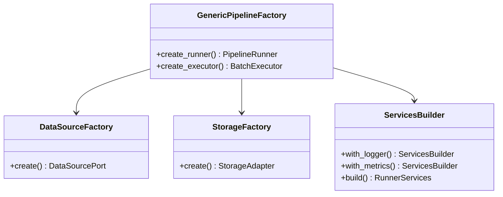

# Factories

Component factories for Dependency Injection.

## Pipeline Factory

### GenericPipelineFactory

Creates pipeline runners with proper dependency injection.

::: bioetl.composition.factories.pipeline_factory.GenericPipelineFactory
    options:
        show-root-heading: true
        show-source: false
        members:
            - __init__
            - create_runner
            - create_executor

### create_pipeline_factory

Factory function to create GenericPipelineFactory instances.

::: bioetl.composition.factories.pipeline_factory.create_pipeline_factory
    options:
        show-root-heading: true
        show-source: false

### assemble_runner

Assemble a PipelineRunner with all dependencies.

::: bioetl.composition.factories.pipeline_factory.assemble_runner
    options:
        show-root-heading: true
        show-source: false

### build_pipeline_services

Build PipelineServices bundle.

::: bioetl.composition.factories.pipeline_factory.build_pipeline_services
    options:
        show-root-heading: true
        show-source: false

## Services Factory

### BaseServicesFactory

Base factory for creating service bundles.

::: bioetl.composition.factories.services_factory.BaseServicesFactory
    options:
        show-root-heading: true
        show-source: false

### ServicesBuilder

Builder pattern for constructing service bundles.

::: bioetl.composition.factories.services_factory.ServicesBuilder
    options:
        show-root-heading: true
        show-source: false

### RunnerServices

Bundle of services for PipelineRunner.

<!-- ::: bioetl.composition.factories.services_factory.RunnerServices -->
<!--     options: -->
<!--         show-root-heading: true -->
<!--         show-source: false -->

### build_runner_services

Build RunnerServices bundle.

<!-- ::: bioetl.composition.factories.services_factory.build_runner_services -->
<!--     options: -->
<!--         show-root-heading: true -->
<!--         show-source: false -->

## Data Source Factory

### DataSourceFactory

Creates data source adapters.

::: bioetl.composition.factories.data_source_factory.DataSourceFactory
    options:
        show-root-heading: true
        show-source: false

### DataSourceRegistry

Registry for data source creators.

::: bioetl.composition.factories.data_source_factory.DataSourceRegistry
    options:
        show-root-heading: true
        show-source: false

### DataSourceCreator

Protocol for data source creator functions.

::: bioetl.composition.factories.data_source_factory.DataSourceCreator
    options:
        show-root-heading: true
        show-source: false

## Storage Factory

### StorageFactory

Creates storage adapters (Bronze, Silver, Gold writers).

::: bioetl.composition.factories.storage.StorageFactory
    options:
        show-root-heading: true
        show-source: false

### StorageAdapter

Unified storage adapter interface.

::: bioetl.composition.factories.storage.StorageAdapter
    options:
        show-root-heading: true
        show-source: false

### StorageContext

Context for storage operations.

::: bioetl.composition.factories.storage.StorageContext
    options:
        show-root-heading: true
        show-source: false

## Transformer Factory

### register_transformer

Register a transformer class for an entity type.

::: bioetl.composition.factories.transformer_factory.register_transformer
    options:
        show-root-heading: true
        show-source: false

### get_transformer_class

Get transformer class for entity type.

::: bioetl.composition.factories.transformer_factory.get_transformer_class
    options:
        show-root-heading: true
        show-source: false

### create_transformer

Create transformer instance with dependencies.

::: bioetl.composition.factories.transformer_factory.create_transformer
    options:
        show-root-heading: true
        show-source: false

### register_all_transformers

Register all available transformers.

::: bioetl.composition.factories.transformer_factory.register_all_transformers
    options:
        show-root-heading: true
        show-source: false

## HTTP Client Factory

### HttpClientFactory

Factory for creating HTTP clients.

::: bioetl.composition.factories.http_client_factory.HttpClientFactory
    options:
        show-root-heading: true
        show-source: false

## Pipeline Factories

Pre-configured factory functions for each pipeline.

### chembl_activity_factory

Factory for ChEMBL activity pipeline.

::: bioetl.composition.factories.pipeline_factories.chembl_activity_factory
    options:
        show-root-heading: true
        show-source: false

### pubchem_compound_factory

Factory for PubChem compound pipeline.

::: bioetl.composition.factories.pipeline_factories.pubchem_compound_factory
    options:
        show-root-heading: true
        show-source: false

### uniprot_protein_factory

Factory for UniProt protein pipeline.

::: bioetl.composition.factories.pipeline_factories.uniprot_protein_factory
    options:
        show-root-heading: true
        show-source: false

### pubmed_publication_factory

Factory for PubMed publication pipeline.

::: bioetl.composition.factories.pipeline_factories.pubmed_publication_factory
    options:
        show-root-heading: true
        show-source: false

## Factory Pattern



## Usage Example

```python
from bioetl.composition.factories import (
    GenericPipelineFactory,
    DataSourceFactory,
    StorageFactory,
    build_runner_services,
)

# Create factories
data_source_factory = DataSourceFactory()
storage_factory = StorageFactory()

# Create pipeline factory
# factory = GenericPipelineFactory(
#     data_source_factory=data_source_factory,
#     storage_factory=storage_factory,
#     config=pipeline_config,
# )

# Create runner
# runner = factory.create_runner(
#     ctx=ctx,
#     services=services,
#     checkpoint_manager=checkpoint_manager,
# )

# Or use the pre_configured factory
from bioetl.composition.factories import chembl_activity_factory

# runner = chembl_activity_factory(ctx)
# await runner.run()
```

## See Also

- [Bootstrap](bootstrap.md) - Composition root
- [Application Core](../application/core.md) - PipelineRunner, Executor
- [Infrastructure](../infrastructure.md) - Adapter implementations
