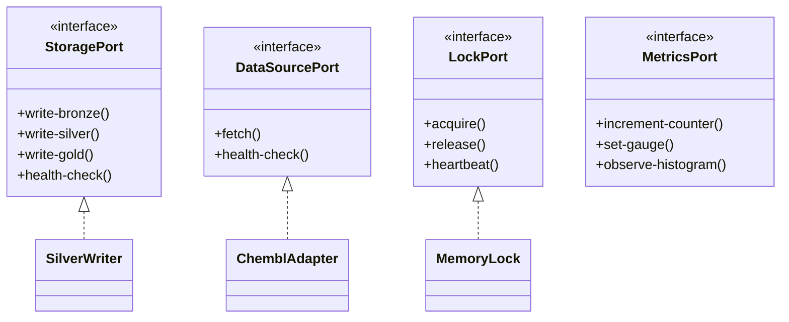

# Domain Layer

The Domain layer contains pure business logic with no I/O dependencies. It defines the core contracts (Ports) that infrastructure adapters must implement.

## Overview



## Modules

### [Ports](domain/ports.md)

Interface contracts that infrastructure adapters must implement:

- `StoragePort` - Write operations for Bronze/Silver/Gold layers
- `DataSourcePort` - Data fetching from external APIs
- `FilterableDataSourcePort` - Data sources with server-side filtering
- `LockPort` - Distributed locking interface
- `CheckpointPort` - Pipeline state persistence
- `QuarantinePort` - Failed records storage
- `MetricsPort` - Observability metrics
- `TracingPort` - Distributed tracing
- `LoggerPort` - Structured logging

### [Types](domain/types.md)

Core type definitions and enumerations:

- `RunID`, `BatchID` - UUID-based identifiers
- `RunType` - INCREMENTAL, BACKFILL, REBUILD
- `HealthStatus` - HEALTHY, DEGRADED, UNHEALTHY
- `BronzeRecord`, `SilverRecord`, `GoldRecord` - Data layer types
- `WriteMode` - MERGE, APPEND, OVERWRITE

### [Entities](domain/entities.md)

Domain model dataclasses representing bioactivity data:

- `Bioactivity` - Bioactivity measurement
- `Assay` - Experimental assay
- `Molecule` - Chemical compound
- `Target` - Biological target
- `ChemblPublication` - Publication reference

### [Exceptions](domain/exceptions.md)

Domain-specific exception hierarchy:

- `BioETLError` - Base exception
- `DataQualityError` - DQ validation failures
- `TransformationError` - Transform pipeline errors
- `InfrastructureError` - Infrastructure failures
- `CircuitBreakerOpenError` - Circuit breaker tripped

## Key Concepts

### Ports & Adapters Pattern

The Domain layer defines **Ports** (interfaces) that establish contracts between business logic and infrastructure:

```python
from bioetl.domain.ports import StoragePort, DataSourcePort

# Ports are Protocol classes (structural typing)
class StoragePort(Protocol):
    async def write-bronze(self, records: list[dict], ...) -> int: ...
    async def write-silver(self, records: list[dict], ...) -> int: ...
```

Infrastructure provides **Adapters** that implement these ports:

```python
from bioetl.infrastructure.storage.silver-writer import SilverWriter

# SilverWriter implements StoragePort
writer: StoragePort = SilverWriter(...)
```

### Content Hash

Unique record identification using deterministic hashing:

```python
from bioetl.domain.transformations import generate-content-hash

# sha256(provider + canonical-json(record))
hash = generate-content-hash("chembl", record)
```

Normalization rules:

- NaN/Inf → `null`
- Floats → rounded to 10 decimals
- Dates → ISO format `YYYY-MM-DD`
- Excludes metadata fields (`-ingestion-ts`, `-run-id`, etc.)

## Import Structure

```python
# Preferred: Import from domain package facade
from bioetl.domain import (
    StoragePort,
    DataSourcePort,
    RunType,
    HealthStatus,
    Bioactivity,
    DataQualityError,
)

# Alternative: Import from specific modules
from bioetl.domain.ports import StoragePort
from bioetl.domain.types import RunType
from bioetl.domain.entities import Bioactivity
```

## See Also

- [Port Contracts](domain/ports.md) - Detailed port documentation
- [Architecture: Domain Layer](../../02-architecture/01-domain-layer.md) - Architecture guide
