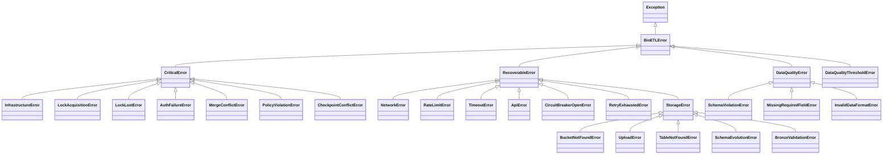

# Domain Exceptions

Centralized exception hierarchy for all BioETL errors with deterministic classification.

## Overview

All exceptions inherit from `BioETLError` to enable consistent error handling. Each exception class defines an explicit `error_type` attribute for deterministic classification.



## Error Classification

| Category | Behavior | Examples |
|----------|----------|----------|
| **Critical** | Stop pipeline immediately | Lock lost, auth failure, schema mismatch |
| **Recoverable** | Retry with backoff | Rate limit (429), timeout, network error |
| **Data Quality** | Log and skip record | Invalid SMILES, missing field, schema violation |

## Base Exceptions

### BioETLError

Base exception for all BioETL errors.

::: bioetl.domain.exceptions.BioETLError
    options:
        show_root_heading: true
        show_source: true
        members:
            - error_type
            - get_error_type
            - context
            - with_context

### CriticalError

Errors requiring immediate pipeline stop.

::: bioetl.domain.exceptions.CriticalError
    options:
        show_root_heading: true
        show_source: false

### RecoverableError

Transient errors that may succeed on retry.

::: bioetl.domain.exceptions.RecoverableError
    options:
        show_root_heading: true
        show_source: false

### DataQualityError

Data quality issues (skip record, continue pipeline).

::: bioetl.domain.exceptions.DataQualityError
    options:
        show_root_heading: true
        show_source: false

## Critical Errors

### InfrastructureError

Infrastructure-level failures (database, storage).

::: bioetl.domain.exceptions.InfrastructureError
    options:
        show_root_heading: true
        show_source: false

### LockAcquisitionError

Failed to acquire distributed lock.

::: bioetl.domain.exceptions.LockAcquisitionError
    options:
        show_root_heading: true
        show_source: false

### LockLostError

Lock was lost during execution.

::: bioetl.domain.exceptions.LockLostError
    options:
        show_root_heading: true
        show_source: false

### AuthFailureError

Authentication or authorization failure.

::: bioetl.domain.exceptions.AuthFailureError
    options:
        show_root_heading: true
        show_source: false

### MergeConflictError

Conflict during Delta Lake merge operation.

::: bioetl.domain.exceptions.MergeConflictError
    options:
        show_root_heading: true
        show_source: false

### PolicyViolationError

Business policy violation.

::: bioetl.domain.exceptions.PolicyViolationError
    options:
        show_root_heading: true
        show_source: false

### CheckpointConflictError

Checkpoint state conflict.

::: bioetl.domain.exceptions.CheckpointConflictError
    options:
        show_root_heading: true
        show_source: false

## Recoverable Errors

### NetworkError

Network connectivity issues.

::: bioetl.domain.exceptions.NetworkError
    options:
        show_root_heading: true
        show_source: false

### RateLimitError

API rate limit exceeded (HTTP 429).

::: bioetl.domain.exceptions.RateLimitError
    options:
        show_root_heading: true
        show_source: false

### TimeoutError

Request timeout exceeded.

::: bioetl.domain.exceptions.TimeoutError
    options:
        show_root_heading: true
        show_source: false

### ApiError

General API error.

::: bioetl.domain.exceptions.ApiError
    options:
        show_root_heading: true
        show_source: false

### ChemblApiError

ChEMBL-specific API error.

::: bioetl.domain.exceptions.ChemblApiError
    options:
        show_root_heading: true
        show_source: false

### CircuitBreakerOpenError

Circuit breaker is open, requests blocked.

::: bioetl.domain.exceptions.CircuitBreakerOpenError
    options:
        show_root_heading: true
        show_source: false

### RetryExhaustedError

All retry attempts exhausted.

::: bioetl.domain.exceptions.RetryExhaustedError
    options:
        show_root_heading: true
        show_source: false

## Data Quality Errors

### SchemaViolationError

Record violates expected schema.

::: bioetl.domain.exceptions.SchemaViolationError
    options:
        show_root_heading: true
        show_source: false

### MissingRequiredFieldError

Required field is missing or null.

::: bioetl.domain.exceptions.MissingRequiredFieldError
    options:
        show_root_heading: true
        show_source: false

### InvalidDataFormatError

Data format is invalid.

::: bioetl.domain.exceptions.InvalidDataFormatError
    options:
        show_root_heading: true
        show_source: false

### DataQualityThresholdError

DQ error threshold exceeded.

::: bioetl.domain.exceptions.DataQualityThresholdError
    options:
        show_root_heading: true
        show_source: false

## Storage Errors

### StorageError

General storage operation error.

::: bioetl.domain.exceptions.StorageError
    options:
        show_root_heading: true
        show_source: false

### SchemaEvolutionError

Schema evolution incompatibility.

::: bioetl.domain.exceptions.SchemaEvolutionError
    options:
        show_root_heading: true
        show_source: false

### BronzeValidationError

Bronze layer validation failure.

::: bioetl.domain.exceptions.BronzeValidationError
    options:
        show_root_heading: true
        show_source: false

### TableNotFoundError

Delta table does not exist.

::: bioetl.domain.exceptions.TableNotFoundError
    options:
        show_root_heading: true
        show_source: false

### BucketNotFoundError

Storage bucket not found.

::: bioetl.domain.exceptions.BucketNotFoundError
    options:
        show_root_heading: true
        show_source: false

### UploadError

File upload failed.

::: bioetl.domain.exceptions.UploadError
    options:
        show_root_heading: true
        show_source: false

## Usage Example

```python
from bioetl.domain.exceptions import (
    BioETLError,
    RateLimitError,
    DataQualityError,
    CriticalError,
)

# Creating exceptions with context
try:
    # API call that fails
    raise RateLimitError(
        "Rate limit exceeded",
        provider="chembl",
        retry_after=60.0,
    )
except RateLimitError as e:
    # Access unified context for logging
    print(e.context)  # {'provider': 'chembl', 'retry_after': 60.0}

    # Add additional context
    e = e.with_context(endpoint="/api/v1/activity", attempt=3)

# Error classification for handling
def handle_error(error: BioETLError) -> None:
    if isinstance(error, CriticalError):
        # Stop pipeline, alert on-call
        raise error
    elif isinstance(error, RecoverableError):
        # Retry with exponential backoff
        pass
    elif isinstance(error, DataQualityError):
        # Log and skip record
        pass
```

## DQ Thresholds

| Threshold | Condition | Action |
|-----------|-----------|--------|
| **Soft** | >5% DQ errors | Warning logged |
| **Hard** | >20% DQ errors | Batch fails with `DataQualityThresholdError` |

## See Also

- [Types](types.md) - ErrorType enum for classification
- [Circuit Breaker ADR](../../../02-architecture/decisions/ADR-007-circuit-breaker-implementation.md) - Circuit breaker pattern
- [Error Handling ADR](../../../02-architecture/decisions/ADR-016-error-handling-strategy.md) - Error handling strategy
