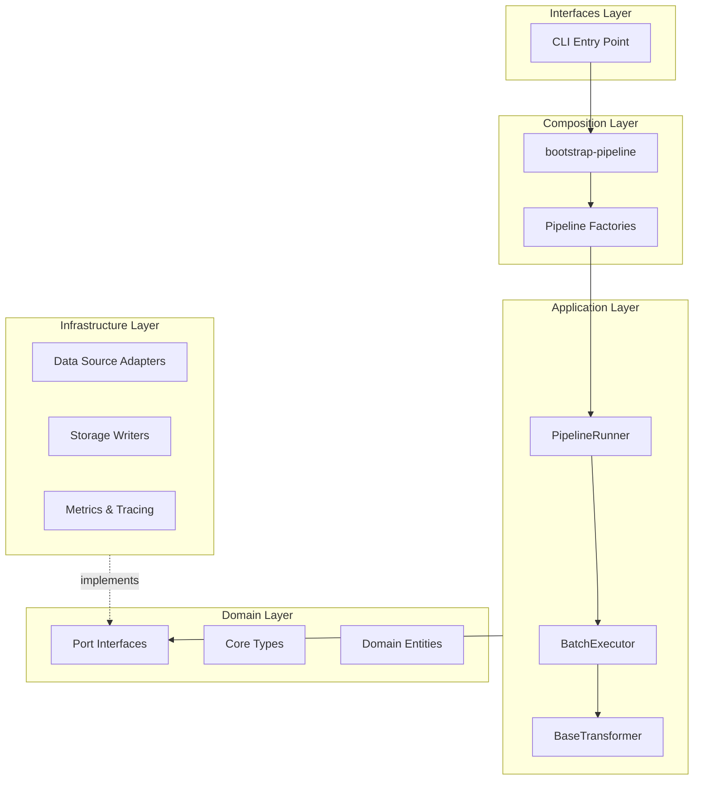

# API Reference

This section provides comprehensive API documentation for the BioETL framework, generated from source code docstrings.

## Architecture Overview

BioETL follows a **Hexagonal Architecture** (Ports & Adapters) with clear layer separation:



## Layer Documentation

### [Domain Layer](domain.md)

Pure business logic with no I/O dependencies. Contains:

- **[Ports](domain/ports.md)** - Interface contracts (StoragePort, DataSourcePort, etc.)
- **[Types](domain/types.md)** - Core types and enums (RunType, HealthStatus, BatchID)
- **[Entities](domain/entities.md)** - Domain model dataclasses
- **[Exceptions](domain/exceptions.md)** - Exception hierarchy

### [Application Layer](application.md)

Pipeline orchestration and use cases:

- **[Core Components](application/core.md)** - PipelineRunner, Executor, Services
- **[Transformers](application/transformers.md)** - BaseTransformer and implementations
- **[Pipelines](application/pipelines.md)** - Pipeline implementations by provider

### [Infrastructure Layer](infrastructure.md)

External system adapters and I/O:

- **[Adapters](infrastructure/adapters.md)** - ChEMBL, PubChem, UniProt clients
- **[Storage](infrastructure/storage.md)** - BronzeWriter, SilverWriter, GoldWriter
- **[Observability](infrastructure/observability.md)** - Logging, Metrics, Tracing

### [Composition Layer](composition.md)

Dependency injection and bootstrapping:

- **[Bootstrap](composition/bootstrap.md)** - `bootstrap-pipeline()` entry point
- **[Factories](composition/factories.md)** - Pipeline and service factories

## Quick Links

| Component | Module | Description |
|-----------|--------|-------------|
| `bootstrap-pipeline` | `bioetl.composition.bootstrap` | Main entry point for pipeline creation |
| `PipelineRunner` | `bioetl.application.core.runner` | Pipeline lifecycle orchestrator |
| `BaseTransformer` | `bioetl.application.core.base-transformer` | Template Method for data transformation |
| `StoragePort` | `bioetl.domain.ports` | Storage interface contract |
| `DataSourcePort` | `bioetl.domain.ports` | Data fetching interface contract |
| `SilverWriter` | `bioetl.infrastructure.storage.silver-writer` | Silver layer Delta Lake writer |
| `BronzeWriter` | `bioetl.infrastructure.storage.bronze-writer` | Bronze layer JSONL writer |

## Usage Example

```python
from bioetl.composition.bootstrap import bootstrap-pipeline
from bioetl.domain.context import PipelineContext
from bioetl.domain.types import RunType
from uuid import uuid4

# Create pipeline context
ctx = PipelineContext(
    pipeline-name="chembl-activity",
    run-id=uuid4(),
    run-type=RunType.INCREMENTAL,
)

# Bootstrap and run
runner = bootstrap-pipeline(ctx)
await runner.run()
```

## See Also

- [CLI Reference](../cli.md) - Command-line interface documentation
- [Architecture Decisions](../../02-architecture/decisions/) - ADRs explaining design choices
- [RULES.md](../../00-project/RULES.md) - Project governance and requirements
