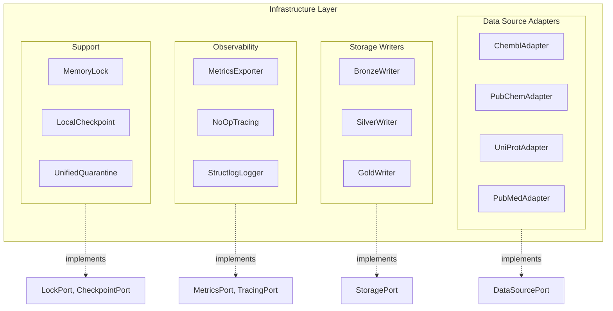
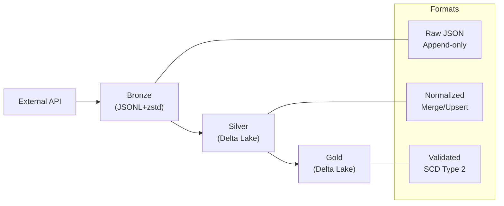

# Infrastructure Layer

The Infrastructure layer contains concrete implementations of domain ports. It handles all I/O operations: HTTP clients, storage, metrics, logging.

## Overview



## Modules

### [Adapters](infrastructure/adapters.md)

Data source adapters implementing `DataSourcePort`:

- `ChemblAdapter` - ChEMBL database client
- `PubChemAdapter` - PubChem compound API
- `UniProtAdapter` - UniProt protein database
- `PubMedAdapter` - PubMed publication API
- `UnifiedHTTPClient` - Shared HTTP client infrastructure

### [Storage](infrastructure/storage.md)

Storage writers implementing `StoragePort`:

- `BronzeWriter` - JSONL + zstd compression
- `SilverWriter` - Delta Lake Silver layer (formerly DeltaWriter)
- `GoldWriter` - Delta Lake Gold layer with SCD Type 2

> **Note**: `DeltaWriter` is deprecated and will be removed after a 14-day deprecation period. Use `SilverWriter` instead.

### [Observability](infrastructure/observability.md)

Observability infrastructure:

- `PrometheusMetrics` - Prometheus metrics exporter
- `NoOpTracing` - Null Object Pattern tracing (see [ADR-022](../02-architecture/decisions/ADR-022-tracing-noop.md))
- `StructlogLogger` - Structured logging
- `LineageTracker` - Data lineage tracking

#### Tracing (NoOp)

Tracing is implemented via **Null Object Pattern** (`NoOpTracing`).

**Rationale** (ADR-010, ADR-022): Local-Only Deployment does not require distributed
tracing. Request correlation is provided via `run_id` in structured logs (RULES.md §4.5).

**Extension Point**: For distributed deployment, replace `NoOpTracing` with
`OpenTelemetryTracingAdapter` implementing `TracingPort`. The `OpenTelemetryTracer`
class in `tracing.py` provides a ready implementation.

## Key Concepts

### Adapters vs Ports

| Domain Port | Infrastructure Adapter |
|-------------|----------------------|
| `DataSourcePort` | `ChemblAdapter`, `PubChemAdapter` |
| `StoragePort` | `BronzeWriter`, `SilverWriter`, `GoldWriter` |
| `LockPort` | `MemoryLock` |
| `CheckpointPort` | `LocalCheckpoint` |
| `MetricsPort` | `PrometheusMetrics`, `NoOpMetrics` |
| `TracingPort` | `NoOpTracing`, `OpenTelemetryTracer` |
| `LoggerPort` | `StructlogLogger`, `NoOpLogger` |

### Medallion Storage Layers



### Unified HTTP Client

All HTTP adapters use `UnifiedHTTPClient` for consistent behavior:

- Rate limiting (per-provider configuration)
- Circuit breaker pattern
- Retry with exponential backoff
- Request/response metrics
- Structured logging

```python
from bioetl.infrastructure.adapters.http import UnifiedHTTPClient

client = UnifiedHTTPClient(
    base_url="https://www.ebi.ac.uk/chembl/api/data",
    rate_limit=5.0,  # requests per second
    timeout=30.0,
    max_retries=3,
)
```

## Import Structure

```python
# Storage writers
from bioetl.infrastructure.storage import (
    BronzeWriter,
    SilverWriter,  # Preferred (was DeltaWriter)
    GoldWriter,
)

# Data source adapters
from bioetl.infrastructure.adapters.chembl import ChemblAdapter
from bioetl.infrastructure.adapters.pubchem import PubChemAdapter

# HTTP infrastructure
from bioetl.infrastructure.adapters.http import UnifiedHTTPClient

# Observability
from bioetl.infrastructure.observability import PrometheusMetrics
from bioetl.infrastructure.observability.tracing import NoOpTracing, OpenTelemetryTracer
```

## See Also

- [Adapters](infrastructure/adapters.md) - Data source adapters
- [Storage](infrastructure/storage.md) - Storage writers
- [Observability](infrastructure/observability.md) - Metrics, tracing, logging
- [Domain Ports](domain/ports.md) - Port interfaces
