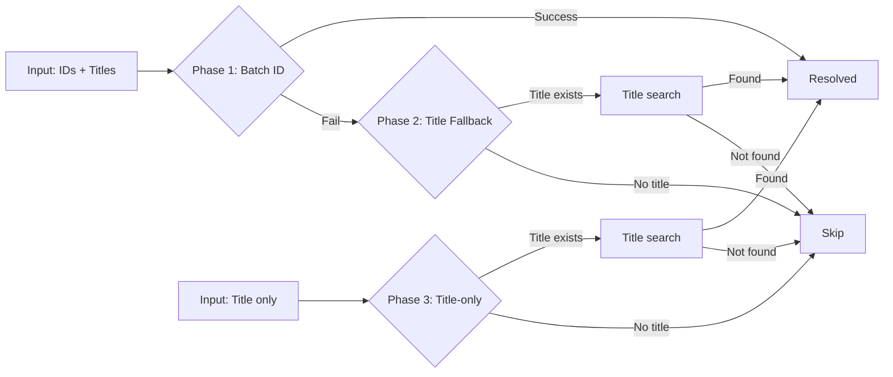

# Common Adapter Utilities

**Module:** `bioetl.infrastructure.adapters.common`
**Version:** 5.14.0
**Last updated:** 2026-02-10

---

## Overview

The `common` module provides shared utilities and base classes for infrastructure adapters. These components enable consistent API request tracking, title-based fallback search, and text normalization across all provider adapters.

**Key Components:**
- `APIRequestCollector` — Thread-safe request metadata collector
- `BaseTitleFallbackHandler` — Abstract base for title-based DOI resolution
- `normalize-title()`, `titles-match()` — Title normalization and fuzzy matching utilities

---

## APIRequestCollector

**Purpose:** Collects API request metadata for Bronze layer audit trail and rate limit monitoring.

**Thread-safety:** ✅ Safe for concurrent request recording within a single pipeline run.

### Usage

```python
from bioetl.infrastructure.adapters.common import APIRequestCollector

# Initialize collector
collector = APIRequestCollector()

# Record each API request
collector.record-request(
    url="https://api.example.com/data?limit=100",
    method="GET",
    response-size=1024,
    duration-ms=150.5,
    status-code=200,
    rate-limit-remaining=950,  # Optional
    rate-limit-reset=1234567890,  # Optional
)

# Generate Bronze metadata
source-metadata = collector.to-source-metadata()
# Returns: SourceMetadata with aggregate statistics:
#   - total-requests: 1
#   - total-bytes: 1024
#   - avg-duration-ms: 150.5
#   - endpoints-hit: ["https://api.example.com"]
```

### Key Methods

| Method | Description | Thread-safe |
|--------|-------------|-------------|
| `record-request()` | Record API request details | ✅ |
| `to-source-metadata()` | Generate SourceMetadata with aggregates | ✅ |
| `reset()` | Clear all recorded requests | ✅ |

### Integration with Adapters

All HTTP adapters **SHOULD** use `APIRequestCollector` to track API calls:

```python
class MyAdapter:
    def --init--(self, http-client: UnifiedHTTPClient, logger: LoggerPort):
        self.-http = http-client
        self.-logger = logger
        self.-collector = APIRequestCollector()

    async def fetch(self, query: Query) -> AsyncIterator[RawRecord]:
        async for response in self.-http.get("/endpoint", params=query.params):
            # Record request
            self.-collector.record-request(
                url=str(response.url),
                method="GET",
                response-size=len(response.content),
                duration-ms=response.elapsed.total-seconds() * 1000,
                status-code=response.status-code,
            )

            for record in response.json()["results"]:
                yield RawRecord(
                    data=record,
                    source-metadata=self.-collector.to-source-metadata(),
                )
```

**Related ADR:** [ADR-029: Output Metadata Unification](../../../../02-architecture/decisions/ADR-029-output-metadata-unification.md)

---

## BaseTitleFallbackHandler

**Purpose:** Abstract base class for title-based DOI resolution when batch ID lookup fails.

**Use case:** CrossRef, OpenAlex, and other publication providers often fail to resolve DOIs directly. This handler implements a three-phase fallback strategy:

1. **Phase 1:** Batch ID lookup (implemented by adapter)
2. **Phase 2:** Title fallback for unresolved IDs (`process-missing-dois()`)
3. **Phase 3:** Title-only lookup for entries without IDs (`process-title-only-entries()`)

### Three-Phase Fallback Strategy



### Abstract Methods

Subclasses **MUST** implement:

```python
@abstractmethod
async def search-by-title(self, title: str) -> dict[str, Any] | None:
    """Provider-specific title search implementation.

    Args:
        title: Normalized title string

    Returns:
        Dict with provider data if found, None otherwise
    """
```

### Event Naming Convention

When `provider-prefix` is set (e.g., `"crossref"`), event names are auto-generated:

| Event | When Emitted | Metrics Key |
|-------|--------------|-------------|
| `{provider}-no-fallback-title` | Phase 2/3: No title available | `crossref-no-fallback-title` |
| `{provider}-title-fallback-attempt` | Phase 2: Starting title search | `crossref-title-fallback-attempt` |
| `{provider}-title-fallback-success` | Phase 2: Title match found | `crossref-title-fallback-success` |
| `{provider}-title-fallback-not-found` | Phase 2: No match | `crossref-title-fallback-not-found` |
| `{provider}-title-only-attempt` | Phase 3: Starting title-only search | `crossref-title-only-attempt` |
| `{provider}-title-only-success` | Phase 3: Title match found | `crossref-title-only-success` |
| `{provider}-title-only-not-found` | Phase 3: No match | `crossref-title-only-not-found` |

### Example Implementation

```python
from bioetl.infrastructure.adapters.common import BaseTitleFallbackHandler

class CrossRefTitleFallback(BaseTitleFallbackHandler):
    def --init--(
        self,
        http-client: UnifiedHTTPClient,
        logger: LoggerPort,
        metrics: MetricsPort,
    ):
        super().--init--(logger, provider-prefix="crossref")
        self.-http = http-client
        self.-metrics = metrics

    async def search-by-title(self, title: str) -> dict[str, Any] | None:
        """Search CrossRef by title."""
        response = await self.-http.get(
            "/works",
            params={"query.title": title, "rows": 1},
        )

        if not response.json().get("message", {}).get("items"):
            return None

        return response.json()["message"]["items"][0]
```

**Related ADR:** [ADR-030: Publication Pagination Strategy](../../../../02-architecture/decisions/ADR-030-publication-pagination-strategy.md)

---

## Title Normalization Utilities

### normalize-title()

**Purpose:** Normalize publication titles for fuzzy matching.

**Transformations:**
- Convert to lowercase
- Remove punctuation (except hyphens)
- Collapse multiple spaces
- Strip leading/trailing whitespace

```python
from bioetl.infrastructure.adapters.common import normalize-title

title = "The Quick Brown Fox: A Study"
normalized = normalize-title(title)
# Returns: "the quick brown fox a study"
```

### titles-match()

**Purpose:** Fuzzy title comparison using Levenshtein distance.

**Algorithm:** Normalized Levenshtein ratio with configurable threshold.

```python
from bioetl.infrastructure.adapters.common import titles-match

title1 = "The Quick Brown Fox"
title2 = "Quick Brown Fox"

match = titles-match(title1, title2, threshold=0.85)
# Returns: True (similarity >= 85%)
```

**Default threshold:** 0.85 (85% similarity required)

---

## Architecture Integration

### Layer Placement

```
infrastructure/adapters/
├── common/               # ← Shared utilities
│   ├── api-request-collector.py
│   ├── base-title-fallback.py
│   └── title-matching.py
├── chembl/               # Uses APIRequestCollector
├── pubmed/               # Uses BaseTitleFallbackHandler + title-matching
├── crossref/             # Uses BaseTitleFallbackHandler + title-matching
└── openalex/             # Uses BaseTitleFallbackHandler + title-matching
```

### Dependency Rules

**MUST:**
- All adapters **MUST** use `APIRequestCollector` for Bronze metadata
- Publication adapters **SHOULD** extend `BaseTitleFallbackHandler` when title fallback is needed
- Adapters **MUST NOT** import from other adapter modules (only from `common/`)

**Related:**
- [ADR-005: Composition Layer Separation](../../../../02-architecture/decisions/ADR-005-composition-layer-separation.md)
- [ARCH-001: Import Matrix](../../../../00-project/RULES.md#arch-001-import-matrix)

---

## Testing

All common utilities have comprehensive unit tests:

```bash
# Test APIRequestCollector
pytest tests/unit/infrastructure/adapters/common/test-api-request-collector.py

# Test title matching
pytest tests/unit/infrastructure/adapters/common/test-title-matching.py

# Test title fallback base class
pytest tests/unit/infrastructure/adapters/common/test-base-title-fallback.py
```

**Test coverage:** 95%+ for all common utilities

---

## See Also

- [Infrastructure Layer Overview](../infrastructure.md)
- [ADR-029: Output Metadata Unification](../../../../02-architecture/decisions/ADR-029-output-metadata-unification.md)
- [ADR-030: Publication Pagination Strategy](../../../../02-architecture/decisions/ADR-030-publication-pagination-strategy.md)
- [ADR-032: Unified HTTP Client Pattern](../../../../02-architecture/decisions/ADR-032-unified-http-client.md)
