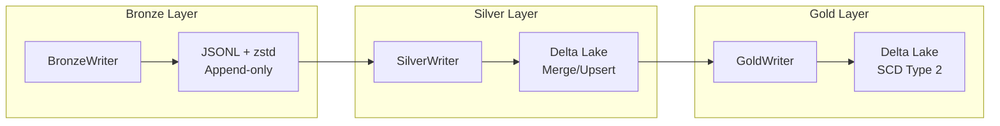

# Storage Writers

Concrete implementations of `StoragePort` for Medallion architecture layers.

## Overview



## Bronze Layer

### BronzeWriter

Writer for Bronze layer (raw data in JSONL + zstd compression).

::: bioetl.infrastructure.storage.bronze-writer.BronzeWriter
    options:
        show-root-heading: true
        show-source: false
        members:
            - --init--
            - write
            - stream-write
            - list-files
            - archive
            - vacuum

**Path Format**: `bronze/v1/{provider}/{entity}/{date}/batch-{batch-id}.jsonl.zst`

**Features**:
- Atomic writes via temp file + rename
- Streaming writes for large batches
- Optional uncompressed JSON copy
- Checksum generation for integrity
- Configurable compression level

## Silver Layer

### SilverWriter

Writer for Silver layer (Delta Lake with merge/upsert).

> **Note**: `DeltaWriter` is deprecated and will be removed after a 14-day deprecation period. Use `SilverWriter` instead. The class was renamed to follow the Medallion layer naming convention (BronzeWriter, SilverWriter, GoldWriter).

::: bioetl.infrastructure.storage.silver-writer.SilverWriter
    options:
        show-root-heading: true
        show-source: false
        members:
            - --init--
            - write-silver
            - vacuum
            - optimize
            - get-table-info

**Features**:
- ACID transactions via Delta Lake
- Merge/upsert by content hash
- Schema drift detection (M4)
- Partitioning support
- Time travel (7-30 day retention)
- VACUUM scheduling

## Gold Layer

### GoldWriter

Writer for Gold layer (validated, analytics-ready data).

::: bioetl.infrastructure.storage.gold-writer.GoldWriter
    options:
        show-root-heading: true
        show-source: false
        members:
            - --init--
            - write
            - merge
            - vacuum

**Features**:
- SCD Type 2 for historical tracking
- `-valid-from` / `-valid-to` columns
- Schema validation via Pandera
- Flattened structure (no JSON blobs)
- Query-optimized partitioning

## Delta Reader

### DeltaReader

Read-only access to Delta Lake tables for querying Silver/Gold data.

::: bioetl.infrastructure.storage.delta-reader.DeltaReader
    options:
        show-root-heading: true
        show-source: false
        members:
            - --init--
            - read-table
            - query
            - get-table-info
            - list-tables

## Retention Management

### RetentionManager

Manages VACUUM, OPTIMIZE, and time travel operations for Delta tables.

::: bioetl.infrastructure.storage.retention-manager.RetentionManager
    options:
        show-root-heading: true
        show-source: false
        members:
            - --init--
            - vacuum
            - optimize
            - get-history
            - restore-to-version

## Metadata Writers

### MetadataWriter

Writes metadata for Bronze/Silver/Gold layers.

::: bioetl.infrastructure.storage.metadata-writer.MetadataWriter
    options:
        show-root-heading: true
        show-source: false

### SilverMetadataBuilder

Builder for Silver layer metadata.

::: bioetl.infrastructure.storage.metadata-builder.SilverMetadataBuilder
    options:
        show-root-heading: true
        show-source: false

### GoldMetadataBuilder

Builder for Gold layer metadata.

::: bioetl.infrastructure.storage.metadata-builder.GoldMetadataBuilder
    options:
        show-root-heading: true
        show-source: false

## Write Modes

| Mode | Description | Use Case |
|------|-------------|----------|
| `MERGE` | Upsert by primary key | INCREMENTAL runs |
| `APPEND` | Add without dedup | Streaming data |
| `OVERWRITE` | Replace partition | REBUILD runs |

```python
from bioetl.domain.medallion import WriteMode

# Write mode is determined by WriteModePolicy
policy = WriteModePolicy()
mode = policy.get-mode(run-type, layer)

if mode == WriteMode.MERGE:
    await writer.merge(records, primary-keys=["activity-id"])
elif mode == WriteMode.APPEND:
    await writer.write(records, mode="append")
elif mode == WriteMode.OVERWRITE:
    await writer.write(records, mode="overwrite")
```

## Schema Evolution

SilverWriter handles schema evolution:

```python
try:
    await writer.write-silver(records, ...)
except SchemaEvolutionError as e:
    # New columns detected
    logger.warning(f"Schema drift: {e.new-fields}")
    # Auto-evolve schema if enabled
    await writer.write-silver(records, ..., on-schema-mismatch="evolve")
```

## VACUUM Operations

Periodic cleanup of old data files:

```python
# Silver layer: 7-day retention
await silver-writer.vacuum(table-name="chembl-activity", retention-hours=168)

# Gold layer: 30-day retention (forensic)
await gold-writer.vacuum(table-name="chembl-activity", retention-hours=720)
```

## Usage Example

```python
from bioetl.infrastructure.storage import BronzeWriter, SilverWriter, GoldWriter
from bioetl.domain.medallion import SilverWriteMode

# Bronze: raw data storage
bronze = BronzeWriter(
    base-path="/data/bronze",
    logger=logger,
    metrics=metrics,
)
await bronze.write-bronze(
    records=raw-records,
    provider="chembl",
    entity="activity",
    date=date,
    batch-id=batch-id,
    run-id=run-id,
    run-type=run-type,
    ingestion-ts=ingestion-ts,
)

# Silver: normalized data (using SilverWriter, formerly DeltaWriter)
silver = SilverWriter(
    base-path="/data/silver",
    logger=logger,
)
await silver.write-silver(
    table-name="chembl-activity",
    records=silver-records,
    primary-keys=["activity-id"],
    schema=arrow-schema,
    mode=SilverWriteMode.MERGE.value,
)

# Gold: validated data
gold = GoldWriter(
    base-path="/data/gold",
    logger=logger,
)
await gold.write-gold(
    table-name="chembl-activity",
    records=gold-records,
    schema=pandera-schema,
    primary-keys=["activity-id"],
)
```

## Audit Trail

All writers support audit logging:

```python
from bioetl.domain.ports.audit import AuditEntry, AuditLayer

# Audit entry created for each write
entry = AuditEntry(
    operation=AuditOperation.WRITE,
    layer=AuditLayer.SILVER,
    table-name="chembl-activity",
    record-count=len(records),
    run-id=run-id,
)
await audit-port.log(entry)
```

## See Also

- [Data Source Adapters](adapters.md) - Data fetching
- [Observability](observability.md) - Metrics and logging
- [Domain Ports](../domain/ports.md) - StoragePort interface
- [Medallion Architecture](../../../02-architecture/01-domain-layer.md)
