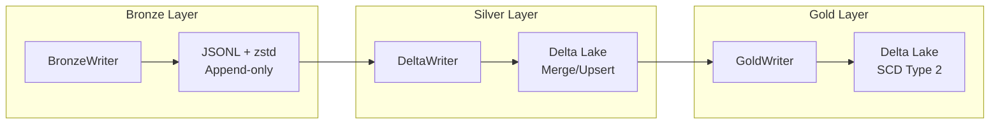

# Storage Writers

Concrete implementations of `StoragePort` for Medallion architecture layers.

## Overview



## Bronze Layer

### BronzeWriter

Writer for Bronze layer (raw data in JSONL + zstd compression).

::: bioetl.infrastructure.storage.bronze_writer.BronzeWriter
    options:
        show_root_heading: true
        show_source: false
        members:
            - __init__
            - write
            - stream_write
            - list_files
            - archive
            - vacuum

**Path Format**: `bronze/v1/{provider}/{entity}/{date}/batch_{batch_id}.jsonl.zst`

**Features**:
- Atomic writes via temp file + rename
- Streaming writes for large batches
- Optional uncompressed JSON copy
- Checksum generation for integrity
- Configurable compression level

## Silver Layer

### DeltaWriter

Writer for Silver layer (Delta Lake with merge/upsert).

::: bioetl.infrastructure.storage.delta_writer.DeltaWriter
    options:
        show_root_heading: true
        show_source: false
        members:
            - __init__
            - write
            - merge
            - vacuum
            - optimize
            - get_table_stats

**Features**:
- ACID transactions via Delta Lake
- Merge/upsert by content hash
- Schema drift detection (M4)
- Partitioning support
- Time travel (7-30 day retention)
- VACUUM scheduling

## Gold Layer

### GoldWriter

Writer for Gold layer (validated, analytics-ready data).

::: bioetl.infrastructure.storage.gold_writer.GoldWriter
    options:
        show_root_heading: true
        show_source: false
        members:
            - __init__
            - write
            - merge
            - vacuum

**Features**:
- SCD Type 2 for historical tracking
- `_valid_from` / `_valid_to` columns
- Schema validation via Pandera
- Flattened structure (no JSON blobs)
- Query-optimized partitioning

## Write Modes

| Mode | Description | Use Case |
|------|-------------|----------|
| `MERGE` | Upsert by primary key | INCREMENTAL runs |
| `APPEND` | Add without dedup | Streaming data |
| `OVERWRITE` | Replace partition | REBUILD runs |

```python
from bioetl.domain.medallion import WriteMode

# Write mode is determined by WriteModePolicy
policy = WriteModePolicy()
mode = policy.get_mode(run_type, layer)

if mode == WriteMode.MERGE:
    await writer.merge(records, primary_keys=["activity_id"])
elif mode == WriteMode.APPEND:
    await writer.write(records, mode="append")
elif mode == WriteMode.OVERWRITE:
    await writer.write(records, mode="overwrite")
```

## Schema Evolution

DeltaWriter handles schema evolution:

```python
try:
    await writer.write(records)
except SchemaEvolutionError as e:
    # New columns detected
    logger.warning(f"Schema drift: {e.new_columns}")
    # Auto-evolve schema if enabled
    await writer.write(records, schema_mode="merge")
```

## VACUUM Operations

Periodic cleanup of old data files:

```python
# Silver layer: 7-day retention
await delta_writer.vacuum(retention_hours=168)

# Gold layer: 30-day retention (forensic)
await gold_writer.vacuum(retention_hours=720)
```

## Usage Example

```python
from bioetl.infrastructure.storage import BronzeWriter, DeltaWriter, GoldWriter
from bioetl.domain.medallion import SilverWriteMode

# Bronze: raw data storage
bronze = BronzeWriter(
    base_path="/data/bronze",
    logger=logger,
    metrics=metrics,
)
await bronze.write(
    records=raw_records,
    provider="chembl",
    entity_type="activity",
    batch_id=batch_id,
    run_id=run_id,
)

# Silver: normalized data
silver = DeltaWriter(
    base_path="/data/silver",
    table_name="chembl_activity",
    primary_keys=["activity_id"],
    logger=logger,
)
await silver.write(
    records=silver_records,
    run_id=run_id,
    mode=SilverWriteMode.MERGE,
)

# Gold: validated data
gold = GoldWriter(
    base_path="/data/gold",
    table_name="chembl_activity",
    primary_keys=["activity_id"],
    schema=activity_schema,
    logger=logger,
)
await gold.write(
    records=gold_records,
    run_id=run_id,
)
```

## Audit Trail

All writers support audit logging:

```python
from bioetl.domain.ports.audit import AuditEntry, AuditLayer

# Audit entry created for each write
entry = AuditEntry(
    operation=AuditOperation.WRITE,
    layer=AuditLayer.SILVER,
    table_name="chembl_activity",
    record_count=len(records),
    run_id=run_id,
)
await audit_port.log(entry)
```

## See Also

- [Data Source Adapters](adapters.md) - Data fetching
- [Observability](observability.md) - Metrics and logging
- [Domain Ports](../domain/ports.md) - StoragePort interface
- [Medallion Architecture](../../../02-architecture/01-domain-layer.md)
