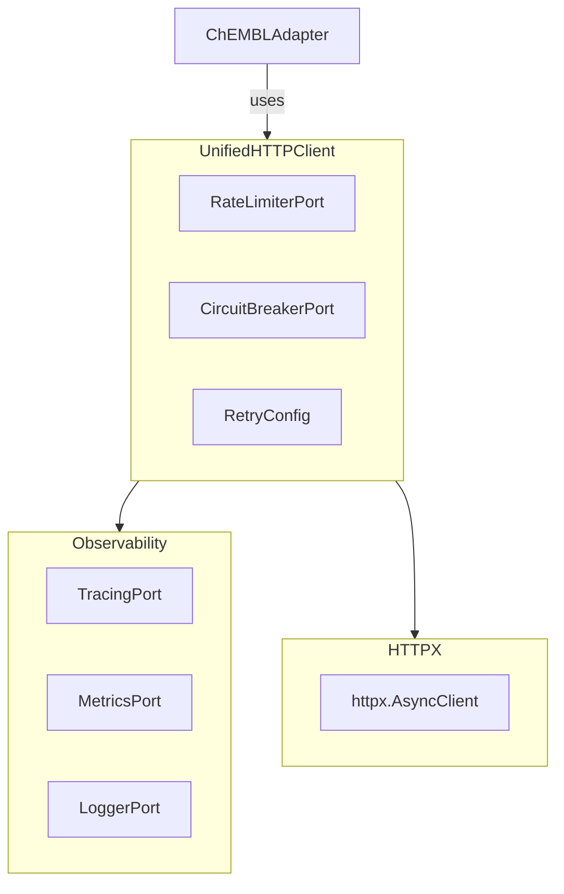
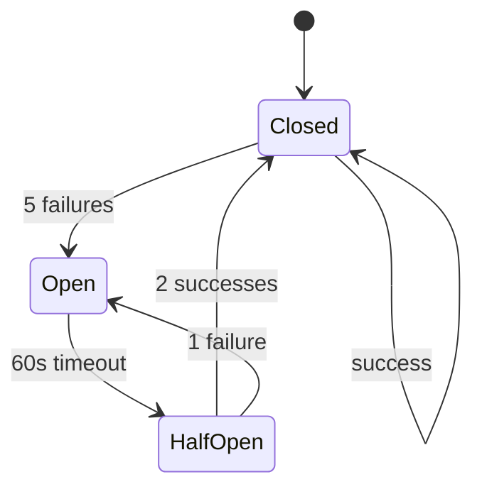

# UnifiedHTTPClient Reference

**Module:** `bioetl.infrastructure.adapters.http.client`
**Version:** 5.14.0
**Last updated:** 2026-02-10

----------------------------------------------------------------------

## Overview

`UnifiedHTTPClient` provides a standardized HTTP client for all data source adapters. It encapsulates:

- **Rate limiting** (provider-specific)
- **Circuit breaker** (cascading failure prevention)
- **Retry logic** (exponential backoff)
- **Observability** (metrics, tracing, logging)

All API adapters **MUST** use `UnifiedHTTPClient` instead of direct `httpx` calls.

**Related ADR:** [ADR-032: Unified HTTP Client Pattern](../../../02-architecture/decisions/ADR-032-unified-http-client.md)

----------------------------------------------------------------------

## Architecture



### Design Principles

1. **Composition over Inheritance:** Ports injected, not inherited
1. **SRP Compliance:** Each concern (rate limit, circuit breaker, retry) is a separate component
1. **Observability Built-in:** Tracing and metrics integrated via ports
1. **Async-first:** Uses `httpx.AsyncClient` for async HTTP

----------------------------------------------------------------------

## Basic Usage

### Simple GET Request

```python
from bioetl.infrastructure.adapters.http import UnifiedHTTPClient
from bioetl.domain.models.retry-config import RetryConfig

# Create client
client = UnifiedHTTPClient(
    base-url="https://www.ebi.ac.uk/chembl/api/data",
    rate-limiter=rate-limiter,
    circuit-breaker=circuit-breaker,
    retry-config=RetryConfig(
        max-attempts=3,
        base-delay=1.0,
        max-delay=60.0,
    ),
    logger=logger,
    metrics=metrics,
    tracing=tracing,
)

# Make request
response = await client.get("/activity", params={"limit": 100})
data = response.json()
```

### POST Request

```python
response = await client.post(
    "/search",
    json={"query": "aspirin"},
    headers={"Content-Type": "application/json"},
)
```

----------------------------------------------------------------------

## Rate Limiting

### Provider-Specific Limits

Each provider has different rate limit policies:

| Provider             | Limit                    | Implementation                          |
| -------------------- | ------------------------ | --------------------------------------- |
| **ChEMBL**           | None                     | `NoOpRateLimiter`                       |
| **PubChem**          | 5 req/sec                | `TokenBucketLimiter(rate=5.0)`          |
| **UniProt**          | 100 req/sec              | `TokenBucketLimiter(rate=100.0)`        |
| **PubMed**           | 3 req/sec (no key)       | `TokenBucketLimiter(rate=3.0)`          |
| **CrossRef**         | Polite pool (50 req/sec) | `TokenBucketLimiter(rate=50.0)`         |
| **OpenAlex**         | ~10 req/sec              | `TokenBucketLimiter(rate=10.0)`         |
| **Semantic Scholar** | 100 req/5min             | `SlidingWindowLimiter(100, window=300)` |

### Token Bucket Example

```python
from bioetl.infrastructure.adapters.rate-limiting import TokenBucketLimiter

# PubChem: 5 requests per second
rate-limiter = TokenBucketLimiter(
    rate=5.0,  # tokens per second
    burst=10,  # max burst size
    logger=logger,
    metrics=metrics,
)

client = UnifiedHTTPClient(
    base-url="https://pubchem.ncbi.nlm.nih.gov/rest/pug",
    rate-limiter=rate-limiter,
    # ... other config
)

# Requests are automatically throttled
for cid in compound-ids:
    response = await client.get(f"/compound/cid/{cid}/JSON")
    # Rate limiter ensures ≤ 5 req/sec
```

### Sliding Window Example

```python
from bioetl.infrastructure.adapters.rate-limiting import SlidingWindowLimiter

# Semantic Scholar: 100 requests per 5 minutes
rate-limiter = SlidingWindowLimiter(
    max-requests=100,
    window-seconds=300,  # 5 minutes
    logger=logger,
    metrics=metrics,
)

client = UnifiedHTTPClient(
    base-url="https://api.semanticscholar.org/graph/v1",
    rate-limiter=rate-limiter,
    # ... other config
)
```

### Rate Limit Headers

The client automatically respects standard rate limit headers:

```python
# X-RateLimit-Remaining: 950
# X-RateLimit-Reset: 1640000000
# Retry-After: 60

# Client will automatically:
# 1. Parse headers from response
# 2. Adjust internal rate limiter state
# 3. Wait until reset time if limit exceeded
```

----------------------------------------------------------------------

## Circuit Breaker

**Purpose:** Prevent cascading failures when external API is unhealthy.

### Configuration

```python
from bioetl.infrastructure.adapters.http import CircuitBreaker

circuit-breaker = CircuitBreaker(
    failure-threshold=5,  # Open after 5 consecutive failures
    success-threshold=2,  # Close after 2 consecutive successes in half-open
    timeout-seconds=60,  # Try again after 60 seconds
    logger=logger,
    metrics=metrics,
)

client = UnifiedHTTPClient(
    base-url="https://api.example.com",
    circuit-breaker=circuit-breaker,
    # ... other config
)
```

### States



| State         | Behavior                                               |
| ------------- | ------------------------------------------------------ |
| **Closed**    | Normal operation, all requests pass through            |
| **Open**      | Circuit breaker tripped, all requests fail fast        |
| **Half-Open** | Testing if service recovered, limited requests allowed |

### Exception Types

```python
from bioetl.domain.exceptions import CircuitBreakerOpenError

try:
    response = await client.get("/endpoint")
except CircuitBreakerOpenError:
    # Circuit breaker is open, service is unhealthy
    logger.error("API circuit breaker tripped, skipping request")
    # Fail gracefully or use fallback
```

----------------------------------------------------------------------

## Retry Logic

### Exponential Backoff

```python
from bioetl.domain.models.retry-config import RetryConfig

retry-config = RetryConfig(
    max-attempts=5,  # Maximum 5 attempts total
    base-delay=1.0,  # Start with 1 second delay
    max-delay=60.0,  # Cap delay at 60 seconds
    backoff-factor=2.0,  # Double delay each retry
)

client = UnifiedHTTPClient(
    base-url="https://api.example.com",
    retry-config=retry-config,
    # ... other config
)

# Retry delays: 1s, 2s, 4s, 8s, 16s
# Total max delay: ~31 seconds
```

### Retry Strategy

**Retryable errors:**

- HTTP 429 (Rate Limit)
- HTTP 500, 502, 503, 504 (Server errors)
- Network errors (`httpx.NetworkError`)
- Timeout errors (`httpx.TimeoutException`)

**Non-retryable errors:**

- HTTP 400, 401, 403, 404 (Client errors)
- HTTP 422 (Unprocessable Entity)
- JSON decode errors

```python
try:
    response = await client.get("/endpoint")
except httpx.HTTPStatusError as e:
    if e.response.status-code == 404:
        # Non-retryable, entity not found
        logger.warning(f"Entity not found: {e.request.url}")
    elif e.response.status-code >= 500:
        # Retryable, already attempted with exponential backoff
        logger.error("API server error after retries", exc-info=e)
```

----------------------------------------------------------------------

## Observability Integration

### Metrics

The client automatically emits metrics:

```python
# Counter: HTTP requests by method and status
http-requests-total{method="GET", status="200", provider="chembl"}

# Histogram: Request duration
http-request-duration-seconds{method="GET", provider="chembl"}

# Counter: Rate limiter wait events
rate-limiter-wait-total{provider="pubchem"}

# Counter: Circuit breaker state changes
circuit-breaker-state-change-total{adapter="uniprot", state="open"}
```

### Tracing

```python
from bioetl.infrastructure.observability import OpenTelemetryTracer

# With distributed tracing enabled
tracing = OpenTelemetryTracer()

client = UnifiedHTTPClient(
    base-url="https://api.example.com",
    tracing=tracing,
    # ... other config
)

# Each HTTP request creates a span
with tracing.start-span("fetch-compounds") as span:
    span.set-attribute("provider", "pubchem")
    response = await client.get("/compound/cid/2244/JSON")
    span.set-attribute("http.status-code", response.status-code)
```

**Note:** For Local-Only deployment, use `NoOpTracing` (default, ADR-022).

### Logging

All HTTP operations are logged with structured context:

```json
{
  "event": "http-request",
  "method": "GET",
  "url": "https://www.ebi.ac.uk/chembl/api/data/activity?limit=100",
  "status-code": 200,
  "duration-ms": 523.45,
  "provider": "chembl",
  "run-id": "run-20260210-143022-abc123"
}
```

----------------------------------------------------------------------

## Error Handling

### Exception Hierarchy

```
HTTPError
├── CircuitBreakerOpenError (domain)
├── RateLimitExceededError (domain)
├── httpx.HTTPStatusError
│   ├── 4xx ClientError
│   └── 5xx ServerError
├── httpx.NetworkError
└── httpx.TimeoutException
```

### Recommended Pattern

```python
from bioetl.domain.exceptions import (
    CircuitBreakerOpenError,
    RateLimitExceededError,
)
import httpx


async def fetch-with-error-handling(client: UnifiedHTTPClient, url: str):
    try:
        response = await client.get(url)
        return response.json()

    except CircuitBreakerOpenError:
        # Service is unhealthy, fail fast
        logger.error("Circuit breaker open, service unavailable")
        raise

    except RateLimitExceededError as e:
        # Rate limit exceeded despite throttling
        wait-seconds = e.retry-after or 60
        logger.warning(f"Rate limit exceeded, retry after {wait-seconds}s")
        await asyncio.sleep(wait-seconds)
        return await fetch-with-error-handling(client, url)

    except httpx.HTTPStatusError as e:
        if e.response.status-code == 404:
            logger.info(f"Entity not found: {url}")
            return None
        elif e.response.status-code >= 500:
            logger.error(f"Server error: {e.response.status-code}")
            raise

    except httpx.NetworkError as e:
        logger.error(f"Network error: {e}")
        raise

    except httpx.TimeoutException:
        logger.error(f"Request timeout: {url}")
        raise
```

----------------------------------------------------------------------

## Testing

### Unit Tests with Mocking

```python
import pytest
import httpx
import respx


@respx.mock
async def test-unified-http-client-retry():
    """Test retry logic with mocked responses."""
    # First two attempts fail, third succeeds
    route = respx.get("https://api.example.com/data")
    route.mock(
        side-effect=[
            httpx.Response(503),
            httpx.Response(503),
            httpx.Response(200, json={"result": "success"}),
        ]
    )

    client = UnifiedHTTPClient(
        base-url="https://api.example.com",
        retry-config=RetryConfig(max-attempts=3),
        rate-limiter=NoOpRateLimiter(),
        circuit-breaker=NoOpCircuitBreaker(),
        logger=logger,
        metrics=NoOpMetrics(),
        tracing=NoOpTracing(),
    )

    response = await client.get("/data")
    assert response.status-code == 200
    assert route.call-count == 3
```

### Integration Tests with VCR

```python
import pytest
import vcr


@pytest.mark.vcr(cassette-library-dir="tests/fixtures/vcr/chembl")
async def test-chembl_activity-fetch-real():
    """Test with recorded HTTP interactions."""
    client = UnifiedHTTPClient(
        base-url="https://www.ebi.ac.uk/chembl/api/data",
        # ... config
    )

    response = await client.get("/activity", params={"limit": 10})
    assert response.status-code == 200
    data = response.json()
    assert "activities" in data
```

----------------------------------------------------------------------

## Configuration via YAML

Source configs support HTTP client settings:

```yaml
# configs/sources/pubchem.yaml
name: pubchem
version: "1.0"
http-config:
  timeout-sec: 30.0
  max-retries: 3
  retry-base-delay: 1.0
  retry-max-delay: 60.0
  rate-limit:
    type: token-bucket
    rate: 5.0  # 5 requests per second
    burst: 10
  circuit-breaker:
    failure-threshold: 5
    success-threshold: 2
    timeout-seconds: 60
```

**Note:** See [ADR-032 Configuration](../../../02-architecture/decisions/ADR-032-unified-http-client.md#configuration) for full schema.

----------------------------------------------------------------------

## Migration from Direct httpx

**Before (legacy):**

```python
import httpx


async def fetch-data():
    async with httpx.AsyncClient() as client:
        response = await client.get("https://api.example.com/data")
        return response.json()
```

**After (unified):**

```python
from bioetl.infrastructure.adapters.http import UnifiedHTTPClient


class MyAdapter:
    def --init--(self, http-client: UnifiedHTTPClient):
        self.-http = http-client

    async def fetch-data(self):
        response = await self.-http.get("/data")
        return response.json()
```

**Benefits:**

- ✅ Automatic rate limiting
- ✅ Circuit breaker protection
- ✅ Standardized retry logic
- ✅ Built-in observability
- ✅ Testability with NoOp implementations

----------------------------------------------------------------------

## See Also

- [ADR-032: Unified HTTP Client Pattern](../../../02-architecture/decisions/ADR-032-unified-http-client.md)
- [ADR-007: Circuit Breaker Implementation](../../../02-architecture/decisions/ADR-007-circuit-breaker-implementation.md)
- [Common Adapter Utilities](adapters-common.md)
- [Infrastructure Layer Overview](../infrastructure.md)
