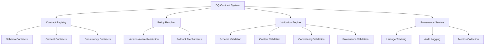

______________________________________________________________________

Version: 1.0.0
Status: active
Class: published
Owner: BioETL Team
Reviewers:

- BioETL Team
  Last verified: '2026-03-29'

______________________________________________________________________

# Data Quality Contract System

## Overview

The Data Quality (DQ) Contract System provides comprehensive data quality validation and governance throughout the BioETL pipeline. It ensures consistent data quality standards, auditability, and compliance across all data processing stages.

## Architecture



## Core Components

### 1. DQ Contract Types

#### DQDisposition

Defines how data quality violations should be handled:

```python
class DQDisposition(StrEnum):
    FAIL = "fail"  # Pipeline fails on violation
    WARN = "warn"  # Log warning but continue processing
    QUARANTINE = "quarantine"  # Isolate problematic data for review
```

#### DQViolationKind

Categorizes types of data quality violations:

```python
class DQViolationKind(StrEnum):
    SCHEMA = "schema"  # Structural validation failures
    CONTENT = "content"  # Data quality rule violations
    CONSISTENCY = "consistency"  # Cross-source inconsistencies
    PROVENANCE = "provenance"  # Lineage/tracking issues
```

#### DQPolicyRef

References specific DQ policies:

```python
class DQPolicyRef(NamedTuple):
    contract_id: str  # Unique contract identifier
    version: str  # Contract version
    severity: DQDisposition = DQDisposition.FAIL  # Default disposition
```

### 2. Contract Validation Layers

#### Schema Validation

- **Purpose**: Validate data structure against JSON Schema
- **Rules**: Required fields, data types, nested structures
- **Example**:

```yaml
schema_validation:
  version: "2.1"
  rules:
    - type: "required_fields"
      fields: ["molecule_id", "smiles", "assay_type"]
    - type: "field_types"
      molecule_id: "string"
      pchembl_value: "number"
```

#### Content Validation

- **Purpose**: Validate data quality and business rules
- **Rules**: Range checks, pattern matching, enumerations
- **Example**:

```yaml
content_validation:
  version: "1.3"
  rules:
    - type: "range_check"
      field: "pchembl_value"
      min: 0
      max: 100
    - type: "pattern_match"
      field: "smiles"
      pattern: "^[A-Za-z0-9@+=\-\[\]()/.]+$"
```

#### Consistency Validation

- **Purpose**: Validate data consistency across sources
- **Rules**: Cross-source comparisons, tolerance thresholds
- **Example**:

```yaml
consistency_validation:
  version: "1.0"
  rules:
    - type: "cross_source"
      primary: "chembl"
      comparison: ["pubchem", "bindingdb"]
      fields: ["molecule_id", "smiles"]
      tolerance: 0.95  # 95% match required
```

#### Provenance Validation

- **Purpose**: Validate data lineage and audit trails
- **Rules**: Source tracking, transformation history
- **Example**:

```yaml
provenance_validation:
  version: "1.0"
  rules:
    - type: "lineage_check"
      required_sources: ["chembl", "pubchem"]
      max_hops: 3
```

### 3. Policy Resolution

The policy resolver implements a hierarchical resolution strategy:

```
Exact Match (contract_id + version)
    ↓
Latest Version of Contract
    ↓
Default Contract for Entity Type
    ↓
Global Fallback Policy
```

**Example:**

```python
from bioetl.domain.services.dq_policy_resolver import DQPolicyResolver

resolver = DQPolicyResolver()
policy = resolver.resolve_policy(
    contract_ref=DQPolicyRef(contract_id="molecule_schema_validation", version="2.1"),
    entity_type="molecule",
    pipeline_context={"provider": "chembl", "environment": "production"},
)
```

### 4. Configuration Runtime Artifacts

#### EffectiveConfigArtifact

Immutable snapshot of complete pipeline configuration:

```yaml
# Example EffectiveConfigArtifact
effective_config:
  version: "1.0"
  timestamp: "2024-03-25T14:30:00Z"
  pipeline_name: "chembl_molecule_etl"
  git_commit: "abc1234"
  dq_contracts:
    - contract_id: "molecule_schema_validation"
      version: "2.1"
      hash: "a1b2c3d4e5f67890"
      disposition: "fail"
      rules_count: 12
  config_files:
    - "configs/providers/chembl.yaml"
    - "configs/entities/molecule.yaml"
  environment: "production"
```

**Usage:**

```python
from bioetl.domain.services.effective_config_service import EffectiveConfigService

service = EffectiveConfigService()

# Create configuration artifact
config_artifact = service.create_artifact(current_config)

# Serialize for storage
serialized = service.serialize_config(config_artifact)

# Deserialize from storage
deserialized = service.deserialize_config(serialized)

# Compute hash for change detection
config_hash = config_artifact.compute_hash()

# Check compatibility
compatible = service.is_checkpoint_compatible(
    saved_hash="a1b2c3...", current_config=current_config
)
```

### 5. Phased Migration Support

Manages backward compatibility during breaking changes:

```python
from bioetl.domain.services.phased_migration_support import (
    PhasedMigrationSupportService,
)

service = PhasedMigrationSupportService()

# Get current migration status
status = service.get_current_migration_status()
print(f"Current phase: {status.current_phase}")
print(f"Current version: {status.current_version}")

# Check backward compatibility
compatibility = service.check_backward_compatibility(
    config={"aggregation": {"group_by": ["field1"]}}, target_phase="v1.1"
)

# Apply migration fallbacks
modified_config, warnings = service.apply_migration_fallback(
    config={"aggregation": {}}, target_phase="v1.0", fallback_behavior="warn"
)

# Get migration guide
guide = service.get_migration_guide("v1.0", "v1.1")
```

## Integration Guide

### Pipeline Integration

```python
from bioetl.composition.factories.dq import create_composite_validation_service
from bioetl.domain.services.composite_validation_layer import CompositeValidationConfig
from bioetl.domain.services.dq_policy_resolver import DQPolicyResolver

# Initialize services
validation_service = create_composite_validation_service()
policy_resolver = DQPolicyResolver()

# Load DQ contracts
contracts = policy_resolver.load_contracts("molecule_pipeline")

# Create validation config
config = CompositeValidationConfig(
    pipeline_name="chembl_molecule_etl",
    composite_config={
        "sources": ["chembl", "pubchem"],
        "merge_strategy": "prioritize",
        "dq_contracts": contracts,
    },
)

# Run validation
result = validation_service.validate_composite(config)

if not result.is_valid():
    print(f"DQ issues found: {len(result.issues)}")
    for issue in result.issues:
        print(f"  - {issue.code}: {issue.message}")
else:
    print("✅ All DQ checks passed")
```

### Configuration Management

```python
# configs/providers/chembl.yaml
dq_contracts:
  schema_validation:
    version: "2.1"
    disposition: "fail"
    rules:
      - type: "required_fields"
        fields: ["molecule_id", "smiles", "assay_type"]
      - type: "field_types"
        molecule_id: "string"
        smiles: "string"
        assay_type: "string"
        pchembl_value: "number"

  content_validation:
    version: "1.3"
    disposition: "warn"
    rules:
      - type: "range_check"
        field: "pchembl_value"
        min: 0
        max: 100
      - type: "pattern_match"
        field: "smiles"
        pattern: "^[A-Za-z0-9@+=\-\[\]()/.]+$"

  consistency_validation:
    version: "1.0"
    disposition: "quarantine"
    rules:
      - type: "cross_source"
        primary: "chembl"
        comparison: ["pubchem", "bindingdb"]
        fields: ["molecule_id", "smiles"]
        tolerance: 0.95
```

## Performance Considerations

### Optimization Techniques

1. **Caching**: Policy resolution results cached for repeated calls
1. **Parallel Validation**: Independent validations run concurrently
1. **Lazy Loading**: DQ contracts loaded only when needed
1. **Incremental Validation**: Only changed data re-validated

### Performance Metrics

| Operation                   | Typical Time | Optimization Potential |
| --------------------------- | ------------ | ---------------------- |
| Policy Resolution           | 5-10ms       | Caching, batching      |
| Schema Validation           | 10-50ms      | Parallel processing    |
| Content Validation          | 20-100ms     | Rule optimization      |
| Consistency Validation      | 50-200ms     | Indexing, caching      |
| Configuration Serialization | 1-5ms        | Efficient encoding     |

## Troubleshooting

### Common Issues

#### DQ Policy Not Found

**Symptoms**: `PolicyNotFoundError` during pipeline execution

**Solutions**:

1. Verify contract exists in registry
1. Check version compatibility
1. Review fallback policies
1. Update configuration files

#### Configuration Hash Mismatch

**Symptoms**: Checkpoint compatibility failures

**Solutions**:

1. Regenerate configuration artifacts
1. Check for uncommitted config changes
1. Review migration status
1. Update checkpoint references

#### Performance Degradation

**Symptoms**: Slow pipeline execution

**Solutions**:

1. Enable caching for policy resolution
1. Review validation rules complexity
1. Check for redundant validations
1. Optimize cross-source comparisons

## Best Practices

### Contract Design

1. **Start Simple**: Begin with basic schema validation
1. **Add Gradually**: Introduce content and consistency rules incrementally
1. **Version Carefully**: Use semantic versioning for contracts
1. **Document Thoroughly**: Include examples and rationale

### Configuration Management

1. **Use Source Control**: Track all configuration changes
1. **Version Configurations**: Maintain history of config changes
1. **Test Configurations**: Validate before deployment
1. **Monitor Performance**: Track validation overhead

### Migration Strategy

1. **Plan Ahead**: Schedule migrations during low-traffic periods
1. **Test Thoroughly**: Validate backward compatibility
1. **Monitor Closely**: Watch for unexpected issues
1. **Communicate Clearly**: Notify all stakeholders

## Related Components

- [Configuration Runtime Artifacts](config-runtime-artifacts.md)
- [Phased Migration Support](phased-migration.md)
- [Composite Validation Layer](composite-validation-layer.md)
- [Observability Architecture](../../02-architecture/decisions/ADR-017-observability-architecture.md)

## Revision History

- **1.0** (2024-03-25): Initial documentation
- **1.1** (2024-03-28): Added integration examples
- **1.2** (2024-04-01): Incorporated performance data
