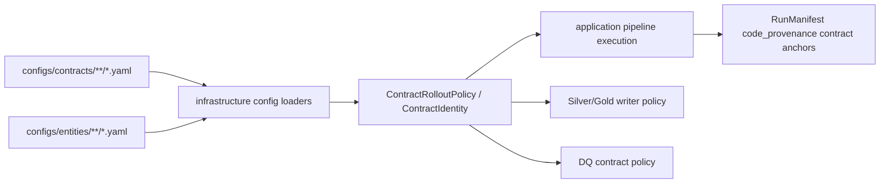

______________________________________________________________________

Version: 1.0.0
Status: active
Class: published
Owner: BioETL Team
Reviewers:

- BioETL Team
  Last verified: '2026-07-06'

______________________________________________________________________

# Data Contracts Current State

Current source of truth:

- Contract YAML: `configs/contracts/**/*.yaml`
- Entity config schemas: `configs/entities/**/*.yaml`
- Gold domain contracts: `src/bioetl/domain/contracts/gold/`
- Contract identity model: `src/bioetl/domain/types/contract_identity.py`
- Contract rollout policy: `src/bioetl/domain/types/contract_rollout.py`
- Contract policy loading/validation:
  `src/bioetl/infrastructure/config/contract_policy_loader.py`,
  `src/bioetl/infrastructure/config/contract_policy_validation.py`
- DQ contract loading:
  `src/bioetl/infrastructure/config/dq_contract_config_loader.py`

## Contract Inventory

There are 27 active YAML data contracts, aligned one-to-one with the 27 entity
pipeline configs.

| Provider | Contracts |
| --- | --- |
| ChEMBL | `activity`, `assay`, `assay_parameters`, `cell_line`, `compound_record`, `molecule`, `protein_class`, `publication`, `publication_similarity`, `publication_term`, `subcellular_fraction`, `target`, `target_component`, `target_protein_classification`, `tissue` |
| Composite | `activity`, `assay`, `molecule`, `publication`, `target` |
| CrossRef | `publication` |
| OpenAlex | `publication` |
| PubChem | `compound` |
| PubMed | `publication` |
| Semantic Scholar | `publication` |
| UniProt | `idmapping`, `protein` |

## Runtime Contract Chain



## Boundary Rules

- Domain owns immutable contract value semantics and identity objects.
- Infrastructure owns YAML loading and Pydantic compatibility/runtime schema
  validation.
- Application consumes contract policies through injected services and ports.
- Composition wires the current contract policy into pipeline factory and writer
  construction.
- Prometheus metrics must not expose raw contract fingerprints, run IDs,
  manifest IDs, record IDs, hashes, filesystem paths, or raw error messages as
  labels.

## Regression Checks

Use these checks after contract or config documentation changes:

```bash
python -m pytest tests/architecture -q
python -m pytest tests/contract -q
python -m scripts.engineering.qa report-observability-metric-inventory --json
```

If a source-code change under `src/bioetl/**/*.py` affects module coverage
inventory, refresh `reports/quality/module-coverage-inventory.json` before
claiming architecture artifact currency.
