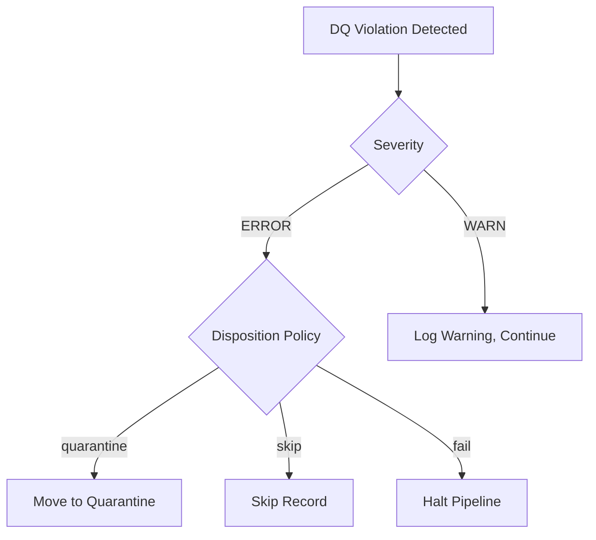

______________________________________________________________________

Version: 1.0.1
Status: active
Class: published
Owner: BioETL Team
Reviewers:

- BioETL Team
  Last verified: '2026-06-16'

______________________________________________________________________

# Data Quality Contracts

*Canonical DQ contract pack for BioETL | Aligned with ADR-045*

This page serves as the first-class published contract surface for Data Quality (DQ) contracts in BioETL. It provides operators and auditors with a single entrypoint for DQ contract semantics, disposition policies, and replay-relevant behavior. Runtime DQ/data-contract routing is backed by `configs/contracts/**`; Pandera models in `src/bioetl/domain/schemas/` remain the structural schema source of truth, and JSON files under `docs/04-reference/contracts/gold/*.json` are generated publication artifacts.

## Contract Registry

The BioETL DQ Contract System defines four primary contract types that govern data quality across all pipelines:

### 1. Schema Contracts

**Purpose**: Validate structural conformance and type safety.

**Canonical Sources**:

- Domain schemas: `src/bioetl/domain/schemas/` (Pandera DataFrameModel contracts)
- Entity contract YAML:
  `configs/contracts/{chembl,composite,crossref,openalex,pubchem,pubmed,semanticscholar,uniprot}/*.yaml`
  (current DQ/data-contract routing inventory)
- Error catalog YAML: `configs/contracts/errors/error_catalog.yaml` (error-code taxonomy, not an entity data contract)
- Entity configs: `configs/entities/{provider}/{entity}.yaml` (field definitions)
- Composite configs: `configs/composites/{entity}.yaml` (field definitions)
- Exported JSON: `docs/04-reference/contracts/gold/*.json` (for external consumers)

**Source-of-truth routing**:

- `src/bioetl/domain/schemas/` owns executable Pandera structural contracts.
- Provider and composite folders under `configs/contracts/` own the current entity contract YAML inventory used by DQ/data-contract routing and policy documentation.
- `configs/contracts/errors/error_catalog.yaml` owns error-code taxonomy and is governed separately from entity data contracts.
- `configs/entities/**` and `configs/composites/**` provide pipeline and composite field metadata; they do not replace the contract YAML inventory.
- `docs/04-reference/contracts/gold/*.json` is generated from contract/schema sources for publication and review.

**Contract Fields**:

- `name`: Field identifier (snake_case)
- `type`: Data type (string, integer, float, boolean, etc.)
- `nullable`: Nullability constraint
- `description`: Business semantics and constraints

**Example**: `chembl_activity_v1.0.json`

### 2. Entity Field Validations

**Purpose**: Enforce business rule compliance and value-domain integrity at the field level.

**Canonical Sources**:

- Entity configs: `configs/entities/{provider}/{entity}.yaml` (section: `entity_field_validations`)
- Composite configs: `configs/composites/{entity}.yaml` (section: `entity_field_validations`)

**Contract Fields**:

- `field`: Target field name (snake_case)
- `type`: Validation rule type (`required`, `not_null`, `range`, `pattern`, `enum`, `max_length`, `not_empty_list`, `custom`)
- `nullable`: Boolean nullability constraint
- `severity`: Severity level ("error" or "warn", default: "error")
- `severity_enricher`: Override severity for enricher context (optional)
- `error_message`: Human-readable error message
- Rule-specific parameters (`min`, `max`, `pattern`, `allowed`, `max_length`, `validator`)

**Example**:

```yaml
quality:
  entity_field_validations:
    - field: activity_id
      type: required
      nullable: false
      error_message: "Activity ID is required for all records"

    - field: standard_value
      type: range
      nullable: true
      min: 0
      max: 1000000000
      error_message: "standard_value must be non-negative and below 1B"

    - field: assay_type
      type: enum
      nullable: false
      allowed: ["B", "F", "A", "T", "P", "U"]
      error_message: "assay_type must be one of B, F, A, T, P, U"

    - field: inchi_key
      type: pattern
      nullable: true
      pattern: "^[A-Z]{14}-[A-Z]{10}-[A-Z]$"
      error_message: "InChI key must match standard format"

    - field: comment
      type: max_length
      nullable: true
      max_length: 500
      error_message: "Comment must not exceed 500 characters"

    - field: custom_validation_field
      type: custom
      nullable: true
      validator: "custom_validation_function"
      error_message: "Field failed custom validation"

    - field: required_field
      type: not_null
      nullable: false
      error_message: "This field cannot be null"
```

### 3. Entity Cross-Field Validations

**Purpose**: Ensure consistency and logical relationships between multiple fields.

**Canonical Sources**:

- Entity configs: `configs/entities/{provider}/{entity}.yaml` (section: `entity_cross_field_validations`)
- Composite configs: `configs/composites/{entity}.yaml` (section: `entity_cross_field_validations`)

**Contract Fields**:

- `name`: Unique name for the validation rule
- `fields`: Tuple of field names involved in the validation
- `condition`: Validation condition type (Literal: "all_present", "any_present", "mutually_exclusive", "conditional_required", "custom")
- `severity`: Severity level ("error" or "warn", default: "error")
- `trigger_field`: For conditional_required: field that triggers requirement
- `required_field`: For conditional_required: field that becomes required
- `validator`: For custom condition: custom validation function name
- `error_message`: Custom error message template

**Example**:

```yaml
quality:
  entity_cross_field_validations:
    - name: both_values_present
      fields: ["standard_value", "standard_units"]
      condition: all_present
      severity: error
      error_message: "Both standard_value and standard_units must be present together"

    - name: min_max_order
      fields: ["min_value", "max_value"]
      condition: custom
      validator: validate_min_max_order
      severity: error
      error_message: "min_value must be less than or equal to max_value"
```

### 4. Entity Conditional Validations

**Purpose**: Apply context-dependent validation rules based on field values.

**Canonical Sources**:

- Entity configs: `configs/entities/{provider}/{entity}.yaml` (section: `entity_conditional_validations`)
- Composite configs: `configs/composites/{entity}.yaml` (section: `entity_conditional_validations`)

**Contract Fields**:

- `name`: Unique name for the validation rule
- `condition_field`: Field to check for condition
- `condition_value`: Value that triggers the validation (scalar or tuple)
- `condition_operator`: Comparison operator ("eq", "ne", "in", "not_in", default: "eq")
- `then_validations`: Tuple of FieldValidation rules to apply when condition is true

**Example**:

```yaml
quality:
  entity_conditional_validations:
    - name: binding_assay_standard_type
      condition_field: assay_type
      condition_value: "B"
      condition_operator: eq
      then_validations:
        - field: standard_type
          type: enum
          allowed: ["IC50", "EC50", "Ki"]
          error_message: "Binding assays require IC50, EC50, or Ki standard types"
```

### 5. Key Nullability Constraints

**Purpose**: Explicit nullability constraints for critical business keys.

**Canonical Sources**:

- Entity configs: `configs/entities/{provider}/{entity}.yaml` (section: `key_nullability`)
- Composite configs: `configs/composites/{entity}.yaml` (section: `key_nullability`)

**Contract Fields**:

- `field`: Field name
- `key_type`: Key role (`merge` or `partition`)
- `nullable`: Boolean nullability constraint

**Example**:

```yaml
quality:
  key_nullability:
    - field: activity_id
      key_type: merge
      nullable: false
    - field: assay_id
      key_type: partition
      nullable: true
    - field: molecule_id
      key_type: merge
      nullable: false
```

## Threshold Semantics

BioETL does **not** have one universal hard-fail default shared by every DQ
surface. Use the matrix below; hierarchical / RULES / contract-loader default
hard-fail is **0.50**.

### Default matrix

| Surface | Source | Default | Meaning |
| --- | --- | --- | --- |
| Hierarchical `quality:` config | `configs/base/quality.yaml`, `ThresholdsConfig` | `soft_fail=0.05`, `hard_fail=0.50` | Base provider/entity DQ hierarchy (RULES default) |
| Contract-backed DQ loader fallback | `configs/contracts/**`, `dq_contract_config_loader.py` | `soft_fail=0.05`, `hard_fail=0.50` | When a contract omits explicit threshold values |
| Inline pipeline DQ override normalization | `pipeline_dq_resolution.py` | `soft_fail=0.05`, `hard_fail=0.20` | Baseline used to detect whether inline `pipeline.dq_overrides` changed the defaults |
| Silver DQ request contract | `silver_dq_request.py` | `soft_fail=0.05`, `hard_fail=0.20` | Request-shape default for Silver DQ analysis |

### Governed threshold changes

Thresholds are policy, not an incident bypass. Operators must not raise
`soft_fail_threshold` or `hard_fail_threshold` merely to convert a failed run
to success.

A proposed change requires:

- the failed run, DQ report, quarantine distribution, effective config, and
  contract version as evidence;
- the affected pipeline set and historical baseline;
- before/after disposition counts and explicit data-risk impact;
- contract-owner review;
- validation against persisted inputs followed by deterministic replay.

The replay creates new manifest and ledger evidence. It never changes the
original failed run or its quarantine payloads in place.

**Invariant**: `soft_fail` must be strictly less than `hard_fail` on every
surface.

**Configuration routing**:

- Hierarchical defaults: `configs/base/quality.yaml`
- Entity/provider overrides: `configs/entities/{provider}/{entity}.yaml`,
  `configs/providers/{provider}.yaml`
- Contract DQ routing: `configs/contracts/**`
- Inline overrides: pipeline YAML → `pipeline.dq_overrides.*`

**Evaluation**: when error rate exceeds `soft_fail`, runtime emits a warning.
When it exceeds `hard_fail`, the batch is rejected or quarantined according to
the active disposition policy and the concrete config surface in effect.

## Validation Layer Matrix

| Layer              | Validation Scope                                   | Primary Contract Source          | Enforcement Point       |
| ------------------ | --------------------------------------------------- | ---------------------------------- | ----------------------- |
| **Domain**          | Entity schema contracts, value object invariants    | `domain/schemas/` (Pandera)        | Pandera validation      |
| **Application**      | Pipeline-level DQ rules, field/cross-field rules     | `configs/entities/`, `configs/composites/` | DQConfigLoader         |
| **Infrastructure**   | Storage schema contracts, Delta Lake constraints    | `infrastructure/schemas/`          | Delta Lake schema check  |
| **Composition**      | DQ rule assembly, hierarchical merge resolution     | `configs/base/quality.yaml`        | DQConfigLoader merge    |

**Key Points**:
- Domain layer enforces structural and semantic validity at the Pandera level
- Application layer applies business rules via hierarchical DQ config
- Infrastructure layer validates storage contracts (Delta Lake schema evolution)
- Composition layer orchestrates threshold evaluation and disposition routing

## Disposition Policy

The DQ contract system defines five disposition strategies based on the canonical `DQDisposition` enum:

| Disposition  | Behavior                                                           | Use Case                                                  |
| ------------ | ------------------------------------------------------------------ | --------------------------------------------------------- |
| `pass`       | No violation detected                                               | Record passes all validation rules                       |
| `warn`       | Violation detected but not severe enough for action                | Non-critical warnings or known edge cases                 |
| `quarantine` | Record moved to quarantine table with full provenance              | Critical violations that require manual review             |
| `skip`       | Skip processing this data                                           | Recoverable issues or data outside scope                  |
| `fail`       | Hard failure - stop processing                                      | System-level integrity violations                         |

**Decision Tree**:



## Replay & Rollout Alignment

### Quarantine Contract

**Purpose**: Govern record isolation and recovery workflows.

**Contract Fields** (QuarantineEntry aggregate):

- `entry_id`: Unique identifier for this quarantine entry
- `pipeline_name`: Name of the pipeline where error occurred
- `error_code`: Classification code for the error (e.g., SCHEMA_VIOLATION)
- `payload`: The failed record data (immutable copy)
- `payload_hash`: Content hash of the payload for deduplication
- `run_id`: Execution context (RunID)
- `batch_id`: Batch that produced this quarantined record
- `status`: Entry status (NEW, UNDER_REVIEW, IGNORED, REPROCESSED, EXPIRED)
- `resolution_info`: Resolution metadata when resolved (resolution_type, resolved_at, resolved_by, reason)
- `created_at`: ISO 8601 timestamp when entry was created
- `metadata`: Additional metadata as key-value pairs

**Recovery Workflow**:

1. **Identification**: `SELECT * FROM quarantine WHERE status = 'NEW'`
1. **Analysis**: Review `payload` and `error_code`
1. **Resolution**: Apply manual correction or update DQ rules, then use resolution methods:
   - `start_review()` → mark as UNDER_REVIEW
   - `mark_ignored(reason, resolved_by, resolved_at)` → mark as IGNORED
   - `mark_reprocessed(new_record_id, resolved_by, resolved_at)` → mark as REPROCESSED
   - `mark_expired(expired_at)` → mark as EXPIRED (retention policy)
1. **Replay**: Use domain replay mechanisms or re-run pipeline with corrected config

### Rollout Contract

**Purpose**: Ensure DQ contract version compatibility during pipeline rollouts.

**Version Policy** (ADR-036):

- Major version (`vX.0`): Breaking changes to contract semantics
- Minor version (`vX.Y`): Backward-compatible additions
- Patch version (`vX.Y.Z`): Non-functional metadata updates

**Rollout Gates**:

1. **Schema Compatibility**: New fields optional, existing fields non-breaking
1. **Content Compatibility**: New rules WARN-only for one release cycle
1. **Consistency Compatibility**: Cross-entity rules validated in staging before promotion

## Contract Discovery & Navigation

### Canonical Entry Points

| Contract Type                      | Entry Point                           | Governance ADR   |
| ---------------------------------- | ------------------------------------- | ---------------- |
| **Schema Contracts**               | [`gold-schemas.md`](gold-schemas.md)  | ADR-018, ADR-036 |
| **Entity Field Validations**       | Entity configs in `configs/entities/` | ADR-027          |
| **Entity Cross-Field Validations** | Entity configs in `configs/entities/` | ADR-027          |
| **Entity Conditional Validations** | Entity configs in `configs/entities/` | ADR-027          |
| **Key Nullability Constraints**    | Entity configs in `configs/entities/` | ADR-027          |
| **Disposition Policy**             | This document                         | ADR-045          |
| **Quarantine Contract**            | This document                         | ADR-045          |
| **Rollout Contract**               | This document                         | ADR-036, ADR-045 |

### Cross-References

**From this page**:

- [DQ Configuration Guide](../../03-guides/dq-configuration.md)
- [Pipeline Failure DQ Runbook](../../05-operations/runbooks/pipeline-failure-dq.md)
- [ADR-045: DQ Contract System](../../02-architecture/decisions/ADR-045-dq-contract-system.md)
- [ADR-027: DQ Rules Externalization](../../02-architecture/decisions/ADR-027-dq-rules-externalization.md)

**To this page**:

- Project Navigator: [`docs/00-project/00-map.md`](../../00-project/00-map.md)
- Data Contracts Index: [`contracts/README.md`](README.md)
- CLI Reference: [`cli.md`](../cli.md)
- Run Manifest Inspection: [`run-manifest-ledger.md`](run-manifest-ledger.md)

## Validation & Compliance

### Parity Requirements

1. **Code ↔ Config Parity**: All DQ rules in `src/bioetl/domain/` must have corresponding config entries
1. **Config ↔ Contract Parity**: All config rules must be reflected in published contract exports
1. **Contract ↔ Docs Parity**: All contracts must be documented in this canonical surface

### Quality Gates

**CI/CD Enforcement**:

- `python -m scripts.schema check-invariants`: validates YAML parse safety and config invariants for `configs/contracts/`, including entity contract YAML and the separate error catalog YAML
- `python -m scripts.schema generate-contracts`: regenerates JSON contract exports from schema sources
- `python -m scripts.check_dq_dsl_parity`: validates DQ DSL parity
- `tests/architecture/test_dq_contract_patterns.py` and `tests/architecture/test_config_contract_yaml_parse_gate.py`: architecture tests for DQ pattern and contract YAML compliance

**Manual Verification**:

- Review contract coverage before major releases
- Audit disposition logic during incident post-mortems
- Validate rollout compatibility in staging environments

## Examples & Templates

### Complete Entity Config with Current DQ DSL

```yaml
# configs/entities/chembl/activity.yaml
# Complete example showing all validation types

entity: activity
provider: chembl
version: 2.1.0

schema:
  fields:
    - name: activity_id
      type: string
      nullable: false
      description: Unique activity identifier
    - name: assay_id
      type: string
      nullable: true
      description: Reference to assay
    - name: standard_value
      type: float
      nullable: true
      description: Measured activity value
    - name: standard_units
      type: string
      nullable: true
      description: Units of measurement

quality:
  # Field-level validations
  entity_field_validations:
    - field: activity_id
      type: required
      nullable: false
      error_message: "Activity ID is required for all records"

    - field: standard_value
      type: range
      nullable: true
      min: 0
      max: 1000000000
      error_message: "standard_value must be non-negative and below 1B"

    - field: assay_type
      type: enum
      nullable: false
      allowed: ["B", "F", "A", "T", "P", "U"]
      error_message: "assay_type must be one of B, F, A, T, P, U"

  # Cross-field validations
  entity_cross_field_validations:
    - name: both_values_present
      fields: ["standard_value", "standard_units"]
      condition: all_present
      severity: error
      error_message: "Both standard_value and standard_units must be present together"

    - name: min_max_order
      fields: ["min_value", "max_value"]
      condition: custom
      validator: validate_min_max_order
      severity: error
      error_message: "min_value must be less than or equal to max_value"

  # Conditional validations
  entity_conditional_validations:
    - name: binding_assay_standard_type
      condition_field: assay_type
      condition_value: "B"
      condition_operator: eq
      then_validations:
        - field: standard_type
          type: enum
          allowed: ["IC50", "EC50", "Ki"]
          error_message: "Binding assays require IC50, EC50, or Ki standard types"

  # Nullability constraints
  key_nullability:
    - field: activity_id
      key_type: merge
      nullable: false
    - field: assay_id
      key_type: partition
      nullable: true
    - field: molecule_id
      key_type: merge
      nullable: false
```

### Validation Rule Reference

#### Field Validation Types

| Rule Type        | Parameters                      | Example                              | Use Case                |
| ---------------- | ------------------------------- | ------------------------------------ | ----------------------- |
| `required`       | `nullable: false`               | `type: required`                     | Mandatory fields        |
| `not_null`       | `nullable: false`               | `type: not_null`                     | Field must not be null  |
| `range`          | `min`, `max`                    | `min: 0, max: 1000`                  | Numeric boundaries      |
| `enum`           | `allowed: [...]`                 | `allowed: ["A", "B"]`                | Enumerated values       |
| `pattern`        | `pattern: "regex"`               | `pattern: "^CHEMBL\\d+$"`            | Regex validation        |
| `max_length`     | `max_length: N`                  | `max_length: 100`                     | Maximum string length   |
| `not_empty_list` | (no min_items parameter)        | `type: not_empty_list`               | Non-empty list/array    |
| `custom`         | `validator: function_name`       | `validator: custom_validator`        | Custom validation logic |

#### Cross-Field Validation Patterns

| Pattern     | Example                                              | Use Case              |
| ----------- | ---------------------------------------------------- | --------------------- |
| Presence    | `field is not none and related_field is not none`    | Both fields required  |
| Comparison  | `field <= related_field`                             | Min/max relationships |
| Conditional | `field == 'value' implies related_field is not none` | Dependent fields      |

### Contract Export And Validation Commands

```bash
# Generate JSON contract exports
python -m scripts.schema generate-contracts

# Validate contract parity
python -m scripts.check_dq_dsl_parity

# Run related architecture tests
pytest tests/architecture/test_dq_contract_patterns.py tests/architecture/test_config_contract_yaml_parse_gate.py
```

## Glossary

| Term                  | Definition                                                                   |
| --------------------- | ---------------------------------------------------------------------------- |
| **DQ Contract**       | Formal agreement defining data quality expectations and enforcement behavior |
| **Disposition**       | Action taken when a DQ violation is detected                                 |
| **Quarantine**        | Isolation mechanism for records failing critical DQ checks                   |
| **Provenance**        | Complete audit trail of DQ validation decisions                              |
| **Rollout Alignment** | Process ensuring DQ contract compatibility across versions                   |

## Related Materials

### Current Documentation

- [ADR-045: Data Quality Contract System](../../02-architecture/decisions/ADR-045-dq-contract-system.md)
- [Observability Metrics Contract](observability.md)
- [Run Manifest & Ledger Contract](run-manifest-ledger.md)
- [Gold Schema Contracts](gold-schemas.md)

### Configuration References

- **ChEMBL Activity**: [`configs/entities/chembl/activity.yaml`](../../../configs/entities/chembl/activity.yaml)
- **PubMed Publication**: [`configs/entities/pubmed/publication.yaml`](../../../configs/entities/pubmed/publication.yaml)
- **Composite Publication**: [`configs/composites/publication.yaml`](../../../configs/composites/publication.yaml)

### Governance

- [ADR-027: DQ Rules Externalization](../../02-architecture/decisions/ADR-027-dq-rules-externalization.md)
- [ADR-045: Data Quality Contract System](../../02-architecture/decisions/ADR-045-dq-contract-system.md)
- [DQ Configuration Guide](../../03-guides/dq-configuration.md)

### Validation

- [Pipeline Failure (DQ) Runbook](../../05-operations/runbooks/pipeline-failure-dq.md)
