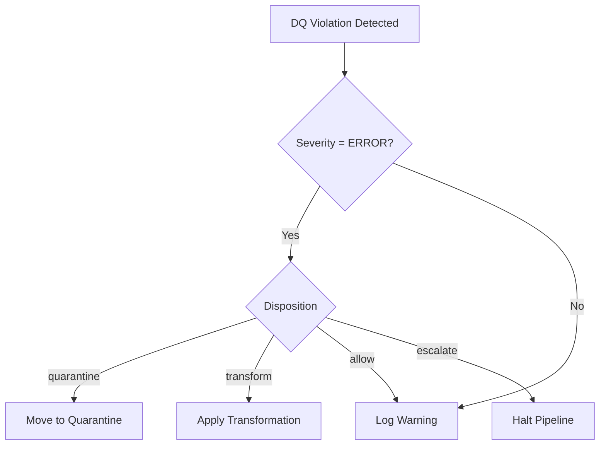

# Data Quality Contracts

*Canonical DQ contract pack for BioETL | Aligned with ADR-045*

This page serves as the first-class canonical contract surface for Data Quality (DQ) contracts in BioETL. It provides operators and auditors with a single entrypoint for DQ contract semantics, disposition policies, and replay-relevant behavior.

## Contract Registry

The BioETL DQ Contract System defines four primary contract types that govern data quality across all pipelines:

### 1. Schema Contracts

**Purpose**: Validate structural conformance and type safety.

**Canonical Sources**:
- Gold layer: `src/bioetl/domain/contracts/gold/` (Pydantic models)
- Silver layer: `src/bioetl/domain/schemas/` (PyArrow schemas)
- Exported JSON: `docs/04-reference/contracts/gold/*.json`

**Contract Fields**:
- `name`: Field identifier (snake_case)
- `type`: Data type (string, integer, float, boolean, etc.)
- `nullable`: Nullability constraint
- `description`: Business semantics and constraints

**Example**: `chembl_activity_v1.0.json`

### 2. Entity Field Validations

**Purpose**: Enforce business rule compliance and value-domain integrity at the field level.

**Canonical Sources**:
- Entity configs: `configs/entities/{provider}/{entity}.yaml` (section: `entity_field_validations`)
- Composite configs: `configs/composites/{entity}.yaml` (section: `entity_field_validations`)

**Contract Fields**:
- `field`: Target field name (snake_case)
- `type`: Validation rule type (`required`, `range`, `enum`, `pattern`, `length`)
- `nullable`: Boolean nullability constraint
- `error_message`: Human-readable error message
- Rule-specific parameters (`min`, `max`, `pattern`, `allowed`, etc.)

**Example**:
```yaml
quality:
  entity_field_validations:
    - field: activity_id
      type: required
      nullable: false
      error_message: "Activity ID is required for all records"
    
    - field: standard_value
      type: range
      nullable: true
      min: 0
      max: 1000000000
      error_message: "standard_value must be non-negative and below 1B"
    
    - field: assay_type
      type: enum
      nullable: false
      allowed: ["B", "F", "A", "T", "P", "U"]
      error_message: "assay_type must be one of B, F, A, T, P, U"
    
    - field: inchi_key
      type: pattern
      nullable: true
      pattern: "^[A-Z]{14}-[A-Z]{10}-[A-Z]$"
      error_message: "InChI key must match standard format"
    
    - field: comment
      type: max_length
      nullable: true
      max_length: 500
      error_message: "Comment must not exceed 500 characters"
    
    - field: tags
      type: not_empty_list
      nullable: true
      min_items: 1
      error_message: "At least one tag is required if tags field is present"
    
    - field: custom_validation_field
      type: custom
      nullable: true
      validation: "custom_validation_function"
      error_message: "Field failed custom validation"
    
    - field: required_field
      type: not_null
      nullable: false
      error_message: "This field cannot be null"
```

### 3. Entity Cross-Field Validations

**Purpose**: Ensure consistency and logical relationships between multiple fields.

**Canonical Sources**:
- Entity configs: `configs/entities/{provider}/{entity}.yaml` (section: `entity_cross_field_validations`)
- Composite configs: `configs/composites/{entity}.yaml` (section: `entity_cross_field_validations`)

**Contract Fields**:
- `field`: Primary field name
- `related_field`: Related field name
- `condition`: Jinja2 validation expression
- `error_message`: Human-readable error message for violation

**Example**:
```yaml
quality:
  entity_cross_field_validations:
    - field: standard_value
      related_field: standard_units
      condition: "{{ standard_value is not none and standard_units is not none }}"
      error_message: "Both standard_value and standard_units must be present together"
    
    - field: min_value
      related_field: max_value
      condition: "{{ min_value is not none and max_value is not none and min_value <= max_value }}"
      error_message: "min_value must be less than or equal to max_value"
```

### 4. Entity Conditional Validations

**Purpose**: Apply context-dependent validation rules based on field values.

**Canonical Sources**:
- Entity configs: `configs/entities/{provider}/{entity}.yaml` (section: `entity_conditional_validations`)
- Composite configs: `configs/composites/{entity}.yaml` (section: `entity_conditional_validations`)

**Contract Fields**:
- `condition`: Jinja2 expression defining when validation applies
- `then`: Validation rules to apply when condition is true
- `else`: Validation rules to apply when condition is false (optional)

**Example**:
```yaml
quality:
  entity_conditional_validations:
    - condition: "{{ assay_type == 'B' }}"
      then:
        field: standard_type
        type: enum
        allowed: ["IC50", "EC50", "Ki"]
        error_message: "Binding assays require IC50, EC50, or Ki standard types"
      else:
        field: standard_type
        type: enum
        allowed: ["IC50", "EC50", "Ki", "Potency"]
        error_message: "Non-binding assays allow additional standard types"
```

### 5. Key Nullability Constraints

**Purpose**: Explicit nullability constraints for critical business keys.

**Canonical Sources**:
- Entity configs: `configs/entities/{provider}/{entity}.yaml` (section: `key_nullability`)
- Composite configs: `configs/composites/{entity}.yaml` (section: `key_nullability`)

**Contract Fields**:
- `field`: Field name
- `nullable`: Boolean nullability constraint

**Example**:
```yaml
quality:
  key_nullability:
    - field: activity_id
      nullable: false
    - field: assay_id
      nullable: true
    - field: molecule_id
      nullable: false
```

## Disposition Policy

The DQ contract system defines four disposition strategies:

| Disposition   | Behavior | Use Case |
|--------------|----------|----------|
| `quarantine`  | Record moved to quarantine table with full provenance | Critical violations that cannot be automatically resolved |
| `transform`   | Automatic correction applied (null → default, type coercion, etc.) | Recoverable format issues |
| `allow`       | Violation logged but record passes through | Non-critical warnings or known edge cases |
| `escalate`    | Pipeline halted, manual intervention required | System-level integrity violations |

**Decision Tree**:


## Replay & Rollout Alignment

### Quarantine Contract

**Purpose**: Govern record isolation and recovery workflows.

**Contract Fields** (QuarantineEntry aggregate):
- `record_id`: Unique identifier of the quarantined record
- `pipeline_id`: Source pipeline identifier
- `run_id`: Execution context
- `violation_type`: Specific DQ rule violated
- `violation_details`: JSON payload with field values and rule parameters
- `original_payload`: Full record before quarantine
- `timestamp`: ISO 8601 timestamp
- `resolution_status`: `pending`, `resolved`, `escalated`

**Recovery Workflow**:
1. **Identification**: `SELECT * FROM quarantine WHERE resolution_status = 'pending'`
2. **Analysis**: Review `violation_details` and `original_payload`
3. **Resolution**: Apply manual correction or update DQ rules
4. **Replay**: `bioetl quarantine replay --run-id <run_id> --record-id <record_id>`

### Rollout Contract

**Purpose**: Ensure DQ contract version compatibility during pipeline rollouts.

**Version Policy** (ADR-036):
- Major version (`vX.0`): Breaking changes to contract semantics
- Minor version (`vX.Y`): Backward-compatible additions
- Patch version (`vX.Y.Z`): Non-functional metadata updates

**Rollout Gates**:
1. **Schema Compatibility**: New fields optional, existing fields non-breaking
2. **Content Compatibility**: New rules WARN-only for one release cycle
3. **Consistency Compatibility**: Cross-entity rules validated in staging before promotion

## Contract Discovery & Navigation

### Canonical Entry Points

| Contract Type | Entry Point | Governance ADR |
|---------------|-------------|----------------|
| **Schema Contracts** | [`gold-schemas.md`](gold-schemas.md) | ADR-018, ADR-036 |
| **Entity Field Validations** | Entity configs in `configs/entities/` | ADR-027 |
| **Entity Cross-Field Validations** | Entity configs in `configs/entities/` | ADR-027 |
| **Entity Conditional Validations** | Entity configs in `configs/entities/` | ADR-027 |
| **Key Nullability Constraints** | Entity configs in `configs/entities/` | ADR-027 |
| **Disposition Policy** | This document | ADR-045 |
| **Quarantine Contract** | This document | ADR-045 |
| **Rollout Contract** | This document | ADR-036, ADR-045 |

### Cross-References

**From this page**:
- [DQ Configuration Guide](../../03-guides/dq-configuration.md)
- [DQ Failure Investigation Runbook](../../05-operations/runbooks/dq-failure-investigation.md)
- [ADR-045: DQ Contract System](../../02-architecture/decisions/ADR-045-dq-contract-system.md)
- [ADR-027: DQ Rules Externalization](../../02-architecture/decisions/ADR-027-dq-rules-externalization.md)

**To this page**:
- Project Navigator: [`docs/00-project/00-map.md`](../../00-project/00-map.md)
- Data Contracts Index: [`contracts/README.md`](README.md)
- CLI Reference: [`cli.md`](../cli.md)
- Run Manifest Inspection: [`run-manifest-ledger.md`](run-manifest-ledger.md)

## Validation & Compliance

### Parity Requirements

1. **Code ↔ Config Parity**: All DQ rules in `src/bioetl/domain/` must have corresponding config entries
2. **Config ↔ Contract Parity**: All config rules must be reflected in published contract exports
3. **Contract ↔ Docs Parity**: All contracts must be documented in this canonical surface

### Quality Gates

**CI/CD Enforcement**:
- `scripts/check_dq_parity.py`: Validates code-config-docs synchronization
- `scripts/validate_contracts.py`: Ensures JSON exports match domain models
- `tests/architecture/test_dq_contracts.py`: Architecture tests for contract compliance

**Manual Verification**:
- Review contract coverage before major releases
- Audit disposition logic during incident post-mortems
- Validate rollout compatibility in staging environments

## Examples & Templates

### Complete Entity Config with Current DQ DSL

```yaml
# configs/entities/chembl/activity.yaml
# Complete example showing all validation types

entity: activity
provider: chembl
version: 2.1.0

schema:
  fields:
    - name: activity_id
      type: string
      nullable: false
      description: Unique activity identifier
    - name: assay_id
      type: string
      nullable: true
      description: Reference to assay
    - name: standard_value
      type: float
      nullable: true
      description: Measured activity value
    - name: standard_units
      type: string
      nullable: true
      description: Units of measurement

quality:
  # Field-level validations
  entity_field_validations:
    - field: activity_id
      type: required
      nullable: false
      error_message: "Activity ID is required for all records"
    
    - field: standard_value
      type: range
      nullable: true
      min: 0
      max: 1000000000
      error_message: "standard_value must be non-negative and below 1B"
    
    - field: assay_type
      type: enum
      nullable: false
      allowed: ["B", "F", "A", "T", "P", "U"]
      error_message: "assay_type must be one of B, F, A, T, P, U"

  # Cross-field validations
  entity_cross_field_validations:
    - field: standard_value
      related_field: standard_units
      condition: "{{ standard_value is not none and standard_units is not none }}"
      error_message: "Both standard_value and standard_units must be present together"
    
    - field: min_value
      related_field: max_value
      condition: "{{ min_value is not none and max_value is not none and min_value <= max_value }}"
      error_message: "min_value must be less than or equal to max_value"

  # Conditional validations
  entity_conditional_validations:
    - condition: "{{ assay_type == 'B' }}"
      then:
        field: standard_type
        type: enum
        allowed: ["IC50", "EC50", "Ki"]
        error_message: "Binding assays require IC50, EC50, or Ki standard types"
      else:
        field: standard_type
        type: enum
        allowed: ["IC50", "EC50", "Ki", "Potency"]
        error_message: "Non-binding assays allow additional standard types"

  # Nullability constraints
  key_nullability:
    - field: activity_id
      nullable: false
    - field: assay_id
      nullable: true
    - field: molecule_id
      nullable: false
```

### Validation Rule Reference

#### Field Validation Types

| Rule Type | Parameters | Example | Use Case |
|-----------|------------|---------|----------|
| `required` | `nullable: false` | `type: required` | Mandatory fields |
| `not_null` | `nullable: false` | `type: not_null` | Field must not be null |
| `range` | `min`, `max` | `min: 0, max: 1000` | Numeric boundaries |
| `enum` | `allowed: [...]` | `allowed: ["A", "B"]` | Enumerated values |
| `pattern` | `pattern: "regex"` | `pattern: "^CHEMBL\\d+$"` | Regex validation |
| `max_length` | `max_length: N` | `max_length: 100` | Maximum string length |
| `not_empty_list` | `min_items: N` | `min_items: 1` | Non-empty list/array |
| `custom` | Custom validation | `validation: custom` | Custom validation logic |

#### Cross-Field Validation Patterns

| Pattern | Example | Use Case |
|---------|---------|----------|
| Presence | `field is not none and related_field is not none` | Both fields required |
| Comparison | `field <= related_field` | Min/max relationships |
| Conditional | `field == 'value' implies related_field is not none` | Dependent fields |

### Contract Export Command

```bash
# Generate JSON contract exports
python -m scripts.schema generate-contracts

# Validate contract parity
python -m scripts.check_dq_dsl_parity

# Run architecture tests
pytest tests/architecture/test_dq_contracts.py
```

### Contract Export Command

```bash
# Generate JSON contract exports
python -m scripts.schema generate-contracts

# Validate contract parity
python -m scripts.check_dq_parity

# Run architecture tests
pytest tests/architecture/test_dq_contracts.py
```

## Glossary

| Term | Definition |
|------|-----------|
| **DQ Contract** | Formal agreement defining data quality expectations and enforcement behavior |
| **Disposition** | Action taken when a DQ violation is detected |
| **Quarantine** | Isolation mechanism for records failing critical DQ checks |
| **Provenance** | Complete audit trail of DQ validation decisions |
| **Rollout Alignment** | Process ensuring DQ contract compatibility across versions |

## Related Materials

### Current Documentation
- [DQ Contract System Architecture](../../04-reference/components/dq-contract-system.md)
- [Observability Metrics Contract](observability.md)
- [Run Manifest & Ledger Contract](run-manifest-ledger.md)
- [Gold Schema Contracts](gold-schemas.md)

### Configuration References
- **ChEMBL Activity**: [`configs/entities/chembl/activity.yaml`](../../../configs/entities/chembl/activity.yaml)
- **PubMed Publication**: [`configs/entities/pubmed/publication.yaml`](../../../configs/entities/pubmed/publication.yaml)
- **Composite Publication**: [`configs/composites/publication.yaml`](../../../configs/composites/publication.yaml)

### Governance
- [ADR-027: DQ Rules Externalization](../../02-architecture/decisions/ADR-027-dq-rules-externalization.md)
- [ADR-045: Data Quality Contract System](../../02-architecture/decisions/ADR-045-dq-contract-system.md)
- [DQ Configuration Guide](../../03-guides/dq-configuration.md)

### Validation
- [DQ Failure Investigation Runbook](../../05-operations/runbooks/dq-failure-investigation.md)
- [Pipeline Failure (DQ) Runbook](../../05-operations/runbooks/pipeline-failure-dq.md)
