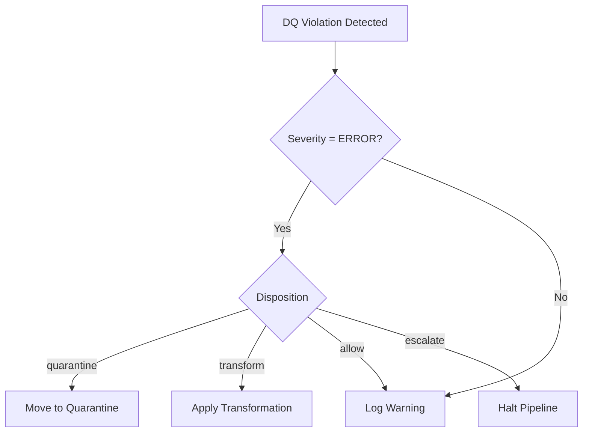

# Data Quality Contracts

*Canonical DQ contract pack for BioETL | Aligned with ADR-045*

This page serves as the first-class canonical contract surface for Data Quality (DQ) contracts in BioETL. It provides operators and auditors with a single entrypoint for DQ contract semantics, disposition policies, and replay-relevant behavior.

## Contract Registry

The BioETL DQ Contract System defines three primary contract types that govern data quality across all pipelines:

### 1. Schema Contracts

**Purpose**: Validate structural conformance and type safety.

**Canonical Sources**:
- Gold layer: `src/bioetl/domain/contracts/gold/` (Pydantic models)
- Silver layer: `src/bioetl/domain/schemas/` (PyArrow schemas)
- Exported JSON: `docs/04-reference/contracts/gold/*.json`

**Contract Fields**:
- `name`: Field identifier (snake_case)
- `type`: Data type (string, integer, float, boolean, etc.)
- `nullable`: Nullability constraint
- `description`: Business semantics and constraints

**Example**: `chembl_activity_v1.0.json`

### 2. Content Contracts

**Purpose**: Enforce business rule compliance and value-domain integrity.

**Canonical Sources**:
- Entity configs: `configs/entities/{provider}/{entity}.yaml` (section: `quality.content`)
- Composite configs: `configs/composites/{entity}.yaml` (section: `quality.content`)

**Contract Fields**:
- `field`: Target field name
- `rule`: Validation rule type (`not_null`, `unique`, `regex`, `enum`, `range`, etc.)
- `params`: Rule-specific parameters
- `severity`: `ERROR`, `WARN`, or `INFO`
- `disposition`: `quarantine`, `transform`, `allow`, or `escalate`

**Example**:
```yaml
quality:
  content:
    - field: activity_id
      rule: not_null
      severity: ERROR
      disposition: quarantine
    - field: assay_type
      rule: enum
      params: ["B", "F", "A", "P", "C"]
      severity: WARN
      disposition: transform
```

### 3. Consistency Contracts

**Purpose**: Ensure cross-field and cross-entity consistency.

**Canonical Sources**:
- Entity configs: `configs/entities/{provider}/{entity}.yaml` (section: `quality.consistency`)
- Cross-provider mappings: `src/bioetl/domain/mapping/`

**Contract Fields**:
- `fields`: Array of field names involved in the consistency check
- `rule`: Consistency rule type (`cross_field`, `cross_entity`, `temporal`, `conditional`)
- `expression`: Validation expression (Jinja2 or Python lambda)
- `severity`: `ERROR`, `WARN`, or `INFO`
- `disposition`: `quarantine`, `transform`, `allow`, or `escalate`

**Example**:
```yaml
quality:
  consistency:
    - fields: [standard_value, standard_units]
      rule: cross_field
      expression: "{{ standard_value is not none and standard_units is not none }}"
      severity: ERROR
      disposition: quarantine
```

## Disposition Policy

The DQ contract system defines four disposition strategies:

| Disposition   | Behavior | Use Case |
|--------------|----------|----------|
| `quarantine`  | Record moved to quarantine table with full provenance | Critical violations that cannot be automatically resolved |
| `transform`   | Automatic correction applied (null → default, type coercion, etc.) | Recoverable format issues |
| `allow`       | Violation logged but record passes through | Non-critical warnings or known edge cases |
| `escalate`    | Pipeline halted, manual intervention required | System-level integrity violations |

**Decision Tree**:


## Replay & Rollout Alignment

### Quarantine Contract

**Purpose**: Govern record isolation and recovery workflows.

**Contract Fields** (QuarantineEntry aggregate):
- `record_id`: Unique identifier of the quarantined record
- `pipeline_id`: Source pipeline identifier
- `run_id`: Execution context
- `violation_type`: Specific DQ rule violated
- `violation_details`: JSON payload with field values and rule parameters
- `original_payload`: Full record before quarantine
- `timestamp`: ISO 8601 timestamp
- `resolution_status`: `pending`, `resolved`, `escalated`

**Recovery Workflow**:
1. **Identification**: `SELECT * FROM quarantine WHERE resolution_status = 'pending'`
2. **Analysis**: Review `violation_details` and `original_payload`
3. **Resolution**: Apply manual correction or update DQ rules
4. **Replay**: `bioetl quarantine replay --run-id <run_id> --record-id <record_id>`

### Rollout Contract

**Purpose**: Ensure DQ contract version compatibility during pipeline rollouts.

**Version Policy** (ADR-036):
- Major version (`vX.0`): Breaking changes to contract semantics
- Minor version (`vX.Y`): Backward-compatible additions
- Patch version (`vX.Y.Z`): Non-functional metadata updates

**Rollout Gates**:
1. **Schema Compatibility**: New fields optional, existing fields non-breaking
2. **Content Compatibility**: New rules WARN-only for one release cycle
3. **Consistency Compatibility**: Cross-entity rules validated in staging before promotion

## Contract Discovery & Navigation

### Canonical Entry Points

| Contract Type | Entry Point | Governance ADR |
|---------------|-------------|----------------|
| **Schema Contracts** | [`gold-schemas.md`](gold-schemas.md) | ADR-018, ADR-036 |
| **Content Contracts** | Entity configs in `configs/entities/` | ADR-027 |
| **Consistency Contracts** | Entity configs + mapping modules | ADR-027 |
| **Disposition Policy** | This document | ADR-045 |
| **Quarantine Contract** | This document | ADR-045 |
| **Rollout Contract** | This document | ADR-036, ADR-045 |

### Cross-References

**From this page**:
- [DQ Configuration Guide](../../03-guides/dq-configuration.md)
- [DQ Failure Investigation Runbook](../../05-operations/runbooks/dq-failure-investigation.md)
- [ADR-045: DQ Contract System](../../02-architecture/decisions/ADR-045-dq-contract-system.md)
- [ADR-027: DQ Rules Externalization](../../02-architecture/decisions/ADR-027-dq-rules-externalization.md)

**To this page**:
- Project Navigator: [`docs/00-project/00-map.md`](../../00-project/00-map.md)
- Data Contracts Index: [`contracts/README.md`](README.md)
- CLI Reference: [`cli.md`](../cli.md)
- Run Manifest Inspection: [`run-manifest-ledger.md`](run-manifest-ledger.md)

## Validation & Compliance

### Parity Requirements

1. **Code ↔ Config Parity**: All DQ rules in `src/bioetl/domain/` must have corresponding config entries
2. **Config ↔ Contract Parity**: All config rules must be reflected in published contract exports
3. **Contract ↔ Docs Parity**: All contracts must be documented in this canonical surface

### Quality Gates

**CI/CD Enforcement**:
- `scripts/check_dq_parity.py`: Validates code-config-docs synchronization
- `scripts/validate_contracts.py`: Ensures JSON exports match domain models
- `tests/architecture/test_dq_contracts.py`: Architecture tests for contract compliance

**Manual Verification**:
- Review contract coverage before major releases
- Audit disposition logic during incident post-mortems
- Validate rollout compatibility in staging environments

## Examples & Templates

### Minimal Entity Config with DQ Contracts

```yaml
# configs/entities/chembl/activity.yaml
entity: activity
provider: chembl
schema:
  fields:
    - name: activity_id
      type: string
      nullable: false
    - name: assay_id
      type: string
      nullable: true
quality:
  content:
    - field: activity_id
      rule: not_null
      severity: ERROR
      disposition: quarantine
    - field: standard_value
      rule: range
      params: {min: 0, max: 1000000}
      severity: WARN
      disposition: transform
  consistency:
    - fields: [assay_id, activity_id]
      rule: cross_entity
      expression: "{{ assay_id is not none or activity_id is not none }}"
      severity: ERROR
      disposition: quarantine
```

### Contract Export Command

```bash
# Generate JSON contract exports
python -m scripts.schema generate-contracts

# Validate contract parity
python -m scripts.check_dq_parity

# Run architecture tests
pytest tests/architecture/test_dq_contracts.py
```

## Glossary

| Term | Definition |
|------|-----------|
| **DQ Contract** | Formal agreement defining data quality expectations and enforcement behavior |
| **Disposition** | Action taken when a DQ violation is detected |
| **Quarantine** | Isolation mechanism for records failing critical DQ checks |
| **Provenance** | Complete audit trail of DQ validation decisions |
| **Rollout Alignment** | Process ensuring DQ contract compatibility across versions |

## Related Materials

- [DQ Contract System Architecture](../../04-reference/components/dq-contract-system.md)
- [Observability Metrics Contract](observability.md)
- [Run Manifest & Ledger Contract](run-manifest-ledger.md)
- [Gold Schema Contracts](gold-schemas.md)