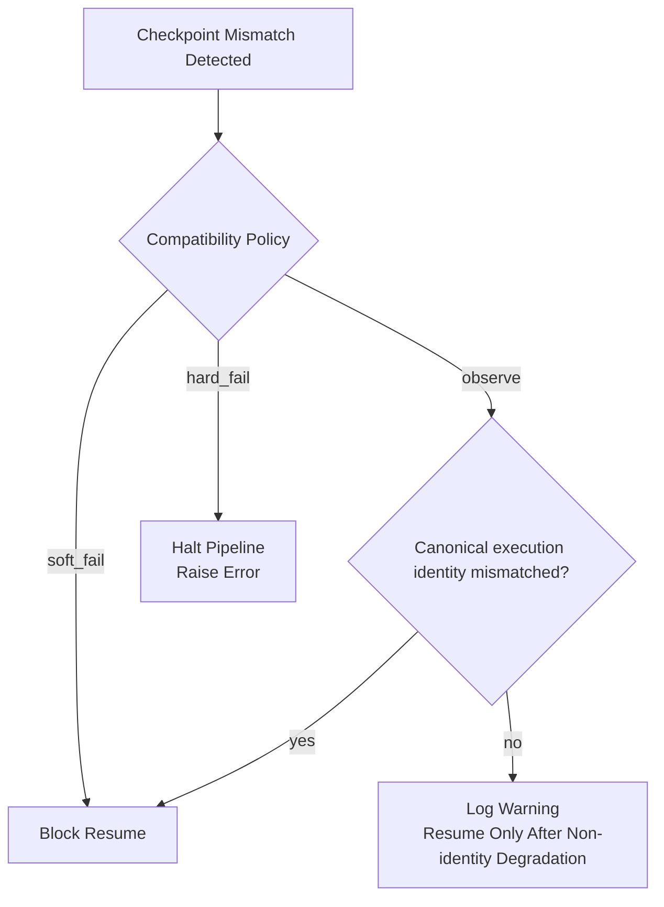

______________________________________________________________________

Version: 1.1.0
Status: active
Class: published
Owner: BioETL Team
Reviewers:

- BioETL Team
  Last verified: "2026-04-23"

______________________________________________________________________

# Run Manifest and Run Ledger Contract

## Purpose

This document defines the published control-plane contract for immutable run
manifests, append-only run ledgers, and the inspection surface used by
operators and diagnostics.

Current published scope: BioETL supports strict exact replay only inside the
explicitly published snapshot-backed support boundary. Project-wide wording
about **any historical run** is governed by the latest authoritative
historical replay universe closure report rather than by this header alone:
when that artifact reports both `universal_claim.claimed=true` and
`durable_evidence_coverage_claim.claimed=true`, BioETL may claim universal
historical exact replay for `all_known_historical_runs`; otherwise the global
claim remains blocked even if supported-boundary runs score well.

The current snapshot-backed boundary remains the default exact-replay path of
the published contract. BioETL also supports one broader certified historical
tranche: retained historical source runs may gain certified parent evidence via
explicit immutable snapshot backfill, and historical composite runs may gain
certified parent evidence only from already certified source lineage.

This broader tranche is still fail-closed. It is never implied by retained
Bronze files, partial lineage, or operator reconstruction heuristics without
explicit certification evidence appended to the run ledger.

Published policy markers for this tranche are:

- `broader_historical_exact_replay_policy=certified_historical_exact_replay_tranche_supported`
- `broader_historical_exact_replay_boundary=historical_source_snapshot_certification`
  for retained historical source runs
- `broader_historical_exact_replay_boundary=historical_composite_certified_source_lineage`
  for historical composite runs

For supported source families, a completed live source capture may later gain
immutable snapshot evidence via ledger materialization. That state is published
as post-capture replayable parent evidence, not as proof that the original live
capture occurrence was itself an exact replay execution.

Historical live runs without immutable snapshot evidence remain outside the
strict replay claim until explicit `input_snapshot_published` ledger evidence
materializes either a bounded immutable parent snapshot envelope or a certified
historical snapshot envelope. BioETL does not silently upgrade such runs from
retained Bronze files, path heuristics, or other implicit reconstruction
signals.

It is the contract leg of the published traceability documentation pack
required by [D-01](../../00-project/governance/01-documentation-governance-style-guide.md).

The current code owners / source-of-truth seams are:

- `src/bioetl/domain/control_plane/run_manifest.py`
- `src/bioetl/domain/control_plane/run_ledger.py`
- `src/bioetl/domain/ports/control_plane/`
- `src/bioetl/application/core/lifecycle/checkpoint_runtime.py`
- `src/bioetl/application/composite/checkpoint/load_service.py`
- `src/bioetl/interfaces/cli/commands/run_manifest.py`
- `src/bioetl/composition/bootstrap/cli/run_manifest.py`
- `src/bioetl/composition/runtime_builders/run_manifest_builder.py`
- `src/bioetl/composition/runtime_builders/runner_builder.py`
- `src/bioetl/composition/factories/pipeline/checkpoint_policy_helpers.py`
- `src/bioetl/composition/factories/pipeline/checkpoint_metadata_helpers.py`
- `src/bioetl/infrastructure/config/_base.py`
- `src/bioetl/infrastructure/control_plane/`

## Execution Context Boundary

The published control-plane contract does not replace BioETL runtime execution
contexts.

- `PipelineRunContext` remains the canonical launch/execution descriptor used
  by composition/runtime assembly before a runner starts.
- `PipelineContext` remains the canonical in-run processing context used by
  record, batch, write, and post-write flows.
- `RunManifest` remains an immutable provenance/control-plane artifact linked
  to runtime execution via `manifest_id`.
- `RunCodeProvenance` includes `normalization_profile_ref`,
  `normalization_profile_version`, and `normalization_profile_hash` so replay
  diagnostics can tie one manifest to the exact normalization profile surface
  used for that run.
- `CheckpointMetadata` now carries the same strict replay anchors for
  `git_commit`, `dependency_lock_hash`, `normalization_profile_ref`,
  `normalization_profile_version`, and `normalization_profile_hash` whenever a
  checkpoint participates in replay-ready or forensic-grade resume flows.

This means the supported model is deliberately split. BioETL does not define
one universal manifest object that serves as launch descriptor, in-run context,
and provenance artifact at the same time.

The published `RunCodeProvenance` schema currently includes:

- `pipeline_version`
- `git_commit`
- `source_revision_state`
- `dependency_lock_hash`
- `config_hash`
- `resolved_config_hash`
- `effective_config_hash`
- `source_fingerprint`
- `contract_ref`
- `contract_version`
- `contract_schema_hash`
- `dq_policy_ref`
- `rule_bundle_version`
- `normalization_profile_ref`
- `normalization_profile_version`
- `normalization_profile_hash`
- `dq_contract_compatibility_hash`
- `effective_config_artifact_id`

## Storage Layout

File-backed control-plane persistence uses the following canonical paths:

| Artifact                             | Path                                                               |
| ------------------------------------ | ------------------------------------------------------------------ |
| Manifest payload                     | `data/output/control/run_manifest/{manifest_id}.json`              |
| Manifest run-id index                | `data/output/control/run_manifest/_by_run_id/{run_id}.txt`         |
| Ledger payload                       | `data/output/control/run_ledger/{manifest_id}.jsonl`               |
| Ledger run-id index                  | `data/output/control/run_ledger/_by_run_id/{run_id}.txt`           |
| Effective config semantic artifact   | `data/output/control/effective_config/{artifact_id}.json`          |
| Effective config occurrence envelope | `data/output/control/effective_config/_occurrences/{run_id}.json`  |
| Effective config run-id index        | `data/output/control/effective_config/_by_run_id/{run_id}.txt`     |
| Lineage fragment payload             | `data/output/control/lineage/fragments/{stable_fragment_key}.json` |
| Lineage lookup indexes               | `data/output/control/lineage/_by_*/*.jsonl`                        |
| Historical replay closure reports    | `data/output/control/historical_replay_closure/{report_id}.json`   |
| Historical replay universe artifacts | `data/output/control/historical_replay_universe/{report_id}.json`  |
| Checkpoint payloads                  | `data/output/checkpoints/**/*.json`                                |
| Cached Bronze input snapshots        | `data/output/bronze/**/*`                                          |

`run_manifest` and `run_ledger` stores are bootstrapped from
`Path(settings.data_dir) / "output" / "control" / <leaf>` and are therefore
runtime-aligned with the current composition layer.

Strict exact-replay, `replay_ready`, and `forensic_grade` contexts require this
root to come from an explicit `settings.data_dir` configuration. Fallback
resolution to repo-local `data/`, private-cache, or `/tmp` is degraded-only and
must not be treated as a strict reproducibility anchor.

## Lifecycle Management

File-backed control-plane lifecycle management is planner-driven:

- `ControlPlaneArtifactLifecyclePolicy` declares the retention window, planning
  timestamp, and explicit protected references.
- `FileControlPlaneArtifactLifecycleStore.plan(..., dry_run=True)` returns a
  complete dry-run plan and MUST NOT delete files.
- `FileControlPlaneArtifactLifecycleStore.plan(..., dry_run=False)` returns the
  same decision model for apply mode.
- `FileControlPlaneArtifactLifecycleStore.apply(plan)` deletes only artifacts
  whose plan decision is `delete`; dry-run plans are no-op during apply.

Protected-reference rules are fail-closed:

- manifests inside the retention window protect their `manifest_id`, `run_id`,
  `replay_of_manifest_id`, and
  `code_provenance.effective_config_artifact_id`;
- manifests inside the retention window protect content-addressed
  `source_refs[*].input_snapshots[*].snapshot_id` values;
- stale manifests that declare `required_persistence_profile=replay_ready` or
  `required_persistence_profile=forensic_grade` retain their replay evidence
  floor unless `ControlPlaneArtifactLifecyclePolicy.allow_profile_floor_violation`
  is explicitly enabled;
- stale manifests whose published family profile advertises
  `broader_historical_exact_replay_policy=certified_historical_exact_replay_tranche_supported`
  also retain their replay evidence floor so no new retained run can age into
  an uncertifiable historical state merely because lifecycle cleanup deleted its
  immutable replay evidence before certification or later child replay;
- the same permanence rule extends to archived and future replay-supported
  history: universal exact replay must keep a declared durable evidence path
  instead of relying on ephemeral local reconstruction that would later decay
  back into uncertifiable historical states;
- checkpoints inside the retention window protect their `run_id`,
  `manifest_id`, and `effective_config_artifact_id` anchors;
- explicit protected manifest/run/effective-config/lineage/snapshot identifiers
  protect matching payloads and lookup indexes regardless of age;
- ledgers are retained when their `manifest_id` or `run_id` is protected;
- effective-config semantic artifacts are retained when referenced by a
  protected or retention-active manifest;
- effective-config occurrence envelopes and run indexes are retained when their
  `run_id` is protected;
- lineage fragments are retained when their `manifest_id`, `run_id`,
  `stored_fragment_id`, or semantic `fragment_id` is protected.
- cached Bronze files are retained when their `sha256:{content_hash}` identity
  is protected by a retained manifest or explicit snapshot protection.
- profile-floor retention is emitted as
  `reason=reproducibility_evidence_floor` with `protected_by` entries prefixed
  by `evidence_floor:` so dry-run/apply output distinguishes replay evidence
  violations from ordinary protected references.

Certified historical replay is therefore bounded but operationalized:

- `bioetl run-manifest inventory` emits a retained-corpus certifiability
  inventory so operators can see which manifests are already replayable,
  already certified, awaiting source snapshot certification, or awaiting
  certified source lineage;
- `bioetl run-manifest replay-bundle <run-id|manifest-id>` emits one canonical
  replay descriptor that ties the manifest, ledger, code/config provenance,
  replay parentage, immutable input snapshots, published artifact refs, and
  lineage fragment identities into one inspection payload;
- `bioetl run-manifest certify-historical-bulk <plan.json>` applies a
  deterministic source-first certification pass across retained manifests using
  explicit immutable snapshot evidence from the provided plan;
- `bioetl run-manifest closure-report --write` persists one retained-corpus
  closure artifact with a deterministic `report_id`, global claim gate, and
  explicit residual resolution queue for any blocked historical manifests;
- `bioetl run-manifest universe-report --external-pack ... --write` persists
  one full-universe closure artifact by merging the retained local corpus with
  authoritative archived/offline historical packs through the supported CLI
  surface;
- `scripts/engineering/qa/run_historical_replay_universe_campaign.py` persists
  a full-universe closure artifact by merging the local retained corpus with
  one or more authoritative external universe packs for archived/offline runs;
- `scripts/engineering/qa/run_historical_replay_closure_campaign.py --require-global-claim`
  fails closed when the retained-corpus closure artifact still cannot make the
  published global replay claim;
- `scripts/engineering/qa/run_historical_replay_universe_campaign.py --require-universal-claim`
  and `--require-durable-evidence-coverage` fail closed when the merged
  full-universe artifact cannot make the stronger universal or durable-evidence
  claims;
- each external universe pack is the authoritative bridge from retained local
  control-plane evidence to the full historical-run universe and must carry one
  record per historical occurrence with
  `manifest_id`, `run_id`, `pipeline_name`, `provider`, `entity`,
  `execution_context`, `certification_status`, `replay_occurrence_kind`,
  blocking reasons when unresolved, `evidence_residency`,
  `durable_evidence_coverage`, and a `source_pack_ref`;
- the closure artifact supports two published claim-scope modes:
  `all_retained_historical_runs` and
  `retained_certifiable_historical_runs`;
- bulk certification never mutates manifests in place; it appends new
  `input_snapshot_published` ledger evidence and then re-derives diagnostics
  from the same append-only control-plane surfaces.
- the global claim gate is published as
  `global_universal_historical_replay_claim`; it remains blocked until the
  retained corpus has no unresolved blocked manifests, no out-of-scope
  retained runs, and no explicitly irrecoverable legacy subset.
- when `claim_scope_mode=retained_certifiable_historical_runs`, explicit
  residual dispositions
  `irrecoverable_missing_immutable_evidence` and
  `outside_universal_claim_scope` remove those legacy occurrences from the
  strong claim scope instead of silently treating them as replayable.
- a literal universal exact replay claim for **any historical run** is only
  supported from the full-universe artifact, not from the retained-corpus
  artifact alone. That artifact must merge locally retained runs with
  authoritative archived/offline historical records and publish
  `authoritative_truth_surface`, `universal_claim`, and
  `durable_evidence_coverage_claim`.
- the full-universe artifact uses `scope=all_known_historical_runs`. It is the
  only published scope that may back literal wording about **any historical
  run** rather than retained-only or retained-certifiable subsets.
- `authoritative_truth_surface.surface=historical_replay_universe_closure_report`
  is the machine-readable declaration that this artifact family, and only this
  artifact family, may back literal **any historical run** wording.
- top-level project wording may claim universal historical exact replay only
  when the latest full-universe artifact reports
  `universal_claim.claimed=true` and
  `durable_evidence_coverage_claim.claimed=true`.
- `durable_evidence_coverage_claim` is the permanence gate for guarantees that
  must survive retained, archived, and future history rather than a one-off
  closure campaign snapshot.
- the retained-corpus closure artifact may still persist while the claim gate
  is blocked. In that state, operators must either certify more immutable
  evidence or attach explicit residual dispositions such as
  `reconstruct_immutable_evidence`,
  `expand_retention_and_publish_evidence`,
  `certify_upstream_source_lineage`,
  `irrecoverable_missing_immutable_evidence`, or
  `outside_universal_claim_scope`.

Lifecycle planning is intentionally independent from read APIs: expired
unprotected files can be selected for deletion even if higher-level lookup
indexes are already orphaned. Corruption-visible read paths still fail closed
before lifecycle apply is considered.

## Rollout Flags

The control-plane runtime is governed by the runtime object path
`settings.pipeline.control_plane`. The source-of-truth model is
`PipelineSettings.ControlPlaneSettings` in
`src/bioetl/infrastructure/config/_base.py`.

| Setting                           |               Default | Effect                                                                                                                         |
| --------------------------------- | --------------------: | ------------------------------------------------------------------------------------------------------------------------------ |
| `required_persistence_profile`    |         `replay_ready` | Minimum control-plane persistence contract required for this runtime (`degraded_observable`, `replay_ready`, `forensic_grade`) |
| `run_manifest_enabled`            |                `true` | Create immutable manifest before runner assembly / execution starts                                                            |
| `run_ledger_enabled`              |                `true` | Append lifecycle and inspection events keyed by `manifest_id`                                                                  |
| `checkpoint_compatibility_policy` |           `hard_fail` | Resume behavior when checkpoint identity mismatches runtime (`observe`, `soft_fail`, `hard_fail`)                              |

Current rollout semantics:

1. Executable standard and composite runs require `run_manifest_enabled=true`;
   current runtime does not support launching a new pipeline/composite execution
   without manifest creation.
1. `run_manifest_enabled=true`, `run_ledger_enabled=false` keeps manifest creation but suppresses ledger writes where that degraded mode is still allowed.
1. `run_ledger_enabled=true` is only valid when `run_manifest_enabled=true`.
1. Executable launches for replay-capable published families default to
   `replay_ready`. When a supported executable family still carries a
   configured `degraded_observable` override, the effective profile is promoted
   to the published strict family default instead of silently preserving the
   weaker floor.
1. Runtime surfaces must distinguish configured vs effective persistence
   profile. Bootstrap observability may publish the configured request as
   `configured_required_persistence_profile`, while the canonical
   `required_persistence_profile` for one run must reflect the effective value
   after control-plane policy resolution.
1. The effective default is fail-closed: a production/debug-critical supported
   family launch that cannot prove immutable input snapshots, or a composite
   launch without a full snapshot envelope, is blocked before it can be claimed
   as replay-ready.
1. `required_persistence_profile=replay_ready` requires
   `run_manifest_enabled=true` and an execution context inside the published
   strict exact-replay support boundary.
1. `required_persistence_profile=forensic_grade` requires both
   `run_manifest_enabled=true` and `run_ledger_enabled=true`, plus replay-ready
   and lineage-closure surfaces inside the same published support boundary.
1. `checkpoint_compatibility_policy` governs resume disposition on checkpoint incompatibility:
   `observe` remains a degraded operator mode for non-identity signals, but canonical
   execution-identity mismatches still block resume; `soft_fail` blocks resume;
   `hard_fail` raises an error.
1. `required_persistence_profile=replay_ready` or
   `required_persistence_profile=forensic_grade` is stricter than the requested
   compatibility policy: runtime coerces any non-`hard_fail` policy up to `hard_fail` so strict
   persistence contexts never continue on an unproven resume identity.
1. `exact_replay=true` is stricter than the requested compatibility policy:
   runtime coerces checkpoint compatibility handling to `hard_fail` so an
   exact replay attempt cannot continue after any compatibility mismatch.

## Checkpoint Compatibility Policy

The BioETL control-plane supports three checkpoint compatibility modes that govern
resume behavior when checkpoint identity mismatches occur:

### Policy Enum

```python
# src/bioetl/application/core/lifecycle/checkpoint_runtime.py
CheckpointCompatibilityPolicy = Literal[
    "observe", "soft_fail", "hard_fail"
]
```

### Policy Semantics

| Policy      | Behavior                                                                                                         | Use Case                                           | Default         |
| ----------- | ---------------------------------------------------------------------------------------------------------------- | -------------------------------------------------- | --------------- |
| `observe`   | Resume only after non-identity compatibility warnings; canonical execution-identity mismatch still blocks resume | Operator-aware degraded mode outside strict replay | ❌ Manual       |
| `soft_fail` | Block resume on incompatibility without aborting the whole process                                               | Default fail-closed resume behavior                | ✅ Default      |
| `hard_fail` | Halt pipeline by raising on incompatibility                                                                      | Critical integrity and exact replay                | ✅ Exact replay |

### Decision Flow



### Configuration

```yaml
# configs/entities/provider/entity.yaml
runtime:
  checkpoint_compatibility:
    critical: hard_fail      # Default for critical operations
    non_critical: observe    # Default for non-critical operations
```

### Policy Selection Guide

**Use `observe` when:**

- Non-critical validation scenarios
- Development/testing environments
- Graceful degradation is acceptable

**Use `soft_fail` when:**

- Default operator-facing fail-closed resume behavior
- Recovery scenarios where incompatibility should block resume without aborting
  the whole process
- Non-strict persistence profiles where fail-closed blocking is sufficient

**Use `hard_fail` when:**

- Critical integrity requirements
- Production steady-state
- `required_persistence_profile` is `replay_ready` or `forensic_grade`
- `exact_replay=true`
- Exact replay requirements

Historical manifests may still preserve removed checkpoint policy values in raw
launch-context payloads. Treat that as evidence of an older runtime posture,
not as a supported modern configuration value.

## Supported Resume Modes

The current control-plane contract intentionally supports two different resume
modes:

- ordinary resume uses checkpoint snapshot state and compatibility checks
  without ledger suffix replay;
- composite resume uses checkpoint snapshot state as the base and then replays
  only the ledger suffix strictly after `last_event_id`.
- `execution_fingerprint` remains the canonical semantic execution identity,
  while `composite_run_identity` is an occurrence-scoped resume anchor used to
  block composite checkpoint drift across logically different executions.
- checkpoint execution identity now carries the same strict code/config replay
  anchors as the manifest/effective-config path, including `git_commit`,
  `dependency_lock_hash`, `contract_ref`, `contract_version`,
  `contract_schema_hash`, `dq_policy_ref`, `rule_bundle_version`,
  `normalization_profile_ref`, `normalization_profile_version`,
  `normalization_profile_hash`, and
  `dq_contract_compatibility_hash`.

This asymmetry is intentional. The current contract finishes the existing
composite replay model without requiring every runner to implement the same
ledger-driven state projection.

## Supported Execution Paths

The current control-plane contract is defined against these supported execution
paths:

| Path                 | Resume model                               | Control-plane guarantees                                                                                                                                                                                                 |
| -------------------- | ------------------------------------------ | ------------------------------------------------------------------------------------------------------------------------------------------------------------------------------------------------------------------------ |
| `ordinary success`   | none                                       | Manifest exists before execution starts; ledger writes `manifest_created`, `run_started`, stage lifecycle events, and `run_finished` when ledger is enabled                                                              |
| `ordinary failure`   | none                                       | Manifest exists before execution starts; ledger writes `manifest_created`, `run_started`, partial stage lifecycle events, and terminal failure semantics through `run_failed` / exception logging when ledger is enabled |
| `ordinary shutdown`  | none                                       | Manifest exists before execution starts; ledger writes `manifest_created`, `run_started`, partial stage lifecycle events, and `run_shutdown` when ledger is enabled                                                      |
| `ordinary resume`    | checkpoint snapshot only                   | Manifest still exists before execution starts; resume relies on checkpoint snapshot state and compatibility checks without ledger suffix replay                                                                          |
| `composite success`  | none                                       | Manifest exists before execution starts; ledger writes `manifest_created`, composite lifecycle events, and terminal success when ledger is enabled                                                                       |
| `composite failure`  | none                                       | Manifest exists before execution starts; ledger writes `manifest_created`, composite lifecycle events, and terminal failure semantics when ledger is enabled                                                             |
| `composite shutdown` | none                                       | Manifest exists before execution starts; ledger writes `manifest_created`, composite lifecycle events, and `run_shutdown` when ledger is enabled                                                                         |
| `composite resume`   | checkpoint snapshot + ledger suffix replay | Manifest still exists before execution starts; resume restores checkpoint snapshot first and then replays only the ledger suffix strictly after `last_event_id`                                                          |
| `full-scan rebuild`  | full scan + content-hash deduplication     | `full_scan_only` pipelines intentionally block checkpoint resume; diagnostics classify this path as `full_scan_idempotent_rebuild`, not exact replay or checkpoint resume                                               |

No supported execution path may bypass manifest creation or, when
`run_ledger_enabled=true`, ledger attachment. Runtime assembly coerces invalid
flag combinations so that ledger cannot be enabled without manifest creation.

## Composite Checkpoint Resume Semantics

The current replay-enabled resume path is implemented for composite checkpoints.

- checkpoint state remains snapshot-only;
- the composite checkpoint snapshot carries replay watermark metadata through
  `last_event_id` and `last_event_occurred_at`;
- composite checkpoint compatibility also enforces
  `composite_run_identity` as an occurrence-scoped anchor distinct from the
  semantic `execution_fingerprint`;
- after the checkpoint snapshot is loaded and compatibility anchors are
  validated, runtime replays only the ledger suffix strictly after
  `last_event_id` via `RunLedgerPort.list_entries_after(manifest_id, last_event_id)`;
- the replay projector is bounded by persisted evidence: it always restores
  lifecycle milestones such as `state`, `seed_completed`, `merge_completed`,
  and the latest replay watermark, and it additionally restores recorded
  `seed_result` / dependency / enrichment / merge payload maps when the ledger
  contains the corresponding composite completion events;
- projector coverage is fail-closed: if the ledger suffix contains
  replay-relevant entries outside the bounded composite projector contract,
  runtime raises checkpoint conflict instead of silently degrading the replay
  into a partial reconstruction;
- if the replay watermark is missing from the append order for the current
  `manifest_id`, runtime treats this as checkpoint incompatibility and raises a
  checkpoint conflict instead of silently continuing.

## Persistence Profile Evaluation

Inspection diagnostics classify each resolved run against one explicit
persistence-profile taxonomy:

- `forensic_grade`: the run is replay-ready and also retains ledger-backed
  control-plane history plus complete artifact/lineage anchors for published
  outputs within the currently supported lineage-closure boundary;
- `replay_ready`: immutable input snapshots, exact-replay capability, and the
  effective-config artifact anchor are present, but richer forensic surfaces may
  still be absent;
- `degraded_observable`: the run remains inspectable through the persisted
  manifest, but one or more mandatory replay-ready requirements are missing.

`required_persistence_profile` is the declared minimum profile requested by the
runtime/deployment for that run. The current published contract is:

- `degraded_observable` remains valid only for families outside the published
  replay-capable executable boundary. Replay-capable executable families do not
  preserve this weaker floor: they promote to the published strict floor or
  fail closed before the run is claimed as executable;
- `replay_ready` is the default floor for executable runs;
- `replay_ready` is only valid inside the strict exact-replay support boundary;
  execution contexts outside that boundary must fail closed during bootstrap
  instead of running and merely reporting a degraded profile later. For
  ordinary source runs this also requires immutable input snapshots and
  `exact_replay_capability` on the built manifest request for the current run;
- outside that published support boundary the contract is intentionally
  narrower: the platform guarantees inspectable degraded observability, not
  universal exact replay for every run;
- `forensic_grade` requires `replay_ready` surfaces plus append-only ledger
  history and metadata-sidecar / lineage persistence for every active published
  layer in the configured sink surface.

The current diagnostics surface exposes:

- `persistence_profile.attained_profile`;
- `persistence_profile.required_profile`;
- `persistence_profile.required_profile_satisfied`;
- `lineage_closure_boundary.family`;
- `lineage_closure_boundary.supported`;
- `lineage_closure_boundary.reason`;
- `persistence_profile.required_profile_missing_requirements`;
- `persistence_profile.claims`;
- `persistence_profile.surfaces`;
- `persistence_profile.replay_ready_missing_requirements`;
- `persistence_profile.forensic_grade_missing_requirements`.
- `artifact_publication_closure`;
- `alert_signals.immutable_input_snapshot_gap`;
- `alert_signals.composite_resume_reconstructability_gap`;
- `alert_signals.required_persistence_profile_gap`;
- `alert_signals.replay_ready_gap`;
- `alert_signals.forensic_grade_gap`;
- `alert_signals.lineage_closure_boundary_gap`;

When ledger-backed diagnostics are available, these profile gaps are promoted
into alert-oriented booleans and operator next steps so replay/forensic
deficiencies are visible as actionable signals rather than passive metadata.
`artifact_publication_closure` is the canonical publication-evidence state:
`closed`, `partial`, `disabled`, or `failed`. Replay-ready and forensic-grade
claims require `closed`; `partial`, `disabled`, and `failed` are fail-closed
evidence gaps even when a manifest and run ledger can otherwise be resolved.
When immutable input snapshots are the missing replay-ready requirement, the
diagnostics surface raises `alert_signals.immutable_input_snapshot_gap` and
points the operator back to cached-Bronze snapshot persistence before exact
replay can be claimed.

## Reproducibility Scoring Rubric

The profile taxonomy above is the authority for pass/fail behavior. The
following score is an operator-facing evidence summary; it does not override
`required_persistence_profile` or exact-replay bootstrap checks.

| Score | Label                 | Required evidence                                                                 |
| ----: | --------------------- | --------------------------------------------------------------------------------- |
|     0 | `not_observable`      | No manifest can be resolved for the run or manifest identifier                    |
|    25 | `manifest_observable` | Manifest resolves and exposes execution identity plus runtime/config provenance   |
|    50 | `ledger_observable`   | Manifest plus append-only ledger history are available and corruption-visible     |
|    75 | `replay_ready`        | Immutable input snapshots and effective-config artifact anchors support replay    |
|   100 | `forensic_grade`      | Replay-ready evidence plus lineage/artifact closure inside the supported boundary |

Evidence matrix:

| Evidence surface                   | Degraded observable | Replay ready | Forensic grade |
| ---------------------------------- | ------------------: | -----------: | -------------: |
| Manifest payload                   |            required |     required |       required |
| Execution fingerprint              |            required |     required |       required |
| Effective-config semantic artifact |            optional |     required |       required |
| Immutable input snapshot refs      |            optional |     required |       required |
| Append-only ledger                 |            optional |     optional |       required |
| Artifact linkage diagnostics       |            optional |     optional |       required |
| Lineage closure boundary           |            optional |     optional |       required |
| Supported reproducibility family   |            optional |     required |       required |

Evidence scoring is conservative: a missing mandatory surface caps the score
at the highest lower tier whose evidence is complete, and unsupported lineage
families cannot score above `replay_ready`.

The repeatable audit rubric is maintained in
[Reproducibility Scoring Rubric](reproducibility-scoring-rubric.md). It defines
the required seven categories, five criteria per category, and the 0/1/2 scoring
semantics reviewers must cite when recalculating audit scores.

Composite replay is additionally documented as a bounded reconstructability
surface:

- scope: `coarse_grained_composite_resume` when only lifecycle/watermark
  evidence is available, or `rich_composite_resume` when the ledger contains
  persisted seed/dependency/enrichment/merge replay payloads;
- resume model: `checkpoint_snapshot_plus_ledger_suffix`;
- coarse reconstruction from persisted state: `state`, `seed_completed`,
  `merge_completed`, `last_event_id`, `last_event_occurred_at`;
- rich reconstruction from persisted state additionally includes:
  `seed_result`, `dependency_results`, `enrichment_results`, `merge_result`;
- rich reconstruction is published only when corresponding ledger evidence is
  present; otherwise diagnostics keep the bounded coarse contract.

When the inspected execution context is composite, diagnostics also raise
`alert_signals.composite_resume_reconstructability_gap` and point operators to
the bounded replay contract instead of implying richer checkpoint-state
reconstruction.

Checkpoint incompatibility diagnostics also expose two compact forensic payloads:

- `current_identity`
- `checkpoint_identity`

These payloads intentionally surface the resume-critical anchors
(`composite_run_identity`, `execution_fingerprint`, `manifest_id`,
`effective_config_hash`, `contract_ref`, `contract_version`, `exact_replay`,
`input_snapshot_ids`) so operators can explain why resume was rejected or
degraded without inspecting the full checkpoint blob first.
`input_snapshot_fingerprint` is the canonical hash of the immutable snapshot
reference envelope rather than an IDs-only digest: when present, the replay
identity contract also incorporates replay-critical fields such as
`content_hash`, `immutable_uri`, and persisted object-version anchors.

## Observability & Metrics

- Aggregated control-plane telemetry lives in `grafana/dashboards/bioetl-control-plane-v1.json`.
  Этот dashboard показывает manifest write failures, ledger append failures,
  checkpoint compatibility incompatibilities и read failure ratio scoped по
  `$pipeline/$run_type`.
- Alert `BioETLControlPlaneReadFailureRate` (see `docs/05-operations/runbooks/observability-checklist.md`)
  сигнализирует, когда доля failed control-plane reads по store/operation
  превышает 5% за 30 минут и служит дополнительной точкой входа для traceability incidents.

## Run Manifest Contract

`RunManifest` is immutable and captures launch-time intent plus reproducibility
provenance.

Canonical identity roles are intentionally split:

- `run_id` is the canonical occurrence anchor shared across manifest indexes,
  ledger indexes, checkpoints, and sidecars;
- `manifest_id` is the immutable persisted manifest record key for one
  occurrence and must not drift for the same `run_id`;
- `execution_fingerprint` remains the canonical semantic execution identity and
  may be shared by multiple occurrence records when the same computation is
  rerun.

| Field                   | Type       | Required | Notes                                                                                                                                                                         |
| ----------------------- | ---------- | -------: | ----------------------------------------------------------------------------------------------------------------------------------------------------------------------------- |
| `manifest_id`           | `str`      |      yes | Stable identifier of the manifest record                                                                                                                                      |
| `execution_fingerprint` | `str`      |      yes | Canonical execution-identity fingerprint derived from normalized semantic anchors; occurrence-only values such as `manifest_id` and ledger history are intentionally excluded |
| `schema_version`        | `str`      |      yes | Control-plane schema version                                                                                                                                                  |
| `created_at`            | `datetime` |      yes | Manifest creation timestamp                                                                                                                                                   |
| `run_id`                | `uuid`     |      yes | Execution run identifier                                                                                                                                                      |
| `run_type`              | `str`      |      yes | `incremental`, `backfill`, `rebuild`                                                                                                                                          |
| `pipeline_name`         | `str`      |      yes | Canonical pipeline ID                                                                                                                                                         |
| `provider`              | `str`      |      yes | Source provider                                                                                                                                                               |
| `entity`                | `str`      |      yes | Domain entity                                                                                                                                                                 |
| `launch_context`        | `object`   |      yes | Launch options relevant to execution                                                                                                                                          |
| `runtime_config`        | `object`   |      yes | Runtime-only settings snapshot                                                                                                                                                |
| `resolved_config`       | `object`   |      yes | Effective resolved pipeline config                                                                                                                                            |
| `code_provenance`       | `object`   |      yes | See the full `RunCodeProvenance` field set below                                                                                                                              |
| `replay_capability`     | `str`      |      yes | Replay classification: `exact_replay_supported`, `resume_only`, or `rebuild_only`                                                                                             |
| `replay_of_run_id`      | `str`      |       no | Parent run anchor when this manifest is an exact replay of a prior run                                                                                                        |
| `replay_of_manifest_id` | `str`      |       no | Parent manifest anchor when this manifest is an exact replay of a prior manifest                                                                                              |
| `source_refs`           | `array`    |       no | Canonical input/source references                                                                                                                                             |
| `planned_artifacts`     | `array`    |       no | Intended output locations by layer                                                                                                                                            |

`launch_context` is also the persisted support-boundary surface for exact replay:

- `execution_context` distinguishes ordinary source execution from composite execution;
- `exact_replay_support_boundary` publishes the strict replay boundary for that execution context:
  - `snapshot_backed_source_runs_only` for ordinary source execution;
  - `composite_snapshot_backed_input_envelope` for composite execution when
    every seed, dependency, and enricher input is represented by immutable
    snapshot refs.
- `replay_family_contract.strict_replay_runtime_verdict` is the operator-facing
  preflight verdict for strict replay requests:
  - `allowed_with_snapshot_backed_source_refs` for supported source families;
  - `requires_full_composite_snapshot_envelope` for composite families;
  - `blocked_outside_supported_boundary` for published source families that
    remain rebuild-only.

### Input snapshot identity vs locator

`source_refs[*].input_snapshots[*]` separates portable identity from replay
locator metadata:

- `content_hash` is the SHA256 hash of captured input bytes.
- `snapshot_id` is content-addressed as `sha256:{content_hash}` and MUST NOT
  include local file paths, mtimes, or other locator-only fields.
- `immutable_uri` is a replay locator. Local cached-Bronze files use portable
  `bronze://{relative_path_from_bronze_root}` URIs instead of absolute checkout
  paths.
- Object storage anchors (`storage_provider`, `object_bucket`, `object_key`,
  `object_version_id`, `etag`, and `last_modified`) are supplemental locator
  anchors. They do not replace `snapshot_id` as semantic identity.
- `captured_at`, `last_modified`, `etag`, and `query_fingerprint` are
  occurrence or lookup metadata; changing them must not change `snapshot_id`
  when the captured bytes are unchanged.

### Post-capture replayable parent evidence

When a live source run starts without launch-time immutable snapshots but later
emits `input_snapshot_published` ledger events with a complete immutable input
snapshot envelope, the published contract distinguishes three states:

- `ordinary_live_capture`: a live source occurrence without sufficient
  immutable snapshot evidence yet;
- `materialized_replayable_parent`: the original live capture occurrence is now
  backed by immutable snapshot evidence and may serve as the replayable parent
  for a later child exact replay run;
- `exact_replay_child_run`: a later run explicitly launched as replay of a
  parent capture lineage.

The operator-facing diagnostic marker for the middle state is
`replay_occurrence_kind=materialized_replayable_parent`. The original live
capture occurrence remains distinct from any child exact replay execution even
after `live_capture_snapshot_materialized` evidence is present.

Historical live runs without immutable snapshot evidence therefore follow one
bounded upgrade policy only:

- `historical_live_run_upgrade_policy=input_snapshot_published_ledger_evidence_only`
- `historical_live_run_upgrade_boundary=input_snapshot_published_ledger_evidence`
- `historical_live_run_upgrade_state=awaiting_input_snapshot_published_evidence`
  until a complete immutable snapshot envelope is explicitly materialized.

Once that evidence is present, diagnostics upgrade the state to
`historical_live_run_upgrade_state=already_materialized_replayable_parent` and
`replay_occurrence_kind=materialized_replayable_parent`. Partial or malformed
materialization remains bounded as
`historical_live_run_upgrade_state=incomplete_materialization_evidence`.

### Effective-config provenance baseline

When `code_provenance.effective_config_artifact_id` is present, the current
published effective-config baseline is:

- canonical YAML-backed `source_refs` persist stable `source_hash` values when
  the referenced config files exist;
- the semantic effective-config artifact lives at
  `effective_config/{artifact_id}.json` and contains the stable
  `semantic_artifact` payload only;
- occurrence-only fields such as `created_at`, resolved-config timestamp, and
  effective-execution timestamp live in
  `effective_config/_occurrences/{run_id}.json` and are not part of the
  semantic effective-config identity;
- file-backed effective-config persistence is fail-closed for semantic
  rewrites: identical semantic payloads are idempotent and leave the existing
  artifact bytes untouched, while conflicting payloads for the same
  `artifact_id` are rejected;
- file-backed effective-config persistence is crash-safe across semantic
  artifact, occurrence envelope, and `run_id -> artifact_id` index writes:
  runtime must not leave a newly committed semantic artifact or occurrence
  envelope behind when a later consistency step fails in-process.

### Replay equivalence levels

Run-manifest replay diagnostics distinguish semantic replay from byte-for-byte
artifact equality:

- `semantic_execution_equivalence` means two runs have the same semantic
  execution identity and replay anchors. The comparison uses
  `execution_fingerprint`, normalized effective-config semantic artifacts,
  immutable input snapshot IDs/content hashes, contract references, and the
  produced-artifact trace. Occurrence-only fields such as `run_id`,
  `manifest_id`, ledger append order, wall-clock timestamps, host/runtime
  diagnostics, and occurrence envelopes may differ.
- `artifact_byte_equivalence` is resolved semantic-first for structured
  sidecars. Normalized JSON/YAML sidecars are compared after removing
  occurrence-only fields such as `run_id`, `manifest_id`, and occurrence-only
  dataset provenance anchors. Raw-byte equality remains an explicit forensic
  sub-surface. This is stricter than semantic replay and is not implied when
  sidecars or metadata envelopes contain occurrence-scoped timestamps, run IDs,
  manifest IDs, lineage timestamps, or host/runtime fields.

Dataset rows and metadata sidecars preserve the same boundary: semantic
`content_hash` values exclude occurrence-scoped runtime anchors, while raw
artifact bytes can still differ when occurrence-rich sidecars are regenerated.
Operators must therefore treat semantic replay success as a replay-contract
claim, not as a byte-identical artifact claim unless byte equality is measured
separately.

### `RunCodeProvenance` field set

`code_provenance` currently includes these optional anchors:

- `pipeline_version`
- `git_commit`
- `source_revision_state`
- `dependency_lock_hash`
- `config_hash`
- `resolved_config_hash`
- `effective_config_hash`
- `contract_ref`
- `contract_version`
- `contract_schema_hash`
- `dq_policy_ref`
- `rule_bundle_version`
- `dq_contract_compatibility_hash`
- `effective_config_artifact_id`

`source_revision_state` is a documented allowlist field. New manifests must not
persist any value outside this set:

- `clean`
- `dirty`
- `dirty_state_unknown`
- `git_unavailable`

Hash semantics are deliberately split:

- `config_hash` is a legacy compatibility anchor retained for older manifest
  and sidecar consumers. Current write paths populate it from
  `resolved_config_hash`; new code must read the explicit
  `resolved_config_hash` / `effective_config_hash` fields and must not treat
  `config_hash` as a synonym for `effective_config_hash`.
- `resolved_config_hash` is the hash of the resolved declarative configuration
  before occurrence envelope fields and supported runtime overrides are folded
  into the execution surface.
- `effective_config_hash` is the hash of the final effective execution
  configuration after supported runtime overrides and control-plane
  normalization. Effective-config hash inputs use the same strict canonical JSON
  serializer contract as execution fingerprints, including deterministic key
  ordering and non-finite float rejection.

New manifest creation, diagnostics, inspection output, metadata sidecars, and
lineage nodes MUST preserve those fields separately. Backward-compatible
consumers MAY still read legacy `config_hash`, but manifest hydration and new
control-plane write paths MUST NOT synthesize missing `resolved_config_hash` or
`effective_config_hash` values from it.

All new executable manifests require `git_commit`, `clean`
`source_revision_state`, and `dependency_lock_hash` to be present, regardless
of whether the requested persistence floor is `degraded_observable`,
`replay_ready`, or `forensic_grade`. Inspection diagnostics must expose both
`git_commit` and `source_revision_state` through `diagnostics`,
`code_provenance_state`, and `identity_graph` so missing or dirty code
provenance is visible to operators and automation. New manifests must record
`dependency_lock_hash` as a provenance anchor; the field is not a domain I/O
concern and must be resolved by composition/runtime wiring. Diagnostics expose
`dependency_lock_state` as `present` or `missing` so historical absent lockfile
evidence remains operator-visible. Metadata sidecars and checkpoint metadata
carry the same lock hash when it is available through the run context.

Older persisted manifests may still surface documented legacy
`source_revision_state` values such as `git_unavailable` or
`dirty_state_unknown`, but new executable write paths must fail closed before
persisting those states.

Checkpoint / resume compatibility may additionally rely on a narrower
runtime-anchor contract derived from a subset of control-plane fields such as
`manifest_id`, `effective_config_hash`, `contract_ref`, `contract_version`, and
`effective_config_artifact_id`. That runtime-anchor contract is intentionally
not the same thing as the canonical `execution_fingerprint`.
`composite_run_identity` remains occurrence-scoped composite-resume metadata
used to guard composite checkpoint drift, not a generic semantic resume proof.

## Run Ledger Contract

`RunLedgerEntry` is append-only and records what actually happened.

| Field                 | Type       | Required | Notes                                                                                                                                |
| --------------------- | ---------- | -------: | ------------------------------------------------------------------------------------------------------------------------------------ |
| `entry_id`            | `str`      |      yes | Stable ledger-entry ID                                                                                                               |
| `manifest_id`         | `str`      |      yes | Foreign key to manifest                                                                                                              |
| `run_id`              | `uuid`     |      yes | Execution run identifier                                                                                                             |
| `event_type`          | `str`      |      yes | Lifecycle / diagnostic event name                                                                                                    |
| `occurred_at`         | `datetime` |      yes | Event timestamp                                                                                                                      |
| `event_family`        | `str`      |       no | Stable event taxonomy (`diagnostic`, `pipeline.lifecycle`, `pipeline.phase`, `artifact`, `dq`, `lineage`, `checkpoint`, `composite`, `input_snapshot`) |
| `status`              | `str`      |       no | Outcome/status snapshot                                                                                                              |
| `stage`               | `str`      |       no | Stage identifier when applicable                                                                                                     |
| `message`             | `str`      |       no | Human-readable event note                                                                                                            |
| `error_type`          | `str`      |       no | Error class/category for failures                                                                                                    |
| `dataset_ref`         | `str`      |       no | Dataset identity anchor for published artifacts                                                                                      |
| `lineage_fragment_id` | `str`      |       no | Lineage fragment identity anchor                                                                                                     |
| `metrics_snapshot`    | `object`   |       no | Numeric metrics captured at event time                                                                                               |
| `details`             | `object`   |       no | Additional structured payload                                                                                                        |

### `details._diagnostic` anchor contract

When `details` is present, runtime enriches it with `_diagnostic` metadata. The
anchor payload includes:

- stable envelope: `diagnostic_contract_version`, `event_type`, `event_family`,
  `manifest_id`, `run_id`, `status`;
- runtime correlation anchors when available: `pipeline`, `provider`, `entity`,
  `run_type`, `effective_config_hash`, `contract_ref`, `contract_version`,
  `dq_policy_ref`, `rule_bundle_version`, `dq_contract_compatibility_hash`,
  `effective_config_artifact_id`, `composite_run_id`;
- event-specific linkage: `stage`, `dataset_ref`, `lineage_fragment_id`,
  `error_type`.

## Current Event Set / Inspection Baseline

The current baseline ledger records these events:

- `manifest_created`
- `run_started`
- `stage_started`
- `stage_completed`
- `artifact_published`
- `run_finished`
- `run_failed`
- `run_shutdown`
- `dq_policy_applied`
- `composite_dependency_completed`
- `composite_enricher_completed`
- `composite_merge_completed`
- `input_snapshot_published`

Event taxonomy behavior:

- `event_type` is normalized to lowercase.
- `event_family` is auto-inferred when omitted.
- Prefix-based families are supported (`dq_*`, `lineage_*`, `checkpoint_*`,
  `composite_*`, `artifact_*`), and suffix-based phase events
  (`*_started`, `*_completed`) map to `pipeline.phase`.
- `input_snapshot_published` records immutable live-capture Bronze input
  snapshot evidence after manifest creation; inspection treats it as
  ledger-derived evidence and does not mutate the original manifest.
- `composite_dependency_completed`, `composite_enricher_completed`, and
  `composite_merge_completed` carry bounded rich composite resume evidence
  used by checkpoint snapshot plus ledger suffix replay.
- file-backed ledger reads are corruption-visible and fail closed: a truncated
  tail line or malformed JSONL entry is treated as ledger corruption rather
  than silently ignored during inspection or resume-time replay.

## Manifest Diff Classification

`run-manifest diff` should classify differences between two manifests using the
current control-plane reproducibility model:

- `identical`: no top-level manifest differences are present;
- `occurrence_only`: only occurrence-scoped fields such as `manifest_id`,
  `run_id`, or `created_at` differ while `execution_fingerprint` is unchanged;
- `semantic_drift`: manifests differ in semantic execution identity and
  therefore are not exact semantic replays of the same computation;
- `semantic_equivalent_with_noncanonical_differences`: manifests share the same
  `execution_fingerprint`, but still differ in non-occurrence serialized fields
  and should be investigated as normalization or contract drift.

The diff payload should therefore expose:

- `classification`
- `semantic_equivalent`
- `occurrence_only`
- `occurrence_difference_fields`
- `semantic_difference_fields`
- `noncanonical_difference_fields`
- `replay_relationship`
- `forensic_diff` / `cross_surface_replay_diff`, retaining the legacy
  `cross_surface_replay_diff` key for CLI/API compatibility while exposing a
  unified forensic view of manifest, effective-config, checkpoint-anchor,
  lineage, input-snapshot, and planned-artifact drift.

The application-level `ForensicRunDiffService` builds the same report through
the existing manifest and ledger ports. It must classify missing optional
evidence, such as absent run-ledger entries or missing published artifacts,
rather than silently treating unavailable evidence as a match.
The operator-facing CLI/API entrypoints are:

- `bioetl run-manifest forensic-diff <LEFT> <RIGHT>`
- `bioetl diagnostics forensic-diff <LEFT> <RIGHT>`

The `forensic-diff` report is a bounded application DTO with explicit sections
for `replay_capability`, `checkpoint_compatibility`, `artifact_completeness`,
`lineage_closure`, and `missing_evidence`. Missing sidecars, incomplete
produced-artifact traces, absent ledger entries, and unsupported lineage
closure are represented as missing/unsupported evidence instead of being
collapsed into a successful match.

`run-manifest verify` is the stricter replay-evidence command for automation.
It resolves both identifiers through the manifest store, then verifies
effective-config evidence through the effective-config artifact store by
`run_id`. The command reports manifest classification, effective-config
semantic equivalence, occurrence-only differences, missing evidence, and
artifact/hash anchor matches. Missing effective-config sidecars or occurrences
are reported as `missing_replay_evidence`, not as a successful replay match.

## Canonical Stage Sets

When `event_type` is `stage_started` or `stage_completed`, the current contract
freezes these canonical stage names:

- ordinary runner stages:
  - `preflight`
  - `prepare_medallion_layers`
  - `execute_pipeline`
  - `postrun`
  - `checkpoint_finalize`
- composite runner stages:
  - `seed`
  - `dependencies`
  - `enrichment`
  - `merge`

These stage sets are intentionally stable contract surface. Stage events are
canonicalized to lowercase pipeline stage names, while non-stage events may use
non-pipeline vocabulary such as artifact layer names in `stage`.

## Invariants

1. When the control-plane contract is enabled, `no manifest, no run` applies to the documented execution path.
1. Manifest creation happens before execution starts.
1. `RunManifest` is immutable after persistence.
1. `RunLedgerEntry` is append-only.
1. Sidecars and runtime diagnostics reference `manifest_id` instead of embedding the full manifest payload.
1. `run_id` lookup resolves to one `manifest_id` through the file index.
1. `run_id` lookup in both manifest and ledger stores must not be remapped to a different `manifest_id` after the first persisted occurrence anchor is established.
1. One ledger file (`{manifest_id}.jsonl`) represents exactly one persisted `manifest_id` and one `run_id`; mixed identity anchors inside one file are corruption-visible.
1. Composite resume reuses checkpoint snapshot data and only replays ledger
   events after the persisted watermark.

## CLI Inspection

Supported inspection commands:

```bash
bioetl run-manifest show <run-id|manifest-id>
bioetl run-manifest diff <left> <right>
bioetl run-manifest verify <left> <right>
bioetl run-manifest score <run-id|manifest-id>
```

The CLI resolves `manifest_id` directly and falls back to `run_id` lookup when
an identifier parses as UUID-like input. Default output is human-readable
`text`; use `--format json` or `--format yaml` for machine-readable output.

`show` returns a four-part inspection payload:

- `manifest`
- `ledger_entries`
- `diagnostics`
- `identity_graph`

The `diagnostics` block is the published operator-facing summary for event
counts, artifact linkage, DQ anchors, correlation-anchor gaps, replay
capability, and suggested next steps.
Diagnostics also include `append_mode_semantic_sinks`; any enabled Silver/Gold
semantic sink with `mode=append` is reported as
`append_mode_semantic_outputs` in `exact_replay_blockers` and as a
`reproducible_semantic_output_mode` persistence gap.

`score` emits the `reproducibility_audit_score` block directly for automation.
The score payload includes `schema_version`, `contract_version`, `scale`,
`required_profile`, run-scoped `score_scope`, backward-compatible
run-scoped `overall_score`, category scores, score `thresholds`,
`threshold_failures`, `thresholds_satisfied`, `blockers`, `evidence_refs`,
explicit `supported_boundary_verdict`,
`historical_replay_universe_exact_replay_claim`,
`executable_run_contract_claim`, `scored_at`, and `source`.

`overall_score` remains a legacy-compatible summary for the inspected
run/family within its published replay boundary. It is not a project-wide claim
that BioETL supports universal exact replay for every family and every
historical occurrence.

`supported_boundary_verdict` is the machine-readable run verdict. It answers
whether the inspected run satisfies its published boundary requirements or is
blocked/gapped by replay capability, lineage closure, thresholds, or other
boundary evidence.

`historical_replay_universe_exact_replay_claim` is the machine-readable claim
surface for historical corpus coverage. It remains explicit even when the
inspected run scores well inside its supported boundary. When the latest
authoritative historical replay universe artifact is available, this field must
mirror that artifact's truth surface; otherwise it remains an explicit
unclaimed fallback rather than silently inferring a universal guarantee from
one run's local score.

`executable_run_contract_claim` is the machine-readable claim surface for
prospective executable runs inside the published supported boundary. It states
that replay-capable executable launches promote to the strict family floor or
fail closed instead of running under a degraded replay claim.

Current published lineage closure boundary for Bronze -> Silver -> Gold
operator-grade trace/debug support is authoritative only in the generated
[Reproducibility Support Matrix](../../02-architecture/policies/reproducibility-support-matrix.md).
That matrix is the sole source of truth for family membership inside the
published closure boundary; this contract intentionally avoids freezing a
second hard-coded family list here.

For each supported family the canonical semantic artifact anchors remain:

- Bronze batch outputs emitted for the family source path;
- Silver dataset outputs with canonical artifact ids of the form
  `silver:{family}@<version>`;
- Gold dataset outputs with canonical artifact ids of the form
  `gold:{family}`.

Families outside that generated published boundary may still emit lineage
signals, but they
are fail-closed outside the supported end-to-end closure surface for
operator-grade trace/debug guarantees.
The diagnostics payload therefore publishes an explicit
`lineage_closure_boundary` contract for every manifested run. When
`lineage_closure_boundary.supported=false`, the run must not be treated as
forensic-grade even if replay-ready and ledger/linkage anchors are otherwise
present.
Published support for composite lineage closure does not by itself grant
forensic-grade attainment; composite runs still require the richer replay and
artifact surfaces exposed by `persistence_profile.forensic_grade_missing_requirements`.

For the supported MVP surface, sidecar/lineage bundles MUST satisfy this
minimal identity contract:

- `runtime.run_id` matches the lineage fragment `run_id`;
- `runtime.manifest_id` matches the lineage fragment `manifest_id` when both
  are present;
- `output.artifact_id` matches the produced artifact node exposed by the
  lineage fragment;
- `output.lineage_fragment_id` matches the published lineage fragment id.
- inspection diagnostics expose `artifact_refs[*].artifact_id` as the
  operator-facing alias of the published `dataset_ref` so sidecar, ledger, and
  inspection surfaces can be correlated without translation.
- inspection diagnostics expose `artifact_publication_closure`; supported
  replay-ready and forensic-grade decisions must treat any non-`closed` value
  as missing produced-artifact publication evidence.

The lineage fragment anchor itself is intentionally split:

- `output.lineage_fragment_id` and ledger `lineage_fragment_id` remain the
  semantic fragment identity used by sidecars, manifests, and artifact-linkage
  diagnostics;
- persisted lineage storage may additionally expose an occurrence-scoped
  `stored_fragment_id` to distinguish multiple historical fragment payloads
  that share one semantic `fragment_id`;
- when more than one stored occurrence exists for the same semantic fragment,
  operator tooling must treat direct lookup by semantic `fragment_id` as
  ambiguous and resolve history through `run_id` or `manifest_id` instead of
  silently returning an arbitrary occurrence record.

Bundle assembly MUST fail closed on mismatched preexisting sidecar anchors
instead of silently overwriting them with lineage-derived values.

Replay intent and replay proof are intentionally distinct in this inspection
surface:

- `requested_exact_replay` reports launch-time operator intent from
  `launch_context.exact_replay`;
- `exact_replay_support_boundary` reports whether the manifested execution
  context can ever be strict-replayable. Current published values are
  `snapshot_backed_source_runs_only` and
  `composite_snapshot_backed_input_envelope`;
- `replay_family_contract` publishes the per-family replay contract that
  decides whether strict exact replay is supported for this manifested family;
- `replay_capability` and `exact_replay_eligible` report what the persisted
  immutable input snapshot set actually proves about the run;
- `exact_replay_blockers` explains why a run is not exact-replay eligible;
- `replay_mode=exact_replay` is only emitted when exact replay was requested
  and the manifest carries immutable input snapshots;
- snapshot-backed runs that captured immutable inputs without being launched as
  exact replay are rendered as `replay_mode=same_data_state_recovery`;
- non-snapshot source runs that stay outside strict exact replay are rendered
  as `replay_mode=rebuild`.
- `continuation_mode` is the bounded operator taxonomy for execution
  continuation semantics. Current values are `exact_replay`,
  `checkpoint_snapshot_only_resume`,
  `checkpoint_snapshot_plus_ledger_suffix_resume`,
  `full_scan_idempotent_rebuild`, and `rebuild_only`. `resume_mode` remains in
  `resume_contract` for backward compatibility, but operators should use
  `continuation_mode` when deciding whether a run is replay, checkpoint-only
  continuation, composite ledger-suffix continuation, or rebuild.
- `replay_of_run_id` and `replay_of_manifest_id` record replay ancestry when a
  run is an explicit exact replay of a previous execution rather than merely a
  semantically equivalent new run;
- for the published `bioetl run` surface, these ancestry anchors are only
  accepted together with `--exact-replay`; ordinary rerun/rebuild execution
  must not publish replay parentage;
- `run-manifest diff` reports this ancestry separately through
  `replay_relationship` so replay parentage is visible without collapsing it
  into occurrence-only or semantic drift classifications.

Composite execution can publish `exact_replay_supported` only when the manifest
captures a full immutable snapshot envelope for every seed, dependency, and
enricher pipeline. Composite manifests without that full envelope remain
`rebuild_only`, and `replay_ready` / `forensic_grade` composite launches fail
closed before execution.

For replay-safe runs the published inspection surface MUST expose compact replay
anchors derived from manifest source refs:

- `requested_exact_replay`
- `exact_replay_anchors`
- `input_snapshot_ids`
- `input_snapshot_content_hashes`
- `input_snapshot_identity_fingerprint`
- `produced_artifact_trace`

These fields are derived operator-facing summaries used to line up run-manifest
inspection with checkpoint compatibility diagnostics; they do not expand the
persisted `RunManifest` storage schema.

`exact_replay_anchors` is the semantic replay section. It intentionally excludes
occurrence-only identifiers such as `manifest_id` and `run_id`; those values stay
in the surrounding inspection payload and occurrence diagnostics.
Runtime `BatchID`, quarantine `entry_id`, and domain-event `event_id` values are
also occurrence-scoped correlation/idempotency identifiers. UUID4 generation for
those values is allowed only when inventoried in
`configs/quality/determinism_identity_policy.yaml`, and those identifiers must
not enter `execution_fingerprint` or persisted dataset content hashes.

`produced_artifact_trace` is rooted at the manifest lookup key and is resolved
from run-ledger artifact publication events only. A run cannot claim
`replay_ready` unless this trace is complete, because replay inspection must be
able to move from `manifest_id` to concrete produced artifacts without scraping
logs or metadata sidecars.

The paired effective-config artifact publishes a separate semantic provenance
table through `semantic_artifact.source_class_provenance`. That table makes the
supported source classes explicit:

- `config_file`
- `cli_override`
- `env_override`
- `runtime_adjustment`
- `dq_policy_contract`
- `immutable_input_snapshot` as an external anchor on the run manifest
- `implicit_process_environment` as intentionally unsupported ambient state

`execution_fingerprint` in this contract now means the canonical
execution-identity fingerprint shared across manifest persistence, checkpoint
metadata, and runtime compatibility checks. It is derived from normalized
semantic execution anchors and intentionally excludes occurrence-only values
such as `manifest_id`, ledger entry order, and diagnostic summaries.

Dataset-level metadata-sidecar identity is also semantic-only:

- sidecar `output.content_hash` must exclude occurrence-scoped runtime anchors
  such as `run_id`, `manifest_id`, `composite_run_id`, and write/lineage
  timestamps even if they appear in one intermediate row payload;
- changing occurrence-only runtime drift must not change replay eligibility,
  replay mode, or manifest diff classification.

## References

- [CLI Reference](../cli.md)
- [Run Manifest Inspection Runbook](../../05-operations/runbooks/run-manifest-inspection.md)
- [ADR-044](../../02-architecture/decisions/ADR-044-run-manifest-ledger-control-plane.md)
- [ADR-045](../../02-architecture/decisions/ADR-045-dq-contract-system.md)
- [D-01 Documentation Governance](../../00-project/governance/01-documentation-governance-style-guide.md)
- [Project Navigator](../../00-project/00-map.md)
