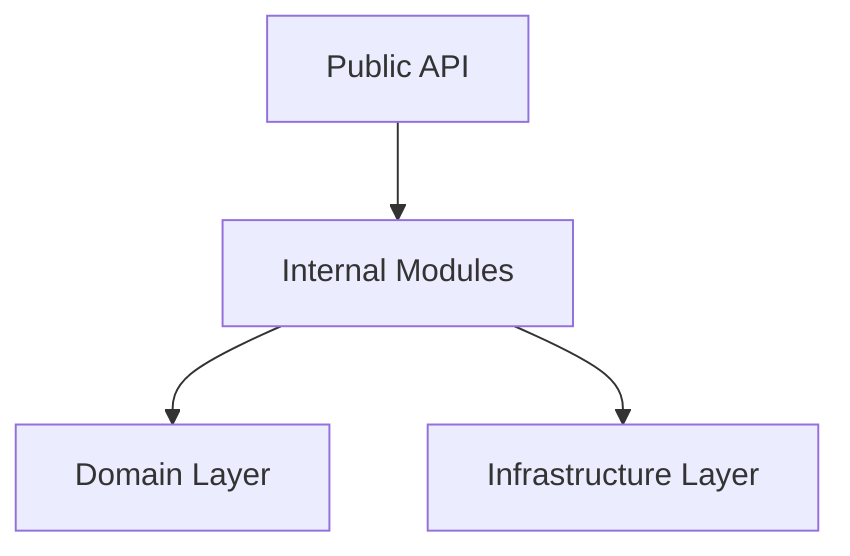

# Composition Layer Internal Modules

*Status: Active | Class: internal | Last Updated: 2026-04-24*

## Overview

This document describes the internal implementation modules within the composition layer that are not part of the primary published API surface.

## Internal Modules

### `_pipeline_execution`

**Purpose**: Execution owner behind canonical first-party `entrypoints`; `execution_api` is an external logic-free lazy re-export shim.

**Key Responsibilities**:

- Pipeline execution orchestration
- Runner lifecycle management
- Execution context setup

**Public Counterparts**:

- `composition.entrypoints` (first-party runtime)
- `composition.execution_api` (external compatibility)

### `_resource_management`

**Purpose**: Internal implementation module behind the public `entrypoints` and `resources_api` modules.

**Key Responsibilities**:

- Resource lifecycle management
- Checkpoint handling
- Quarantine operations

**Public Counterparts**:

- `composition.entrypoints`
- `composition.resources_api`

### `_services`

**Purpose**: Internal implementation module behind service-oriented composition owner APIs.

**Key Responsibilities**:

- Service discovery and registration
- Dependency injection
- Service lifecycle management

**Public Counterparts**:

- `composition.entrypoints` (first-party runtime)
- `composition.health_service_access` (first-party health owner seam)
- `composition.health_api` (external compatibility)
- `composition.maintenance_api` (external compatibility)
- `composition.observability_runtime`

## Implementation Patterns

### Module Organization

```
composition/
├── entrypoints/              # Public execution-focused seam
├── execution_api/           # Narrow execution-focused public API
├── resources_api/           # Narrow resource-management public API
├── _pipeline_execution/     # Internal implementation
├── _resource_management/    # Internal implementation
└── _services/               # Internal implementation
```

### Dependency Flow



## Usage Guidelines

1. **Import Paths**: First-party runtime code resolves `entrypoints` or a reviewed owner seam. External integrations may retain `execution_api`, `health_api`, and `maintenance_api` imports.
1. **Stability**: Internal modules may change without notice.
1. **Testing**: Internal modules should only be imported by tests within the `composition` package.

## Related Documentation

- [Composition Layer API Reference](../api/composition.md)
- [Composition Layer Architecture](../../02-architecture/05-composition-layer.md)
- [Internal/Extended Index](index.md)
