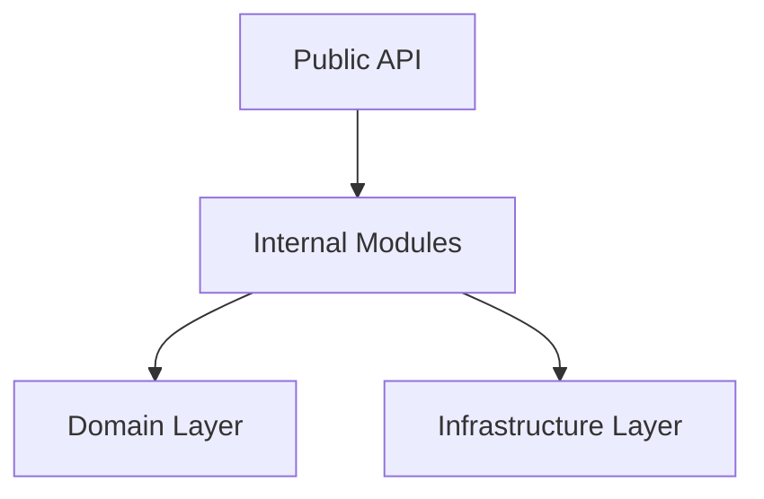

# Composition Layer Internal Modules

*Status: Active | Class: internal | Last Updated: 2026-04-24*

## Overview

This document describes the internal implementation modules within the composition layer that are not part of the primary published API surface.

## Internal Modules

### `_pipeline_execution`

**Purpose**: Internal implementation module behind the public `entrypoints` and `execution_api` modules.

**Key Responsibilities**:
- Pipeline execution orchestration
- Runner lifecycle management
- Execution context setup

**Public Counterparts**:
- `composition.entrypoints`
- `composition.execution_api`

### `_resource_management`

**Purpose**: Internal implementation module behind the public `entrypoints` and `resources_api` modules.

**Key Responsibilities**:
- Resource lifecycle management
- Checkpoint handling
- Quarantine operations

**Public Counterparts**:
- `composition.entrypoints`
- `composition.resources_api`

### `_services`

**Purpose**: Internal implementation module behind the public `entrypoints` and `services_api` modules.

**Key Responsibilities**:
- Service discovery and registration
- Dependency injection
- Service lifecycle management

**Public Counterparts**:
- `composition.entrypoints`
- `composition.services_api`

## Implementation Patterns

### Module Organization

```
composition/
├── entrypoints/              # Public execution-focused seam
├── execution_api/           # Narrow execution-focused public API
├── services_api/            # Narrow services-focused public API
├── resources_api/           # Narrow resource-management public API
├── _pipeline_execution/     # Internal implementation
├── _resource_management/    # Internal implementation
└── _services/               # Internal implementation
```

### Dependency Flow



## Usage Guidelines

1. **Import Paths**: Always import from public modules (`entrypoints`, `execution_api`, etc.) rather than internal modules.
2. **Stability**: Internal modules may change without notice.
3. **Testing**: Internal modules should only be imported by tests within the `composition` package.

## Related Documentation

- [Composition Layer API Reference](../api/composition.md)
- [Composition Layer Architecture](../../02-architecture/05-composition-layer.md)
- [Internal/Extended Index](index.md)
