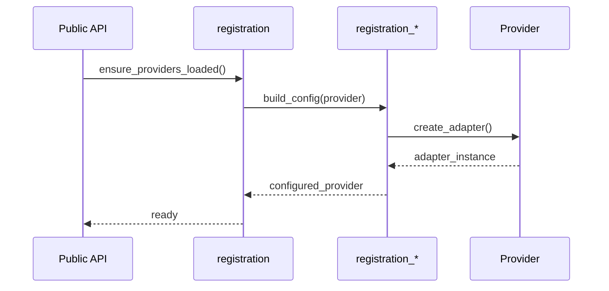

# Provider Registration Internals

*Status: Active | Class: internal | Last Updated: 2026-04-24*

## Overview

This document describes the internal provider registration mechanisms and config builders that are not part of the primary published API surface.

## Internal Registration Modules

### `registration_*` Modules

**Purpose**: Internal provider config builders that handle the detailed configuration and setup of individual providers.

**Key Modules**:

- `registration_chembl`
- `registration_crossref`
- `registration_openalex`
- `registration_pubchem`
- `registration_pubmed`
- `registration_uniprot`

**Public Counterpart**:

- `composition.providers.registration` (public orchestration layer)

### Registration Flow



## Implementation Details

### Config Builder Pattern

Each `registration_*` module follows a consistent pattern:

```python
# Internal config builder (not public API)
def build_chembl_config(raw_config: dict) -> ChemblProviderConfig:
    """Internal: Build Chembl provider configuration from raw YAML."""
    # Validation, defaults, provider-specific logic
    return ChemblProviderConfig(...)
```

### Provider Registration Context

```python
class ProviderRegistrationContext:
    """Internal: Context for provider registration operations."""

    def __init__(self, registry: ProviderRegistry):
        self.registry = registry
        self.configured_providers = set()

    def register_provider(self, provider_name: str, config: dict):
        """Internal: Register a single provider."""
        # Internal registration logic
        ...
```

## Usage Guidelines

1. **Access Pattern**: Always use the public `composition.providers.registration` module rather than importing `registration_*` modules directly.
1. **Configuration**: Provider configuration should be done through the public API, not by manipulating internal builders.
1. **Extensibility**: To add new providers, extend the public registration system rather than modifying internal builders.

## Related Documentation

- [Provider Registration API Reference](../api/composition.md#providers)
- [Adding New Providers](../../03-guides/add-new-source.md)
- [Internal/Extended Index](index.md)
