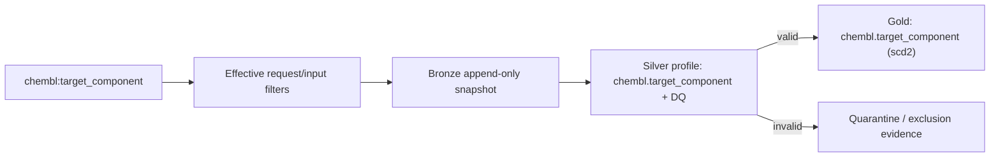

# `chembl_target_component`

> Generated documentation projection. Do not edit manually.

## Обзор

| Параметр | Значение |
| --- | --- |
| Typed identity `[type:provider_entity]` | `pipeline:chembl_target_component` |
| Status | `active` |
| Gold contract | `chembl.target_component v1.0.0` |

## Назначение и обработка данных

ChEMBL Target Components (protein sequences, etc.). Источник — `chembl:target_component` на `https://www.ebi.ac.uk/chembl/api/data`; применяемые extraction/input filters: component_id=IDs from data/input/target_component.csv column component_id; CLI may override the input CSV.
В business-проекцию входят `component_id`, `accession`, `component_type`, `description`, `organism`, `taxonomy_id`, `target_component_synonyms`, `target_component_xrefs` и ещё 3 полей.
Silver использует профиль `chembl.target_component` и проверяет обязательные поля `component_id`, `organism`; невалидные записи направляются в `quarantine`.
Перед Gold применяется строгий Pandera-контракт `chembl.target_component`; Gold filters/constraints заданы в entity config (6 групп правил).

## Извлечение данных

| Аспект | Значение |
| --- | --- |
| Source | `http_api` · `chembl:target_component` |
| Method / endpoint | `GET` · `https://www.ebi.ac.uk/chembl/api/data/target_component` |
| Resource / tables | `target_component` |
| Filters | `component_id`: IDs from data/input/target_component.csv column component_id; CLI may override the input CSV |
| Selected fields | `system` (7 fields); `business` (11 fields) |

## Silver и Data Quality

- Normalization profile: `chembl.target_component`.
- Partitioning: `organism`.
- DQ thresholds: soft `0.05`, hard `0.5`; invalid policy `quarantine`.

## Gold

- Contract: `chembl.target_component v1.0.0`; strict validation: `True`.
- Write mode: `scd2`.
- SCD2: current_flag_col=_is_current; valid_from_col=_valid_from; valid_to_col=_valid_to; version_col=_version.
- Technical exclusions: `_dq_*`, `_source_batch_id`, `_index`.

## Операторские команды

| Задача | Команда | Результат |
| --- | --- | --- |
| Запуск | `bioetl run --pipeline chembl_target_component` | Запускает pipeline с effective config. |
| Ограниченный запуск | `bioetl run --pipeline chembl_target_component --limit 100` | Ограничивает число обрабатываемых записей. |
| Безопасная проверка | `bioetl run --pipeline chembl_target_component --run-type backfill --dry-run` | Проверяет backfill/rebuild path без записи. |
| Quarantine | `bioetl quarantine inspect --pipeline chembl_target_component --limit 100` | Показывает quarantined и Silver-filter records; доступны --error-code и --run-id. |
| Статистика исключений | `bioetl quarantine stats --pipeline chembl_target_component --group-by reason-code` | Группирует исключения; Gold/cross-validation причины видны только если runtime их публикует. |
| Checkpoint | `bioetl checkpoint inspect --pipeline chembl_target_component` | Показывает checkpoint и связанные audit/manifest anchors. |
| Manifest | `bioetl run-manifest show <run-id-or-manifest-id>` | Показывает immutable manifest и ledger evidence запуска. |

## Диаграммы

### Data Flow

## Evidence

- `effective_entity_config`: `configs/entities/chembl/target_component.yaml`
- `pipeline_registration`: `src/bioetl/composition/factories/pipeline/registry_manifest.py`
- `run_cli`: `src/bioetl/interfaces/cli/commands/domains/run/command_entrypoint.py`
- `quarantine_cli`: `src/bioetl/interfaces/cli/commands/quarantine.py`
- `gold_validation_contract`: `docs/02-architecture/decisions/ADR-018-gold-strict-validation.md`
- `observability_contract`: `src/bioetl/domain/_observability_contract_primitives.py`
- `dq_contract`: `configs/contracts/chembl/target_component.yaml`
- `provider_config`: `configs/providers/chembl.yaml`
