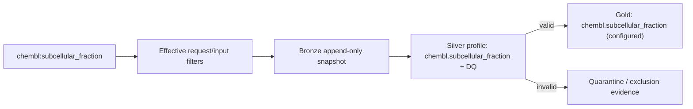

# `chembl_subcellular_fraction`

> Generated documentation projection. Do not edit manually.

## Обзор

| Параметр | Значение |
| --- | --- |
| Typed identity `[type:provider_entity]` | `pipeline:chembl_subcellular_fraction` |
| Status | `active` |
| Gold contract | `chembl.subcellular_fraction v1.0.0` |

## Назначение и обработка данных

Extract unique subcellular fractions from ChEMBL Assay records. Источник — `chembl:subcellular_fraction` на `https://www.ebi.ac.uk/chembl/api/data`; применяемые extraction/input filters: subcellular_fraction=IDs from data/input/subcellular_fraction.csv column subcellular_fraction; CLI may override the input CSV.
В business-проекцию входят `subcellular_fraction_raw`, `subcellular_fraction`, `assay_count`, `example_assay_id`.
Silver использует профиль `chembl.subcellular_fraction` и проверяет обязательные поля `subcellular_fraction`; невалидные записи направляются в `quarantine`.
Перед Gold применяется строгий Pandera-контракт `chembl.subcellular_fraction`; Gold filters/constraints заданы в entity config (6 групп правил).

## Извлечение данных

| Аспект | Значение |
| --- | --- |
| Source | `derived` · `chembl:subcellular_fraction` |
| Resource / tables | `subcellular_fraction` |
| Filters | `subcellular_fraction`: IDs from data/input/subcellular_fraction.csv column subcellular_fraction; CLI may override the input CSV |
| Selected fields | `system` (7 fields); `business` (4 fields) |

## Silver и Data Quality

- Normalization profile: `chembl.subcellular_fraction`.
- Partitioning: —.
- DQ thresholds: soft `0.05`, hard `0.5`; invalid policy `quarantine`.

## Gold

- Contract: `chembl.subcellular_fraction v1.0.0`; strict validation: `True`.
- Write mode: `configured`.
- Technical exclusions: `_dq_*`, `_source_batch_id`, `_index`.

## Операторские команды

| Задача | Команда | Результат |
| --- | --- | --- |
| Запуск | `bioetl run --pipeline chembl_subcellular_fraction` | Запускает pipeline с effective config. |
| Ограниченный запуск | `bioetl run --pipeline chembl_subcellular_fraction --limit 100` | Ограничивает число обрабатываемых записей. |
| Безопасная проверка | `bioetl run --pipeline chembl_subcellular_fraction --run-type backfill --dry-run` | Проверяет backfill/rebuild path без записи. |
| Quarantine | `bioetl quarantine inspect --pipeline chembl_subcellular_fraction --limit 100` | Показывает quarantined и Silver-filter records; доступны --error-code и --run-id. |
| Статистика исключений | `bioetl quarantine stats --pipeline chembl_subcellular_fraction --group-by reason-code` | Группирует исключения; Gold/cross-validation причины видны только если runtime их публикует. |
| Checkpoint | `bioetl checkpoint inspect --pipeline chembl_subcellular_fraction` | Показывает checkpoint и связанные audit/manifest anchors. |
| Manifest | `bioetl run-manifest show <run-id-or-manifest-id>` | Показывает immutable manifest и ledger evidence запуска. |

## Диаграммы

### Data Flow

## Evidence

- `effective_entity_config`: `configs/entities/chembl/subcellular_fraction.yaml`
- `pipeline_registration`: `src/bioetl/composition/factories/pipeline/registry_manifest.py`
- `run_cli`: `src/bioetl/interfaces/cli/commands/domains/run/command_entrypoint.py`
- `quarantine_cli`: `src/bioetl/interfaces/cli/commands/quarantine.py`
- `gold_validation_contract`: `docs/02-architecture/decisions/ADR-018-gold-strict-validation.md`
- `observability_contract`: `src/bioetl/domain/_observability_contract_primitives.py`
- `dq_contract`: `configs/contracts/chembl/subcellular_fraction.yaml`
- `provider_config`: `configs/providers/chembl.yaml`
