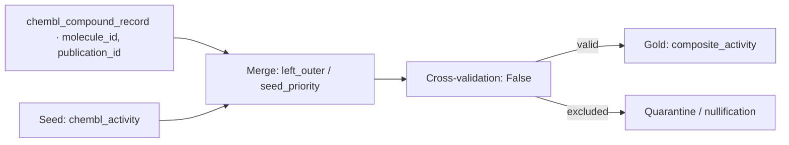

# `composite_activity`

> Generated documentation projection. Do not edit manually.

## Обзор

| Параметр | Значение |
| --- | --- |
| Typed identity `[type:composite]` | `composite:composite_activity` |
| Status | `active` |
| Gold contract | `composite.activity v1.0.0` |

## Назначение и обработка данных

Composite pipeline `composite_activity` использует seed `chembl_activity` и объединяет его с configured dependencies/enrichers.
Join keys, cardinality и source tables берутся из composite configuration; merge и conflict resolution выполняются общей CompositePipelineRunner.
После merge применяется configured cross-validation; исключённые значения направляются в quarantine или nullification branch согласно composite policy.
Результат проходит строгий Gold-контракт `composite.activity` и публикует manifest/checkpoint evidence.

## Извлечение данных

| Аспект | Значение |
| --- | --- |
| Source | `composite` · `chembl_activity` |
| Method / endpoint | — · — |
| Resource / tables | `silver/chembl/activity`, `silver/chembl/compound_record` |
| Filters | `chembl_compound_record`: no condition |

## Silver и Data Quality

- Normalization profile: `composite.activity`.
- Partitioning: —.
- DQ thresholds: soft `0.1`, hard `0.5`; invalid policy `quarantine`.

## Gold

- Contract: `composite.activity v1.0.0`; strict validation: `True`.
- Write mode: `configured`.

## Операторские команды

| Задача | Команда | Результат |
| --- | --- | --- |
| Запуск | `bioetl run-composite --composite activity` | Запускает pipeline с effective config. |
| Ограниченный запуск | `bioetl run-composite --composite activity --seed-limit 100` | Ограничивает число обрабатываемых записей. |
| Безопасная проверка | `bioetl run-composite --composite activity --use-cached-bronze --dry-run` | Проверяет cached Bronze composite без записи. |
| Quarantine | `bioetl quarantine inspect --pipeline composite_activity --limit 100` | Показывает quarantined и Silver-filter records; доступны --error-code и --run-id. |
| Статистика исключений | `bioetl quarantine stats --pipeline composite_activity --group-by reason-code` | Группирует исключения; Gold/cross-validation причины видны только если runtime их публикует. |
| Checkpoint | `bioetl checkpoint inspect --pipeline composite_activity` | Показывает checkpoint и связанные audit/manifest anchors. |
| Manifest | `bioetl run-manifest show <run-id-or-manifest-id>` | Показывает immutable manifest и ledger evidence запуска. |

## Диаграммы

### Composite Flow

## Owner-approved context

Preserve ChEMBL activity rows while enriching them with source-backed compound-record context.

## Evidence

- `composite_config`: `configs/composites/activity.yaml`
- `effective_entity_config`: `configs/entities/composite/activity.yaml`
- `gold_contract`: `configs/contracts/composite/activity.yaml`
- `composite_cli`: `src/bioetl/interfaces/cli/commands/run_composite.py`
- `quarantine_cli`: `src/bioetl/interfaces/cli/commands/quarantine.py`
