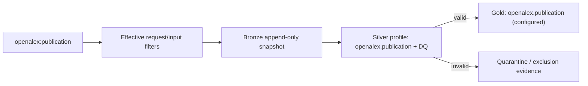

# `openalex_publication`

> Generated documentation projection. Do not edit manually.

## Обзор

| Параметр | Значение |
| --- | --- |
| Typed identity `[type:provider_entity]` | `pipeline:openalex_publication` |
| Status | `active` |
| Gold contract | `openalex.publication v1.0.0` |

## Назначение и обработка данных

Batch DOI resolution via OpenAlex with title fallback. Источник — `openalex:publication` на `https://api.openalex.org`; применяемые extraction/input filters: doi=IDs from data/input/dois.csv column doi; CLI may override the input CSV.
В business-проекцию входят .
Silver использует профиль `openalex.publication` и проверяет обязательные поля `openalex_id`, `title`; невалидные записи направляются в `quarantine`.
Перед Gold применяется строгий Pandera-контракт `openalex.publication`; Gold filters/constraints заданы в entity config (6 групп правил).

## Извлечение данных

| Аспект | Значение |
| --- | --- |
| Source | `http_api` · `openalex:publication` |
| Resource / tables | `publication` |
| Filters | `doi`: IDs from data/input/dois.csv column doi; CLI may override the input CSV |
| Selected fields | `system` (10 fields); `identifiers` (4 fields); `title` (1 fields); `abstract` (1 fields); `authors` (3 fields); `affiliations` (1 fields); `institutions` (3 fields); `journal` (3 fields); `year` (1 fields); `dates` (1 fields); `pagination` (4 fields); `citations` (3 fields); `open_access` (2 fields); `subjects` (6 fields); `publisher` (1 fields); `funding` (3 fields); `doc_type` (5 fields); `quality` (1 fields); `language` (1 fields) |

## Silver и Data Quality

- Normalization profile: `openalex.publication`.
- Partitioning: —.
- DQ thresholds: soft `0.05`, hard `0.5`; invalid policy `quarantine`.

## Gold

- Contract: `openalex.publication v1.0.0`; strict validation: `True`.
- Write mode: `configured`.
- Technical exclusions: `_dq_*`, `_source_batch_id`, `_index`, `_lookup_method`, `_original_id`.

## Операторские команды

| Задача | Команда | Результат |
| --- | --- | --- |
| Запуск | `bioetl run --pipeline openalex_publication` | Запускает pipeline с effective config. |
| Ограниченный запуск | `bioetl run --pipeline openalex_publication --limit 100` | Ограничивает число обрабатываемых записей. |
| Безопасная проверка | `bioetl run --pipeline openalex_publication --run-type backfill --dry-run` | Проверяет backfill/rebuild path без записи. |
| Quarantine | `bioetl quarantine inspect --pipeline openalex_publication --limit 100` | Показывает quarantined и Silver-filter records; доступны --error-code и --run-id. |
| Статистика исключений | `bioetl quarantine stats --pipeline openalex_publication --group-by reason-code` | Группирует исключения; Gold/cross-validation причины видны только если runtime их публикует. |
| Checkpoint | `bioetl checkpoint inspect --pipeline openalex_publication` | Показывает checkpoint и связанные audit/manifest anchors. |
| Manifest | `bioetl run-manifest show <run-id-or-manifest-id>` | Показывает immutable manifest и ledger evidence запуска. |

## Диаграммы

### Data Flow

## Evidence

- `effective_entity_config`: `configs/entities/openalex/publication.yaml`
- `pipeline_registration`: `src/bioetl/composition/factories/pipeline/registry_manifest.py`
- `run_cli`: `src/bioetl/interfaces/cli/commands/domains/run/command_entrypoint.py`
- `quarantine_cli`: `src/bioetl/interfaces/cli/commands/quarantine.py`
- `gold_validation_contract`: `docs/02-architecture/decisions/ADR-018-gold-strict-validation.md`
- `observability_contract`: `src/bioetl/domain/_observability_contract_primitives.py`
- `dq_contract`: `configs/contracts/openalex/publication.yaml`
- `provider_config`: `configs/providers/openalex.yaml`
