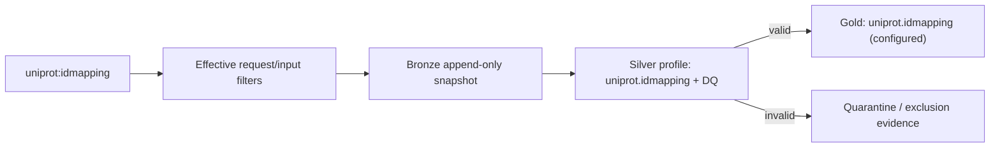

# `uniprot_idmapping`

> Generated documentation projection. Do not edit manually.

## Обзор

| Параметр | Значение |
| --- | --- |
| Typed identity `[type:provider_entity]` | `pipeline:uniprot_idmapping` |
| Status | `active` |
| Gold contract | `uniprot.idmapping v1.0.0` |
| Aliases | `data-source:uniprot_idmapping` |

## Назначение и обработка данных

Maps ChEMBL target IDs to UniProt accessions via UniProt ID Mapping API. Источник — `uniprot:idmapping` на `https://rest.uniprot.org`; применяемые extraction/input filters: target_id=IDs from data/input/target.csv column target_chembl_id; CLI may override the input CSV.
В business-проекцию входят `target_id`, `uniprot_accession`, `mapping_status`, `uniprot_entry_name`, `organism_scientific`, `organism_common`, `taxonomy_id`, `protein_name` и ещё 6 полей.
Silver использует профиль `uniprot.idmapping` и проверяет обязательные поля `target_id`, `mapping_status`; невалидные записи направляются в `quarantine`.
Перед Gold применяется строгий Pandera-контракт `uniprot.idmapping`; Gold filters/constraints заданы в entity config (6 групп правил).

## Извлечение данных

| Аспект | Значение |
| --- | --- |
| Source | `http_api` · `uniprot:idmapping` |
| Resource / tables | `idmapping` |
| Filters | `target_id`: IDs from data/input/target.csv column target_chembl_id; CLI may override the input CSV |
| Selected fields | `system` (7 fields); `business` (14 fields) |

## Silver и Data Quality

- Normalization profile: `uniprot.idmapping`.
- Partitioning: —.
- DQ thresholds: soft `0.05`, hard `0.5`; invalid policy `quarantine`.

## Gold

- Contract: `uniprot.idmapping v1.0.0`; strict validation: `True`.
- Write mode: `configured`.
- Technical exclusions: `_dq_*`, `_source_batch_id`, `_index`.

## Операторские команды

| Задача | Команда | Результат |
| --- | --- | --- |
| Запуск | `bioetl run --pipeline uniprot_idmapping` | Запускает pipeline с effective config. |
| Ограниченный запуск | `bioetl run --pipeline uniprot_idmapping --limit 100` | Ограничивает число обрабатываемых записей. |
| Безопасная проверка | `bioetl run --pipeline uniprot_idmapping --run-type backfill --dry-run` | Проверяет backfill/rebuild path без записи. |
| Quarantine | `bioetl quarantine inspect --pipeline uniprot_idmapping --limit 100` | Показывает quarantined и Silver-filter records; доступны --error-code и --run-id. |
| Статистика исключений | `bioetl quarantine stats --pipeline uniprot_idmapping --group-by reason-code` | Группирует исключения; Gold/cross-validation причины видны только если runtime их публикует. |
| Checkpoint | `bioetl checkpoint inspect --pipeline uniprot_idmapping` | Показывает checkpoint и связанные audit/manifest anchors. |
| Manifest | `bioetl run-manifest show <run-id-or-manifest-id>` | Показывает immutable manifest и ledger evidence запуска. |

## Диаграммы

### Data Flow

## Evidence

- `effective_entity_config`: `configs/entities/uniprot/idmapping.yaml`
- `pipeline_registration`: `src/bioetl/composition/factories/pipeline/registry_manifest.py`
- `run_cli`: `src/bioetl/interfaces/cli/commands/domains/run/command_entrypoint.py`
- `quarantine_cli`: `src/bioetl/interfaces/cli/commands/quarantine.py`
- `gold_validation_contract`: `docs/02-architecture/decisions/ADR-018-gold-strict-validation.md`
- `observability_contract`: `src/bioetl/domain/_observability_contract_primitives.py`
- `dq_contract`: `configs/contracts/uniprot/idmapping.yaml`
- `provider_config`: `configs/providers/uniprot.yaml`
