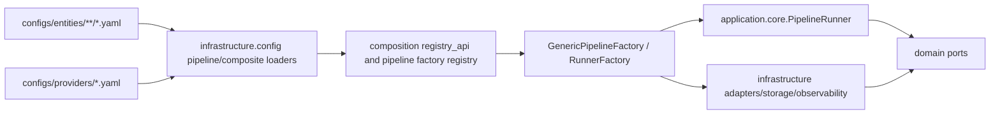

______________________________________________________________________

Version: 1.0.0
Status: active
Class: published
Owner: BioETL Team
Reviewers:

- BioETL Team
  Last verified: '2026-06-03'

______________________________________________________________________

# Pipeline Catalog

Current source of truth:

- Entity pipeline configs: `configs/entities/**/*.yaml`
- Composite merge configs: `configs/composites/*.yaml`
- Provider configs: `configs/providers/*.yaml`
- Config loaders: `src/bioetl/infrastructure/config/pipeline_config_api.py`,
  `src/bioetl/infrastructure/config/composite_config_api.py`
- Composition factories: `src/bioetl/composition/factories/`

## Summary

| Family | Count | Files | Notes |
| --- | ---: | --- | --- |
| Provider entity pipelines | 22 | `configs/entities/{provider}/{entity}.yaml` | ChEMBL 15, UniProt 2, plus CrossRef/OpenAlex/PubChem/PubMed/Semantic Scholar. |
| Composite entity pipelines | 5 | `configs/entities/composite/*.yaml` | Entity-level pipeline contracts for composite activity, assay, molecule, publication, target. |
| Composite merge configs | 5 | `configs/composites/*.yaml` | ADR-026 seed/enrich/merge behavior. |
| Provider settings | 7 | `configs/providers/*.yaml` | Provider API/rate-limit/fallback settings. |

## Entity Pipeline Catalog

| Pipeline | Config | Provider | Entity | Description | Gold enabled |
| --- | --- | --- | --- | --- | --- |
| `chembl_activity` | `configs/entities/chembl/activity.yaml` | ChEMBL | activity | Extract biological activity records from ChEMBL API. | yes |
| `chembl_assay` | `configs/entities/chembl/assay.yaml` | ChEMBL | assay | Extract bioassay definitions from ChEMBL API. | yes |
| `chembl_assay_parameters` | `configs/entities/chembl/assay_parameters.yaml` | ChEMBL | assay_parameters | Extract experimental assay parameters from ChEMBL API. | config-dependent |
| `chembl_cell_line` | `configs/entities/chembl/cell_line.yaml` | ChEMBL | cell_line | Extract cell lines from ChEMBL API. | config-dependent |
| `chembl_compound_record` | `configs/entities/chembl/compound_record.yaml` | ChEMBL | compound_record | Extract compound records from ChEMBL API. | config-dependent |
| `chembl_molecule` | `configs/entities/chembl/molecule.yaml` | ChEMBL | molecule | Extract molecules/compounds from ChEMBL API. | config-dependent |
| `chembl_protein_class` | `configs/entities/chembl/protein_class.yaml` | ChEMBL | protein_class | ChEMBL protein classification hierarchy. | config-dependent |
| `chembl_publication` | `configs/entities/chembl/publication.yaml` | ChEMBL | publication | Extract scientific publications from ChEMBL API. | yes |
| `chembl_publication_similarity` | `configs/entities/chembl/publication_similarity.yaml` | ChEMBL | publication_similarity | Extract publication similarity data from ChEMBL API. | config-dependent |
| `chembl_publication_term` | `configs/entities/chembl/publication_term.yaml` | ChEMBL | publication_term | Extract publication terms from ChEMBL publication records. | config-dependent |
| `chembl_subcellular_fraction` | `configs/entities/chembl/subcellular_fraction.yaml` | ChEMBL | subcellular_fraction | Extract unique subcellular fractions from ChEMBL assay records. | config-dependent |
| `chembl_target` | `configs/entities/chembl/target.yaml` | ChEMBL | target | Extract biological targets from ChEMBL API. | yes |
| `chembl_target_component` | `configs/entities/chembl/target_component.yaml` | ChEMBL | target_component | Extract target components and protein sequences. | config-dependent |
| `chembl_target_protein_classification` | `configs/entities/chembl/target_protein_classification.yaml` | ChEMBL | target_protein_classification | Derived target-to-protein-classification rows. | config-dependent |
| `chembl_tissue` | `configs/entities/chembl/tissue.yaml` | ChEMBL | tissue | Extract tissues from ChEMBL API. | config-dependent |
| `crossref_publication` | `configs/entities/crossref/publication.yaml` | CrossRef | publication | Enrich publication records with CrossRef metadata via DOI. | config-dependent |
| `openalex_publication` | `configs/entities/openalex/publication.yaml` | OpenAlex | publication | Batch DOI resolution via OpenAlex with title fallback. | config-dependent |
| `pubchem_compound` | `configs/entities/pubchem/compound.yaml` | PubChem | compound | Ingest PubChem compounds. | config-dependent |
| `pubmed_publication` | `configs/entities/pubmed/publication.yaml` | PubMed | publication | Extract publication metadata from PubMed Entrez. | config-dependent |
| `semanticscholar_publication` | `configs/entities/semanticscholar/publication.yaml` | Semantic Scholar | publication | Batch DOI resolution via Semantic Scholar with title fallback. | config-dependent |
| `uniprot_idmapping` | `configs/entities/uniprot/idmapping.yaml` | UniProt | idmapping | Map ChEMBL target IDs to UniProt accessions. | config-dependent |
| `uniprot_protein` | `configs/entities/uniprot/protein.yaml` | UniProt | protein | Ingest UniProt proteins. | config-dependent |
| `composite_activity` | `configs/entities/composite/activity.yaml` | Composite | activity | Composite activity entity merging data from multiple providers. | yes |
| `composite_assay` | `configs/entities/composite/assay.yaml` | Composite | assay | Composite assay entity merging data from multiple providers. | yes |
| `composite_molecule` | `configs/entities/composite/molecule.yaml` | Composite | molecule | Composite molecule entity merging data from multiple providers. | yes |
| `composite_publication` | `configs/entities/composite/publication.yaml` | Composite | publication | Composite publication entity merging data from multiple providers. | yes |
| `composite_target` | `configs/entities/composite/target.yaml` | Composite | target | Composite target entity merging data from multiple providers. | yes |

## Composite Merge Catalog

| Composite | Merge config | Version | Runtime owner | Notes |
| --- | --- | --- | --- | --- |
| `composite_activity` | `configs/composites/activity.yaml` | 1.0.0 | `src/bioetl/application/composite/` | Uses seed, dependencies, enrichers, merge, cross-validation, DQ overrides, execution, lineage. |
| `composite_assay` | `configs/composites/assay.yaml` | 1.0.0 | `src/bioetl/application/composite/` | Uses seed, dependencies, enrichers, merge, cross-validation, DQ overrides, execution, lineage. |
| `composite_molecule` | `configs/composites/molecule.yaml` | 1.0.0 | `src/bioetl/application/composite/` | Uses normalized anchor/join policy plus seed/enrich/merge config. |
| `composite_publication` | `configs/composites/publication.yaml` | 1.1.0 | `src/bioetl/application/composite/` | Combines publication data from ChEMBL, CrossRef, OpenAlex, PubMed, Semantic Scholar. |
| `composite_target` | `configs/composites/target.yaml` | 1.3.0 | `src/bioetl/application/composite/` | Uses normalized anchor and UniProt mapping join boundary policies. |

## Dependency Model

Provider pipelines are configured declaratively and wired through composition:

## Filter Compatibility Status

The pipeline config boundary currently supports a compatibility window for
legacy semantic Silver filters:

| Surface | Evidence | Current behavior |
| --- | --- | --- |
| Entity YAML | `configs/entities/**/*.yaml` | Active `filters.silver_filters` are structural-only; semantic keys were moved to `gold_filters` or dropped as duplicates. |
| Normalization helper | `src/bioetl/infrastructure/config/silver_filter_migration.py` | `normalize_silver_gold_filter_payload()` promotes semantic Silver keys into `gold_filters` and leaves Silver structural-only. |
| Pipeline schema | `src/bioetl/infrastructure/schemas/pipeline_config.py` | `PipelineYamlConfig.promote_semantic_silver_filters()` normalizes entity payloads before validation. |
| Domain projection | `src/bioetl/infrastructure/schemas/pipeline_config_common_schemas.py` | `SilverFiltersConfig.to_domain()` returns structural-only `SilverFilterConfig`. |
| Source profiles | `configs/entities/chembl/*.yaml` | Curated ChEMBL `extraction_params` profiles are explicitly versioned as baseline and are not widened by Silver/Gold cleanup. |

Future source-side widening must update `filters.source_profile` separately and
prove Gold/Silver parity before changing provider extraction params.
