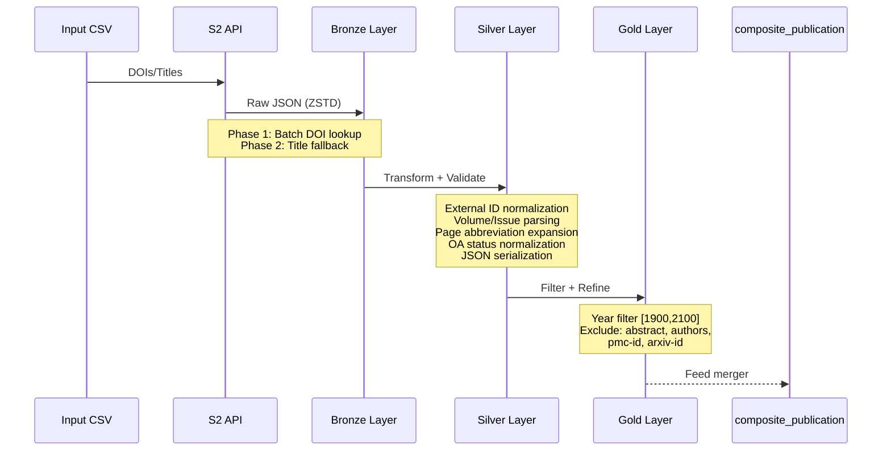
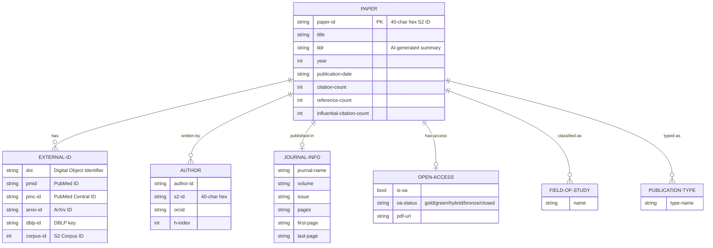

# semanticscholar_publication

> **Status**: Deprecated. This legacy guide is superseded by current pipeline specs in `docs/04-reference/pipelines/` (see `docs/04-reference/pipelines/INDEX.md`).

Semantic Scholar Academic Graph API pipeline for publication metadata enrichment with DOI resolution and title-based fallback.

---

## Overview

The `semanticscholar_publication` pipeline ingests scholarly publication records from the [Semantic Scholar Academic Graph API](https://api.semanticscholar.org/api-docs/graph), transforming them through Bronze (raw JSON), Silver (normalized), and Gold (analytics-ready) layers.

**Key Features:**
- Batch DOI resolution with automatic title-based fallback
- AI-generated summaries (TLDR) extraction
- Rich author metadata (S2 IDs, ORCIDs, h-indices)
- Open Access status tracking with PDF URL preservation
- Page range abbreviation expansion (e.g., "737-9" to "737-739")
- Volume/issue parsing from combined formats
- Influential citation count metrics

**Use Cases:**
- DOI-to-metadata resolution for publication enrichment
- Citation analysis and bibliometric research
- Author disambiguation (via S2 IDs and ORCIDs)
- Open Access monitoring and PDF access
- Research impact assessment (h-index, influential citations)

---

## Pipeline Identity

| Property | Value |
|----------|-------|
| **Pipeline Name** | `semanticscholar_publication` |
| **Version** | 1.2.0 |
| **Provider** | `semanticscholar` |
| **Entity Type** | `publication` |
| **Primary Key** | `paper-id` (40-char hex S2 ID) |
| **Loading Strategy** | `full-scan-only` (ADR-030, ADR-031) |
| **Batch Size** | 50 records |

### Primary Key Format

The `paper-id` is a 40-character hexadecimal string unique to Semantic Scholar:

```
Pattern: ^[a-f0-9]{40}$
Example: 1234567890abcdef1234567890abcdef12345678
```

### Storage Paths

| Layer | Path | Format |
|-------|------|--------|
| Bronze | `data/output/bronze/semanticscholar/publication` | ZSTD-compressed JSONL |
| Silver | `data/output/silver/semanticscholar/publication` | Delta Lake (partitioned by `year`) |
| Gold | `data/output/gold/semanticscholar/publication` | Delta Lake / Parquet |

---

## Source API

### Endpoint

| Property | Value |
|----------|-------|
| **Base URL** | `https://api.semanticscholar.org/graph/v1` |
| **Endpoint** | `/paper/batch` (POST) |
| **Format** | JSON |
| **Authentication** | API Key (optional, increases rate limit) |
| **Rate Limit** | 1 req/sec (with key), lower without |
| **Batch Limit** | 500 papers/request (recommended: 100) |

### Resolution Methods

The pipeline supports multiple identifier resolution strategies:

| Method | Query Pattern | Priority |
|--------|---------------|----------|
| **Direct** | `/paper/{paper-id}` | 1 (highest) |
| **DOI** | `/paper/batch` with `ids=[DOI:...]` | 2 |
| **Title Fallback** | `/paper/search?query={title}` | 3 (lowest) |

When DOI resolution fails, the pipeline automatically falls back to title-based search. The resolution method is tracked in `-lookup-method` for data quality auditing.

### Requested Fields

```
paperId, externalIds, title, abstract, year, publicationDate,
venue, authors, authors.externalIds, authors.hIndex, authors.authorId,
citationCount, referenceCount, influentialCitationCount, isOpenAccess,
openAccessPdf, tldr, fieldsOfStudy, publicationTypes, journal
```

**Note**: `venue` field is used as fallback for `journal.name` and is not stored separately after transformation.

### API Response Structure

```json
{
  "paperId": "1234567890abcdef1234567890abcdef12345678",
  "externalIds": {
    "DOI": "10.1038/nature12373",
    "PubMed": "12345678",
    "ArXiv": "1234.5678",
    "DBLP": "conf/acl/2023#123",
    "CorpusId": 123456789
  },
  "title": "Example Publication Title",
  "tldr": {"model": "tldr@v2.0.0", "text": "This paper presents..."},
  "journal": {"name": "Nature", "volume": "32 4", "pages": "737-9"},
  "venue": "Nature",
  "isOpenAccess": true,
  "openAccessPdf": {"url": "https://...", "status": "GREEN"},
  "citationCount": 150,
  "referenceCount": 45,
  "influentialCitationCount": 25,
  "fieldsOfStudy": ["Biology", "Medicine"],
  "publicationTypes": ["Journal Article"],
  "authors": [
    {
      "authorId": "12345",
      "externalIds": {"ORCID": "0000-0001-2345-6789"},
      "hIndex": 45
    }
  ]
}
```

---

## Silver Output Contract

### Field Mapping

#### System Fields (Prefix)

| Silver Field | Type | Source | Description |
|--------------|------|--------|-------------|
| `entity-id` | string | Computed | UUID hash of business data |
| `content-hash` | string | Computed | SHA-256 of normalized content |
| `-run-id` | string | Context | Pipeline execution ID |
| `-run-type` | string | Context | "incremental" or "full-scan" |
| `-source-batch-id` | string | Adapter | Batch identifier |
| `-source` | string | Fixed | Always "semanticscholar" |
| `-ingestion-ts` | string | Context | ISO 8601 timestamp |
| `-index` | int64 | Processor | Record index within batch |

#### Lookup Metadata

| Silver Field | Type | Source | Values |
|--------------|------|--------|--------|
| `-lookup-method` | string | Adapter | "direct" \| "doi" \| "pmid" \| "title-fallback" \| "unknown" |
| `-original-id` | string | Adapter | Original identifier if fallback used |

#### Primary Identifier

| API Field | Silver Field | Type | Required |
|-----------|--------------|------|----------|
| `paperId` | `paper-id` | string | **YES** |

#### External Identifiers

| API Field | Silver Field | Type | Validation | Notes |
|-----------|--------------|------|------------|-------|
| `externalIds.DOI` | `doi` | string | DOI Value Object | Normalized format |
| `externalIds.PubMed` | `pmid` | string | PubMedId Value Object | Numeric string |
| `externalIds.PubMedCentral` | `pmc-id` | string | - | **Excluded from Gold** |
| `externalIds.ArXiv` | `arxiv-id` | string | - | **Excluded from Gold** |
| `externalIds.DBLP` | `dblp-id` | string | - | **Excluded from Gold** |
| `externalIds.CorpusId` | `corpus-id` | int64 | - | S2 internal ID |

**Value Object Validation:**
- DOI: `DOI.from-raw()` validates format (10.xxxx/...), returns None if invalid
- PMID: `PubMedId.from-raw()` validates numeric format, returns None if invalid

#### Core Metadata

| API Field | Silver Field | Type | Notes |
|-----------|--------------|------|-------|
| `title` | `title` | string | Publication title |
| `tldr.text` | `tldr` | string | AI-generated summary |
| `year` | `year` | int64 | Validated: 1500-2100 |
| `publicationDate` | `publication-date` | string | ISO format (partial OK) |
| `venue` | - | string | Used as fallback for `journal` (not stored separately) |

#### Journal Information

| API Field | Silver Field | Type | Processing |
|-----------|--------------|------|------------|
| `journal.name` or `venue` | `journal` | string | Unified field; `venue` used as fallback if `journal.name` is null |
| `journal.volume` | `volume` | string | Parsed from combined format |
| - | `issue` | string | Parsed from combined format |
| `journal.pages` | `pages` | string | Original value (cleaned) |
| - | `first-page` | string | Parsed with abbreviation expansion |
| - | `last-page` | string | Parsed with abbreviation expansion |

**Volume/Issue Parsing:**
Combined formats like `"32 4"` are parsed into separate fields:
- `"32 4"` → volume="32", issue="4"
- `"32(4)"` → volume="32", issue="4"
- `"Vol. 32, No. 4"` → volume="32", issue="4"

**Page Abbreviation Expansion:**
- `"737-9"` → first-page="737", last-page="739"
- `"737-39"` → first-page="737", last-page="739"
- `"199-3"` → first-page="199", last-page="203" (rollover case)

#### Open Access Fields

| API Field | Silver Field | Type | Values |
|-----------|--------------|------|--------|
| `isOpenAccess` | `is-oa` | bool | true/false/null |
| `openAccessPdf.url` | `open-access-url` | string | PDF URL |
| `openAccessPdf.status` | `oa-status` | string | gold/green/hybrid/bronze/closed |

**OA Status Normalization:**
- Input values normalized to lowercase
- "closed" set only when `is-oa=False` explicitly
- `null` preserved when status unknown (not defaulted to "closed")

#### Metrics

| API Field | Silver Field | Type | Constraint |
|-----------|--------------|------|------------|
| `citationCount` | `citation-count` | int64 | >= 0 |
| `referenceCount` | `reference-count` | int64 | >= 0 |
| `influentialCitationCount` | `influential-citation-count` | int64 | >= 0 |

#### Classification (JSON Serialized)

| API Field | Silver Field | Type | Notes |
|-----------|--------------|------|-------|
| `fieldsOfStudy[]` | `fields-of-study` | string | JSON array (max 10) |
| `publicationTypes[]` | `publication-types` | string | JSON array |

#### Author Fields (JSON Serialized)

| Extraction | Silver Field | Type | Notes |
|------------|--------------|------|-------|
| `authors[].authorId` | `author-ids` | string | JSON array of IDs |
| `authors[].authorId` (40-char) | `author-s2-ids` | string | JSON array of S2 IDs |
| `authors[].externalIds.ORCID` | `author-orcids` | string | JSON array (empty string for missing) |
| `authors[].hIndex` | `author-h-indices` | string | JSON array (null for missing) |

#### Citation Contexts

| API Field | Silver Field | Type | Notes |
|-----------|--------------|------|-------|
| `citations[].contexts[]` | `citation-contexts` | string | JSON array (max 100) |

#### DQ Flags (Suffix)

| Silver Field | Type | Default | Description |
|--------------|------|---------|-------------|
| `-dq-warn` | bool | False | Soft threshold exceeded |
| `-dq-error` | bool | False | Hard threshold exceeded |

---

## Transformations (Silver)

### External IDs Extraction

The API returns external IDs with case-sensitive keys that are normalized:

```python
{
    "DOI": "10.1038/..." → doi
    "PubMed": "12345678" → pmid
    "PubMedCentral": "PMC..." → pmc-id
    "ArXiv": "1234.5678" → arxiv-id
    "DBLP": "conf/..." → dblp-id
    "CorpusId": 123456789 → corpus-id
}
```

DOI and PMID are validated using Value Objects; invalid values become `null`.

### TLDR Extraction

The `tldr` field contains an AI-generated summary from Semantic Scholar's model:

```json
{
  "model": "tldr@v2.0.0",
  "text": "This paper presents a novel method for..."
}
```

Only the `text` field is extracted and stored.

### Journal Name Extraction

The `journal` field is extracted from `journal.name` with `venue` as fallback:

```python
journal-name = journal.get("name") or venue  # Stored in 'journal' field
```

**Note**: After transformation, only the unified `journal` field is stored (no separate `venue` field).

### Volume/Issue Parsing

The `journal.volume` field often contains combined volume and issue:

| Input | Parsed Volume | Parsed Issue |
|-------|---------------|--------------|
| `"32 4"` | "32" | "4" |
| `"32(4)"` | "32" | "4" |
| `"Vol. 32, No. 4"` | "32" | "4" |
| `"32:4"` | "32" | "4" |
| `"32"` | "32" | null |

### Page Range Abbreviation Expansion

Academic publishers commonly abbreviate page ranges. The transformer expands them:

**Algorithm:**
1. Parse first and last page numbers
2. If last page has fewer digits than first page:
   - Calculate expanded value using digit alignment
   - Handle rollover cases (e.g., "199-3" where 3 < 199)
3. Return expanded range

**Examples:**

| Input | First Page | Last Page | Notes |
|-------|------------|-----------|-------|
| `"737-9"` | "737" | "739" | 9 expanded to 739 |
| `"737-39"` | "737" | "739" | 39 expanded to 739 |
| `"737-839"` | "737" | "839" | No expansion needed |
| `"199-3"` | "199" | "203" | Rollover: 3 + 200 = 203 |
| `"S1-S5"` | "S1" | "S5" | Non-numeric preserved |

### Open Access Status Normalization

OA status is normalized to lowercase with special handling for unknown status:

| is-oa | status | Result | Meaning |
|-------|--------|--------|---------|
| true | "GREEN" | `{is-oa: true, oa-status: "green"}` | Confirmed OA |
| false | null | `{is-oa: false, oa-status: "closed"}` | Confirmed closed |
| null | "GOLD" | `{is-oa: null, oa-status: "gold"}` | Unknown, but gold access |
| null | null | `{is-oa: null, oa-status: null}` | Completely unknown |

**Key Design:** `null` is preserved (not defaulted to "closed") to distinguish between "closed" (explicit) and "unknown" (data gap).

### JSON Serialization

Complex fields are serialized as JSON strings for storage:

| Method | Input | Output |
|--------|-------|--------|
| `serialize-json()` | `["A", "B"]` | `'["A", "B"]'` |
| `serialize-json-list()` | `[1, None, 3]` | `'[1, null, 3]'` |

Applied to: `fields-of-study`, `publication-types`, `author-ids`, `author-s2-ids`, `author-orcids`, `author-h-indices`, `citation-contexts`

### Year Validation

Publication year is validated against range 1500-2100:

- Valid years within range are preserved
- Years outside range become `null`
- Rationale: Semantic Scholar includes historical publications

---

## Gold Output Contract

### Schema Definition

**Schema Class:** `SemanticScholarPublicationGoldSchema`

| Field | Type | Nullable | Constraints |
|-------|------|----------|-------------|
| `entity-id` | string | **No** | - |
| `content-hash` | string | **No** | - |
| `paper-id` | string | **No** | Primary key |
| `doi` | string | Yes | - |
| `pmid` | string | Yes | - |
| `corpus-id` | float | Yes | coerce=True |
| `title` | string | Yes | - |
| `tldr` | string | Yes | - |
| `year` | float | Yes | coerce=True |
| `publication-date` | string | Yes | - |
| `journal` | string | Yes | - |
| `volume` | string | Yes | - |
| `issue` | string | Yes | - |
| `pages` | string | Yes | - |
| `first-page` | string | Yes | - |
| `last-page` | string | Yes | - |
| `citation-count` | float | Yes | ge=0, coerce=True |
| `reference-count` | float | Yes | ge=0, coerce=True |
| `is-oa` | bool | Yes | coerce=True |
| `open-access-url` | string | Yes | - |
| `oa-status` | string | Yes | - |
| `fields-of-study` | string | Yes | JSON array |
| `publication-types` | string | Yes | JSON array |
| `-source` | string | Yes | - |
| `-lookup-method` | string | Yes | - |
| `-original-id` | string | Yes | - |
| `-dq-warn` | bool | **No** | default=False |
| `-dq-error` | bool | **No** | default=False |
| `-run-id` | string | **No** | - |
| `-run-type` | string | **No** | - |
| `-source-batch-id` | string | Yes | - |
| `-ingestion-ts` | string | **No** | - |
| `-index` | int | **No** | - |

### Required Fields

- `paper-id` (primary key)
- `title` (required for identification)
- System fields: `entity-id`, `content-hash`, `-run-id`, `-run-type`, `-ingestion-ts`, `-index`
- DQ flags: `-dq-warn`, `-dq-error`

### Year Filter Range

Gold layer applies year constraints:
- **Minimum:** 1900 (historical cutoff)
- **Maximum:** 2100 (future buffer)

### Citation/Reference Constraints

- `citation-count` >= 0
- `reference-count` >= 0

### Int-to-Float Coercion

Fields stored as `float` in Gold (despite `int64` in Silver) for nullable integer support:
- `year`, `citation-count`, `reference-count`, `corpus-id`

---

## Gold Filters and Exclusions

### Fields Excluded from Gold

The following Silver fields are **excluded** from Gold output:

| Field | Reason |
|-------|--------|
| `abstract` | User request |
| `authors` | User request |
| `affiliations` | User request |
| `pmc-id` | User request |
| `arxiv-id` | User request |
| `dblp-id` | Not in Gold schema |
| `author-ids` | Not in Gold schema |
| `author-s2-ids` | Not in Gold schema |
| `author-orcids` | Not in Gold schema |
| `author-h-indices` | Not in Gold schema |
| `citation-contexts` | Not in Gold schema |
| `influential-citation-count` | Not in Gold schema |

### Gold Filter Configuration

| Filter Type | Field | Constraint | Value |
|-------------|-------|-----------|-------|
| **range** | year | min | 1900 |
| **range** | year | max | 2100 |
| **required** | paper-id | present | yes |
| **required** | title | present | yes |

---

## Data Quality Checklist

### Missing External IDs

| Check | Severity | Threshold |
|-------|----------|-----------|
| Missing `paper-id` | Error | 0% |
| Missing `doi` | Warning | 30% |
| Missing `pmid` | Info | 70% |
| Invalid DOI format | Warning | 5% |
| Invalid PMID format | Warning | 5% |

### Open Access Consistency

| Check | Severity | Notes |
|-------|----------|-------|
| `is-oa=true` but no `open-access-url` | Warning | PDF URL expected |
| `is-oa=true` but `oa-status=closed` | Error | Inconsistent data |
| `is-oa=null` (unknown) | Info | Data gap, not error |

### Year Validity

| Check | Severity | Threshold |
|-------|----------|-----------|
| Year outside 1500-2100 | Warning | 1% |
| Year null | Info | 5% |
| Year in future (> current year) | Warning | 0.1% |

### Metrics Validation

| Check | Severity | Notes |
|-------|----------|-------|
| `citation-count` < 0 | Error | Must be non-negative |
| `reference-count` < 0 | Error | Must be non-negative |
| `influential-citation-count` < 0 | Error | Must be non-negative |

### DQ Thresholds

- **Soft Threshold:** 15% (triggers warning)
- **Hard Threshold:** 40% (triggers failure)

---

## Lineage

### Data Flow



### Upstream Sources

| Source | Description |
|--------|-------------|
| Semantic Scholar API | Primary data source |
| DOI resolution | Via `/paper/batch` with DOI IDs |
| Title search | Fallback via `/paper/search` |

### Downstream Consumers

| Consumer | Usage |
|----------|-------|
| `composite_publication` | Silver merge input |
| Analytics dashboards | Gold layer queries |
| DOI enrichment services | Publication metadata lookup |

### Composite Pipeline Integration

The `composite_publication` pipeline uses Semantic Scholar Silver data as an enricher:

```yaml
enrichers:
  - name: semanticscholar_publication
    source: silver/semanticscholar/publication
    join-keys: [doi, pmid]
    priority: 3
```

---

## Examples

### Sample Bronze Record

```json
{
  "paperId": "1234567890abcdef1234567890abcdef12345678",
  "externalIds": {
    "DOI": "10.1038/nature12373",
    "PubMed": "23831764",
    "CorpusId": 4393218
  },
  "title": "Crystal structure of a bacterial homologue",
  "tldr": {
    "model": "tldr@v2.0.0",
    "text": "This paper presents the crystal structure of a membrane protein."
  },
  "journal": {
    "name": "Nature",
    "volume": "500 7462",
    "pages": "102-6"
  },
  "venue": "Nature",
  "year": 2013,
  "publicationDate": "2013-08-01",
  "isOpenAccess": true,
  "openAccessPdf": {
    "url": "https://europepmc.org/articles/pmc3737505?pdf=render",
    "status": "GREEN"
  },
  "citationCount": 856,
  "referenceCount": 45,
  "influentialCitationCount": 89,
  "fieldsOfStudy": ["Biology", "Chemistry"],
  "publicationTypes": ["Journal Article"],
  "authors": [
    {
      "authorId": "3456789",
      "externalIds": {"ORCID": "0000-0001-2345-6789"},
      "hIndex": 52
    }
  ],
  "-lookup-method": "doi",
  "-original-id": "10.1038/nature12373"
}
```

### Sample Silver Record

```json
{
  "entity-id": "uuid-abc123...",
  "content-hash": "sha256:def456...",
  "paper-id": "1234567890abcdef1234567890abcdef12345678",
  "doi": "10.1038/nature12373",
  "pmid": "23831764",
  "corpus-id": 4393218,
  "title": "Crystal structure of a bacterial homologue",
  "tldr": "This paper presents the crystal structure of a membrane protein.",
  "journal": "Nature",
  "volume": "500",
  "issue": "7462",
  "pages": "102-6",
  "first-page": "102",
  "last-page": "106",
  "year": 2013,
  "publication-date": "2013-08-01",
  "is-oa": true,
  "open-access-url": "https://europepmc.org/articles/pmc3737505?pdf=render",
  "oa-status": "green",
  "citation-count": 856,
  "reference-count": 45,
  "influential-citation-count": 89,
  "fields-of-study": "[\"Biology\", \"Chemistry\"]",
  "publication-types": "[\"Journal Article\"]",
  "author-ids": "[\"3456789\"]",
  "author-s2-ids": "[\"3456789\"]",
  "author-orcids": "[\"0000-0001-2345-6789\"]",
  "author-h-indices": "[52]",
  "-source": "semanticscholar",
  "-lookup-method": "doi",
  "-original-id": "10.1038/nature12373",
  "-run-id": "run-123",
  "-dq-warn": false,
  "-dq-error": false
}
```

### Sample Gold Record

```json
{
  "entity-id": "uuid-abc123...",
  "content-hash": "sha256:def456...",
  "paper-id": "1234567890abcdef1234567890abcdef12345678",
  "doi": "10.1038/nature12373",
  "pmid": "23831764",
  "corpus-id": 4393218,
  "title": "Crystal structure of a bacterial homologue",
  "tldr": "This paper presents the crystal structure of a membrane protein.",
  "journal": "Nature",
  "volume": "500",
  "issue": "7462",
  "pages": "102-6",
  "first-page": "102",
  "last-page": "106",
  "year": 2013,
  "publication-date": "2013-08-01",
  "is-oa": true,
  "open-access-url": "https://europepmc.org/articles/pmc3737505?pdf=render",
  "oa-status": "green",
  "citation-count": 856,
  "reference-count": 45,
  "fields-of-study": "[\"Biology\", \"Chemistry\"]",
  "publication-types": "[\"Journal Article\"]",
  "-source": "semanticscholar",
  "-lookup-method": "doi"
}
```

---

## Entity Relationship Diagram



**Note:** Authors, Fields of Study, and Publication Types are stored as JSON arrays in Silver/Gold, not as normalized tables.

---

## Known Limitations / TODO

### Current Limitations

1. **Full Scan Only**: No incremental loading due to API offset pagination instability (ADR-030, ADR-031).

2. **Author Fields Not in Gold**: Author-level data (S2 IDs, ORCIDs, h-indices) excluded from Gold schema.

3. **Citation Contexts Not in Gold**: Context sentences for citation analysis only in Silver.

4. **Title Fallback Accuracy**: Title-based search may return incorrect matches. Use `-lookup-method` to filter.

5. **TLDR Coverage**: Not all papers have AI-generated summaries (newer papers more likely).

6. **Rate Limiting**: Without API key, rate limits are restrictive (100 requests/5 min).

### Schema Gaps

The following fields are created by the transformer but not defined in Silver schema:
- `author-s2-ids`, `author-orcids`, `author-h-indices`
- `citation-contexts`, `dblp-id`, `influential-citation-count`, `issue`

### Future Enhancements

- [ ] Add author fields to Gold schema with flattened structure
- [ ] Add `influential-citation-count` to Gold schema
- [ ] Implement incremental loading when S2 stabilizes cursor pagination
- [ ] Add citation/reference extraction for network analysis
- [ ] Add abstract (currently excluded per user request)

---

## Changelog

| Version | Date | Changes |
|---------|------|---------|
| 1.2.0 | 2026-01 | Added volume/issue parsing, page abbreviation expansion, issue field |
| 1.1.0 | 2025-12 | Added author S2 IDs, ORCIDs, h-indices extraction |
| 1.0.1 | 2025-11 | Fixed OA status to preserve null (not default to closed) |
| 1.0.0 | 2025-10 | Initial release with DOI resolution and title fallback |

---

## References

- [Semantic Scholar API Documentation](https://api.semanticscholar.org/api-docs/graph)
- [S2 Paper Object Schema](https://api.semanticscholar.org/api-docs/graph#tag/Paper-Data/operation/get-graph-get-paper)
- [ADR-030: Publication Pagination Strategy](../../02-architecture/decisions/ADR-030-publication-pagination-strategy.md)
- [ADR-031: Loading Strategy Formalization](../../02-architecture/decisions/ADR-031-loading-strategy-formalization.md)
- [RULES.md: Medallion Architecture](../../00-project/RULES.md#2-поток-данных-и-стратегия-medallion)
