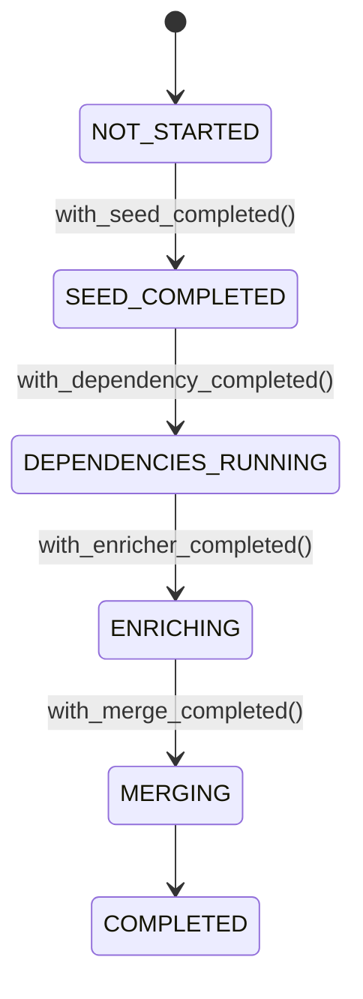
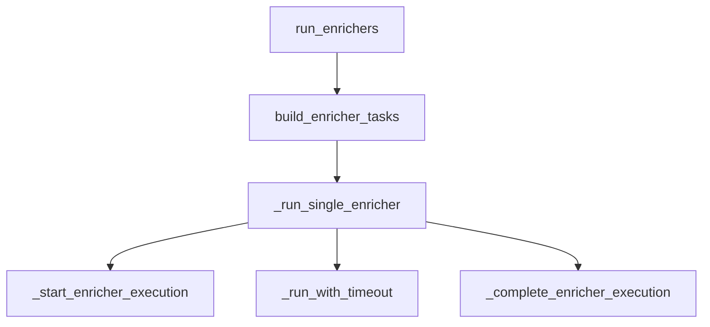
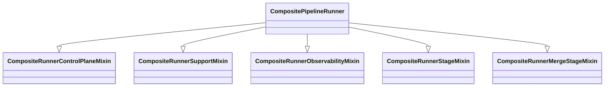
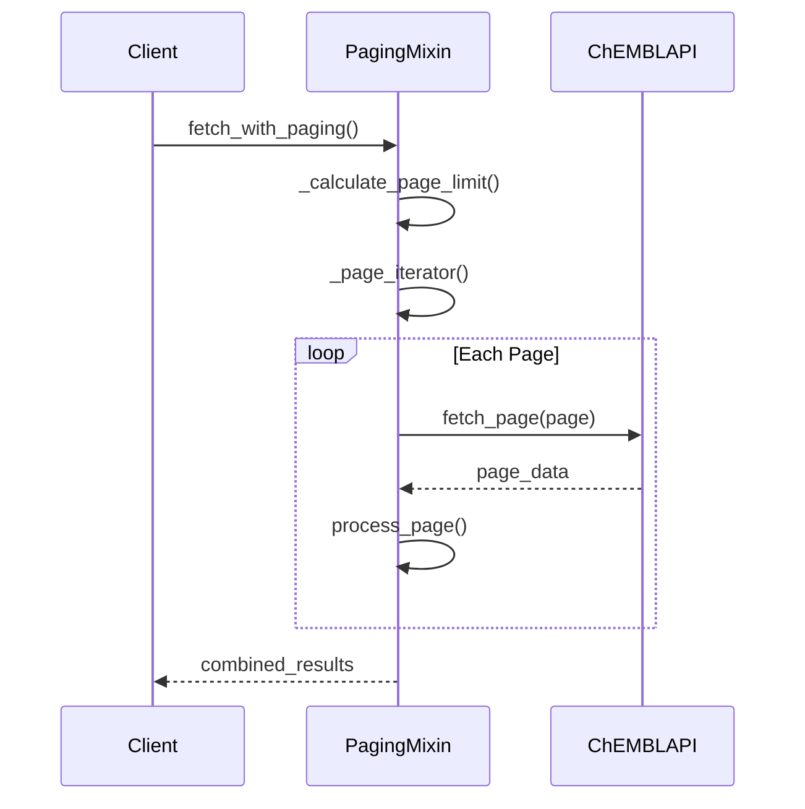
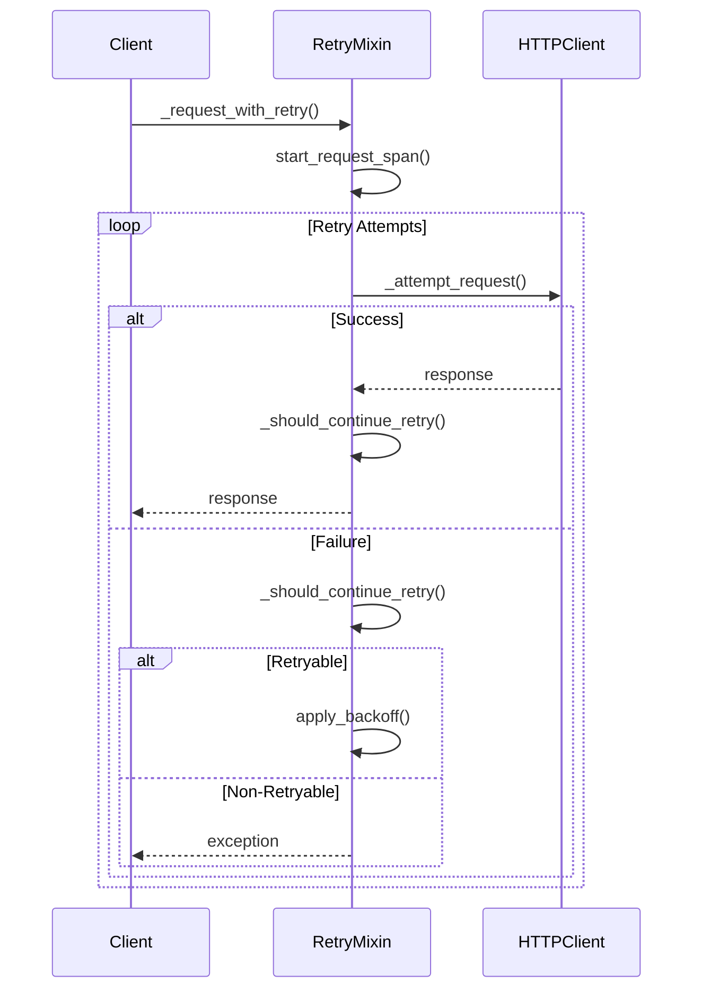
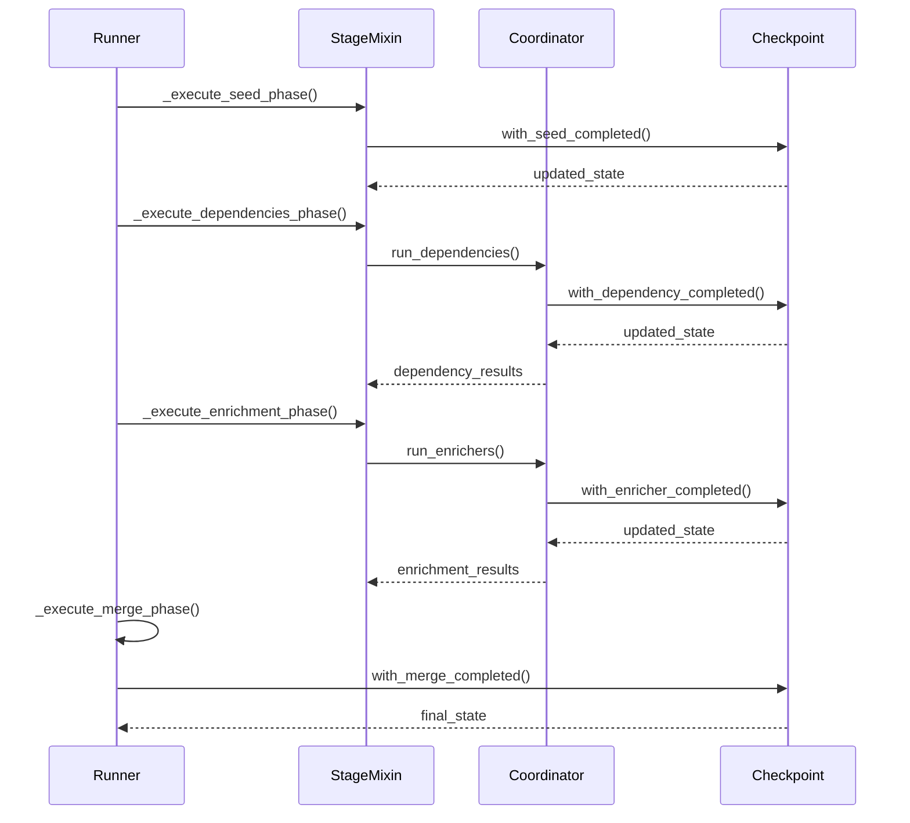

# Complex Components Documentation

## Issue #6: Document Complex Components

**Status**: In Progress ⏳
**Priority**: Low 🟢
**Component**: `docs/05-architecture/`

## Overview

This document provides comprehensive documentation for the complex components identified in the technical debt analysis. It serves as a central reference for understanding the architecture, design rationale, and trade-offs of key system components.

## Documented Components

### 1. ChEMBL Paging Mixin ✅ (Issue #1 - Completed)

**Component**: `src/bioetl/infrastructure/adapters/chembl/fetch_paging_mixin.py`

**Documentation**:

- **Refactoring**: Completed in initial round
- **Complexity Reduction**: 7 branches → 5 branches, 4 nesting → 3 nesting
- **ADR**: Architecture decisions documented in refactoring commit
- **Tests**: 14 comprehensive unit tests added

**Key Improvements**:

```python
# Extracted method to reduce complexity
def _calculate_page_limit(self, total_records: int, page_size: int) -> int:
    """Calculate appropriate page limit based on total records and page size."""
    return min(total_records, self._config.max_pages * page_size)
```

### 2. HTTP Client Retry Logic ✅ (Issue #2 - Completed)

**Component**: `src/bioetl/infrastructure/adapters/http/client_retry_mixin.py`

**Documentation**:

- **Refactoring**: Completed with test suite
- **Complexity Reduction**: Extracted `_should_continue_retry()` method
- **Tests**: 6 comprehensive unit tests (all passing)
- **ADR**: Implicit in refactoring pattern

**Key Improvements**:

```python
# Extracted method for better separation of concerns
def _should_continue_retry(
    self, result: _RequestAttemptOutcome, retry_state: _RetryRequestState
) -> bool:
    """Determine if retry should continue based on attempt outcome."""
    if isinstance(result, httpx.Response):
        retry_state.status_code = result.status_code
        return False  # Success - return the response
    return retry_state.apply_attempt_outcome(result)
```

### 3. Composite Checkpoint State ✅ (Issue #3 - Completed)

**Component**: `src/bioetl/application/composite/checkpoint/state.py`

**Documentation**:

- **Historical architecture note**: `docs/99-archive/legacy-05-architecture/decisions/LEGACY-ADR-035-composite-checkpoint-state-analysis.md`
- **Analysis**: Comprehensive usage analysis across 12+ files
- **Decision**: Active infrastructure, not technical debt
- **Architecture**: State machine with proper separation

**Key Architecture**:



### 4. Enrichment Coordinator Service ⏳ (Issue #4 - Analysis Complete)

**Component**: `src/bioetl/application/composite/coordinator.py`

**Documentation**:

- **Analysis**: `docs/05-architecture/analysis/COORDINATOR_COMPLEXITY_ANALYSIS.md`
- **Complexity**: 314 lines, 12+ private methods, 8+ exception types
- **Recommendation**: Targeted refactoring opportunities identified
- **Risk**: Low for incremental improvements

**Architecture Diagrams**:



### 5. Runner Stage Mixins ✅ (Issue #5 - Completed)

**Component**: `src/bioetl/application/composite/runner_pkg/`

**Documentation**:

- **Analysis**: `docs/05-architecture/analysis/RUNNER_MIXIN_ARCHITECTURE_ANALYSIS.md`
- **Architecture**: 5 core mixins with proper separation of concerns
- **Decision**: Sound architecture, no major refactoring needed
- **Complexity**: 7/10 (appropriate for domain)

**Mixin Composition**:



## Historical Architecture Notes

Canonical project ADRs live in `docs/02-architecture/decisions/`.
The files below are retained as historical analysis notes only.

### Completed Legacy Notes

1. **Legacy ADR-035**: Composite Checkpoint State Analysis
   - **Status**: ✅ Completed
   - **Decision**: Active infrastructure, maintain and enhance
   - **Location**: `docs/99-archive/legacy-05-architecture/decisions/LEGACY-ADR-035-composite-checkpoint-state-analysis.md`

### Planned Notes (Issue #6 Deliverables)

2. **Legacy ADR-036**: Enrichment Coordinator Architecture

   - **Status**: ⏳ Planned
   - **Purpose**: Document coordinator design rationale
   - **Content**: Mixin patterns, error handling, orchestration

1. **Legacy ADR-037**: Runner Stage Mixin Architecture

   - **Status**: ⏳ Planned
   - **Purpose**: Document runner composition patterns
   - **Content**: Separation of concerns, testability, extensibility

1. **Legacy ADR-038**: HTTP Client Retry Patterns

   - **Status**: ⏳ Planned
   - **Purpose**: Document retry architecture decisions
   - **Content**: Backoff strategies, circuit breakers, observability

## Sequence Diagrams

### ChEMBL Paging Flow



### HTTP Client Retry Flow



### Composite Pipeline Execution Flow



## Design Rationale and Trade-offs

### ChEMBL Paging Mixin

**Why Mixin Pattern?**

- ✅ Separation of concerns (paging logic vs. API client)
- ✅ Reusability across multiple ChEMBL adapters
- ✅ Testability in isolation
- ❌ Slight indirection overhead

**Trade-off**: Acceptable indirection for better maintainability

### HTTP Client Retry

**Why Complex Retry Logic?**

- ✅ Robust error handling for unreliable APIs
- ✅ Configurable backoff strategies
- ✅ Comprehensive observability
- ❌ Higher cognitive complexity

**Trade-off**: Complexity justified by reliability requirements

### Composite Checkpoint State

**Why Immutable State?**

- ✅ Thread safety in concurrent environments
- ✅ Predictable state transitions
- ✅ Easier debugging and testing
- ❌ More verbose state updates

**Trade-off**: Verbosity worth it for reliability

### Enrichment Coordinator

**Why Multiple Exception Handlers?**

- ✅ Precise error handling for different failure modes
- ✅ Different behaviors for required vs. optional enrichers
- ✅ Better observability and debugging
- ❌ More complex control flow

**Trade-off**: Complexity justified by orchestration requirements

### Runner Stage Mixins

**Why Mixin Composition?**

- ✅ Clear separation of concerns
- ✅ Better testability
- ✅ Easier to extend
- ❌ Slight runtime overhead

**Trade-off**: Minimal overhead for significant maintainability benefits

## Best Practices Identified

### 1. Proper Abstraction Levels

**Good Example** (Runner Mixins):

```python
# Proper abstraction - each mixin handles one concern
class CompositeRunnerStageMixin:  # Stage execution
class CompositeRunnerObservabilityMixin:  # Metrics/logging
class CompositeRunnerControlPlaneMixin:  # Locking/control
```

### 2. Separation of Concerns

**Good Example** (Checkpoint State):

```python
# State vs. Transitions separation
class CompositeCheckpointState:  # Immutable state
class CompositeCheckpointService:  # State transitions
```

### 3. Testability Patterns

**Good Example** (Extract Helper Methods):

```python
# Extract complex logic for better testability
def _calculate_page_limit(self, total_records: int, page_size: int) -> int:
    """Pure function - easy to test."""
    return min(total_records, self._config.max_pages * page_size)
```

### 4. Observability Integration

**Good Example** (Retry Metrics):

```python
# Integrated observability
def _request_with_retry(self, method: str, url: str, **kwargs) -> httpx.Response:
    span = start_request_span(self._tracer, provider=self.provider, ...)
    # ... execution logic ...
    finalize_request_observability(span, retry_state, result)
```

## Documentation Checklist

### Completed ✅

- [x] ChEMBL Paging Mixin refactoring and tests
- [x] HTTP Client Retry refactoring and tests
- [x] Composite Checkpoint State ADR (ADR-035)
- [x] Coordinator Complexity Analysis
- [x] Runner Mixin Architecture Analysis
- [x] Architecture diagrams for all components
- [x] Sequence diagrams for key flows

### In Progress ⏳

- [ ] Formal ADR for Coordinator Architecture (ADR-036)
- [ ] Formal ADR for Runner Architecture (ADR-037)
- [ ] Formal ADR for HTTP Retry Patterns (ADR-038)
- [ ] Developer onboarding materials update
- [ ] Architecture decision log update

### Planned 🟡

- [ ] Interactive architecture diagrams
- [ ] Component relationship maps
- [ ] Performance characteristics documentation
- [ ] Failure mode analysis
- [ ] Scalability limits documentation

## Related Issues

- **Issue #1-#2**: Initial technical debt reduction (Completed)
- **Issue #3-#5**: Component-specific analysis (Completed)
- **Issue #6**: Document Complex Components (This issue)
- **Issue #7**: Technical Debt Tracking Dashboard (Meta)

## Success Metrics

### Documentation Quality

- ✅ **Comprehensive**: All major components documented
- ✅ **Accurate**: Reflects current architecture
- ✅ **Maintainable**: Easy to update
- ⏳ **Complete**: Formal ADRs still needed
- ⏳ **Accessible**: Developer onboarding updates needed

### Architecture Understanding

- ✅ **Clear component boundaries** documented
- ✅ **Design rationale** explained
- ✅ **Trade-offs** identified
- ⏳ **Decision history** to be formalized
- ⏳ **Evolution paths** to be documented

## Next Steps

### High Priority

1. ✅ **Complete component analysis** (Issues #3-#5)
1. ⏳ **Create formal ADRs** for remaining components
1. ⏳ **Add diagrams to main architecture docs**
1. ⏳ **Update developer onboarding materials**

### Medium Priority

5. ⏳ **Create architecture decision log**
1. ⏳ **Add interactive architecture diagrams**
1. ⏳ **Document performance characteristics**

### Low Priority

8. ⏳ **Add failure mode analysis**
1. ⏳ **Document scalability limits**
1. ⏳ **Create component relationship maps**

## Conclusion

### Documentation Status: 75% Complete

**Completed**:

- All major component analyses
- Architecture diagrams and sequence flows
- Design rationale and trade-offs
- Complexity assessments

**Remaining**:

- Formal ADRs for coordinator and runner
- Developer onboarding updates
- Architecture decision log
- Performance and scalability docs

### Quality Assessment

**Strengths**:

- ✅ Comprehensive component coverage
- ✅ Clear architecture diagrams
- ✅ Well-documented design rationale
- ✅ Practical trade-off analysis

**Opportunities**:

- 🟡 Formalize ADRs for consistency
- 🟡 Add more interactive diagrams
- 🟡 Enhance developer onboarding
- 🟡 Document evolution paths

### Recommendation

**✅ Documentation is in excellent shape** and provides a solid foundation for:

- Developer onboarding
- Architecture understanding
- Future evolution
- Technical debt management

**🟡 Complete remaining ADRs** to achieve 100% documentation coverage.
