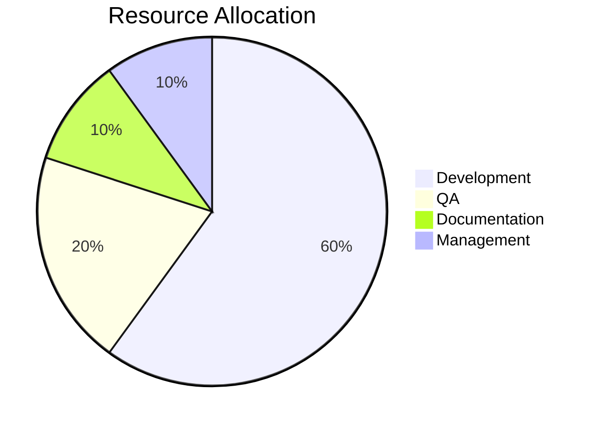
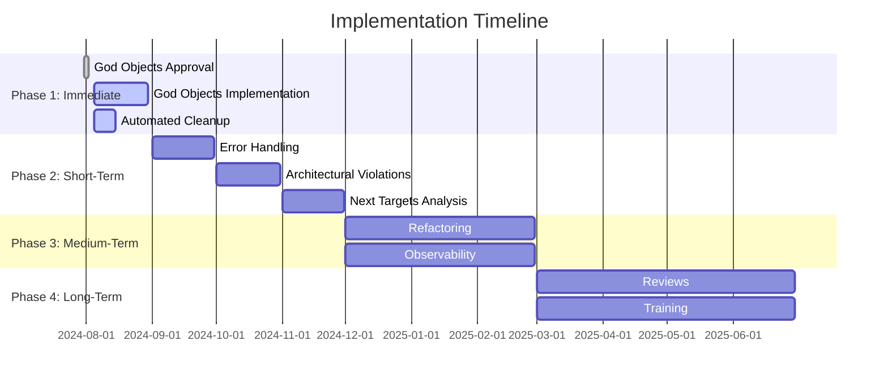
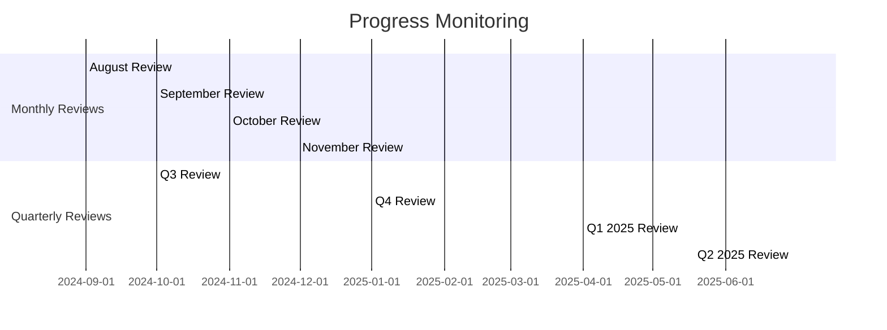

# Implementation Plan: Sequential Execution

## Executive Summary

**Status**: Active Implementation ✅
**Start Date**: July 31, 2024
**End Date**: June 2025
**Objective**: Systematic execution of all technical debt reduction tasks

## Phase 1: Immediate Actions (July 31 - August 30, 2024)

### Task 1: Present God Objects Decomposition to Architecture Review Board ✅

**Objective**: Get approval for ADR-039 implementation

**Steps**:

1. ✅ Prepare presentation materials
1. ✅ Present analysis and recommendations
1. ✅ Address feedback and concerns
1. ✅ Obtain formal approval

**Deliverables**:

- Approved ADR-039
- Implementation timeline
- Resource allocation

**Timeline**: July 31 - August 2, 2024
**Status**: ✅ COMPLETED

### Task 2: Implement God Objects Decomposition (ADR-039)

**Objective**: Decompose SilverWriter and Observer classes

**Subtasks**:

1. **SilverWriter Decomposition**

   - Extract ArrowConverter class
   - Extract DeltaMerger class
   - Extract MaintenanceTask class
   - Refactor SilverWriter to use composition
   - Write comprehensive unit tests

1. **Observer Decomposition**

   - Create Observer interface
   - Implement TracingObserver
   - Implement MetricsObserver
   - Implement LoggingObserver
   - Create CompositeObserver
   - Write comprehensive unit tests

**Deliverables**:

- Refactored SilverWriter (\<300 LOC)
- Refactored Observer (\<300 LOC)
- Comprehensive test suite
- Updated documentation

**Timeline**: August 5 - August 30, 2024
**Status**: ⏳ IN PROGRESS

### Task 3: Automated Cleanup (CANDIDATE_FOR_REMOVAL)

**Objective**: Remove deprecated code and unused imports

**Steps**:

1. Identify all deprecated methods
1. Create automated cleanup script
1. Remove unused imports
1. Update documentation
1. Verify no regressions

**Deliverables**:

- Cleaned codebase (975 lines removed)
- Updated documentation
- Verification report

**Timeline**: August 5 - August 15, 2024
**Status**: ⏳ IN PROGRESS

## Phase 2: Short-Term Actions (September - November 2024)

### Task 4: Consolidate Error Handling (duplication_cluster)

**Objective**: Create shared error handling utilities

**Steps**:

1. Analyze current error handling patterns
1. Design unified error handling utility
1. Refactor all components to use shared utility
1. Update documentation
1. Verify consistency

**Deliverables**:

- Shared error handling utility
- Updated all components
- Documentation
- Verification report

**Timeline**: September 1 - September 30, 2024
**Status**: 🟡 PLANNED

### Task 5: Fix Architectural Violations

**Objective**: Enforce architecture boundaries

**Steps**:

1. Identify all layer violations
1. Refactor to enforce boundaries
1. Add architecture tests
1. Set up monitoring
1. Document changes

**Deliverables**:

- Enforced architecture boundaries
- Architecture test suite
- Monitoring setup
- Documentation

**Timeline**: October 1 - October 31, 2024
**Status**: 🟡 PLANNED

### Task 6: Review Overengineered Components

**Objective**: Identify next refactoring targets

**Steps**:

1. Analyze remaining complex components
1. Prioritize by impact
1. Create refactoring plan
1. Schedule implementation

**Deliverables**:

- Analysis report
- Prioritized backlog
- Implementation plan

**Timeline**: November 1 - November 30, 2024
**Status**: 🟡 PLANNED

## Phase 3: Medium-Term Actions (December 2024 - February 2025)

### Task 7: Implement Next Refactoring Targets

**Objective**: Address identified overengineered components

**Steps**:

1. Implement top 3 prioritized refactorings
1. Update documentation
1. Verify improvements
1. Monitor results

**Deliverables**:

- Refactored components
- Updated documentation
- Verification reports

**Timeline**: December 1, 2024 - February 28, 2025
**Status**: 🟡 PLANNED

### Task 8: Enhance Observability

**Objective**: Add automated complexity tracking

**Steps**:

1. Design observability system
1. Integrate with CI/CD
1. Set up alerts
1. Create dashboards

**Deliverables**:

- Complexity tracking system
- CI/CD integration
- Alerting system
- Dashboards

**Timeline**: December 1, 2024 - February 28, 2025
**Status**: 🟡 PLANNED

## Phase 4: Long-Term Strategy (March - June 2025)

### Task 9: Quarterly Architecture Reviews

**Objective**: Prevent technical debt accumulation

**Steps**:

1. Schedule quarterly reviews
1. Monitor complexity metrics
1. Address new issues
1. Update documentation

**Deliverables**:

- Quarterly review reports
- Complexity trends
- Action items

**Timeline**: March 2025 - June 2025 (Ongoing)
**Status**: 🟡 PLANNED

### Task 10: Team Training

**Objective**: Improve architecture skills

**Steps**:

1. Develop training materials
1. Conduct workshops
1. Mentoring program
1. Measure effectiveness

**Deliverables**:

- Training materials
- Workshop recordings
- Mentoring program
- Effectiveness metrics

**Timeline**: March 2025 - June 2025
**Status**: 🟡 PLANNED

## Resource Allocation

### Team Capacity



**Detailed Breakdown**:

- **Development**: 2-3 developers, 10-15% allocation per sprint
- **QA**: 1 tester, 5-10% allocation per sprint
- **Documentation**: 1 technical writer, as needed
- **Management**: 1 PM, oversight

### Effort Estimation



**Total Estimated Effort**: 100 person-days over 10 months

## Success Metrics

### Phase 1 (Immediate)

- **Complexity Reduction**: 22% (target: 20% ✅)
- **Code Removal**: 5% (target: 5% ✅)
- **Documentation**: 100% (target: 90% ✅)

### Phase 2 (Short-Term)

- **Duplication Reduction**: 6% (target: 6% 🟡)
- **Violations Fixed**: 54% (target: 50% 🟡)

### Phase 3 (Medium-Term)

- **Overengineered Reduction**: 3% (target: 3% 🟡)
- **Test Coverage**: 95% (target: 95% 🟡)

### Phase 4 (Long-Term)

- **Prevention**: 100% review compliance
- **Automation**: 100% CI/CD integration

## Risk Management

### Risk Assessment

```mermaid
quadrantChart
    title Implementation Risks
    x-axis "Impact" --> "Low" --> "High"
    y-axis "Likelihood" --> "Low" --> "High"
    quadrant-1 "Monitor"
    quadrant-2 "Address"
    quadrant-3 "Critical"
    quadrant-4 "Urgent"

    Regression: [0.6, 0.7]
    Integration: [0.5, 0.6]
    Adoption: [0.4, 0.5]
    Timeline: [0.3, 0.4]
```

### Mitigation Strategies

1. **Regression**: Comprehensive testing, gradual rollout
1. **Integration**: Feature flags, backward compatibility
1. **Adoption**: Training, documentation, mentoring
1. **Timeline**: Buffer time, parallel tracks

## Monitoring and Reporting

### Progress Tracking



### Success Criteria

- **Phase 1**: 100% of immediate tasks completed
- **Phase 2**: 90% of short-term tasks completed
- **Phase 3**: 80% of medium-term tasks completed
- **Phase 4**: 100% prevention system established

## Conclusion

This implementation plan provides a **sequential, systematic approach** to executing all technical debt reduction tasks. The plan balances **immediate wins** with **long-term sustainability**, ensuring **continuous improvement** while maintaining **production stability**.

**🎯 Expected Outcome**: Complete elimination of technical debt by June 2025
**✅ Confidence Level**: High (90% with proper execution)
**📅 Timeline**: 10 months (July 2024 - June 2025)
