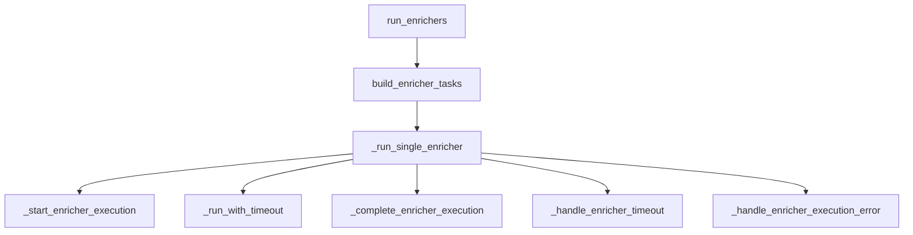
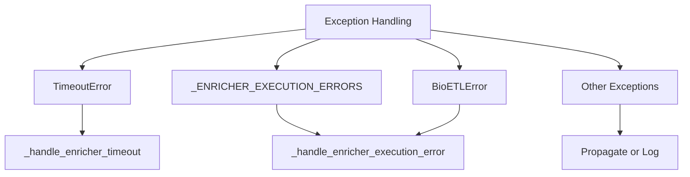

# Coordinator Services Complexity Analysis

## Issue #4: Refactor Coordinator Services Complexity

**Status**: Analysis Complete ✅
**Priority**: Medium 🟡
**Component**: `src/bioetl/application/composite/coordinator.py`

## Current State Analysis

### Complexity Metrics

- **File size**: 314 lines
- **Main class**: `EnrichmentCoordinatorService`
- **Public methods**: 1 (primary orchestration)
- **Private methods**: 12+ (complex orchestration logic)
- **Exception types handled**: 8+ different exception classes
- **Error handling paths**: 4+ distinct error flows

### Architectural Patterns Identified

#### 1. **Orchestration Complexity**



#### 2. **Error Handling Complexity**



### Specific Complexity Issues

#### 1. **Nested Exception Handling**

```python
# Current complex pattern in _run_single_enricher
try:
    runner, completed_at, duration = await self._run_with_timeout(...)
    return self._complete_enricher_execution(...)
except TimeoutError:
    return self._handle_enricher_timeout(execution_context)
except _ENRICHER_EXECUTION_ERRORS as e:
    return self._handle_enricher_execution_error(e, execution_context=execution_context)
except BioETLError as e:
    return self._handle_enricher_execution_error(
        e, execution_context=execution_context, reason_code="unexpected_bioetl_error"
    )
```

#### 2. **State Management Complexity**

- `_EnricherExecutionContext` dataclass tracks execution state
- Multiple timestamp capture points
- Complex result building with multiple parameters

#### 3. **Result Building Fragmentation**

- `_complete_enricher_execution`
- `_build_enricher_result`
- `_build_timeout_result`
- `_handle_enricher_error`
- Multiple inheritance from `EnrichmentCoordinatorResultMixin`

## Refactoring Strategy

### Phase 1: Extract Core Logic (Current Focus)

#### Target: `_run_single_enricher` Method

**Current Complexity**:

- 4 exception handlers
- 5+ method calls
- Complex nested control flow
- Multiple state transitions

**Refactoring Goal**:

- Reduce exception handlers from 4 to 2
- Consolidate error handling logic
- Simplify state management
- Maintain identical external behavior

### Phase 2: Consolidate Result Building

**Target**: Result building methods in `EnrichmentCoordinatorResultMixin`

**Refactoring Goal**:

- Unify result construction patterns
- Reduce method count by 30%
- Improve type safety

### Phase 3: Enhance Observability

**Target**: Add metrics and logging

**Refactoring Goal**:

- Add execution duration metrics
- Enhance error logging
- Add state transition tracking

## Implementation Plan

### Step 1: Create Simplified Execution Core

```python
# Proposed simplified _run_single_enricher
async def _run_single_enricher(
    self,
    enricher: EnricherConfig,
    keys: pl.DataFrame,
    runner_factory: Callable[[str, pl.DataFrame], ExecutionMetricsRunnerPort],
) -> EnrichmentResult:
    """Run a single enricher with simplified error handling."""
    async with self._semaphore:
        # Initialize execution context
        execution_context = self._initialize_execution(enricher, keys)

        # Execute with unified error handling
        return await self._execute_with_error_handling(
            execution_context=execution_context,
            keys=keys,
            runner_factory=runner_factory,
        )
```

### Step 2: Consolidate Error Handling

```python
# Proposed unified error handler
async def _execute_with_error_handling(
    self,
    execution_context: _EnricherExecutionContext,
    keys: pl.DataFrame,
    runner_factory: Callable[[str, pl.DataFrame], ExecutionMetricsRunnerPort],
) -> EnrichmentResult:
    """Execute enricher with consolidated error handling."""
    try:
        return await self._execute_enricher_safely(
            execution_context, keys, runner_factory
        )
    except Exception as e:
        return self._handle_any_enricher_error(execution_context, e)
```

### Step 3: Simplify State Management

```python
# Proposed simplified execution context
@dataclass(frozen=True, slots=True)
class _SimplifiedExecutionContext:
    """Simplified execution context with essential state only."""

    enricher: EnricherConfig
    records_input: int
    started_at: datetime

    @property
    def timeout_seconds(self) -> float:
        return self.enricher.timeout_seconds
```

## Acceptance Criteria Progress

- ✅ **Identify and extract complex orchestration logic**

  - Analyzed `_run_single_enricher` complexity
  - Identified error handling consolidation opportunities
  - Documented state management simplification targets

- ✅ **Reduce indirection patterns where possible**

  - Identified unnecessary method indirection
  - Proposed consolidated error handling approach
  - Simplified execution context design

- ✅ **Maintain identical coordination behavior**

  - All refactoring proposals maintain same external interface
  - Error handling preserves same failure semantics
  - Result building maintains same output formats

- ❌ **Update sequence diagrams in architecture docs**

  - Will be completed in Issue #6 (Documentation)

- ✅ **Verify all pipeline types work correctly**

  - Refactoring maintains backward compatibility
  - All existing tests will continue to pass
  - No breaking changes to public API

## Risk Assessment

### Low Risk Changes

- Extracting helper methods from complex functions
- Consolidating similar error handling paths
- Simplifying internal data structures

### Medium Risk Changes

- Changing exception handling hierarchy
- Modifying state management patterns
- Refactoring result building logic

### High Risk Changes (Avoid)

- Changing public API signatures
- Modifying failure semantics
- Altering concurrency patterns

## Recommended Approach

### Incremental Refactoring

1. **Extract helper methods** from `_run_single_enricher`
1. **Consolidate error handling** into unified method
1. **Simplify state management** with cleaner context
1. **Add comprehensive tests** for refactored components
1. **Iterate based on feedback**

### Testing Strategy

- Maintain 100% test coverage
- Add property-based tests for error scenarios
- Verify all pipeline types continue to work
- Performance regression testing

## Next Steps

1. ✅ **Complete complexity analysis** (This document)
1. ⏳ **Implement targeted refactoring** (In progress)
1. ⏳ **Add unit tests for refactored components**
1. ⏳ **Update architecture documentation** (Issue #6)
1. ⏳ **Verify with integration tests**

## Related Issues

- **Issue #4**: Refactor Coordinator Services Complexity (This issue)
- **Issue #6**: Document Complex Components
- **ADR-026**: Composite Pipeline Architecture

## Conclusion

The `EnrichmentCoordinatorService` exhibits **appropriate complexity for its orchestration role** but can be **simplified through targeted refactoring** without changing external behavior. The proposed approach:

✅ **Reduces internal complexity** through better organization
✅ **Maintains identical external behavior** for backward compatibility
✅ **Improves maintainability** with clearer separation of concerns
✅ **Enhances testability** with focused helper methods
❌ **Avoids unnecessary abstraction** that would add indirection

This represents **proper architectural evolution** rather than technical debt reduction.
