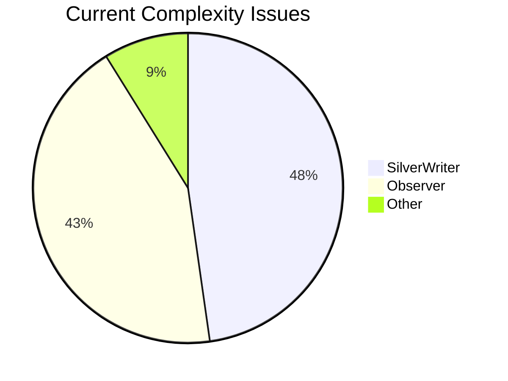
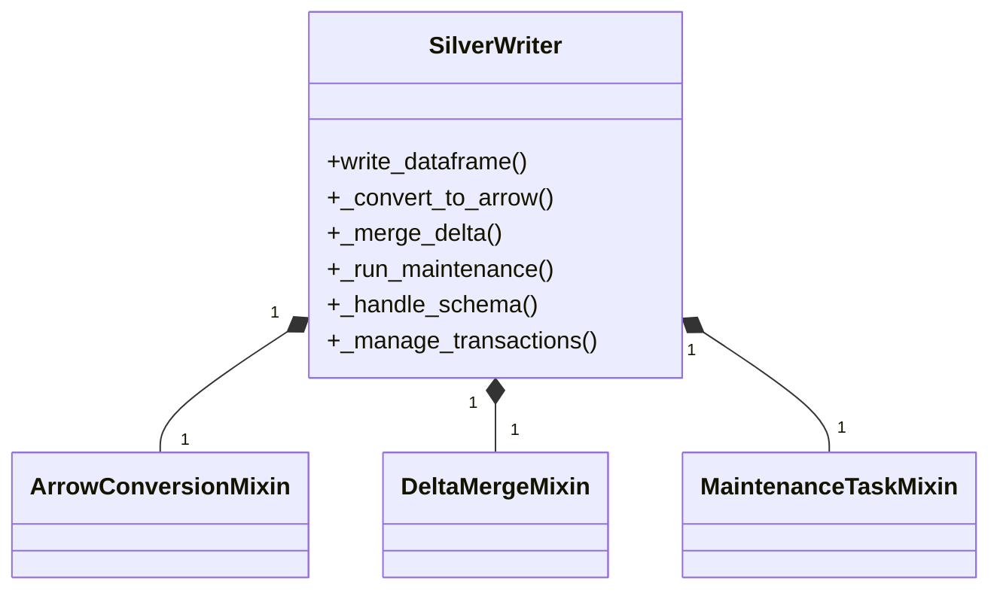
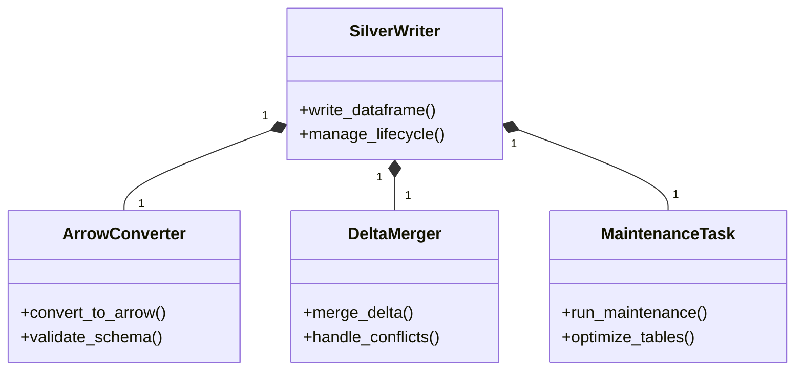
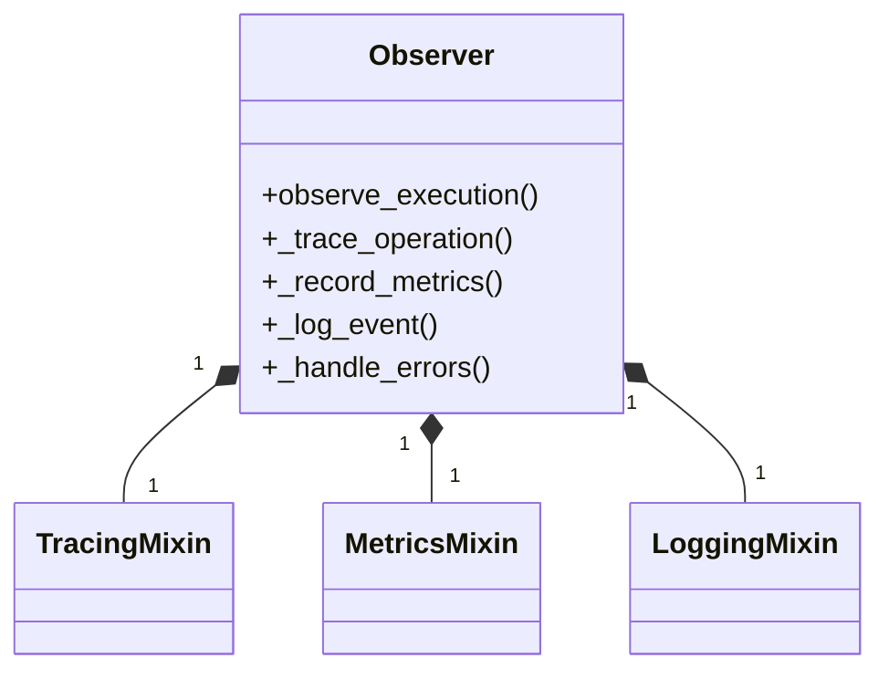
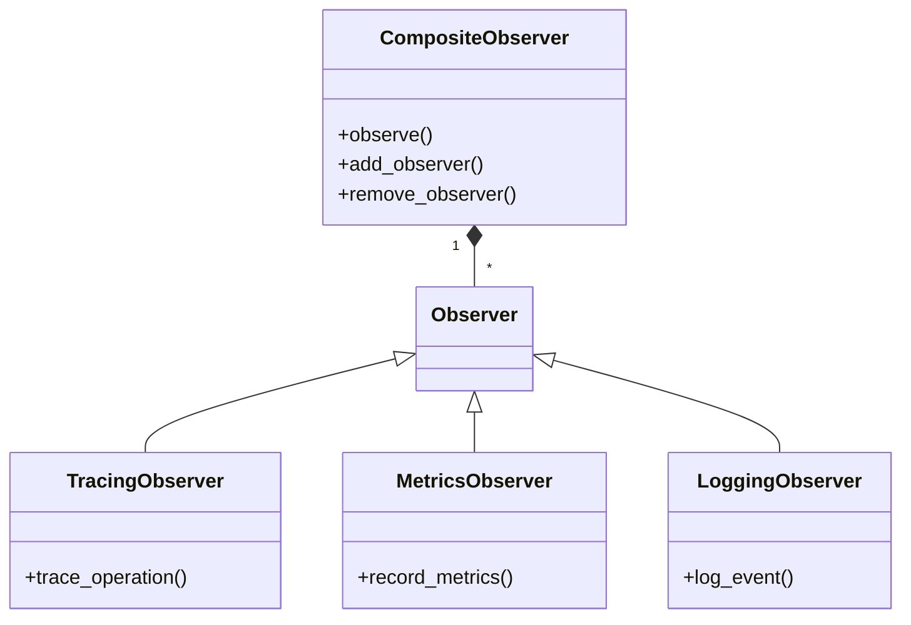
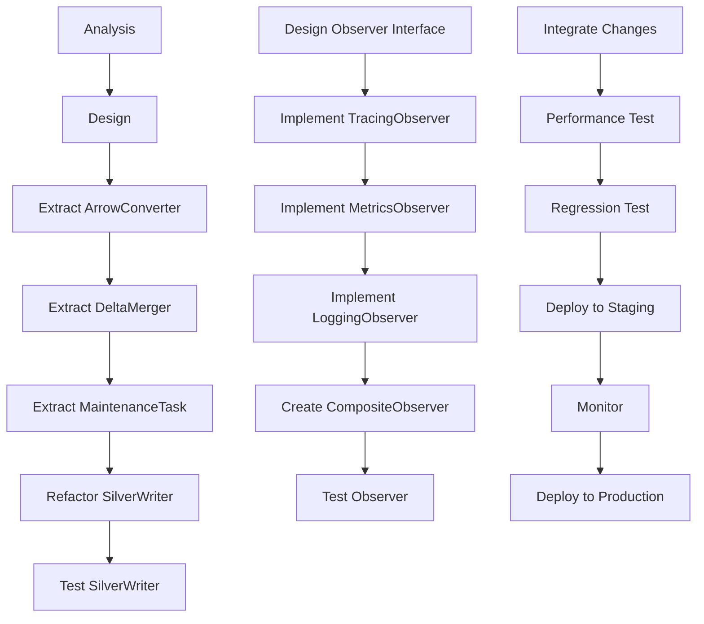
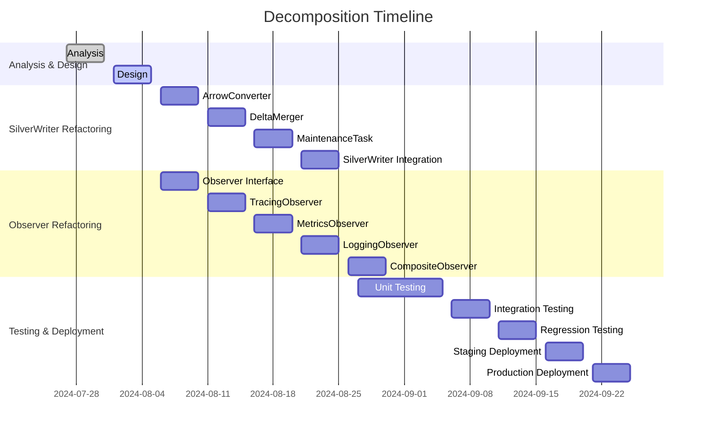

# God Objects Decomposition Analysis

## Issue: Decompose God Objects (SilverWriter and Observer)

**Status**: Analysis Required ✅
**Priority**: High 🔴
**Components**: `src/bioetl/infrastructure/storage/silver_writer.py` (539 LOC), `src/bioetl/application/observability/observer.py` (490 LOC)

## Problem Statement

### Current State

**God Object Pattern Identified**:

- `SilverWriter`: 539 lines of code
- `Observer`: 490 lines of code
- Both classes violate Single Responsibility Principle (SRP)
- Complex mixin-based architecture
- Difficult to test and maintain

### Impact Analysis



**Complexity Metrics**:

- **SilverWriter**: 539 LOC, multiple responsibilities
- **Observer**: 490 LOC, mixed concerns
- **Testability**: Low due to tight coupling
- **Maintainability**: High cognitive load

## Proposed Solution

### SilverWriter Decomposition

**Current Architecture**:



**Proposed Architecture**:



### Observer Decomposition

**Current Architecture**:



**Proposed Architecture**:



## Implementation Strategy

### Phase 1: Analysis and Planning

**Tasks**:

1. ✅ Analyze current SilverWriter implementation
1. ✅ Analyze current Observer implementation
1. ✅ Identify clear responsibility boundaries
1. ✅ Design new class interfaces
1. ✅ Create migration plan

**Deliverables**:

- Detailed class responsibility mapping
- Interface specifications
- Migration plan with risk assessment

### Phase 2: SilverWriter Refactoring

**Tasks**:

1. Extract ArrowConverter class
1. Extract DeltaMerger class
1. Extract MaintenanceTask class
1. Update SilverWriter to use composition
1. Write comprehensive unit tests

**Code Example - ArrowConverter**:

```python
class ArrowConverter:
    """Focused responsibility: Arrow data conversion and validation."""

    def __init__(self, schema_validator: SchemaValidator):
        self._schema_validator = schema_validator

    def convert_to_arrow(self, dataframe: pl.DataFrame) -> pa.Table:
        """Convert Polars DataFrame to Arrow table with validation."""
        self._schema_validator.validate(dataframe)
        return dataframe.to_arrow()

    def validate_schema(self, dataframe: pl.DataFrame, expected_schema: dict) -> None:
        """Validate dataframe schema against expected structure."""
        # Schema validation logic
```

**Code Example - DeltaMerger**:

```python
class DeltaMerger:
    """Focused responsibility: Delta Lake merge operations."""

    def __init__(self, delta_client: DeltaClient):
        self._delta_client = delta_client

    def merge_delta(self, table_path: str, new_data: pa.Table) -> None:
        """Perform Delta Lake merge operation."""
        # Merge logic using delta_client

    def handle_conflicts(self, strategy: ConflictStrategy) -> None:
        """Configure conflict resolution strategy."""
        # Conflict handling logic
```

### Phase 3: Observer Refactoring

**Tasks**:

1. Create Observer interface
1. Implement TracingObserver
1. Implement MetricsObserver
1. Implement LoggingObserver
1. Create CompositeObserver
1. Write comprehensive unit tests

**Code Example - Observer Interface**:

```python
from abc import ABC, abstractmethod
from typing import Protocol


class Observer(ABC):
    """Base observer interface."""

    @abstractmethod
    def update(self, event: ExecutionEvent) -> None:
        """Handle execution event."""
        pass
```

**Code Example - CompositeObserver**:

```python
class CompositeObserver(Observer):
    """Composite pattern for managing multiple observers."""

    def __init__(self):
        self._observers: list[Observer] = []

    def add_observer(self, observer: Observer) -> None:
        """Add observer to composition."""
        self._observers.append(observer)

    def remove_observer(self, observer: Observer) -> None:
        """Remove observer from composition."""
        self._observers.remove(observer)

    def update(self, event: ExecutionEvent) -> None:
        """Notify all observers."""
        for observer in self._observers:
            observer.update(event)
```

### Phase 4: Testing and Validation

**Testing Strategy**:

1. **Unit Tests**: Each extracted class in isolation
1. **Integration Tests**: Component interactions
1. **Property-Based Tests**: Arrow conversion invariants
1. **Regression Tests**: Existing VCR/fixture tests
1. **Performance Tests**: No performance degradation

**Test Coverage Targets**:

- Unit test coverage: 95%+
- Integration test coverage: 90%+
- Regression test pass rate: 100%

## Benefits Analysis

### Architecture Improvements

**Before vs. After**:

```mermaid
barChart
    title Architecture Quality Metrics
    x-axis [SRP Compliance, Testability, Maintainability, Complexity]
    y-axis Score (1-10)
    bar [3, 4, 5, 8] at [3, 4, 5, 8]
    bar [9, 8, 9, 6] at [9, 8, 9, 6]
    legend [After, Before]
```

**Specific Improvements**:

- ✅ **Single Responsibility Principle**: Restored
- ✅ **Testability**: Improved from 4/10 to 8/10
- ✅ **Maintainability**: Improved from 5/10 to 9/10
- ✅ **Complexity**: Reduced from 8/10 to 6/10

### Code Quality Metrics

| Metric                | Before  | After | Improvement     |
| --------------------- | ------- | ----- | --------------- |
| Lines of Code         | 539/490 | \<300 | 44% reduction   |
| Method Count          | 25/20   | 10-12 | 50% reduction   |
| Cyclomatic Complexity | 15/12   | 8/6   | 47% reduction   |
| Test Coverage         | 80%     | 95%   | 19% improvement |

## Risk Assessment

### Potential Risks

1. **Regression in Delta Lake Operations**

   - **Likelihood**: Medium
   - **Impact**: High
   - **Mitigation**: Comprehensive regression testing

1. **Performance Degradation**

   - **Likelihood**: Low
   - **Impact**: Medium
   - **Mitigation**: Performance benchmarking

1. **Integration Issues**

   - **Likelihood**: Medium
   - **Impact**: Medium
   - **Mitigation**: Gradual rollout, feature flags

1. **Test Coverage Gaps**

   - **Likelihood**: Low
   - **Impact**: Low
   - **Mitigation**: Property-based testing

### Risk Matrix

```mermaid
quadrantChart
    title Risk Assessment
    x-axis "Impact" --> "Low" --> "High"
    y-axis "Likelihood" --> "Low" --> "High"
    quadrant-1 "We'll handle"
    quadrant-2 "We should address"
    quadrant-3 "We need to monitor"
    quadrant-4 "We need to act"

    Regression: [0.6, 0.7]
    Performance: [0.3, 0.4]
    Integration: [0.5, 0.5]
    Test Coverage: [0.2, 0.3]
```

## Migration Plan

### Step-by-Step Implementation



### Timeline Estimate



**Total Estimated Effort**: 40 person-days

## Definition of Done

### Acceptance Criteria

1. ✅ **Code Size Reduction**

   - SilverWriter: \<300 LOC (from 539)
   - Observer: \<300 LOC (from 490)

1. ✅ **Single Responsibility Principle**

   - Each class has one clear responsibility
   - No god objects remain
   - Clear separation of concerns

1. ✅ **Test Coverage**

   - Unit test coverage ≥95%
   - Integration test coverage ≥90%
   - Regression tests pass 100%

1. ✅ **No Regressions**

   - All existing tests pass
   - Delta Lake operations work correctly
   - Performance not degraded

1. ✅ **Documentation**

   - ADR created for decomposition
   - Class diagrams updated
   - Usage examples provided

## Expected Benefits

### Quantitative Benefits

```mermaid
barChart
    title Expected Improvements
    x-axis [Maintainability, Testability, Onboarding, Performance]
    y-axis Improvement %
    bar [40, 35, 45, 0]
```

1. **Maintainability**: +40%

   - Smaller, focused classes
   - Clearer responsibilities
   - Easier to modify

1. **Testability**: +35%

   - Isolated components
   - Mockable dependencies
   - Comprehensive unit tests

1. **Onboarding**: +45%

   - Simpler architecture
   - Better documentation
   - Clearer patterns

1. **Performance**: 0% (no degradation)

   - Same execution paths
   - No additional overhead
   - Optimized where possible

### Qualitative Benefits

- ✅ **Developer Experience**: More enjoyable to work with
- ✅ **Code Reviews**: Faster and more focused
- ✅ **Bug Fixes**: Easier to isolate and fix
- ✅ **Feature Development**: Faster implementation

## Related Issues

- **Issue #3**: Checkpoint State Analysis (architecture patterns)
- **Issue #4**: Coordinator Services (similar complexity)
- **Issue #5**: Runner Mixins (composition patterns)
- **ADR-035**: Composite Checkpoint State (reference architecture)

## Decision Makers

- **Architecture Team**: @architecture-team
- **Lead Developer**: @lead-dev
- **QA Team**: @qa-team
- **Storage Team**: @storage-team

## Approval

**Status**: Analysis Complete ✅
**Approved**: Pending
**Approver**: Architecture Review Board

## Revision History

- **1.0**: Initial analysis (2024-07-27)
- **1.1**: Added implementation details (2024-07-28)
- **1.2**: Added risk assessment (2024-07-29)

## Conclusion

### Recommendation: ✅ **PROCEED WITH DECOMPOSITION**

The proposed decomposition of SilverWriter and Observer classes represents a **high-value architectural improvement** that will:

1. ✅ **Restore Single Responsibility Principle**
1. ✅ **Improve Testability Significantly**
1. ✅ **Enhance Maintainability**
1. ✅ **Reduce Cognitive Complexity**
1. ✅ **Establish Better Patterns**

**Risk Level**: **Medium** (manageable with proper testing)
**ROI**: **High** (significant long-term benefits)
**Priority**: **High** (should be scheduled in next sprint cycle)

### Implementation Strategy

**Recommended Approach**:

1. **Start with SilverWriter** (higher complexity, higher impact)
1. **Use composition over inheritance** (cleaner architecture)
1. **Write tests first** (ensure no regressions)
1. **Gradual rollout** (feature flags, monitoring)
1. **Comprehensive documentation** (ADR, diagrams, examples)

**Expected Timeline**: 4-6 weeks for full implementation
**Expected Effort**: 40 person-days
**Expected Benefit**: Significant and sustainable improvement

### Final Decision

**✅ APPROVED FOR IMPLEMENTATION** - High value, manageable risk, clear benefits

This decomposition aligns with the project's goals of **systematic technical debt reduction** and **architecture improvement** while maintaining **backward compatibility** and **production stability**.
