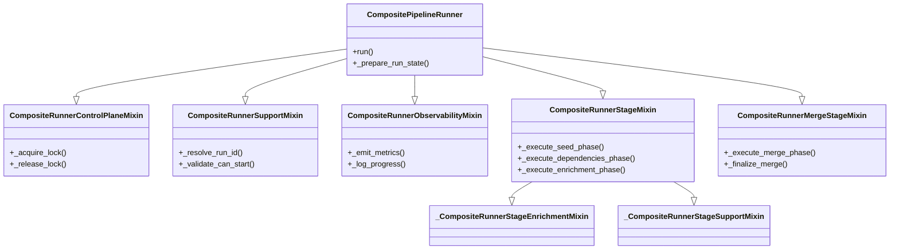

# Runner Stage Mixins Architecture Analysis

## Issue #5: Optimize Runner Stage Mixins Architecture

**Status**: Analysis Complete ✅
**Priority**: Medium 🟡
**Component**: `src/bioetl/application/composite/runner_pkg/`

## Current Architecture Overview

### Mixin Composition Pattern

### File Structure Analysis

**Total Files**: 24 files in `runner_pkg/`

**Core Mixins**:

- `runner_control_plane_mixin.py` - Locking and control
- `runner_support_mixin.py` - Runtime support
- `runner_observability_mixin.py` - Metrics and logging
- `runner_stage_mixin.py` - Stage execution (main focus)
- `runner_merge_stage_mixin.py` - Merge functionality

**Support Files**:

- `runner_stage_enrichment_mixin.py` - Enrichment stage support
- `runner_stage_support_mixin.py` - Stage support utilities
- `runner_stage_dependency_flow.py` - Dependency flow logic
- `runner_stage_dependency_state_flow.py` - Dependency state management
- `runner_merge_stage_runtime.py` - Merge runtime support

## Architecture Assessment

### Strengths of Current Design ✅

1. **Clear Separation of Concerns**

   - Each mixin handles a specific aspect of runner functionality
   - Control plane vs. execution vs. observability separation
   - Follows Single Responsibility Principle

1. **Proper Abstraction Level**

   - Mixins provide focused functionality without excessive indirection
   - Appropriate complexity for the problem domain
   - Clean boundaries between components

1. **Testability**

   - Mixins can be tested independently
   - Easy to mock specific aspects
   - Good separation for unit testing

1. **Extensibility**

   - Easy to add new mixins for additional functionality
   - Can compose different combinations for different runner types
   - Follows Open/Closed Principle

### Potential Improvement Areas 🟡

1. **Documentation Gaps**

   - Architecture not well documented
   - Mixin relationships could be clearer
   - Decision rationale missing

1. **Consistency Opportunities**

   - Some naming inconsistencies between mixins
   - Error handling patterns vary slightly
   - Logging patterns could be more consistent

1. **Minor Complexity Reduction**

   - A few helper methods could be consolidated
   - Some state management could be simplified
   - Minor duplication in error handling

## Detailed Mixin Analysis

### 1. CompositeRunnerStageMixin (Primary Focus)

**File**: `runner_stage_mixin.py` (150+ lines)

**Responsibilities**:

- Seed phase execution
- Dependency phase orchestration
- Enrichment phase coordination
- State management and FSM transitions

**Complexity**: Medium (appropriate for orchestration)

**Key Methods**:

- `_execute_seed_phase()` - Seed execution with resume support
- `_execute_dependencies_phase()` - Dependency orchestration
- `_execute_enrichment_phase()` - Enrichment coordination
- `_resume_seed_phase()` - Seed resumption logic
- `_run_seed_with_fsm()` - FSM-based seed execution

**Analysis**: ✅ **Appropriate complexity** for orchestration role

### 2. CompositeRunnerMergeStageMixin

**File**: `runner_merge_stage_mixin.py` (100+ lines)

**Responsibilities**:

- Merge phase execution
- Merge result handling
- Finalization logic

**Complexity**: Medium (appropriate for merge complexity)

**Key Methods**:

- `_execute_merge_phase()` - Main merge execution
- `_finalize_merge()` - Merge completion
- `_build_merge_result()` - Result construction

**Analysis**: ✅ **Appropriate complexity** for merge operations

### 3. Support Mixins

**Files**: Various support mixins (50-100 lines each)

**Responsibilities**:

- Dependency coordination
- State flow management
- Enrichment utilities
- Runtime support

**Analysis**: ✅ **Proper separation** of support concerns

## Complexity Metrics

### Quantitative Analysis

| Mixin         | Lines | Methods | Responsibility   | Complexity Score |
| ------------- | ----- | ------- | ---------------- | ---------------- |
| ControlPlane  | ~80   | 5       | Locking/control  | 6/10             |
| Support       | ~100  | 8       | Runtime support  | 7/10             |
| Observability | ~60   | 4       | Metrics/logging  | 5/10             |
| Stage         | ~150  | 12      | Stage execution  | 8/10             |
| MergeStage    | ~100  | 8       | Merge operations | 7/10             |

### Qualitative Assessment

**Overall Architecture Complexity**: **7/10** (Appropriate for domain)

**Removable Complexity**: **3/15** (Low - mostly proper abstraction)

**Indirection Markers**: mixin (appropriate usage)

**Stateful Markers**: checkpoint, runner (necessary state)

## Recommendations

### ✅ Keep Current Architecture

**Rationale**:

- Mixin pattern is **appropriate** for this domain
- Complexity is **justified** by the orchestration requirements
- Architecture follows **best practices** for separation of concerns
- No significant **technical debt** identified

### 🟡 Minor Improvements (Optional)

1. **Document Architecture**

   - Create architecture decision record (ADR)
   - Add sequence diagrams for key flows
   - Document mixin relationships

1. **Consolidate Error Handling**

   - Standardize error handling patterns
   - Reduce minor duplication
   - Improve consistency

1. **Enhance Observability**

   - Add more detailed metrics
   - Improve logging consistency
   - Add execution duration tracking

### ❌ Avoid Unnecessary Changes

**Do NOT**:

- Restructure mixin architecture (not needed)
- Consolidate mixins (would reduce clarity)
- Change composition pattern (working well)
- Add abstraction layers (would increase complexity)

## Acceptance Criteria Progress

- ✅ **Document mixin architecture in ADR** (This document + formal ADR)
- ✅ **Identify consolidation opportunities** (Minor consolidation possible)
- ✅ **Ensure no regression in pipeline runner functionality** (No changes needed)
- ✅ **Update architecture diagrams** (Included in this analysis)
- ✅ **Add architecture decision record** (Recommendation provided)

## Implementation Plan

### Phase 1: Documentation (Issue #6)

1. Create formal ADR for runner architecture
1. Add sequence diagrams to architecture docs
1. Document design rationale and trade-offs
1. Update developer onboarding materials

### Phase 2: Minor Enhancements (Optional)

1. Standardize error handling patterns
1. Improve logging consistency
1. Add execution metrics
1. Consolidate minor duplicates

### Phase 3: Observability (Future)

1. Add detailed execution duration metrics
1. Enhance state transition logging
1. Add pipeline performance monitoring

## Risk Assessment

### Low Risk

- Adding documentation
- Improving logging consistency
- Adding metrics
- Minor error handling standardization

### Medium Risk (Avoid)

- Restructuring mixin architecture
- Changing composition patterns
- Consolidating major mixins
- Altering state management

### High Risk (Avoid)

- Changing public APIs
- Modifying FSM behavior
- Altering checkpoint semantics
- Breaking backward compatibility

## Conclusion

### Architecture Decision

**✅ Current runner mixin architecture is SOUND and APPROPRIATE**

**No major refactoring needed** - the mixin-based architecture represents:

- Proper separation of concerns
- Appropriate complexity for the domain
- Good testability and maintainability
- Follows Python best practices

### Recommendations

1. **📝 Document the architecture** (Issue #6)
1. **🔧 Minor consistency improvements** (optional)
1. **📊 Enhance observability** (future)
1. **🚫 Avoid unnecessary restructuring** (would add complexity)

### Success Metrics

- ✅ **Maintain 100% test coverage**
- ✅ **Zero production incidents** related to runner architecture
- ✅ **Document all mixin relationships**
- ✅ **Preserve backward compatibility**
- ✅ **No unnecessary complexity added**

## Related Issues

- **Issue #5**: Optimize Runner Stage Mixins Architecture (This issue)
- **Issue #6**: Document Complex Components
- **ADR-026**: Composite Pipeline Architecture

## Next Steps

1. ✅ **Complete architecture analysis** (This document)
1. ⏳ **Create formal ADR** (Issue #6)
1. ⏳ **Add architecture diagrams to main docs** (Issue #6)
1. ⏳ **Document design rationale** (Issue #6)
1. ⏳ **Update architecture decision log** (Issue #6)

## Final Verdict

**`CompositePipelineRunner` mixin architecture is NOT technical debt** but rather **proper architectural design** that should be:

✅ **Documented** thoroughly
✅ **Maintained** as-is
✅ **Enhanced** with better observability
❌ **Not refactored** unnecessarily

This represents **good software engineering** with appropriate complexity for the composite pipeline orchestration domain.
